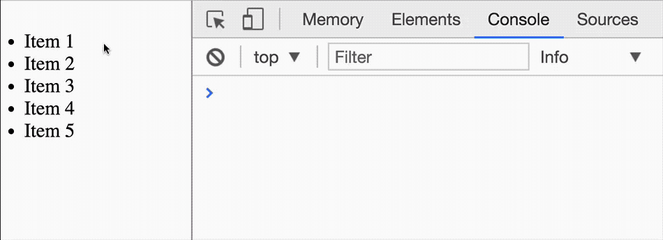
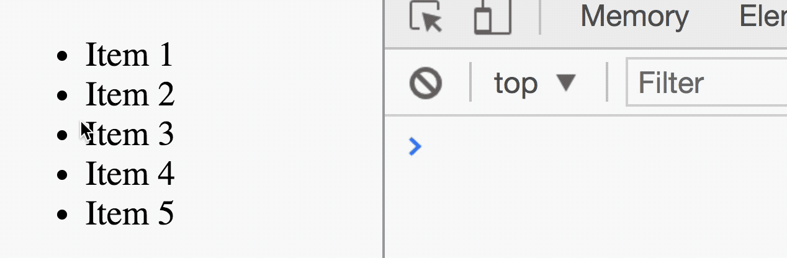

# Event delegation

Let's say you have a list of items. You want to listen to a `click` event on each item. One way is to attach an event listener to every item.

```html
<ul>
  <li>Item 1</li>
  <li>Item 2</li>
  <li>Item 3</li>
  <li>Item 4</li>
  <li>Item 5</li>
</ul>
```

```js
const items = Array.from(document.querySelectorAll('li'))
items.forEach(item => item.addEventListener('click', e => {
  // Do something with item
}))
```

But what if you had one thousand items? If you do the above, you'll create one thousand event listeners. That's not the best way.

A better way is to use the event delegation pattern.

## Event delegation pattern

The event delegation pattern makes use of event propagation. It works like this:

1. you attach one event listener to an ancestor element
2. ancestor element listens to all events in descendant elements

Note: the event delegation pattern only works for events that bubble.

```html
<ul>
  <li>Item 1</li>
  <li>Item 2</li>
  <li>Item 3</li>
  <li>Item 4</li>
  <li>Item 5</li>
</ul>
```

```js
const list = document.querySelector('ul')
list.addEventListener('click', e => {
  // Do something when list is clicked on
})
```

## Determining the event target

The element that fires the event is called the **event target**. It can be found with the `target` property.

```js
list.addEventListener('click', e => console.log(e.target))
```

<figure>
  
  <figcaption>The clicked target can be found with event.target</figcaption>
</figure>

## Avoid misfires

The event delegation pattern is sensitive to all events fired from the listening element onwards. In this case, you can also fire the callback when you click on the list itself.

<figure>
  
  <figcaption>Event delegation pattern is sensitive to all events</figcaption>
</figure>

To prevent such misfires from happening, we need to check if the target element matches the element we're looking for. We can do so with the `matches` method.

`matches` checks if the element matches the selector we provided. You should be familiar with it's syntax.

```js
element.matches(selector)
```

In our case, we only want to do something if a user clicks on a list item. We can check whether the event target is a list item with `matches`.

```js
list.addEventListener('click', e => {
  if (e.target.matches('li')) {
    // Do something
  }
})
```

## Dealing with nested elements

Let's say you want to listen to a click event on a `<button>`. This button has an SVG and some text embedded in it.

```html
<button>
  <svg> <!-- Gear icon --> </svg>
  <span>Click me!</span>
</button>
```

```js
const button = document.querySelector('button')
button.addEventListener('click', e => {
  console.log(e.target)
})
```

Watch what happens if you click on the gear icon or the text.

<figure>
  
  <figcaption>event.target can fire for inner elements if you're not careful</figcaption>
</figure>

This is not good. This behavior breaks event delegation. Our button will no longer match the event target.

```js
// This doesn't always work
button.addEventListener('click', e => {
  if (e.target.matches('button')) {
    // Do something
  }
})
```

There are two ways to deal with inner elements.

1. Set `pointer-events` to `none`
2. Use `closest`

### Pointer events

`pointer-events` is a CSS property that determines how an element respond to mouse events. (Remember, `click` is a mouse event). If you set `pointer-events` of an element to `none`, it will not respond to mouse events.

For our use case, we want to set `pointer-events` of all descendant elements to `none`. We can do this with the following CSS:

```css
/* Preventing events from bubbling in CSS */
button * {
  pointer-events: none;
}
```

### Closest

`closest` searches for the closest ancestor element (including itself) that matches the selector given to it. You can use `closest` to ensure events bubble up to the button.

```js
button.addEventListener('click', e => {
  if (e.target.closest('button')) {
    // Do something
  }
})
```

### Pointer events or closest?

`closest` work better because you won't need to add `pointer-events` to the CSS. One less thing to remember :)

## Exercise

Here's a list of famous people. Do the following:

1. Create an event listener that uses the event delegation pattern.
2. Log the element if the target matches `li`
3. Try using both pointer events and `closest` to filter the event target

```html
<ul>
  <li><a href="#">Benjamin Franklin</a></li>
  <li><a href="#">Thomas Edison</a></li>
  <li><a href="#">Franklin Roosevelt</a></li>
  <li><a href="#">Napolean Bonaparte</a></li>
  <li><a href="#">Abraham Lincoln</a></li>
</ul>
```
