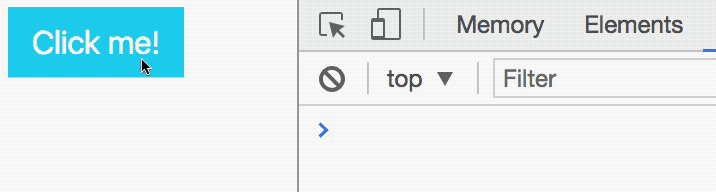

# Removing Event Listeners

Event listeners remain in the DOM forever once they're attached. They should be removed as soon as you no longer need them.

## Removing event listeners

You can use the following syntax to remove event listeners:

```js
element.removeEventListener('event-name', callback)
```

`element` is the element you attached an event listener to.

`event-name` is the name of the event you want to stop listening to.

`callback` is the function that gets called when the event gets triggered. This callback must point to the same callback reference you used when you added the event listener.

Let's go through an example.

## Removing a click event listener

Let's say you have a button. You attached a listener that logs to the console when a user clicks on it:

```js
const button = document.querySelector('button')
button.addEventListener('click', e => {
  console.log('Button is clicked')
})
```

The first step to removing the event listener is to create a named reference for the callback.

```js
const buttonCallback = _ => {
  console.log('Button is clicked')
}

const button = document.querySelector('button')
button.addEventListener('click', buttonCallback)
```

Then, you use this `buttonCallback` as the `callback` when you remove the event listener:

```js
button.removeEventListener('click', buttonCallback)
```

You can verify the removal of the event listener by checking the number of events listeners attached to the Element with Chrome or Firefox's devtools. See the events lesson if you need a refresher.

## A listener that activates once

Let's say you want to create an event listener that activates only one time. To do so, you can remove the event listener once the event has triggered.

```js
const listenOnce = e => {
  console.log('Button is clicked')
  e.currentTarget.removeEventListener('click', listenOnce)
}

const button = document.querySelector('button')
button.addEventListener('click', listenOnce)
```

<figure>
  
  <figcaption>An event that only triggers once</figcaption>
</figure>

## Exercise

Do the following:

1. Add a `click` event listener.
2. Remove the event listener you've added.
3. Create an event listener that listens for five clicks.

---

- Previous lesson: [Event Delegation](04.event-delegation.md)
- Next lesson: [Improving Modal](06.improving-modal.md)
