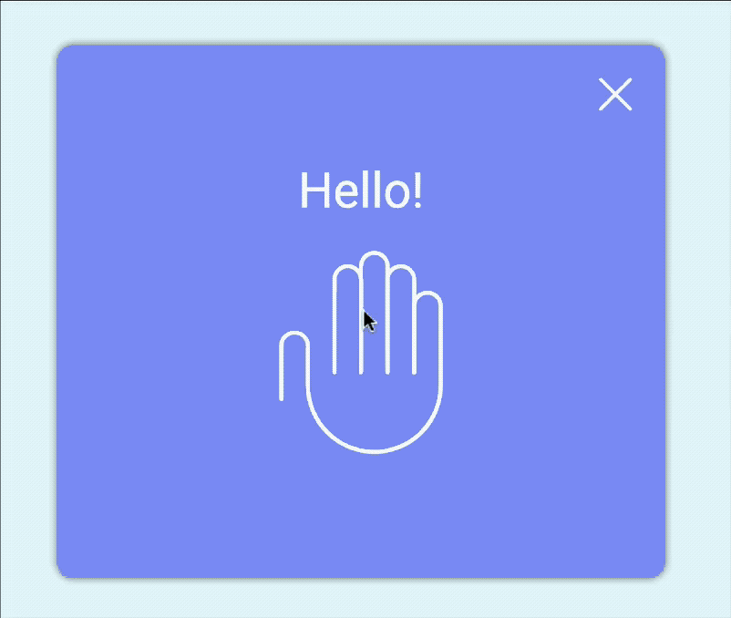
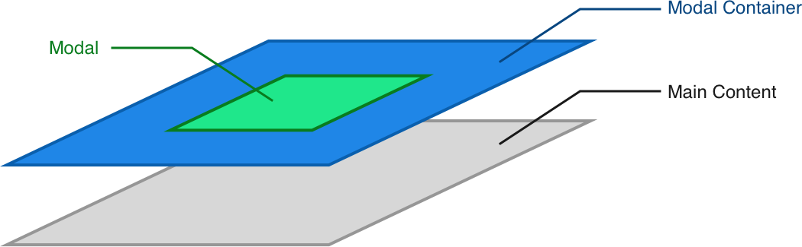
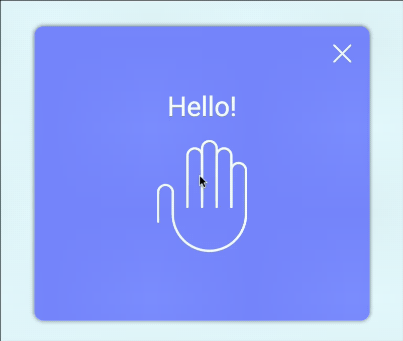
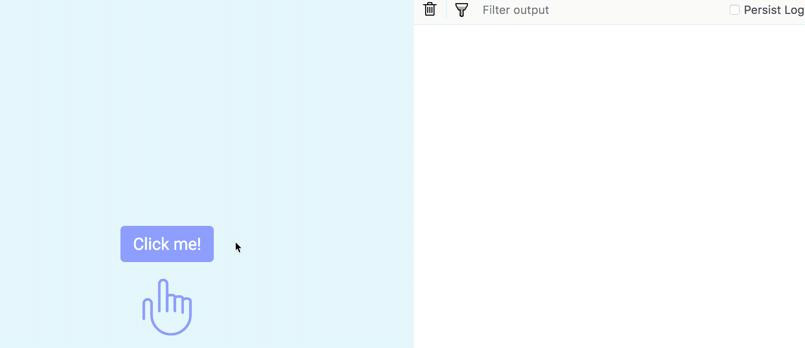
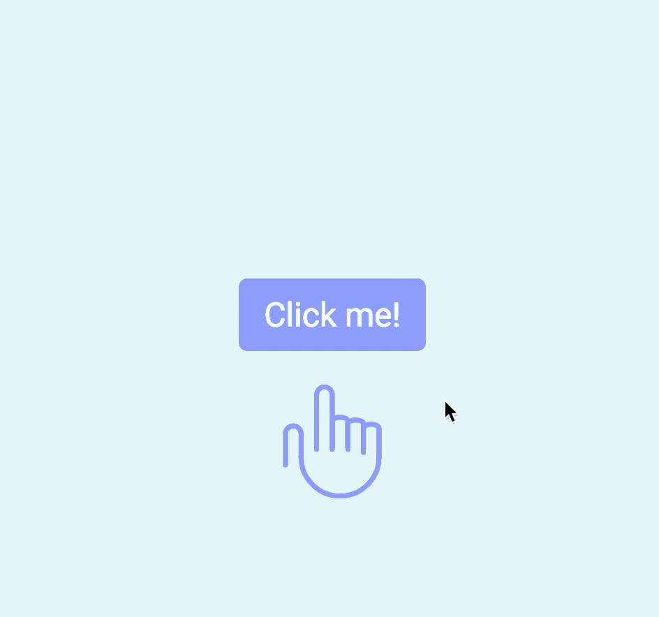

# 🛠 Improving the modal window

In this lesson, you're going to learn how to close the modal when a user clicks outside of the modal.

<figure>
  
  <figcaption>Modal closes when the a user clicks outside the modal</figcaption>
</figure>

## Closing the modal when a user clicks outside

What happens when a user clicks outside of the modal?

If you look at the picture of how a modal works, you'll see that, when a user clicks outside of the modal content, they're actually clicking on the modal container.

<figure>
  
  <figcaption>A click on outside a modal is a click on the modal container</figcaption>
</figure>

If we want to close the modal when a user clicks on the container, we need to add an event listener to the container. In this event listener, we're going to remove the `modal-is-open` class from the `<body>`.

```js
const container = document.querySelector('.modal-container')

container.addEventListener('click', e => {
  document.body.classList.remove('modal-is-open')
})
```

Now, the modal closes when you click on the container. Unfortunately, the modal also closes when you click on the modal itself!

<figure>
  
  <figcaption>Modal closes when content is clicked, but this should not happen!</figcaption>
</figure>

You don't want to close the modal when a user clicks on it. This is because people click around when they read. It's highly disruptive when you click on something you want to read, and that thing goes away.

## Preventing clicks within the modal content from closing the modal

When you click on the modal at this point, the `click` event bubbles up towards the container. When this `click` event hits the container, it triggers a the callback we wrote, and closes the modal.

That's why the modal closes when you click on the modal. You can tell that this is happening if you `console.log` the event target.

```js
container.addEventListener('click', e => {
  document.body.classList.remove('modal-is-open')
  console.log(e.target)
})
```

<figure>
  
  <figcaption>The click event bubbles from within the modal to the container</figcaption>
</figure>

You can clearly see in the GIF above that the event target comes from within the modal content. This is evidence that the `click` event bubbles.

The most straightforward way to prevent the modal from closing is to prevent the event from bubbling above the modal.

```js
const modal = document.querySelector('.modal')

modal.addEventListener('click', e => {
  e.stopPropagation()
})
```

<figure>
  
  <figcaption aria-hidden>The modal doesn't close when it gets clicked anymore</figcaption>
</figure>

This works, but there's a tiny problem with `stopPropagation`.

### The problem with stopPropagation

The problem with `stopPropagation` is it prevents all events of that type from passing through. Let's go through an example to put this scenario into perspective.

Say you have the following HTML, and you've prevented click events from bubbling from the modal through stopPropagation.

```html
<body>
  <div class="modal-container">
    <div class="modal"></div>
  </div>
</body>
```

```js
const modal = document.querySelector('.modal')
modal.addEventListener('click', e => e.stopPropagation)
```

The question is, what if you need to listen for a `click` event on `<body>`, and this `click` event may trigger from within modal?

If you stop the `click` event from bubbling, you'll never be able to listen to the `click` event on `<body>`.

That's the problem with `stopPropagation`.

## A better way to prevent clicks in the modal from closing the modal

Let's look at the picture of how a modal works again. From this picture, you can see that a user can only click on three things—anything within the modal, the modal itself, or the container.

<figure>
  
  <figcaption>A user can potentially click on the contents within the modal, the modal itself, and the container</figcaption>
</figure>

If the user clicks on an element within the modal, the click event will bubble up, hit the modal, then hit the modal container.

If the user clicks the modal, the event will also bubble up, hit the modal, then hit the modal container.

However, if the user clicks the container, the modal will only hit the modal container. It will not bubble downwards and hit the modal.

This means we can check if the event target has the modal as an ancestor. If the modal is an ancestor, we do nothing. If the modal is not an ancestor, we close the modal.

```js
container.addEventListener('click', e => {
  if (!e.target.closest('.modal')) {
    document.body.classList.remove('modal-is-open')
  }
})
```

## Wrapping up

You learned how to close the modal when you click outside the modal.

## Homework

Close your modal when a user clicks on outside the modal. Make sure you don't use `stopPropagation`. Move on when you're able to do this without referring back to this lesson.

