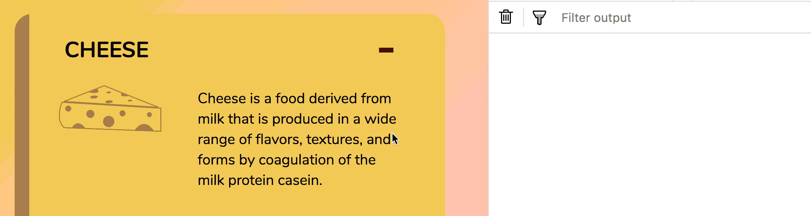

# 🛠 Improving the accordion

When we built the accordion component previously, we added an event listener to each accordion.

```js
const accordions = Array.from(document.querySelectorAll('.accordion'))

accordions.forEach(accordion => {
  // ...
})
```

Whenever you see this pattern, it's an indication to use the event delegation pattern.

## Changing to the event delegation pattern

When you use the event delegation pattern, you want to attach an event listener to the nearest common ancestor of all the elements you want to listen to.

In this case, you can tell from the HTML that the nearest common ancestor is `.accordion-container`. That's the element we're going to add an event listener to.

```html
<div class="accordion-container">
  <div class="accordion"> ... </div>
  <div class="accordion"> ... </div>
  <div class="accordion"> ... </div>
  <div class="accordion"> ... </div>
</div>
```

```js
const container = document.querySelector('.accordion-container')

container.addEventListener('click', e => {
  // Do something here
})
```

For our accordion to work, we want to listen for `click` events on each `.accordion__header`. But at this point, we listen for `click` events everywhere within `.accordion-container`.

```js
container.addEventListener('click', e => {
  console.log(e.target)
})
```

<figure>
  
  <figcaption>Even click events from accordion content bubbles up to the container!</figcaption>
</figure>

We want to ignore the events that bubble from `.accordion__content`. To do so, we check if the event target is a descendant of `.accordion__header`. If it is, we toggle the `is-open` class on the accordion.

```js
container.addEventListener('click', e => {
  const header = e.target.closest('.jsAccordionHeader')
    if (header) {
      header.parentNode.classList.toggle('is-open')
    }
})
```

## Wrapping up

In this lesson, you learned how to use the event delegation pattern to listen for `click` events in all `.accordion__header`s

## Homework

Build your accordion with the event delegation pattern too. Make sure you can do it on your own without referring to this lesson.