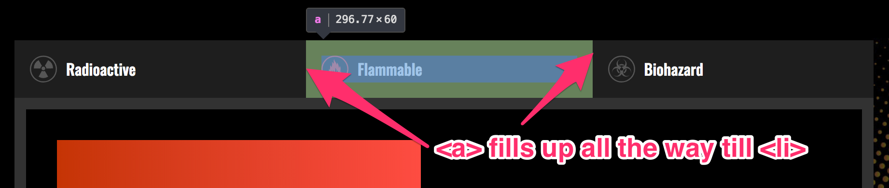
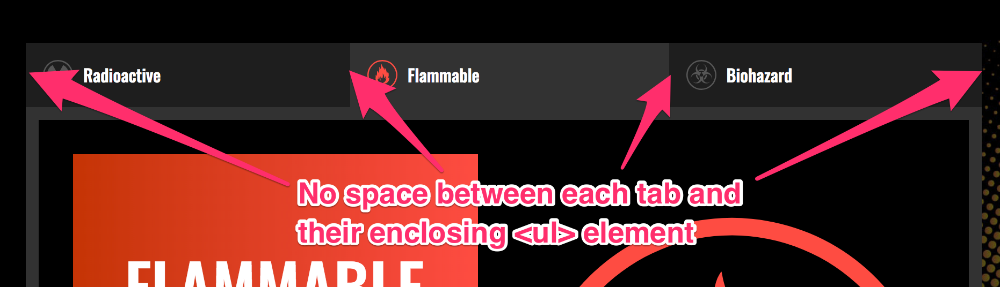

# 🛠 Improving the tabbed component

We can make two improvements to the tabbed component we've built so far:

1. Use the event delegation pattern
2. Prevent the awkward jump

## Using the event delegation pattern

Previously, we listened for a `click` event on every tab by attaching an event listener on the tab itself.

```js
tabs.forEach(tab => {
  tab.addEventListener('click', _ => {
    // ...
  })
})
```

As always, when you see this pattern, you know you can use an event delegation pattern.

To use the event delegation pattern, you want to attach one listener to the closest common ancestor. This ancestor is `.tabs`.

```html
<ul class="tabs">
  <li class="tab is-selected"> ... </li>
  <li class="tab"> ... </li>
  <li class="tab"> ... </li>
</ul>
```

```js
const component = document.querySelector('.tabbed-component')
const tabList = component.querySelector('.tabs')
tabs.addEventListener('click', e => {
  // Do something
})
```

Next, we need to know the `href` attribute. This `href` attribute only exists on the `<a>` element. From the HTML, we also know that it's possible to click on elements within `<a>`.

```html
<!-- There's <svg> and <span> within <a> -->
<a href="#radioactive">
  <svg class="tab__icon" viewBox="0 0 39.81 39.81" data-icon-color="radioactive">
    <use xlink:href="images/sprite.svg#radioactive" />
  </svg>
  <span class="tab__title">Radioactive</span>
</a>
```

If we click on elements within `<a>`, we need to be able to find `<a>`. To do so, we use `closest`.

```js
tabList.addEventListener('click', e => {
  const link = e.target.closest('a')
})
```

From the HTML and CSS output, we also know that each `<a>` element fills up the `<li>`. That means we don't have to worry about users clicking in the space between `<li>` and `<a>`.

<figure>
  
  <figcaption aria-hidden>No space between the tab and it's anchor element</figcaption>
</figure>

We also don't need to worry about users clicking on the space between `<ul>` and `<li>`. This space is non-existent for our tabbed component.

<figure>
  
  <figcaption aria-hidden>No space between the tab and their enclosing `<ul>` element</figcaption>
</figure>

Which means we don't need to check if we clicked on the weird spaces. We can perform our the actions we want directly in the event listener.

```js
tabList.addEventListener('click', e => {
  const link = e.target.closest('a')
  // Do stuff here
})
```

What stuff do we do?

Well, basically everything we did in the previous lesson. One tiny change though, is we need to get the `tab` by traversing the DOM.

```js
tabList.addEventListener('click', e => {
  const link = e.target.closest('a')
  const tab = link.parentNode
  const href = link.getAttribute('href')
  const tabContent = component.querySelector(href)

  // Hiding previous tab and tab content
  tabs.forEach(elem => elem.classList.remove('is-selected'))
  contents.forEach(elem => elem.classList.remove('is-selected'))

  // Showing the selected tab and tab content
  tab.classList.add('is-selected')
  tabContent.classList.add('is-selected')
})
```

## Preventing the awkward jump

When you click on any tab, your browser may jump a little.

<figure>
  
  <figcaption>Awkward jump</figcaption>
</figure>

This happens naturally when you click on `<a>` tags with a valid `href` attribute. If the `href` attribute begins with a `#`, browsers look for the an element with the same `id` as the `href` attribute and navigates to it. This process causes the browser to "jump".

The jump can be useful if you're on a long page, and if your element is outside the viewport. For a tab component, however, jump can be weird because users can already see your tab. You don't want to let the browser jump and confuse your user.

To prevent the awkward jump from happening, we simply prevent the default behavior.

```js
tabList.addEventListener('click', e => {
  e.preventDefault()
  // Do everything else
})
```

## Wrapping up

In this lesson, you added the event delegation pattern to the tabbed component. You also learned how to use `preventDefault` to prevent the awkward jump from happening.

## Homework

Add the event delegation pattern to your tabbed component. Prevent the awkward jump too. Make sure you can complete this assignment without referring to this lesson.