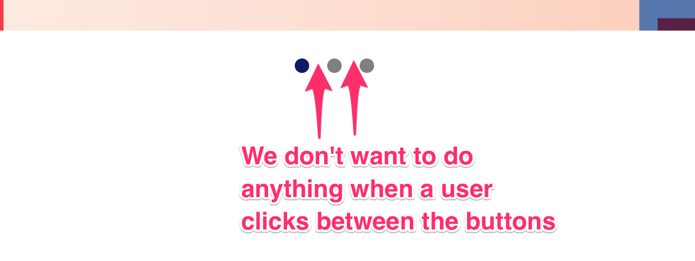

# 🛠 Improving the carousel

One improvement we can make to the carousel at this stage is to use the event delegation pattern to listen to clicks on each dot.

## Adding the event delegation pattern for the dots

From the HTML, we know the listening element needs to be `.carousel__nav`. This is quite straightforward.

```html
<div class="carousel__nav">
  <button class="carousel__dot is-selected"></button>
  <button class="carousel__dot"></button>
  <button class="carousel__dot"></button>
</div>
```

```js
dotsContainer.addEventListener('click', e => {
  // ... Do something here
})
```

We know there are spaces between dots; we want to ignore these spaces, so we check whether the target is a `<button>` element. You can either use `matches` or `closest` method for this.

<figure>
  
  <figcaption>We don't want to do anything when a user clicks on empty spaces!</figcaption>
</figure>

Let's use `closest` because `closest` also lets you determine if any ancestor element is a button. (We don't really need it for this component, but why not?).

```js
dotsContainer.addEventListener('click', e => {
  const targetDot = e.target.closest('button')
  if (targetDot) {
    // Do something
  }
})
```

Since you already have `targetDot`, there's no need to write `targetDot = dot` anymore.

```js
// Remove this line
const targetDot = dot
```

The rest of the component remains the same.

## Wrapping up

You added the event delegation pattern to the carousel in this lesson. Nothing new by now, yeah? 😉

## Homework

Add the event delegation pattern to your carousel. Make sure you can get it to work without referring to this lesson.

---

- Previous lesson: [Improving Tabbed Component](08.improving-tabbed-component.md)
- Next lesson: [Module 7 (animations-and-transitions), lesson 1—css-transition](../07.animations-and-transitions/01.css-transition.md)
