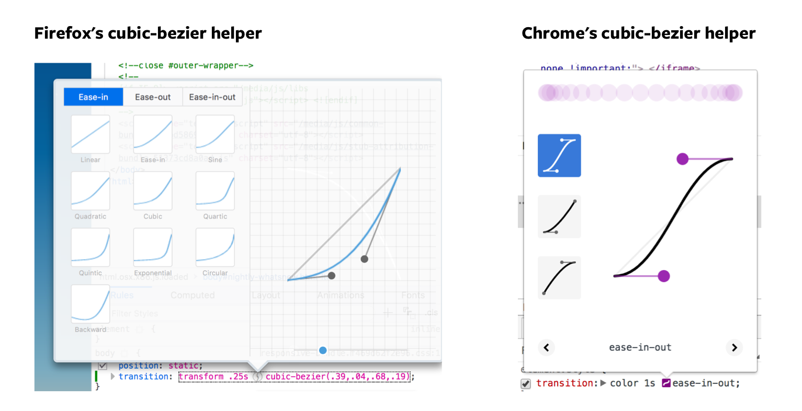

# CSS Transitions

There are three ways to create animations.

1. CSS Transitions
2. CSS Animations
3. JavaScript animations

## CSS Transitions

The simplest (most straightforward) way to animate your components is through CSS Transitions. A transition occurs when a CSS property changes from one value to another value over a period of time.

You can create CSS Transitions with the `transition` property:

```css
.selector {
  transition: property duration transition-timing-function delay;
}
```

The `transition` property is a shorthand of four CSS properties, `transition-property`, `transition-duration`, `transition-timing-function`, `transition-delay`.

```css
.selector {
  transition-property: property;
  transition-duration: duration;
  transition-timing-function: timing-function;
  transition-delay: delay;

  /* The transition property is the shorthand for the above four properties */
  transition: property duration timing-function delay;
}
```

`transition-property` refers to the CSS property you wish to transition. It is required in the `transition` shorthand.

`transition-duration` refers to the duration of the transition. How long do you want the transition to last? This value is written in seconds with the `s` suffix (like `3s`). It is also required in the `transition` shorthand.

`transition-timing-function` refers to how to transition occurs. You'll learn more about this later. This is also required in the `transition` shorthand.

`transition-delay` refers to how long you want to wait before starting the duration. This value is written in seconds with the `s` suffix (like `3s`). `transition-delay` is optional in the `transition` shorthand.

## Triggering transitions

You can trigger CSS transitions directly with pseudo classes like `:hover` (activates when mouse goes over an element), `:focus` (activates when a user tabs onto an element, or when a user clicks into an input element), or `:active` (activates when user clicks on the element).

```css
/* creating transitions directly in CSS */
.button {
  background-color: #33ae74;
  transition: background-color 0.5s ease-out;
}

.button:hover {
  background-color: #1ce;
}
```

See this Pen for a demo: https://codepen.io/zellwk/pen/Qqzzxd/

(I wish I could embed the Codepen directly in Github, but I can't. Unfortunately, you'll have to make do with clicking on the Codepen links until I'm done making an app for this course, which could take some time. In the meantime, I'm sorry about making you click somewhere else to view the content. Thank you so much for your patience).

<script async src="https://production-assets.codepen.io/assets/embed/ei.js"></script>

You can also trigger CSS transitions through JavaScript by adding or removing a class.

```css
.button {
  background-color: #33ae74;
  transition: background-color 0.5s ease-out;
}

.button.is-active {
  color: #1ce;
}
```

```js
const button = document.querySelector(".button");
button.addEventListener("click", _ => button.classList.toggle("is-active"));
```

See this Pen for a demo: https://codepen.io/zellwk/pen/GMPPBg/

## Understanding transition-timing-function

The `transition-timing-function` governs how a transition occurs. All transitions have a value of `linear` by default, which means the property changes evenly until the end of the transition.

```css
.selector {
  transition: transform 1s linear;

  /* OR */
  transition-property: transform;
  transition-duration: 1s;
  transition-timing-function: linear;
}
```

The thing is, nothing moves linearly in life. That's not how real objects move. Sometimes, we accelerate; Sometimes, we decelerate. The `transition-timing-function` allows you to capture all of that.

Imagine yourself throwing a tennis ball into an open field. The ball leaves your hand with the maximum speed. As it moves, it loses energy, it decelerates and eventually comes to a halt. This is called `ease-out`. There's a timing function for it.

```css
.selector {
  transition-timing-function: ease-out;
}
```

Now imagine you're in a car. It's not moving right now. When you move the car, it accelerates and goes toward its top speed. This is called `ease-in`. There's also a timing function for it.

```css
.selector {
  transition-timing-function: ease-in;
}
```

Since you have `ease-in` and `ease-out`, there's also a timing function that combines the two together, `ease-in-out`. (I advise against using `ease-in-out` in your transitions unless your transitions last longer than a second. Nothing eases in and out within a second. It simply looks weird.)

```css
.selector {
  transition-timing-function: ease-in-out;
}
```

See this pen for a demo of the timing functions you've learned so far: https://codepen.io/zellwk/pen/Oxrqpo.

Finally, if you don't like any of the above choices, you can create your own timing function with `cubic-bezier`.

## Creating your own timing function with cubic-bezier

A Cubic-bezier is a set of four values that determine your transition-timing-function. It looks like this:

```css
.selector {
  transition-timing-function: cubic-bezier(x1, y1, x2, y2);
}
```

Don't worry about the `x1`, `y1,`, `x2` and `y2`. You'll never create cubic-bezier curves by writing numbers yourself (unless you already know what they mean and you're tweaking your timing function for perfection).

You can rely on both Chrome and Firefox's trusty developer tools to help you create your curves. To use it, you add a `transition-timing-function` into an element, then open up devtools and click on the timing function.

<figure>
  
  <figcaption>Both Chrome and Firefox provides you with a cubic-bezier tool</figcaption>
</figure>

See this pen for a demo on cubic-beziers: https://codepen.io/zellwk/pen/gGZqNo

Going in-depth about creating your own bezier curves for your animations is out of scope for this lesson. We're mostly sticking with the default ones like `ease-out` and `ease-in` in the course. If you're interested, you can find more information about cubic-bezier curves in this [Smashing Magazine article](https://www.smashingmagazine.com/2014/04/understanding-css-timing-functions/).

## Transitioning two or more properties

You can transition two (or more) CSS properties by separating them with a comma in your `transition` or `transition-property` property.

You can do the same with duration, timing-functions and delays as well. If the values are the same, you only need to specify one of them.

```css
.selector {
  transition: background-color 1s ease-out, color 1s ease-out;

  /* OR */
  transition-property: background, color;
  transition-duration: 1s;
  transition-timing-function: ease-out;
}
```

You may be tempted to transition every CSS property with `all`. Don't ever do this. This is bad for performance. Always specify the property you're trying to transition.

```css
/* DON'T EVER DO THIS */
.selector {
  transition-property: all;
}

/* ALWAYS DO THIS */
.selector {
  transition-property: background-color, color, transform;
}
```

## Transitioning in vs transitioning out

Sometimes, you want the properties to transition in and out at differently. You want the duration, timing-function or delay to be different. (See the modal window animation when you learn to create accessible interfaces. This one is high-level).

To do so, you write another set of `transition-` properties.

```css
.button {
  background-color: #33ae74;
  transition: background-color 0.5s ease-out;
}

.button:hover {
  background-color: #1ce;
  transition-duration: 2s;
}
```

When you write transition properties in the triggering class/pseudo class, the transition properties in the triggering class/pseudo class overwrites the original transition properties you've stated in the base class.

So, in the example above, when you hover on the button, the background color takes 2 seconds to change from `#33ae74` to `#1ce`.

When you hover out from the button, the background color only takes 0.5s to change back to `#1ce` because the `transition-duration` of 2s no longer exists.

This is a little mind-boggly, so read what I've written again. And read it one more time. Read at least three times and practice the heck out of it until this behavior becomes second nature.

## Exercise

Create the following transitions:

1. Change the `opacity` property of an element from 0.5 to 1 over 1.5 seconds when you hover on it.
2. Rotate an element from 0deg to 180deg when you add the `is-rotated` class to it. (Hint: you can transition the `transform` property).
3. Experiment with `ease`, `ease-in`, `ease-out` timing functions.
4. Create your own timing function with Cubic bezier.
5. Create a transition that uses the `ease-out` timing function when transitioning in and `ease-in` when transitioning out.

PS: There's also a "step" transition-timing-function. I never found much use for it, but you can read more [here](https://css-tricks.com/using-multi-step-animations-transitions/) if you're interested.
