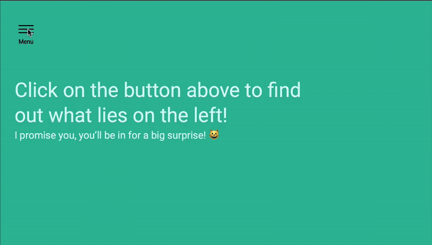

# 🛠 Animating the off-canvas menu

By the end of this lesson you should be able to get this:

<figure>
  
  <figcaption>Completed animation for the off-canvas menu</figcaption>
</figure>

## Try it yourself first

You should roughly know how to build this animation if you've read the CSS transitions lesson. (You've read it, didn't you?).

If you read the lesson, take a step back from this lesson and try to build the animation on your own. If you didn't, go read it now.

## Here's how to build this

Remember in the previous module you moved the `.site-container` and `.offsite-container` with the `transform` property?

```css
/* The canvas */
.offsite-is-open .site-container {
  transform: translateX(14rem);
}

/* The offsite canvas */
.offsite-is-open .offsite-container {
  transform: translateX(14rem);
}
```

Well, all you need to do now is add the `transition` property to both `.site-container` and `.offsite-container` and you're done.

```css
.site-container {
  transition: transform 0.3s ease-out;
}

.offsite-container {
  transition: transform 0.3s ease-out;
}
```

Tada! 🎉

