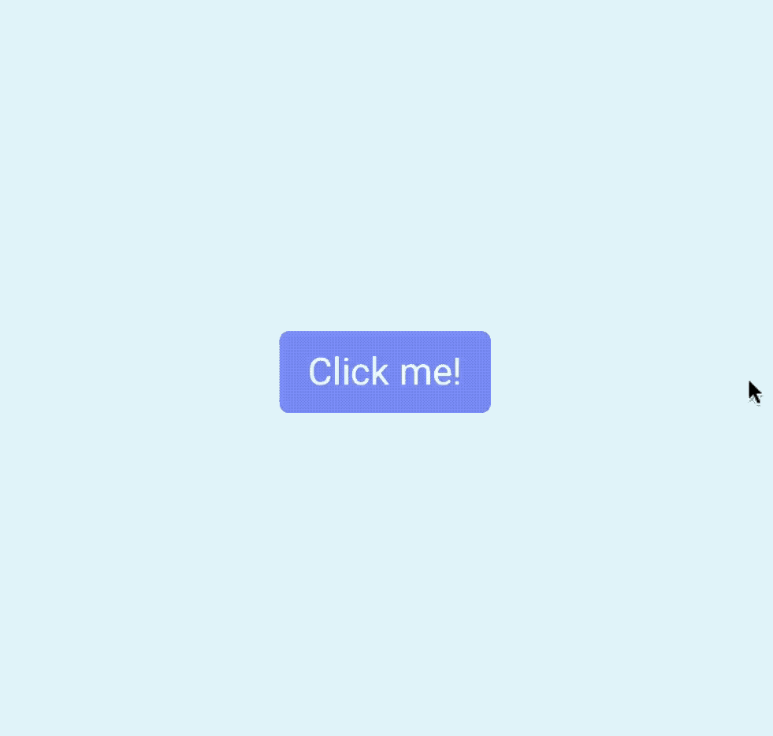
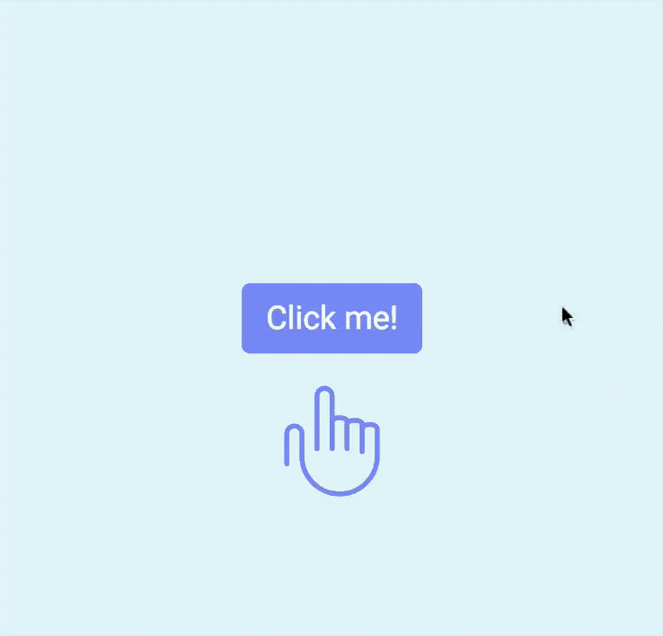
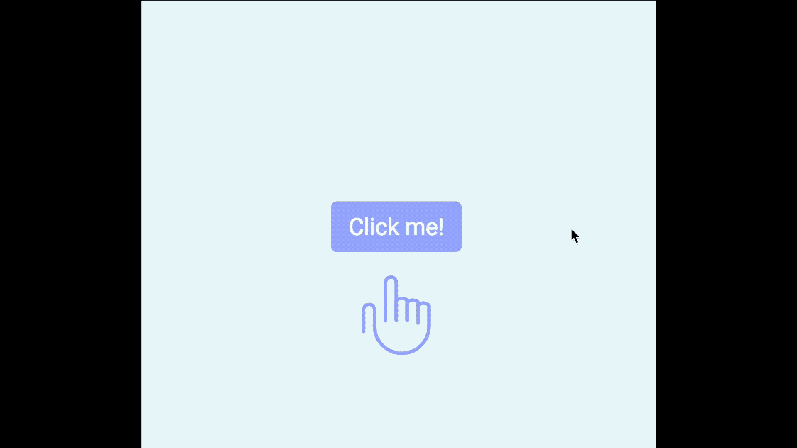
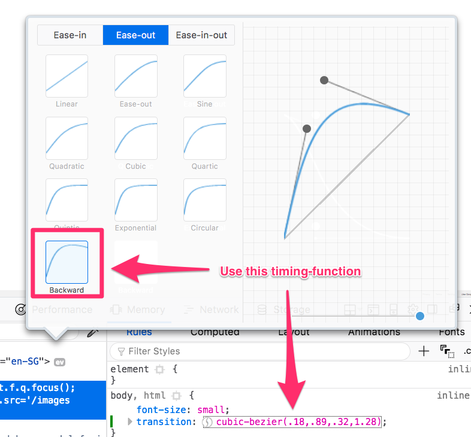

# 🛠 Animating the modal window

By the end of this lesson you should be able to get this:

<figure>
  
  <figcaption>Completed animation for the modal window</figcaption>
</figure>

Three animations happened in the GIF above:

1. The opening animation for the modal window.
2. The pointing hand animation when the browser loads
3. The waving hand animation after the button modal opens

Let's break these three animations down.

## The opening animation for the modal window.

You already know the modal window is visible (`opacity: 1;`) when it is open, and invisible (`opacity: 0;`) when it is closed.

To animate the opening of the modal window, you need to do is transition the `opacity` value:

```css
.modal-container {
  /* other properties */
  transition: opacity 0.3s ease-out;
}
```

<figure>
  
  <figcaption>Opening animation</figcaption>
</figure>

Although this animation looks okay, there's something you need to be aware of. If you look carefully at this GIF below, where I altered the background color of the modal window, and the duration of the animation, you'll see that the button appears before the modal faded away!

<figure>
  
  <figcaption>Button appears before modal fades away completely!</figcaption>
</figure>

This happens because we need to change two properties—`z-index` and `opacity`—when opening and closing the modal window. So far, we've only transitioned `opacity`; `z-index` flips immediately without any transition.

To fix this problem, you might be tempted to create a transition on them both at the same time, like in the code below.

```css
.modal-container {
  transition: opacity 3s ease-out, z-index 3s ease-out;
}
```

Note: While we work on this animation, let's slow down the animation so it takes 3s instead of 0.3s to complete; this'll give us time to spot any problems.

<figure>
  
  <figcaption>Swapping of layers causes a strange change in opacity</figcaption>
</figure>

Note: GIFs don't do animation justice. I suggest you try the code above to correctly view the results of the animation. Github doesn't let me embed videos directly. :(

Notice the strange jerk the opacity of the button? This jerk in opacity is caused by a swap in `z-index`. When we open the modal, `z-index` remains at `-1`. It transitions from `-1` to `1` in three seconds. Midway, it passes index `0`, where the layers get swapped.

Likewise, when the modal closes, `z-index` remains at `1`. It transitions from `1` to `-1` in three seconds. Midway, it passes index `0`, where the content layer and the modal window swaps once again.

This is a tiny detail that many people won't consciously notice if your animation lasts for 0.3s. However, if your eyes are fast, you'll feel uncomfortable with it; you just won't really know what happened.

To fix this, we need to change the `z-index` transition.

When the modal opens, we want `z-index` to jump to `1` immediately so the modal window can fade in at the right layer.

When the modal closes, we want `z-index` to remain at `1` until the modal fades away completely. We only change the `z-index` from `1` to `-1` when the modal completes the fade.

That means `z-index` should not have a `transition-duration`.

```css
.modal-container {
  transition: opacity 3s ease-out, z-index 0s linear;
}
```

When you remove the transition duration from `z-index`, you'll notice the animation works well when you're opening the modal. But in the closing animation, you'll notice you still have the same problem as if you didn't add a `z-index` transition.

<figure>
  
  <figcaption>Results after removing transition duration on z-index</figcaption>
</figure>

To fix the closing animation, you need to a delay to the `z-index` transition so to doesn't activate until the modal window fades away completely. When you think about the delay for the first time, you might want to add it to `.modal-container` directly.

```css
.modal-container {
  transition: opacity 3s ease-out, z-index 0s linear 3s;
}
```

But if you do so, the opening animation will get screwed up—the `z-index` layer becomes `1` only after the modal has faded in completely.

<figure>
  
  <figcaption>Z-index flips to 1 only after modal has faded in completely</figcaption>
</figure>

To combat this fade-in problem, you want to set a `transition-delay` of 0 in the `body.modal-is-open .modal-container` selector.

```css
body.modal-is-open .modal-container {
  opacity: 1;
  z-index: 1;
  transition-delay: 0s;
}
```

<figure>
  
  <figcaption>Flawless opening and closing animations. Finally!</figcaption>
</figure>

Why does setting a `transition-delay` in `body.modal-is-open .modal-container` work? Give it a thought. If you can't understand why, you have a question to ask in the community :)

Finally, don't forget to set the `transition-duration` and `transition-delay` back to 0.3s when you're done.

```css
.modal-container {
  transition: opacity 0.3s ease-out, z-index 0s linear 0.3s;
}
```

## The pointing hand animation

The pointing hand animation begins when the browser loads. Since there is no clear trigger for a CSS transition to occur, you need to create this animation with CSS Animations.

Let's look closely at the pointing hand animation and see what you need to extract from it.

<figure>
  
  <figcaption>Pointing-hand animation</figcaption>
</figure>

You can tell a few things from this animation.

First, the hand begins invisible, and becomes visible over time. This means you need to change the opacity in the CSS animation.

```html
<!-- Adding the point-hand class to the SVG -->
<svg class="point-hand" viewBox="0 0 58 66"><use xlink:href="images/sprite.svg#point-hand"/></svg>
```

```css
@keyframes point {
  0% {
    opacity: 0;
  }

  100% {
    opacity: 1;
  }
}

.point-hand {
  animation: point 1s ease-out;
}
```

<figure>
  
  <figcaption>Pointing-hand fades in</figcaption>
</figure>

Second, the hand slides in from the bottom. This means you need to move the hand with `translateY`.

```css
@keyframes point {
  0% {
    transform: translateY(3em);
    opacity: 0;
  }

  100% {
    transform: translateY(0);
    opacity: 1;
  }
}

.point-hand {
  animation: point 1s ease-out;
}
```

<figure>
  
  <figcaption>Sliding in the hand from the bottom</figcaption>
</figure>

Third, as the hand slides in, it moves a bit over the intended position, then moves back down.

There are many ways to do this animation. One way is to create the movement with `@keyframes`. (Don't do this. You'll kill yourself trying to get the @keyframe point right). A better way is to change the timing-function a "backwards" cubic-bezier curve.

<figure>
  
  <figcaption>Backwards ease-out curve</figcaption>
</figure>

```css
.point-hand {
  animation: point 1s cubic-bezier(0.18, 0.89, 0.32, 1.28);
}
```

And you get the pointing-hand animation.

<figure>
  
  <figcaption>Pointing-hand animation</figcaption>
</figure>

Let's move on.

## The waving hand animation

The waving hand animation is the most complicated one in this example.

<figure>
  
  <figcaption>The waving hand animation</figcaption>
</figure>

From the GIF, you can see that there are two parts to this animation – the zooming part and the waving part. Let's work on the zooming part first.

### The zooming part

When the modal window opens up, the hand turns opaque (from invisible to visible) and pops out (from small to big).

You can add this animation either through a CSS transition or a CSS animation. Since you will need to make a CSS Animation for the waving part later, let's stick to CSS Animations.

Building the zoom animation is straightforward. You probably know how to do this already:

```css
/* Makes waving hand zoom out */
@keyframes zoom {
  0% {
    transform: scale(0.25);
    opacity: 0;
  }

  100% {
    transform: scale(1);
    opacity: 1;
  }
}
```

Once you've built the `zoom` animation, add it to the waving hand.

```html
<!-- Adding wave-hand class to the SVG -->
<svg class="wave-hand" width="112" height="139" viewBox="0 0 112 139"><use xlink:href="images/sprite.svg#wave-hand" /></svg>
```

```css
.wave-hand {
  /* This is the same cubic-bezier curve you used in the earlier animation */
  animation: zoom 0.5s cubic-bezier(0.18, 0.89, 0.32, 1.28);
}
```

Right now, the `zoom` animation begins immedialety when the broswer loads. You don't want that. You want the `zoom` animation to play only when the button gets clicked.

To do so, you can set the `animation-play-state` to `paused`. Then, change the `animation-play-state` to running when the modal opens.

```css
.wave-hand {
  animation: zoom 0.5s cubic-bezier(0.18, 0.89, 0.32, 1.28);
  animation-play-state: paused;
}

.modal-is-open .wave-hand {
  animation-play-state: running;
}
```

<figure>
  
  <figcaption>Hand zooms in when the modal is open</figcaption>
</figure>

(Note: This animation works everywhere except in Safari. It seems like there's a bug with changing the `animation-play-state` property).

Let's work on the waving part next.

### The waving part

The waving part is complicated. When you build anything complicated, it makes sense to extract the complicated part so you can work on it without getting distracted by other things.

I've prepared a Codepen for you to play around with the wave part. Go ahead and click on [this link](https://codepen.io/zellwk/pen/zEbERM) to get started.

Now, to create wave animation, you have to think about the different possible values the waving hand needs to move to.

Our hand moves to these six points:

1. Begins straight upright
2. Rotates to its left (your right)
3. Rotates to its right (your left)
4. Rotates to its left again
5. Rotates to its right again
6. Goes back to the starting position

You can say that these 6 points are "snapshots" in the animation. Once you get these six points right, the rest of the animation follows through easily.

<figure>
  
  <figcaption>6 points of wave-hand animation</figcaption>
</figure>

Since each snapshot takes up the same amount of time, you can split the `@keyframes` points evenly into 6 (including 0%).

```css
@keyframes wave {
  0% { /* Start at center */ }
  20% { /* Rotate to its left */ }
  40% { /* Rotate to its right */ }
  60% { /* Rotate to its left */ }
  80% { /* Rotate to its right */ }
  100% { /* Back to center */ }
}
```

In the animation the hand is rotated by 15 degrees. To rotate clockwise, you increment by 15 degrees. To rotate anti-clockwise, you decrease by 15 degrees.

```css
@keyframes wave {
  0% { transform: rotate(0); }
  20% { transform: rotate(15deg); }
  40% { transform: rotate(-15deg); }
  60% { transform: rotate(15deg); }
  80% { transform: rotate(-15deg); }
  100% { transform: rotate(0); }
}

.wave-hand {
  animation: wave 1s ease-in-out;
}
```

```html
<!-- Remember to add the wave-hand class to your HTML! -->
<svg class="wave-hand" width="112" height="139" viewBox="0 0 112 139"><use xlink:href="images/sprite.svg#wave-hand" /></svg>
```

<figure>
  
  <figcaption>The hand waves! But...</figcaption>
</figure>

Whoa. Right now, the animation looks weird. It rotates around the middle of the hand, and that's not how you normally wave!

You want the hand to rotate about the bottom center part so the animation looks natural. To so do, you change the `transform-origin` property (which tells CSS where to rotate from) to `bottom center`.

```css
.wave-hand {
  transform-origin: bottom center;
  animation: wave 1s ease-in-out;
  animation-play-state: paused;
}
```

<figure>
  
  <figcaption>The hand waves correctly now!</figcaption>
</figure>

Much better!

Now, you can combine the `zoom` animation with the `wave` animation together in your `wave-hand` element.

Since `zoom` comes first, let's put `zoom` before `wave` in the `animation` property. Make sure you add a slight delay to the `wave` animation so it comes after `zoom`!

```css
.wave-hand {
  transform-origin: bottom center;
  animation: zoom 0.5s cubic-bezier(0.18, 0.89, 0.32, 1.28),
    /* creates a delay for the wave animation. Experiment with the delay value here! */
    wave 1s 0.55s ease-in-out;
  animation-play-state: paused;
}
```

<figure>
  
  <figcaption>The waving hand animation</figcaption>
</figure>

And you're done...?

Not quite. If you try clicking on the button a second time, you'll notice the animation doesn't move!

The reason is because the animation has completed. To make it move again, you have to restart the animation.

## Restarting the waving hand

If you read [this article](https://css-tricks.com/restart-css-animation/) on CSS tricks, you'll realize that restarting CSS animations is tricky, almost hacky.

I prefer not to resort to hacky tricks whenever possible because it makes things hard to maintain in future

Since starting the animation requires JavaScript anyway, let's switch from using CSS Animations to GSAP.

## Installing GSAP

If you haven't already, install GSAP by typing this command in your command line (if you're using the starter template).

If you're not using the starter template, skip ahead to the next section. Install GSAP with the instructions you've read on the [GSAP lesson]() and skip ahead to the next section.

```bash
npm install gsap --save-dev
```

Then, add the following line of code into your `main.js` file.

```js
import 'gsap'
```

## Waving the hand with JavaScript

First, add a class to the waving hand SVG so it's easier for you to target it in your JavaScript.

```html
<svg class="jsWaveHand" width="112" height="139" viewBox="0 0 112 139"><use xlink:href="images/sprite.svg#wave-hand" /></svg>
```

```js
const hand = document.querySelector('.jsWaveHand')
```

The hand waves when the modal window opens. To perform this action, you can create a function called `wave` (where you'll write the waving code).

You can call this `wave` function when you open the modal:

```js
const wave = hand => {
  // Wave hand animation here
}

const openModal = _ => {
  document.body.classList.add('modal-is-open')
  wave(hand)
}
```

## Creating the zoom animation with GSAP

From the `zoom` and `wave` animations combined, you can see that you're going to work with multiple tweens. The easiest way to perform this animation is with TimelineMax.

```js
const wave = hand => {
  const tl = new TimelineMax({})
}
```

You're now prepared to create the `zoom` animation.

To help you remember what you did previously, this is the `zoom` animation with CSS Animations:

```css
@keyframes zoom {
  0% {
    transform: scale(0.25);
    opacity: 0;
  }

  100% {
    transform: scale(1);
    opacity: 1;
  }
}

.wave-hand {
  animation: zoom 0.5s cubic-bezier(0.18, 0.89, 0.32, 1.28);
  animation-play-state: paused;
}
```

You animated the waving hand from a `scale` of 0.25 to 1 with CSS Animations. While doing so, you also changed the `opacity` from 0 to 1.

Without any animations, the waving hand is already at a `scale` of 1 and an `opacity` of 1. You need to **animate from** a scale of `0.25` and an opacity of 0.

Here, you can use the `from` method.

The cubic-bezier curve equivalent for the `zoom` animation is `Back.easeOut` in GSAP.

```js
const wave = hand => {
  const tl = new TimelineMax({})
  tl.from(hand, 0.5, {
    scale: 0.5,
    opacity: 0,
    ease: Back.easeOut.config(1.5)
  })
}
```

<figure>
  
  <figcaption>Zoom animation with GSAP</figcaption>
</figure>

Great! Let's work on the wave animation next.

## Creating the wave animation with GSAP

Here's the `wave` animation you created with CSS Animations:

```css
@keyframes wave {
  0% { transform: rotate(0); }
  20% { transform: rotate(15deg); }
  40% { transform: rotate(-15deg); }
  60% { transform: rotate(15deg); }
  80% { transform: rotate(-15deg); }
  100% { transform: rotate(0); }
}

.wave-hand {
  transform-origin: bottom center;
  animation: wave 1s 0.55s ease-in-out;
  animation-play-state: paused;
}
```

When you use GSAP, you don't care about the `0%`, `20%`, `40%` and so on. What you care about is the animation from `0%` to `20%`, from `20%` to `40%` and so on.

From `0%` to `20%`, you want the hand to rotate to the right. Here, you use the `to` method. The duration of this movement is 0.2 seconds.

```js
const wave = hand => {
  const tl = new TimelineMax({})
  tl.from(hand, 0.5, {scale: 0.5, opacity: 0, ease: Back.easeOut.config(1.5)})
  tl.to(hand, 0.2, {rotation: 15})
}
```

From `20%` to `40%`, you want the hand to rotate to the left. It should end up at a `-15deg` rotation, so you continue chaining the wave animation with `to`.

```js
const wave = hand => {
  const tl = new TimelineMax({})
  tl.from(hand, 0.5, {scale: 0.5, opacity: 0, ease: Back.easeOut.config(1.5)})
  tl.to(hand, 0.2, {rotation: 15})
  tl.to(hand, 0.2, {rotation: -15})
}
```

And you can continue until you're done with the rest of the animation.

```js
const wave = hand => {
  const tl = new TimelineMax({})
  tl.from(hand, 0.5, {scale: 0.5, opacity: 0, ease: Back.easeOut.config(1.5)})
  tl.to(hand, 0.2, {rotation: 15})
  tl.to(hand, 0.2, {rotation: -15})
  tl.to(hand, 0.2, {rotation: 15})
  tl.to(hand, 0.2, {rotation: -15})
  tl.to(hand, 0.2, {rotation: 0})
}
```

<figure>
  
  <figcaption></figcaption>
</figure>

Oops! Looks like we forgot about the `transform-origin` property!

You want to set the `transform-origin` property without triggering any animations. To do so, you can use the `set` method.

Let's add the `transform-origin` property to the top of the animation sequence so the scale animation scales from the bottom as well.

```js
const wave = hand => {
  const tl = new TimelineMax({})
  // Sets transform origin
  tl.set(hand, {transformOrigin: 'bottom center'})
  tl.from(hand, 0.5, {scale: 0.5, opacity: 0, ease: Back.easeOut.config(1.5)})
  tl.to(hand, 0.2, {rotation: 15})
  tl.to(hand, 0.2, {rotation: -15})
  tl.to(hand, 0.2, {rotation: 15})
  tl.to(hand, 0.2, {rotation: -15})
  tl.to(hand, 0.2, {rotation: 0})
}
```

## Adding a delay between tweens in TimelineMax

If you noticed, there is a slight delay (0.05 seconds) after the `zoom` animation completes, before the start of the `wave` animation.

```css
.wave-hand {
  animation: zoom 0.5s cubic-bezier(0.18, 0.89, 0.32, 1.28),
    wave 1s 0.55s ease-in-out;
}
```

To create the additional delay in TimelineMax, you pass a fourth parameter to the tween. It looks like this

```js
const tween = TweenMax.to(element, duration, vars, '+=0.05')
```

The `+=0.05` tells GSAP to add a 0.05s delay. If you used `-=0.05`, you tell GSAP to start the tween 0.05s earlier.

And you're finally done!

<figure>
  
  <figcaption>Completed animation for the modal window</figcaption>
</figure>

Bye bye!

## Wrapping up

In this lesson, you learned to build three animations:

1. The opening modal animation
2. The pointing-hand animation
3. The waving-hand animation

You've also learned to use CSS Transitions, CSS Animations and GSAP. Now you're a full fledged animator. Go and explore and try building different animations!

(Make sure you try building the accordion animation yourself!).


