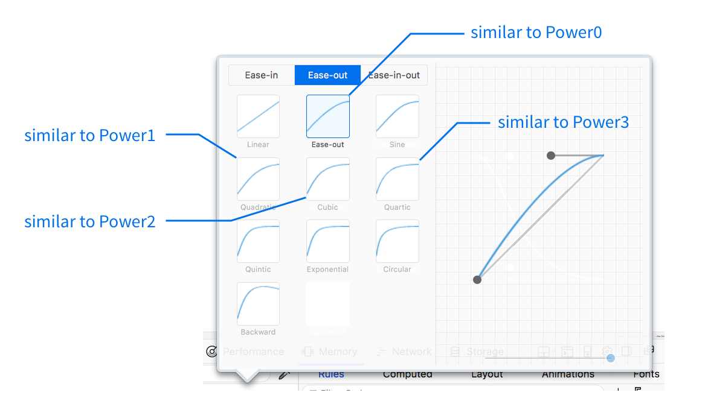

# Greensock Animation API (GSAP)

[Greensock Animation API (GSAP)](https://greensock.com) is an animation library that's performs animations incredibly well. It can be used safely back to IE6 to create animations without jank. It is the only animation library that handles SVG animations seamlessly.

Many animation experts, like [Sarah Drasner](https://twitter.com/sarah_edo) and [Chris Gannon](https://twitter.com/ChrisGannon), use GSAP on a daily basis in their work. You can use GSAP too.

You'll learn how to use GSAP in this course for simple animations. Complex animations are out of scope. If you want to learn more about complex animations, I recommend you follow Sarah or Chris for more information.

## Installing GSAP

To install GSAP in your project, you need to include the library before you include your JavaScript file. The process looks like this:

```html
<!-- Link to GSAP -->
<script src="https://cdnjs.cloudflare.com/ajax/libs/gsap/1.20.3/TweenMax.min.js"></script>

<!-- Your main JavaScript comes nexet -->
<script src="js/main.js"></script>
```

## TweenMax and TimelineMax

GSAP lets you choose from four libraries—**TweenLite**, **TweenMax**, **TimelineLite** and **TimelineMax**; TweenMax has more features than TweenLite; TimelineMax has more features than TimelineLite.

Since you're learning about GSAP for the first time, let's optimize for learning and use TweenMax; it includes almost everything you'll ever need (including TimelineMax).

If you're worried about file size, you can optimize your assets for production by choosing the right libraries later. For now, let's stick with learning.

## First, what's a Tween?

A tween is a single movement in an animation. In GSAP, a tween has the following syntax:

```js
TweenMax.method(element, duration, vars)
```

`method` refers to the GSAP method you'll like to tween with.

`element` is the element you want to animate. If you want to create tweens for multiple elements at the same time, you can pass in an array of elements to `element`.

`duration` is the duration of your tween. It is an integer in seconds (without the `s` suffix!).

`vars` is an object of the properties you want to animate. More on this later.

## GSAP methods

GSAP lets you animate with many methods. When you're new, the ones you'll use most are:

1. `set`
2. `from`
3. `to`

`set` sets the `vars` object to the specified values **without creating an animation**.

`from` animates the element **from the values you set in `vars`** to their current values.

`to` animates the element from their current values **to the values you set in `vars`**.

## GSAP vars

`vars` is an object that lets you specify the properties you want to animate. You can specify any CSS property here. Just switch the CSS naming format into camel case.

For example, if you want to animate the `font-size` property, you change `font-size` into `fontSize`.

```js
const vars = {
  fontSize: '20px',
  backgroundColor: '#40eefa'
}
```

GSAP also lets you animate CSS transforms. The syntax here is slightly different though:

- For `translateX`, you use `x`.
- For `translateY`, you use `y`.
- For `rotate`, you use `rotation`.

```js
const vars = {
  x: 200, // Translates 200px from left to right
  y: -200 // Translates 200px from bottom to top
  rotation: 90 // Rotates 90 degrees
}
```

When you use `x`, `y` and `rotation`, GSAP uses [CSS transform matrix](https://developer.mozilla.org/en-US/docs/Web/CSS/transform-function/matrix) to calculate the tween.

In case you are wondering, there is no need to understand CSS Transform matrix because you'll probably not want to hand-write one. It's unbelievably complicated.

### Is there a documentation that contains all animate-able properties?

Unfortunately, no. There isn't a documentation that contains all animate-able properties. The good news is, you won't need such a documentation because GSAP can animate any animate-able CSS property. As long as you can use CSS Transitions on the property, GSAP can handle it for you.

By the way, even though GSAP is super fast, you can't stop jank from happening if you animate CSS properties other than `transform` and `opacity`. So don't animate other CSS properties unnecessarily.

## Let's start tweening

Let's say you have a box. You want to move the box from the left to the right over 2 seconds.

To do so, you use the `to` method because you want to move the box **to** the right. In `vars` object, you specify the `x` property (translateX) to move things horizontally.

```js
const box = document.querySelector('.box')
TweenMax.to(box, 2, {x: 400 })
```

<figure>
  
  <figcaption>Moving a box from left to right over 2 seconds</figcaption>
</figure>

Here's another example: let's say you want the box from the bottom to it's current position. The box should be invisible at first; it fades in and becomes fully visible at the end of the animation.

To do so, you use the `from` method because you want to move the box **from** the bottom. In the `vars` object, you specify the `y` property to move things vertically. You also specify `opacity` to make the box fade in.

```js
const box = document.querySelector('.box')
TweenMax.from(box, 2, {
  y: 100,
  opacity: 0
})
```

<figure>
  
  <figcaption>Moving a box from bottom up, changing opacity at the same time</figcaption>
</figure>

## Timing functions

Like CSS Transitions and CSS Animations, you can create timing functions for each of your tweens. The syntax is slightly different though.

In GSAP, you write the timing functions as the `ease` property.

```js
const vars = {
  ease: Power0.easeOut;
}
```

GSAP provides you with many easing variables like ``Power0`, `Power1`, `Power2`, `Power3` and `Power4`. These easing variables tell GSAP how strong the easing needs to be.

`Power0` gives you the normal ease-in and ease-out values, `Power1` gives you the quadratic ease-in and ease-out values, and `Power2` gives you the cubic ease-in and cubic ease-out values, and so on.

If you use Firefox's devtools, you can roughly estimate what `Power0` to `Power4` looks like.

<figure>
  
  <figcaption>Power0 to Power4 are similar to the standard, quadratic, cubic and quartic easing values</figcaption>
</figure>

Besides `Power0` to `Power4`, GSAP gives you other easing variables, like `Bounce` and `Elastic`, that are more powerful than to cubic-bezier curves—they let you create animations that you can't do with cubic-bezier!

One example is a bouncing animation. Click the ball in this [this codepen](https://codepen.io/zellwk/pen/mBoJry) and you'll see the ball bounce.

<figure>
  
  <figcaption>Realistic bouncing animation with Bounce easing</figcaption>
</figure>

## The Easing visualizer

To find the perfect timing-function for your tweens, you can use the [easing visualizer](https://greensock.com/ease-visualizer) that GSAP has created. Here, you'll find a complete list of possible easing variables.

<figure>
  
  <figcaption>A complete list of easing variables</figcaption>
</figure>

You can also customize easing properties and see how it looks like immediately.

<figure>
  
  <figcaption>Each easing variable can be further customized by clicking on the underlined items</figcaption>
</figure>

If you want to create animations that look good, you need to go through different possible timing-functions and find the perfect one. There's no substitute for experimentation here, so experiment away! GSAP has already made it easy for you!

## Multiple Tweens at the same time

You can Tween an element with two different sets of `vars` at the same time. To do so, you create two tweens, like this:

```js
const ball = document.querySelector('svg g')

ball.addEventListener('click', e => {
  TweenMax.to(ball, 2.5, {
    x: 600,
    rotation: 720,
    transformOrigin: '50% 50%',
    ease: 'Power1.easeOut'
  });
  TweenMax.to(ball, 2, {
    y: 400,
    ease: 'Bounce.easeOut'
  });
})
```

<figure>
  
  <figcaption>Bouncing, moving and rotating at the same time</figcaption>
</figure>

See [this codepen](https://codepen.io/zellwk/pen/rGRVev) if you want to click on the ball yourself.

If you want to start the second tween after the first tween is done, you need to set a delay value in the second tween with the `delay` property.

```js
const box = document.querySelector('box')
TweenMax.to(box, 1, {x: 200})
TweenMax.to(box, 1, {y: 200, delay: 1})
```

<figure>
  
  <figcaption>Delaying a tween with the delay property</figcaption>
</figure>

Setting delay like this is easy if you only use a few tweens. It becomes unwieldy if you have more more tweens to work with.

That's where TimelineMax comes in to help.

## Chaining Tweens with TimelineMax

TimelineMax lets you chain tweens together. When you do so, the second tween starts after the first tween completes; the third tween starts after the second tween completes.

To create a TimelineMax instance, you write `new TimelineMax({})`.

```js
const tl = new TimelineMax({})
```

Once you've created a timeline, treat the new `tl` variable as `TweenMax` and continue doing whatever you did previously.

```js
const tl = new TimelineMax({})
tl.to(box, 1, {x: 200})
tl.to(box, 1, {y: 200})
```

What you'll notice is, without the delay, the second tween (moving vertically) gets attached to the end of the first tween automatically. Isn't that sweet?!

<figure>
  
  <figcaption>Chaining tweens with TimelineMax</figcaption>
</figure>

Check [this codepen](https://codepen.io/zellwk/pen/qPgyEb) for a demo.

That's it for a basic intro to the Greensock Animation API (GSAP). There's way more to TweenMax and TimelineMax that you've learned in this lesson. Feel free to explore what you can do with them (or wait till you learn more when you build components).

## Wrapping up

GSAP is a library that lets you create animations with JavaScript. It contains four possible libraries—`TweenLite`, `TweenMax`, `TimelineLite` and `TimelineMax`.

To create a tween, you specify three things—the element you want to tween, the duration of the tween, and the `vars` object—in the `to`, `from` methods.

You can create multiple tweens that start at the same time by simply writing two tweens. To chain tweens together, you can use `TimelineMax`.

## Exercise

1. Install GSAP into your project.
2. Create a tween that moves an object from 200px from the left to the right.
3. Create a tween that moves an object 200px from the top to the bottom.
4. Create a tween that turns an object invisible.
5. Chain five tweens with TimelineMax