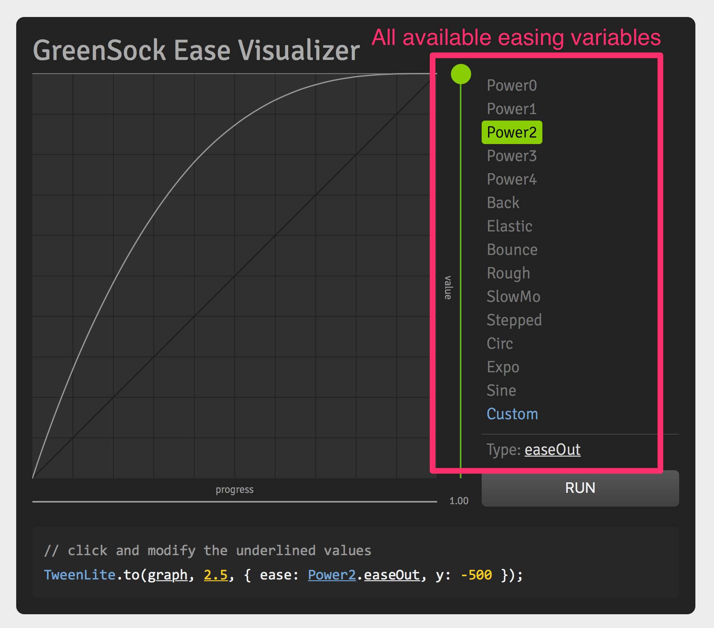
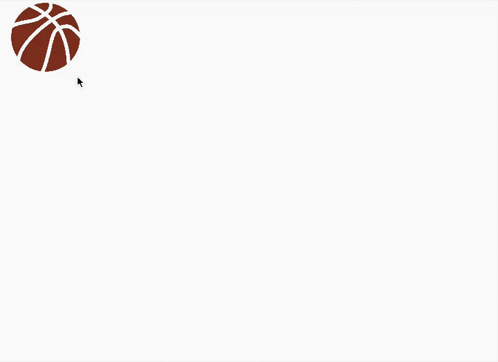

# Greensock Animation API (GSAP)

[Greensock Animation API (GSAP)](https://greensock.com) is an animation library that's performs animations incredibly well. It can be used safely back to IE6 to create animations without jank. It is the only animation library that handles SVG animations seamlessly.

Many animation experts, like [Sarah Drasner](https://twitter.com/sarah_edo) and [Chris Gannon](https://twitter.com/ChrisGannon), use GSAP on a daily basis in their work. You can use GSAP too.

(Okay, GSAP is freaking amazing, I gotta admit).

You'll learn how to use GSAP in this course for simple animations. Complex animations are out of scope. If you want to learn more about complex animations, I recommend you follow Sarah or Chris for more information. (Alternatively, ask me some questions and I might come back with another course in future 😎).

## Installing GSAP

When you use GSAP normally in your project, you need to include the library before you include your JavaScript file. The process looks like this:

```html
<!-- Link to GSAP -->
<script src="https://cdnjs.cloudflare.com/ajax/libs/gsap/1.20.3/TweenMax.min.js"></script>

<!-- Your main JavaScript comes nexet -->
<script src="js/main.js"></script>
```

## Installing GSAP with the starter kit

If you use GSAP with the starter template, the installation process is different. Why it is different will become clear to you when you learn about Webpack in a later module. For now, follow the instructions.

To install GSAP, you need to run the following command in the command line, after navigating to your project folder. (You can also use Yarn if you know about Yarn. Don't worry about Yarn otherwise).

```js
npm install gsap --save-dev
```

Once you have installed GSAP through your command line, go to your `main.js` file and add `import 'gsap'` at the top of your JavaScript file. With this, you're ready to use GSAP.

```js
import 'gsap'
```

## TweenMax and TimelineMax

GSAP provides you with four objects – `TweenLite`, `TweenMax`, `TimelineLite` and `TimelineMax`.

As you can tell from the names, `TweenMax` is a stronger version (with more features) than `TweenLite`. `TimelineMax` is a stronger version (more features) than `TimelineLite`.

Since you're learning, lets use `TweenMax` and `TimelineMax`. You can worry about optimizing for file sizes when you're done going through the course.

## First, what's a Tween?

A tween is a single movement in an animation. In GSAP, a tween has the following syntax:

```js
TweenMax.method(element, duration, vars)
```

`method` refers to the GSAP method you'll like to tween with.

`element` is the `element` you want to tween for. If you want to create a tween for multiple elements at once, you can pass in an array of elements. For this course, we'll stick to tweening one thing at a time.

`duration` is the duration of your tween. This duration is an integer in seconds (without the `s` suffix!).

`vars` is an object of the properties you want to animate. More on this later.

## GSAP methods

GSAP lets you animate with many methods. When you're new, the ones you'll use most are:

1. `set`
2. `from`
3. `to`

`set` sets the `vars` object to the specified values without creating a tween. (No animation if you use `set`).

`from` animates the element from the values you set in `vars` to their current values.

`to` animates the element from their current values to the values you set in `vars`.

## GSAP vars

GSAP `vars` is an object that lets you specify the properties you want to animate. You can specify any CSS property here. Just switch the CSS naming format into camel case.

So, for example, if you want to animate the `font-size` property, you change `font-size` into `fontSize`.

```js
const vars = {
  fontSize: '20px',
  backgroundColor: '#40eefa'
}
```

GSAP also lets you animate CSS transforms. The syntax here is slightly different though:

- For `translateX`, you use `x`.
- For `translateY`, you use `y`.
- For `rotate`, you use `rotation`.

```js
const vars = {
  x: 200, // Translates 200px from left to right
  y: -200 // Translates 200px from bottom to top
  rotation: 90 // Rotates 90 degrees
}
```

When you use `x`, `y` and `rotation`, GSAP uses [CSS transform matrix](https://developer.mozilla.org/en-US/docs/Web/CSS/transform-function/matrix) to calculate the tween.

CSS Transform matrix is unbelievably complicated to understand. Don't even bother trying to understand it. You won't ever want to calculate CSS transform matrix by hand. I recommend you stick to using GSAP to save time, energy, and most importantly, sanity.

**Is there a documentation that contains all animate-able properties?**

Unfortunately, no. There isn't a documentation that contains all animate-able properties. The good news is, you won't need such a documentation because GSAP can animate any animate-able CSS property. So, as long as you can transition the CSS property, GSAP can handle it for you.

By the way, even though GSAP is super fast, you can't stop jank from happening if you animate CSS properties other than `transform` and `opacity`. So, you don't want to animate other CSS properties unnecessarily.

Don't believe it? See the jank when you hover over the button in [this Codepen](https://codepen.io/zellwk/pen/LzqJdJ) and you'll open your eyes to the truth.

## Let's start tweening

Enough talk. Nothing beats examples, so let's tween something. You'll get it immediately once you see it work!

Let's say you have a box. You want to move the box from the left to the right over 2 seconds.

To do so, you use the `to` method because you want to move the box **to** the right. In `vars` object, you specify the `x` property (translateX) to move things horizontally.

```js
const box = document.querySelector('.box')
TweenMax.to(box, 2, {x: 400 })
```

<figure>
  
  <figcaption>Moving a box from left to right over 2 seconds</figcaption>
</figure>

Now, let's say you want to move the box into it's current position, from the bottom. It should be invisible at first, and it should become fully visible when you reach the end.

To do so, you use the `from` method because you want to move the box **from** the bottom. In `vars` object, you specify the `y` property (translateY) to move things vertically. You also specify `opacity` to transition make the box fade in.

```js
const box = document.querySelector('.box')
TweenMax.to(box, 2, {
  y: 100,
  opacity: 0
})
```

<figure>
  
  <figcaption>Moving a box from bottom up, changing opacity at the same time</figcaption>
</figure>

## Timing functions

Like CSS animations, you can create timing functions for each of your tweens. The syntax is slightly different though.

In GSAP, you write the timing functions as the `ease` property.

```js
const vars = {
  ease: Power0.easeOut;
}
```

GSAP provides you with many easing variables like ``Power0`, `Power1`, `Power2`, `Power3` and `Power4`. These easing variables tell GSAP how strong the easing needs to be. If you've checked out the cubic-bezier helper in Firefox's devtool, you'll kind of know what they mean.

`Power0` gives you the normal ease-in and ease-out values. `Power1` gives you the xx values. `Power2` gives you the cubic ease-in and cubic ease-out values and so on.

<figure>
  
  <figcaption>Power0 to Power4 are similar to the standard, quadratic, cubic and quartic easing values</figcaption>
</figure>

Besides `Power0` to `Power4`, GSAP gives you other easing variables, like `Bounce` and `Elastic`, that are more powerful than to cubic-bezier curves – they let you create animations that you can't do with cubic-bezier!

One example is a bouncing animation. Click the ball in this [this codepen](https://codepen.io/zellwk/pen/mBoJry) and you'll see the ball bounce.

<figure>
  
  <figcaption>Realistic bouncing animation with Bounce easing</figcaption>
</figure>

## The Easing visualizer

GSAP has created an [easing visualizer](https://greensock.com/ease-visualizer) To help you find the perfect timing-function for your tweens,

In this visualizer, you can find a complete list of easing variables available in GSAP.

<figure>
  
  <figcaption>A complete list of easing variables</figcaption>
</figure>

You can also customize your easing and immediately see how it'll look like.

<figure>
  
  <figcaption>Each easing variable can be further customized by clicking on the underlined items</figcaption>
</figure>

If you want to create animations that look good, you need to go through different possible timing-functions and find the perfect one. There's no substitute for experimentation here, so experiment away! GSAP has already made it easy for you!

## Multiple Tweens at the same time

You can Tween an element with two different sets of `vars` at the same time.

```js
const ball = document.querySelector('svg g')

ball.addEventListener('click', e => {
  TweenMax.to(ball, 2.5, {
    x: 600,
    rotation: 720,
    transformOrigin: '50% 50%',
    ease: 'Power1.easeOut'
  });
  TweenMax.to(ball, 2, {
    y: 400,
    ease: 'Bounce.easeOut'
  });
})
```

<figure>
  
  <figcaption>Bouncing, moving and rotating at the same time</figcaption>
</figure>

See [this codepen](https://codepen.io/zellwk/pen/rGRVev) if you want to click on the ball yourself.

If you want to start the second tween after the first tween is done, you need to set a delay value in the second tween with the `delay` property.

```js
const box = document.querySelector('box')
TweenMax.to(box, 1, {x: 200})
TweenMax.to(box, 1, {y: 200, delay: 1})
```

<figure>
  
  <figcaption>Delaying a tween with the delay property</figcaption>
</figure>

Setting delay like this is easy if you only use a few tweens. It becomes unwieldy if you have more more tweens to work with.

That's where TimelineMax comes in to help.

## Chaining Tweens with TimelineMax

TimelineMax lets you chain tweens together. When you do so, the second tween will automatically start after the first tween completes. The third tween will automatically start after the second tween completes.

To create a TimelineMax instance, you write `new TimelineMax({})`. (This `new` thing requires you to know about Object Oriented Programming, which you'll learn in a later module).

```js
const tl = new TimelineMax({})
```

Once you've created a timeline, treat the new `tl` variable as `TweenMax` and continue doing whatever you did previously.

```js
const tl = new TimelineMax({})
tl.to(box, 1, {x: 200})
tl.to(box, 1, {y: 200})
```

What you'll notice is, without the delay, the second tween (moving vertically) automatically gets attached to the end of the first tween. Isn't that sweet?!

<figure>
  
  <figcaption>Chaining tweens with TimelineMax</figcaption>
</figure>

Check [this codepen](https://codepen.io/zellwk/pen/qPgyEb) for a demo.

That's it for a basic intro to the Greensock Animation API (GSAP). There's way more to TweenMax and TimelineMax that you've learned in this lesson. Feel free to explore what you can do with them (or wait till you learn more when you build components).

## Exercise

1. Install GSAP into your project.
2. Create a tween that moves an object from 200px from the left to the right.
3. Create a tween that moves an object 200px from the top to the bottom.
4. Create a tween that turns an object invisible.
5. Chain five tweens with TimelineMax