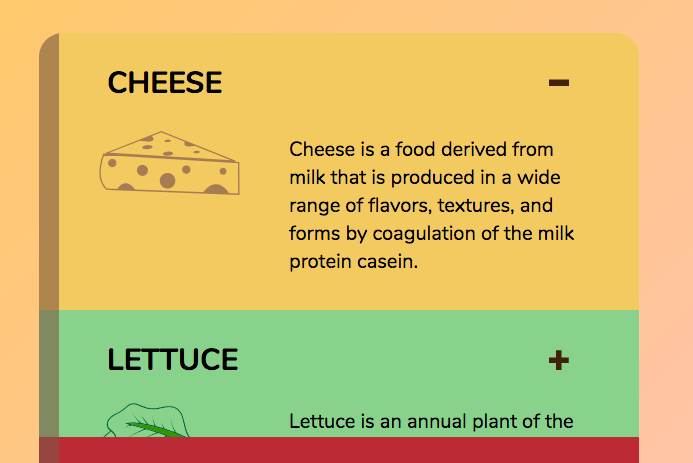
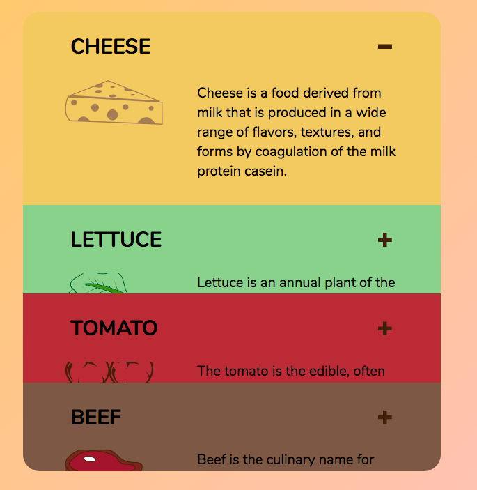
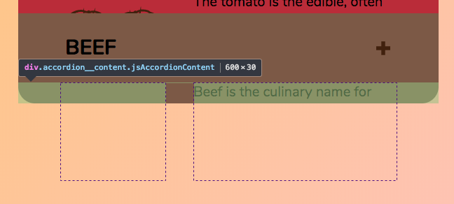
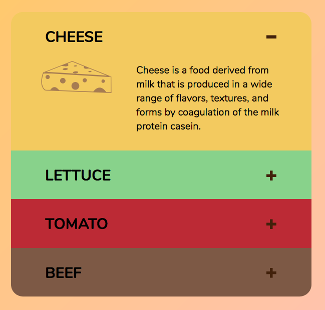

# 🛠 Animating accordions

You're going to learn how to animate the accordion in this lesson. You'll get this by the end of the lesson:

<figure>
  
  <figcaption>Completed animation for the accordion</figcaption>
</figure>

Let's start with the most important lesson of all.

## Stop using display: none

`display: none` prevents animations from happening because the `display` property cannot be animated. If you want to build animations, you'll want to stay away from `display: none` as much as possible.

So, to animate the accordion, we cannot hide `.accordion__content` with `display: none`.

Instead of `display: none`, we can hide `.accordion__content` by setting the `height` property to zero. When `.accordion__content` is open, we can set `height` back to auto:

```css
/* remove these properties */
.accordion__content {
  display: none;
}

.accordion.is-open .accordion__content {
  display: grid;
}
```

```css
/* Add these properties */
.accordion__content {
  display: grid;
  height: 0;
}

.accordion.is-open .accordion__content {
  height: auto;
}
```

Here's what we have at this point. (It looks broken; I'll explain why it's broken, then we'll fix it).

<figure>
  
  <figcaption>Accordion content peeks out slightly even though height is set to zero</figcaption>
</figure>

If you remove `position: relative` from `.accordion`, you'll see a worst picture. (This is what you'll normally see, but since we set `position: relative` for this specific accordion, you'll see the above picture instead).

<figure>
  
  <figcaption>Accordion content peeks out slightly, and text overflows onto other accordion items</figcaption>
</figure>

There are two problems with the above picture:

1. Text overflows into subsequent accordion items.
2. Accordion content isn't completely hidden even though height is set to zero.

### Fixing the overflow issue

`overflow` is set to `visible`. This allows elements to be visible even if they exceed their parent's boundaries. To prevent text from overflowing outside of `.accordion__content`, you can set `overflow` to `hidden`.

```css
.accordion__content {
  overflow: hidden;
}
```

<figure>
  
  <figcaption>Overflow hidden hides children that exceed it's boundaries</figcaption>
</figure>

(Note: You can put `position: relative` back to `.accordion` at this point. I wanted to show you what would happen if you were to style a standard accordion).

## Fixing the height issue

The `.accordion__content` can still be seen even though height is set to zero. This is because `.accordion__content` contains a `padding` property. This `padding` gives `height` to `.accordion__content`, even though it doesn't use the `height` property.

<figure>
  
  <figcaption>The padding-bottom property gives "height" to the accordion content.</figcaption>
</figure>

To completely remove the accordion content from view, you need to reset both `height` and `padding` properties.

```css
.accordion__content {
  height: 0;
  padding: 0;
  /* other properties */
}

.accordion.is-open .accordion__content {
  height: auto;
  padding-right: 3em;
  padding-bottom: 1.5em;
  padding-left: 3em;
}
```

<figure>
  
  <figcaption>Accordion items are properly closed when height and padding are set to zero.</figcaption>
</figure>

This is undesirable, because we need to transition two properties—`height` and `padding`. Ideally, we want to change only one property (because we can keep track of lesser things).

To allow our accordion to transition only with the `height` property, we can add wrap `.accordion__content` in another `<div>`. Let's call this outer div `.accordion__content`; we'll call the previous accordion content `.accordion__inner`.

```html
<div class="accordion__content jsAccordionContent">
  <div class="accordion__inner">
    <!-- Cheese image -->
    <!-- Description of choose  -->
  </div>
</div>
```

We want set the `height` of `accordion__content` to zero when the accordion item is closed. We'll set the `height` to `auto` when the accordion item is opened. Every other property that used to belong to `.accordion__content` should now also be switched to `.accordion__inner`.

Here's the complete CSS changes:

```css
.accordion__content {
  height: 0;
  overflow: hidden;
}

.accordion.is-open .accordion__content {
  height: auto;
}

.accordion__inner {
  display: grid;
  grid-row-gap: 1rem;
  padding-right: 3em;
  padding-bottom: 1.5em;
  padding-left: 3em;
}

@media screen and (min-width: 700px) {
  .accordion__inner {
    grid-template-columns: 7.5em 1fr;
    grid-column-gap: 2rem;
    align-items: center;
  }
}
```

Once you're done with this set of changes, you'll get the right visuals for the accordion. At this point, the opening and closing of the accordion should still work:

<figure>
  
  <figcaption aria-hidden>Accordion functionality should still work even though the HTML and CSS have changed</figcaption>
</figure>

## Animating the accordion's height property

Although the `height` property can be animated, you cannot animate a component's height to `auto`. You can verify this by setting the `transition` property; the results will be the same as before.

```css
.accordion__content {
  transition: height 0.3s ease-out;
}
```

<figure>
  
  <figcaption aria-hidden>You cannot animate height with to the `auto` value</figcaption>
</figure>

But if you set `height` to a specific value, you can animate the `height` property.

```css
.accordion.is-open .accordion__content {
  height: 200px;
}
```

<figure>
  
  <figcaption>You can animate the height property to a specific value</figcaption>
</figure>

This means you need to use JavaScript to find (and set) the height of `.accordion__content`.

### But I thought you shouldn't transition the height property?

Yep. You don't want to `transition` the height property if you can help it, because transitioning the height property could cause jank. (Transitioning properties other than `transform` and `opacity` may create jank).

Unfortunately, there's no way to animate the accordion without changing the `height` property. A bit of jank is better than no transition at all, right? :)

## Getting accordion content's height with JavaScript

The height of `.accordion__content` should be the height of `.accordion__inner`.

<figure>
  
  <figcaption>Height of accordion content should be height of accordion inner</figcaption>
</figure>

Before you can get the height of `.accordion__inner`, you need to find `.accordion__inner` and `.accordion__content` with some DOM traversal-jitsu.

### Getting accordionContent and accordionInner

Since `.accordion__content` is the next element after the `.jsAccordionHeader`, you can use `nextElementSibling` to select it:

```js
accordionContainer.addEventListener('click', e => {
  const header = e.target.closest('.jsAccordionHeader')
  if (header) {
    const accordionContent = header.nextElementSibling
    // ...
  }
})
```

Once you have `accordionContent`, getting `.accordion__inner` is simple. Since there's only one child element within `accordionContent`, `.accordion__inner` must be the `firstElementChild`.

```js
accordionContainer.addEventListener('click', e => {
  const header = e.target.closest('.jsAccordionHeader')
  if (header) {
    const accordionContent = header.nextElementSibling
    const accordionInner = accordionContent.firstElementChild

    // ...
  }
})
```

### Setting accordionContent's height

To get the height property. You can use `getBoundingClientRect()`.

```js
accordionContainer.addEventListener('click', e => {
  const header = e.target.closest('.jsAccordionHeader')
  if (header) {
    const accordionContent = header.nextElementSibling
    const height = accordionContent.firstElementChild.getBoundingClientRect().height
  }
})
```

If you `console.log` the height, you should get a number:

```js
console.log(height) // 180
```

Since you know the height of `accordionInner`, you can set the height of `accordionContent` with `Element.style.height`. (Note: you need to provide a unit to set a valid height; since `getBoundingClientRect` retrieves pixel values, you can set the height to `height + 'px'`).

```js
accordionContainer.addEventListener('click', e => {
  const header = e.target.closest('.jsAccordionHeader')
  if (header) {
    const accordionContent = header.nextElementSibling
    const height = accordionContent.firstElementChild.getBoundingClientRect().height

    accordionContent.style.height = height + 'px'

    // ...
  }
})
```

At this point, don't forget that you need open and close the accordion by checking for the `is-open` class. (The code below should be straightforward for you at this point. If you don't understand it, go through it slowly and try to figure out what each line does. Take your time!).

```js
accordionContainer.addEventListener('click', e => {
  const header = e.target.closest('.jsAccordionHeader')
  if (header) {
    const accordion = header.parentNode
    const accordionContent = header.nextElementSibling
    const height = accordionContent.firstElementChild.getBoundingClientRect().height

    if (accordion.classList.contains('is-open')) {
      accordionContent.style.height = '0px'
      accordion.classList.remove('is-open')
    } else {
      accordionContent.style.height = height + 'px'
      accordion.classList.add('is-open')
    }
  }
})
```

With this, you have the complete animation.

<figure>
  
  <figcaption>Completed animation for the accordion</figcaption>
</figure>

## Cleaning up the code a little

A huge chunk of the code was written within an `if` statement. This isn't ideal because indentations make code harder to read.

```js
if (header) {
  // All our code belongs in here
}
```

You can remove one level of indentation if you write a `return` when the `header` is not found.

```js
accordionContainer.addEventListener('click', e => {
  const header = e.target.closest('.jsAccordionHeader')
  if (!header) return

  // ...
})
```

## Wrapping up

When you create animations, try to transition as little properties as you can. This makes your component easier to handle. Sometimes, doing so requires a slight change in the HTML.

Although it's not advisable to transition the `height` property, don't hesitate to use it if you need to. It's much harder to write readable code if you create all kinds of hacks. As long as you transition responsibly, you should be alright.

