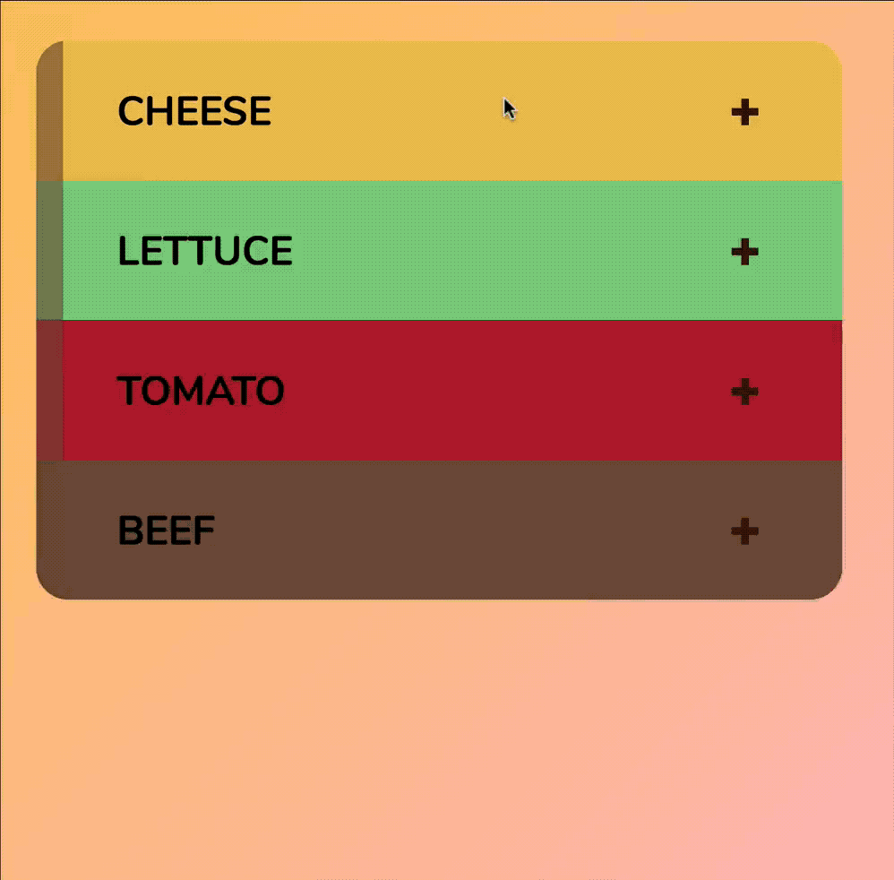

# 🛠 Animating accordions

(This chapter is still in draft mode. Stop reading! 😄).

By the end of this lesson you should be able to get this:

<figure>
  
  <figcaption>Completed animation for the accordion</figcaption>
</figure>

## How to build animate the accordion

From the animation, the accordion content looks squished when the accordion is closed. When the accordion is open, the accordion content is set to is normal height.

<figure>
  
  <figcaption></figcaption>
</figure>

In this case, you need to animate the `height` property of the accordion content. Working with height is always tricky, as you'll see from this lesson.

First of all, we need to remove `display: none;` from the `.accordion__content`. When you use `display: none;`, you cannot animate it (unless you create the animation with JavaScript), so `display: none;` is the enemy of animation. Also, you should never use `display: none;` if you want to create an accessible interface. More on why in the accessibility module.

First, let's try to set the `accordion__content`'s height property to zero and see what happens.

```css
.accordion__content {
  height: 0;
}
```

<figure>
  
  <figcaption></figcaption>
</figure>

It looks like there's an extra space at the bottom of the `.acoordion__header`. Why is that?

Upon closer inspection, you can see that `accodion__content` has a padding-bottom, which creates the extra whitespace. This padding-bottom exists even though the height is supposed to be zero.

<figure>
  
  <figcaption></figcaption>
</figure>

Not good.

To remove the `.accordion__content` entirely with the height property, you must restructure the HTML such that the padding resides in an inner element. You can do so by adding another `<div>`. Let's call this `.accordion__inner`.

```html
<div class="accordion__content jsAccordionContent">
  <div class="accordion__inner">
    <!-- Inner content -->
  </div>
</div>
```

Since the `padding` and layout properties (by layout, I mean display and grid properties) are supposed to be written for the direct parent that contains the actual content, let's shift the CSS from `.accordion__content` to `.accordion__inner`.

```css
.accordion__inner {
  display: grid;
  grid-row-gap: 1rem;
  padding-right: 3em;
  padding-bottom: 1.5em;
  padding-left: 3em;
}

@media screen and (min-width: 700px) {
  .accordion__inner {
    grid-template-columns: 7.5em 1fr;
    grid-column-gap: 2rem;
    -webkit-box-align: center;
    -ms-flex-align: center;
    align-items: center;
  }
}
```

Now, set the height of `.accordion__content` to 0 again. It should work.

<figure>
  
  <figcaption></figcaption>
</figure>

Next, we need to transition the height.

## Transitioning the height

Transitioning height is a tricky issue. This is because CSS doesn't play with height very well. You've probably heard horror stories about trying to align things vertically with CSS in the past. Those are all because of height!

But those stories are not relevant. It's not that hard over here. Let's see.

Transitioning height is a tricky issue. You'll see why. Maybe I don't even need this.

When the accordion is open, we want to display the accordion content. To do so, you can set height to `auto`.

```css
.accordion.is-open .accordion__content {
  height: auto;
}
```

<figure>
  
  <figcaption></figcaption>
</figure>

But you cannot transition `height` when it is set to auto. It simply doesn't work.

```css
.accordion__content {
  transition: height 0.35s ease-out;
  /* other properties */
}
```

<figure>
  
  <figcaption></figcaption>
</figure>

The only way to transition `height` in CSS is to set a fixed height value. Try setting a height of 400px and you'll see the smooth transition.

```css
.accordion.is-open .accordion__content {
  height: 400px;
}
```

<figure>
  
  <figcaption></figcaption>
</figure>

That means you need a way to set the height of the content accurately, which means you need JavaScript.

## But wait a minute, you shouldn't transition height!

Great catch! If you remember the jank-free animation lesson, you'll know you should only create transitions with `transform` and `opacity`.

Unfortunately, there is no way to animate the accordion without changing the `height` of the accordion. Even though it might introduce some jank, a transition is better than none!

## Getting the height with JavaScript

So, now you need to get the height of the `.accordion__content` when it is expanded. The question is how?

To do so, you can try getting height (padding included) of the `.accordion__inner` element. Since the height of the `.accordion__inner` in the same as the `accordion__content`, it's worth a try.

To get the `.accordion__inner` element, you can perform a DOM traversal. This is the perfect time to practice your traversal-jitsu if you've haven't been using it.

```js
accordionContainer.addEventListener('click', e => {
  const header = e.target.closest('.jsAccordionHeader')
  if (header) {
    const content = header.nextElementSibling
    console.log(content)
    // commenting out the toggling for now
    // header.parentNode.classList.toggle('is-open')
  }
})
```

<figure>
  
  <figcaption></figcaption>
</figure>

Sweet. Now, you need to find the `.accordion__inner` element. To do so, you can use `firstElementChild`

```js
accordionContainer.addEventListener('click', e => {
  const header = e.target.closest('.jsAccordionHeader')
  if (header) {
    const content = header.nextElementSibling
    const inner = content.firstElementChild
    console.log(inner)
    // commenting out the toggling for now
    // header.parentNode.classList.toggle('is-open')
  }
})
```

Look at your component as you hover over the element in the console. Can you see that the element has the height? You can use this height to your advantage!

<figure>
  
  <figcaption></figcaption>
</figure>

So now, you need to get the height property. You can do so with `getBoundingClientRect()`.

```js
accordionContainer.addEventListener('click', e => {
  const header = e.target.closest('.jsAccordionHeader')
  if (header) {
    const content = header.nextElementSibling
    const height = content.firstElementChild.getBoundingClientRect().height
    console.log(height)
    // commenting out the toggling for now
    // header.parentNode.classList.toggle('is-open')
  }
})
```

<figure>
  
  <figcaption></figcaption>
</figure>

Alright! Now you can see the height is X.

What's next is setting the height on the accordion header when it is open. You also want to remove the height (and set it to 0px) when the accordion is closed.

Note, you need to add the `px` suffix to the `height` value because `height` doesn't accept a unitless value. In JavaScript, you also need the `px` unit when you set `height` to 0.

```js
accordionContainer.addEventListener('click', e => {
  const header = e.target.closest('.jsAccordionHeader')
  if (header) {
    const content = header.nextElementSibling
    const height = content.firstElementChild.getBoundingClientRect().height

    if (header.parentNode.classList.contains('is-open')) {
      content.style.height = '0px'
    } else {
      content.style.height = height + 'px'
    }

    header.parentNode.classList.toggle('is-open')
  }
})
```

<figure>
  
  <figcaption></figcaption>
</figure>

And you're done!

Now, time for some refactoring to make the code a bit cleaner.

## Cleaning up the code

First of all, you may have noticed you're using `header.parentNode.classList` twice in the code. You can abstract this long string of properties into a variable.

```js
accordionContainer.addEventListener('click', e => {
  const header = e.target.closest('.jsAccordionHeader')
  if (header) {
    const accordionClassList = header.parentNode.classList
    const content = header.nextElementSibling
    const height = content.firstElementChild.getBoundingClientRect().height

    if (accordionClassList.contains('is-open')) {
      content.style.height = '0px'
    } else {
      content.style.height = height + 'px'
    }

    accordionClassList.toggle('is-open')
  }
})
```

Second, since you already need to check if the `accordionClassList` contains `is-open`, you might as well fit the `toggle` method into the if/else statement. This creates less of a cognitive overload because you group all the things you need to change in the same place. I like to make things abit more specific and use the `remove` and `add` methods instead of keeping it as `toggle`. Refactoring code is a stylistic choice. As long as it works, and as long as its understandable, it's good enough.

```js
accordionContainer.addEventListener('click', e => {
  const header = e.target.closest('.jsAccordionHeader')
  if (header) {
    const accordionClassList = header.parentNode.classList
    const content = header.nextElementSibling
    const height = content.firstElementChild.getBoundingClientRect().height

    if (accordionClassList.contains('is-open')) {
      content.style.height = '0px'
      accordionClassList.remove('is-open')
    } else {
      content.style.height = height + 'px'
      accordionClassList.add('is-open')
    }
  }
})
```

Third, you may have notice a huge chunk of the code is written within an `if` statement.

```js
if (header) {
  // All our code belongs in here
}
```

Each indent adds on cognitive weight to the code you write. If you create more than three indents, it starts becoming unbearable.

You can avoid letting the code becoming unbearable by creating a `return` statement that breaks out of the callback.

```js
accordionContainer.addEventListener('click', e => {
  const header = e.target.closest('.jsAccordionHeader')
  if (!header) return

  const accordionClassList = header.parentNode.classList
  const content = header.nextElementSibling
  const height = content.firstElementChild.getBoundingClientRect().height

  if (accordionClassList.contains('is-open')) {
    content.style.height = '0px'
    accordionClassList.remove('is-open')
  } else {
    content.style.height = height + 'px'
    accordionClassList.add('is-open')
  }
})
```

