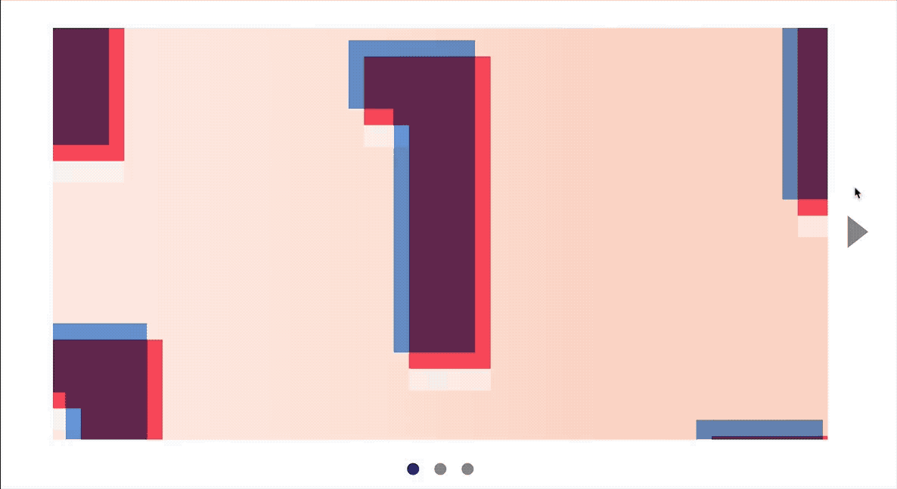

# 🛠 Animating the carousel

You're going to learn how to animate the carousel in this lesson. You'll get this by the end of the lesson:

<figure>
  
  <figcaption>Completed animation for the carousel</figcaption>
</figure>

## Animating the transitions

To animate the carousel, all you need to `transition` the `left` property of the `track`. (Can you reason out why?)

```css
.carousel__track {
  left: 0;
  transition: left 0.3s ease-out;
}
```

However, you should not transition the `left` property because you'll introduce jank. You should transition a `transform` property instead. Specifically, you'll want to use `translateX`

## Switching slides with transforms

To switch slides with transforms, two things must happen:

1. You need to set the right transform value with JavaScript
2. You need to create a `transition` for the `transform` property.

### Setting the right transform value

The correct transform value is the same as the correct left value. You need to change it into the transform syntax. Can you understand what's going on? If you don't make sure you ask in the community :)

```js
// remove this
track.style.left = '-' + targetSlide.style.left
```

```js
// replace with this
track.style.transform = 'translateX(-' + targetSlide.style.left + ')'
```

Since you're using transforms, you might want to [add a vendor prefix](./05.detecting-vendor-prefixes.md) to support older browsers. I'll leave you to add the vendor prefix on your own.

### Setting the transform property

Since we're replacing `left` with `transform`, you can remove `position` and `left` properties from `.carousel__track`.

In it's place, write a `transition` property, and a `transform` property that begins with a `translateX` of zero. (Why do you need `translateX(0)`? What happens if you don't include it? Try it out!).

```css
// remove this
.carousel__track {
  position: relative;
  left: 0;
  transition: left 0.3s ease-out;
}
```

```css
// replace with this
.carousel__track {
  transform: translateX(0);
  transition: transform 0.3s ease-out;
}
```

## Wrapping up

When you create animations, try to use the four properties explained in [jank free animations](./03.jank-free-animations.md). They are:

1. Translate (from the transform property)
2. Rotate (from the transform property)
3. Scale (from the transform property)
4. Opacity

Sometimes, you might need to hack around your brain before you can use these four properties. Other times, the change is more straightforward, like in this carousel's case.