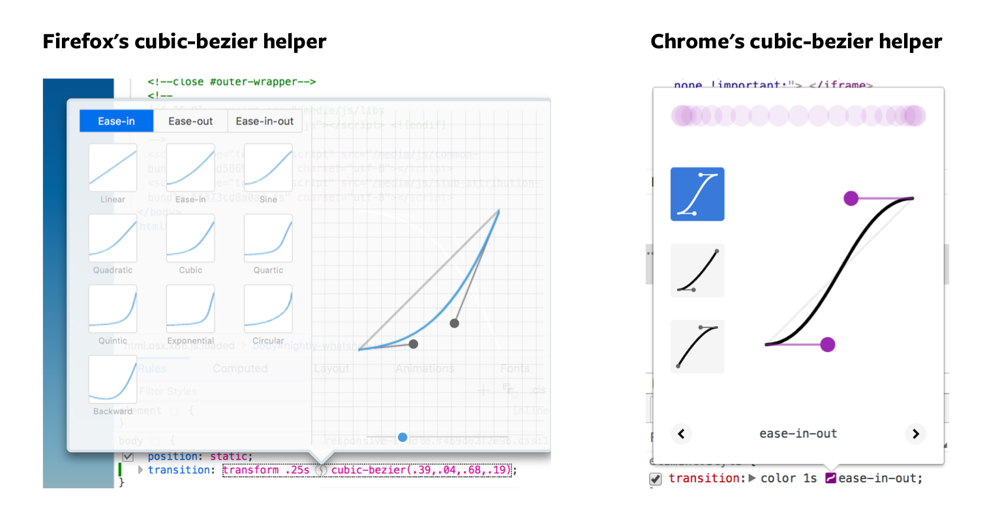

# CSS Transitions

There are three ways to create animations.

1. CSS Transitions
2. CSS Animations
3. JavaScript animations

CSS transitions is the simplest one of the three.

## CSS Transitions

**A transition occurs when a CSS property changes from one value to another value over a period of time.**

You can create transitions with the `transition` property:

```css
.selector {
  transition: property duration transition-timing-function delay;
}
```

The `transition` property is a shorthand of four properties:

1. `transition-property`
2. `transition-duration`
3. `transition-timing-function`
4. `transition-delay`

```css
.selector {
  transition-property: property;
  transition-duration: duration;
  transition-timing-function: timing-function;
  transition-delay: delay;
}
```

`transition-property` refers to the CSS property you want to transition.

`transition-duration` refers to the duration of the transition. How long should this transition last? This value is written in seconds with the `s` suffix (like `3s`).

`transition-timing-function` refers to how the transition occurs. You'll learn more about this later.

`transition-delay` refers to the duration to wait before the duration starts. This value is written in seconds with the `s` suffix.

## Triggering transitions

CSS transitions trigger when:

1. There is a `transition-property`
2. The value changes between two states.

That means you can trigger transitions directly through psuedo classes like `:hover` (activates when mouse goes over an element), `:focus` (activates when a user tabs onto an element, or when a user clicks into an input element), or `:active` (activates when user clicks on the element).

```css
/* creating transitions directly in CSS */
.button {
  background-color: #33ae74;
  transition: background-color 0.5s ease-out;
}

.button:hover {
  background-color: #1ce;
}
```

See this Pen for a demo: https://codepen.io/zellwk/pen/Qqzzxd/

(I wish I could embed the Codepen directly in Github, but I can't. Unfortunately, you'll have to make do with clicking on the Codepen links until I'm done making an app for this course, which could take some time. In the meantime, I'm sorry about making you click somewhere else to view the content. Thank you so much for your patience).

<script async src="https://production-assets.codepen.io/assets/embed/ei.js"></script>

You can also trigger CSS transitions through JavaScript by adding or removing a class (or even changing CSS with the `style` property).

```css
.button {
  background-color: #33ae74;
  transition: background-color 0.5s ease-out;
}

.button.is-active {
  background-color: #1ce;
}
```

```js
const button = document.querySelector(".button");
button.addEventListener("click", _ => button.classList.toggle("is-active"));
```

See this Pen for a demo: https://codepen.io/zellwk/pen/GMPPBg/

## Understanding transition-timing-function

The `transition-timing-function` governs how a transition occurs. It defaults to `ease`.

```css
.selector {
  transition: transform 1s ease;
}
```

The most common timing functions you'll see are:

1. linear
2. ease
3. ease-in
4. ease-out
5. ease-in-out
6. cubic-bezier

Note: There's also a `step` timing function. I never found much use for it though. You can read more about it [here](https://css-tricks.com/using-multi-step-animations-transitions/) if you're interested.

### Linear

When you set the timing function to linear, your element moves at the same rate over the course of the animation. It doesn't accelerate or decelerate.

```css
.selector {
  transition-timing-function: linear;
}
```

### Easing

Easing is a little easier to explain though a few examples.

Imagine throwing a tennis ball into an open field. When you throw the ball, the ball leaves your hand at its max speed. As it moves, it loses energy, decelerates, and eventually comes to a halt. Right?

This pattern is called `ease-out`; you start off strong, then decelerates, and finally stops.

```css
.selector {
  transition-timing-function: ease-out;
}
```

Next, imagine you're sitting in your favorite car. It's stationary. The light turns green and you step on the accelerator.

What happens?

Your car inches forward a little, then goes faster and faster until it reaches its top speed. Yeah?

This pattern is called `ease-in`; you start off slow, then accelerates, and stops suddenly when you reach the end of the animation.

```css
.selector {
  transition-timing-function: ease-in;
}
```

When you combine `ease-in` and `ease-out`, you get `ease-in-out`—you start off slow, accelerate, hit max speed, decelerate, and stop.

```css
.selector {
  transition-timing-function: ease-in-out;
}
```

Finally, there's `ease`.

`ease` is weird. Its a faster version of `ease-out` for some weird reason. I don't really know how to comment on it. See the difference between `ease` and other timing functions for yourself in the demo (below).

```css
.selector {
  transition-timing-function: ease;
}
```

Here's a pen for the demo I mentioned: https://codepen.io/zellwk/pen/Oxrqpo.

### Cubic-bezier

Cubic bezier lets you customize your transition timing function through four values. It looks like this:

```css
.selector {
  transition-timing-function: cubic-bezier(x1, y1, x2, y2);
}
```

Don't worry about `x1`, `y1,`, `x2`, and `y2`. They're values you probably wouldn't write by hand.

What you'll do usually, when you use cubic-bezier, is use a helper tool. You can find helper tools everywhere on the internet, including in the devtools!

To open up the cubic-bezier helper in both Firefox's and Chrome's devtool, you create a `transition-timing-function` property for the element you want to transition, then click on the icon that shows up.

<figure>
  
  <figcaption aria-hidden>The cubic-bezier tool in Chrome and Firefox</figcaption>
</figure>

See this pen for a demo on cubic-beziers: https://codepen.io/zellwk/pen/gGZqNo

Note: we won't get deep into cubic-bezier for this course. They're out of scope. You can learn more about cubic-bezier in this [Smashing Magazine article](https://www.smashingmagazine.com/2014/04/understanding-css-timing-functions/) if you're interested.

## Transitioning two or more properties

To transition two (or more) properties, you need to separate each property with a comma.

If you use the shorthand, you'll want to specify every property, duration, timing function, and delay. It's always good to be explicit.

```css
.selector {
  transition:
    background-color 1s ease-out,
    color 1s ease-out;
}
```

You can do the same with duration, timing-functions and delays as well. If the values are the same, you only need to specify one of them.

```css
.selector {
  transition-property: background, color;
  transition-duration: 1s;
  transition-timing-function: ease-out;
}
```

You may be tempted to transition every CSS property with `all`. Don't ever do this. This is bad for performance. Always specify the property you're trying to transition.

```css
/* DON'T EVER DO THIS */
.selector {
  transition-property: all;
}

/* ALWAYS DO THIS */
.selector {
  transition-property: background-color, color, transform;
}
```

## Exercise

Create the following transitions:

1. Create an element
2. Change its `opacity` from 1 to 0 over 1 second when you hover on it.
3. Try using `ease`, `ease-in`, `ease-out`, `ease-in-out` timing functions.
4. Create your own timing function with Cubic bezier.
