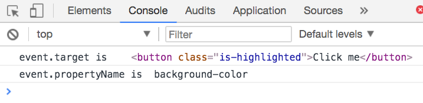
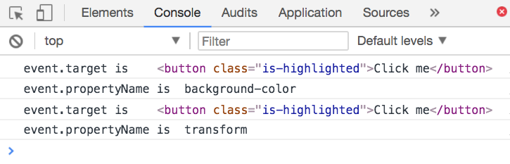

# Integrating CSS transitions and animations with JavaScript

If you want to change JavaScript after a CSS Transition or Animation completes, you can use the `transitionend` or `animationend` event.

(It's rare to use these two properties though; use them only if you need to).

## Transitionend

The `transitionend` event triggers when a transition completes. This event can only be attached to the document.

```js
document.addEventListener("transitionend", e => {
  // Do something here
})
```

When `transitionend` occurs, you're mostly interested in two properties:

1.  `event.target`—the element that was transitioned
2.  `event.propertyName`—the property that was transitioned

```js
document.addEventListener("transitionend", e => {
  console.log("event.target is ", e.target)
  console.log("event.propertyName is ", e.propertyName)
})
```

<figure>
  
  <figcaption>The `target` and `propertyName` tells you which transition was completed.</figcaption>
</figure>

### Transitionend for multiple properties

`transitionend` can be used to detect transitions with multiple properties. It triggers once per property, when the transition for that property completes.

```css
/* CSS */
button {
  background-color: pink;
  transition: background-color 0.3s ease-out, transform 0.3s ease-out;
  /* Other properties */
}

button.is-highlighted {
  background-color: goldenrod;
  transform: translateX(1em);
}
```

```js
// Add is-highlighted class to button on click
const button = document.querySelector("button")
button.addEventListener("click", e => e.target.classList.add("is-highlighted"))

// The transitionend event
document.addEventListener("transitionend", e => {
  console.log("event.target is ", e.target)
  console.log("event.propertyName is ", e.propertyName)
})
```

<figure>
  
  <figcaption>When two or more properties are transitioned at once, `transitionend` logs each of them individually</figcaption>
</figure>

## Animationend

The `animationend` event triggers when an animation completes. Like `transitionend`, `animationend` can only be attached to the document.

Note: if the animation repeats infinitely, `animationend` will not trigger.

```js
document.addEventListener("animationend", e => {
  // Do something here
})
```

When `animationend` occurs, you're mostly interested in two properties:

1.  `event.target`—the element that was animated
2.  `event.animation`—the name of the completed animation.

```js
document.addEventListener("animationend", e => {
  console.log("event.target is ", e.target)
  console.log("event.propertyName is ", e.propertyName)
})
```

<figure>
  
  <figcaption>The `target` and `animationName` tells you which animation was completed.</figcaption>
</figure>

## Wrapping up

`transitionend` and `animationend` are events you can use to tell if your transition or animation completes. They're invaluable if you need to sync up your transition or animation with JavaScript.

## Exercise

1. Create three elements with three different `transition-property` and `transition-duration`. Use `transitionend` to remove elements when their transition completes.
2. Create three elements with three different animations. Use `animationend` to remove elements when their transition completes.