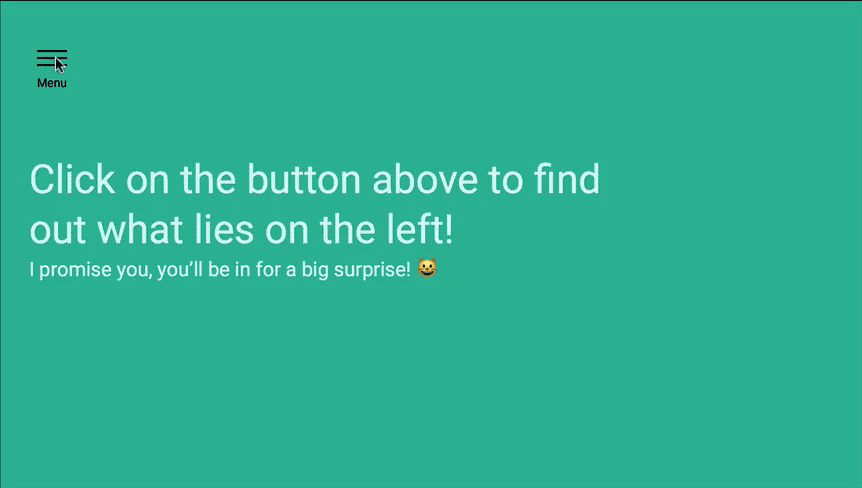

# 🛠 Animating the off-canvas menu

Here's what you'll get by the end of this lesson:

<figure>
  
  <figcaption>Completed animation for the off-canvas menu</figcaption>
</figure>

Here's how we moved the `.site-container` and `.offsite-container` with the `transform` property so far:

```css
/* The canvas */
.offsite-is-open .site-container {
  transform: translateX(14rem);
}

/* The offsite canvas */
.offsite-is-open .offsite-container {
  transform: translateX(14rem);
}
```

To animate this transform, you add the `transition` property and set `transition-property` to `transform`.

```css
.site-container {
  transition: transform 0.3s ease-out;
}

.offsite-container {
  transition: transform 0.3s ease-out;
}
```

Tada! 🎉

## Homework

Animate your off-canvas menu with referring back to this lesson.