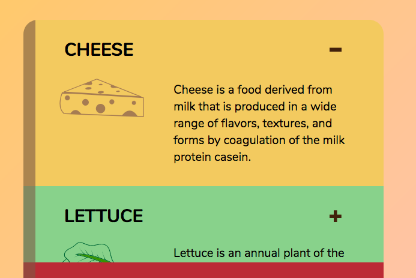
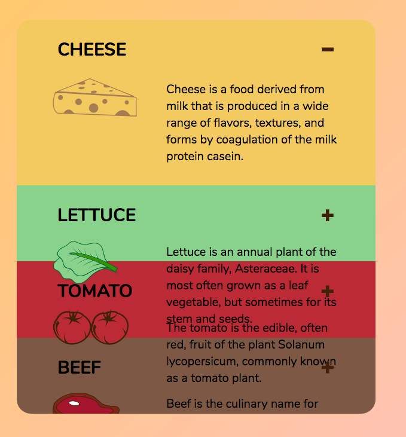
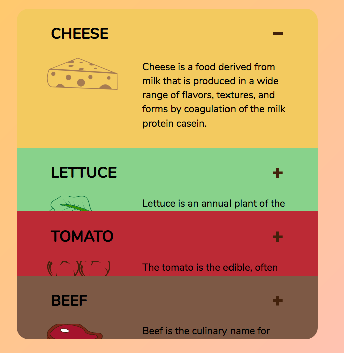
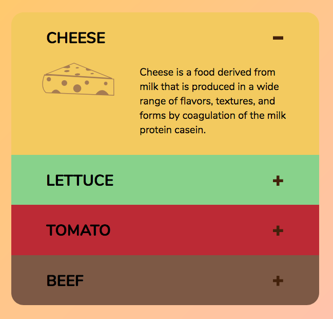
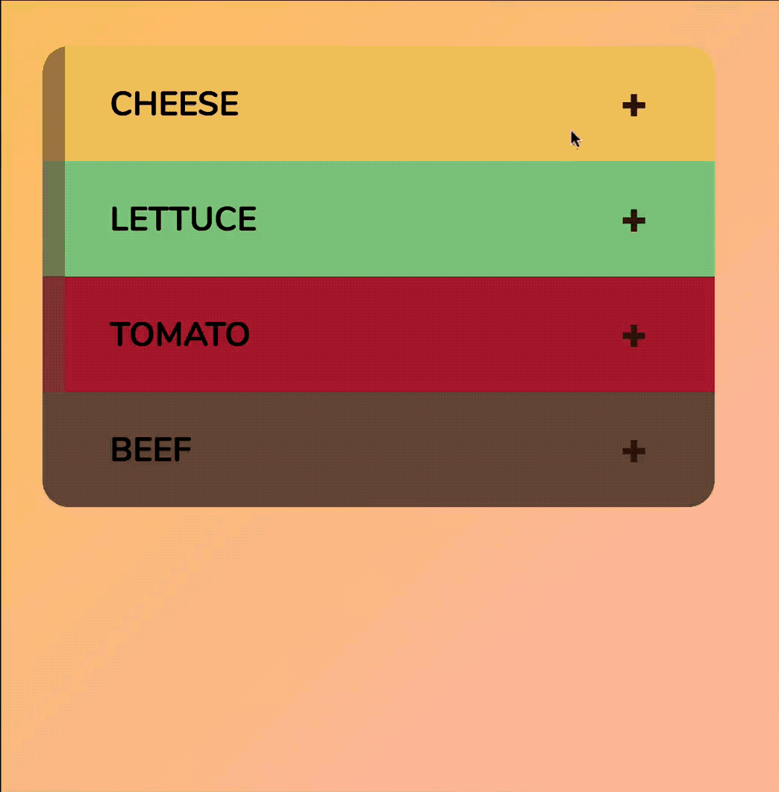
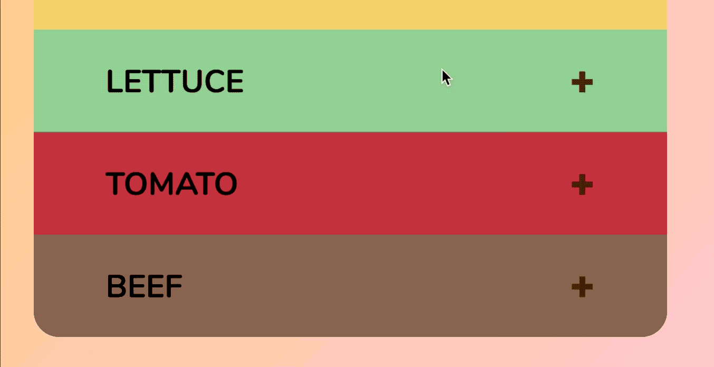
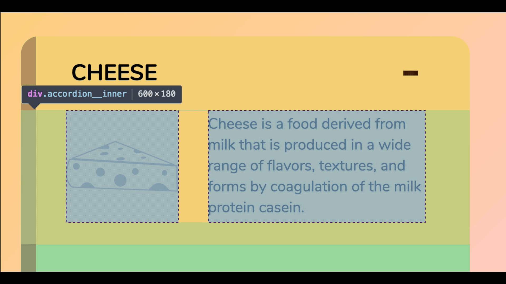

# 🛠 Animating the accordion

Here's what you'll get by the end of this lesson:

<figure>
  
  <figcaption>Completed animation for the accordion</figcaption>
</figure>

Let's start with the most important lesson of all in animations.

## Stop using display: none

You cannot animate an element if you use `display: none`. This is because the `display` property cannot be animated.

Since we want to animate the accordion, what we need is an animatable property. From the above animation, one property we can use is `height`.

(Note: transitioning `height` may cause jank. In this case, there's no other way around it. Is having some jank better than having no animations at all? You decide.)

We'll change the CSS first. When the accordion is hidden, we want the content to be hidden; here, we can set `height` to be zero. When the accordion is open, we want the content to be shown. Here, we can set `height` to auto.

```css
/* remove these properties */
.accordion__content {
  display: none;
}

.accordion.is-open .accordion__content {
  display: grid;
}
```

```css
/* Add these properties */
.accordion__content {
  display: grid;
  height: 0;
}

.accordion.is-open .accordion__content {
  height: auto;
}
```

And here's what we have at this point. (It looks broken; I'll explain why it's broken, then we'll fix it).

<figure>
  
  <figcaption>Accordion content peeks out slightly even though height is set to zero</figcaption>
</figure>

What I want you to do now is remove `position: relative` from `.accordion`. This is what you'll see:

<figure>
  
  <figcaption>Accordion content peeks out slightly, and text overflows onto other accordion items</figcaption>
</figure>

There are two problems with the above picture:

1. Text overflows into subsequent accordion items.
2. Accordion content isn't completely hidden even though height is set to zero.

### Fixing the overflow issue

`overflow` determines how content is shown when they spill out of a box. By default, `overflow` is set to `visible`, meaning you'll see content even though they've spilled outside their bounding box.

If you want contents to be hidden, you can set `overflow` to `hidden`.

```css
.accordion__content {
  overflow: hidden;
}
```

<figure>
  
  <figcaption>Overflow hidden hides children that exceed it's boundaries</figcaption>
</figure>

(Note: You can put `position: relative` back to `.accordion` at this point. It messes around with `overflow` a bit, and I wanted to show you how the accordion would have looked like without `position: relative`.)

## Fixing the height issue

The accordion content can still be seen even though we've set `height` to zero. This is because the content contains a `padding` value. In the CSS, I've set `box-sizing` to `border-box`, which means `padding` is part of a content's height.

<figure>
  
  <figcaption>The padding-bottom property gives "height" to the accordion content.</figcaption>
</figure>

To remove the content completely, you need to reset both `padding` and `height` to zero.

```css
.accordion__content {
  height: 0;
  padding: 0;
  /* other properties */
}

.accordion.is-open .accordion__content {
  height: auto;
  padding-right: 3em;
  padding-bottom: 1.5em;
  padding-left: 3em;
}
```

<figure>
  
  <figcaption>Accordion items are properly closed when height and padding are set to zero.</figcaption>
</figure>

This is undesirable because we need to transition two properties now—`height` and `padding`. It makes the transition more complicated, and each of these properties can cause jank.

Ideally, we want to transition only one property if we can help it. In this case, we can, if we wrap the accordion content in another `<div>`.

Let's call this outer div `.accordion__content`; we'll call the previous accordion content `.accordion__inner`.

```html
<div class="accordion__content jsAccordionContent">
  <div class="accordion__inner">
    <!-- Cheese image -->
    <!-- Description of cheese  -->
  </div>
</div>
```

(Note: you'll have to change the CSS quite a bit here. Following along, we'll change it together):

1. When the accordion is closed, `.accordion__content`'s `height` should be set to zero.
2. When the accordion is open, `.accordion__content`'s `height` should be set to `auto`'
3. `padding` and other properties that existed in the previous `.accordion__content` should now be shifted into `.accordion__inner`.

Here's the complete CSS changes:

```css
.accordion__content {
  height: 0;
  overflow: hidden;
}

.accordion.is-open .accordion__content {
  height: auto;
}

.accordion__inner {
  display: grid;
  grid-row-gap: 1rem;
  padding-right: 3em;
  padding-bottom: 1.5em;
  padding-left: 3em;
}

@media screen and (min-width: 700px) {
  .accordion__inner {
    grid-template-columns: 7.5em 1fr;
    grid-column-gap: 2rem;
    align-items: center;
  }
}
```

At this point, the opening and closing of the accordion should work as before:

<figure>
  
  <figcaption aria-hidden>Accordion functionality should still work even though the HTML and CSS have changed</figcaption>
</figure>

## Animating the accordion's height property

The `height` property can be animated, but you cannot animate the `height` to `auto`. You can verify this by setting the `transition` property.

```css
.accordion__content {
  transition: height 0.3s ease-out;
}
```

<figure>
  
  <figcaption aria-hidden>You cannot animate height with to the `auto` value</figcaption>
</figure>

You need to set a specific `height` value to create an animation.

```css
.accordion.is-open .accordion__content {
  height: 200px;
}
```

<figure>
  
  <figcaption>You can animate the height property to a specific value</figcaption>
</figure>

This means you need to use JavaScript to find (and set) the height of each accordion content.

## Getting accordion content's height with JavaScript

We want to get `.accordion__content`'s height for our animation. To get this value, we need to traverse the DOM and get the correct `.accordion__content` element.

```js
container.addEventListener('click', e => {
  const header = e.target.closest('.accordion__header')
  if (header) {
    const content = header.nextElementSibling
    // ...
  }
})
```

To get the content's `height`, you can use `getBoundingClientRect()`.

```js
container.addEventListener('click', e => {
  const header = e.target.closest('.accordion__header')
  if (header) {
    const content = header.nextElementSibling
    const height = content.getBoundingClientRect().height
    // ...
  }
})
```

If you `console.log(height)` when the accordion is closed, you should get `0`.

```js
console.log(height) // 0
```

This is because we've set `.accordion__content`'s `height` to zero in the CSS. To know the actual height of the accordion contents, we need to know the `height` of `.accordion__inner`.

<figure>
  
  <figcaption>We can set the content's height value if we know `.accordion__inner`'s height value</figcaption>
</figure>

`.accordion__inner` is the first child of `.accordion__content`. You can use `children`, followed by an index of 0 to get it.

```js
container.addEventListener('click', e => {
  const header = e.target.closest('.accordion__header')
  if (header) {
    const content = header.nextElementSibling
    const inner = content.children[0]
    const height = inner.getBoundingClientRect().height
    // ...
  }
})
```

Now, if you `console.log(height)` when the accordion is closed, you should get a value.

```js
console.log(height) // 180
```

## Changing the content's height with JavaScript

You can change the content's height by assigning a value to `content.style.height`. Remember to add a `px` string when you change the height, because `height` needs to be a value with a unit.

```js
container.addEventListener('click', e => {
  const header = e.target.closest('.accordion__header')
  if (header) {
    const content = header.nextElementSibling
    const inner = content.children[0]
    const height = inner.getBoundingClientRect().height

    content.style.height = height + 'px'
    // ...
  }
})
```

Of course, you still need to check if the accordion is currently open or not. If it's opened, you want to change the height to `height + 'px'`. If it's closed, you want to change the height to `0px`.

```js
container.addEventListener('click', e => {
  const header = e.target.closest('.accordion__header')
  if (header) {
    const accordion = header.parentElement
    const content = header.nextElementSibling
    const inner = content.children[0]
    const height = inner.getBoundingClientRect().height

    if (accordion.classList.contains('is-open')) {
      content.style.height = '0px'
    } else {
      content.style.height = height + 'px'
    }

    accordion.classList.toggle('is-open')
  }
})
```

With this, you have the complete animation.

<figure>
  
  <figcaption>Completed animation for the accordion</figcaption>
</figure>

## A little aside

The accordion remains open if you leave the `is-open` class in the HTML. This is what we've done for the first accordion in the list.

```html
<div class="accordion is-open"> ... </div>
<div class="accordion"> ... </div>
<div class="accordion"> ... </div>
<div class="accordion"> ... </div>
```

Click on the first accordion; you'll see it close abruptly. This happens because:

1. `height` is set to `auto` when `.is-open` is present.
2. We did not set a `height` value for any elements that are already opened when JavaScript loads.

You can decide how you want fix this—removing `is-open` from any element, or making JavaScript calculate the height for every opened element. I've chosen to remove the `is-open` class in the source code.

## Wrapping up

When you create animations, try to transition as little properties as you can. This makes your component easier to handle. Sometimes, doing so requires a slight change in the HTML.

Although it's not advisable to transition the `height` property, don't hesitate to use it if you need to. As long as you transition responsibly, you should be alright. You can always find another way to create the transition if jank happens.

## Homework

Animate your accordions with referring back to this lesson.
