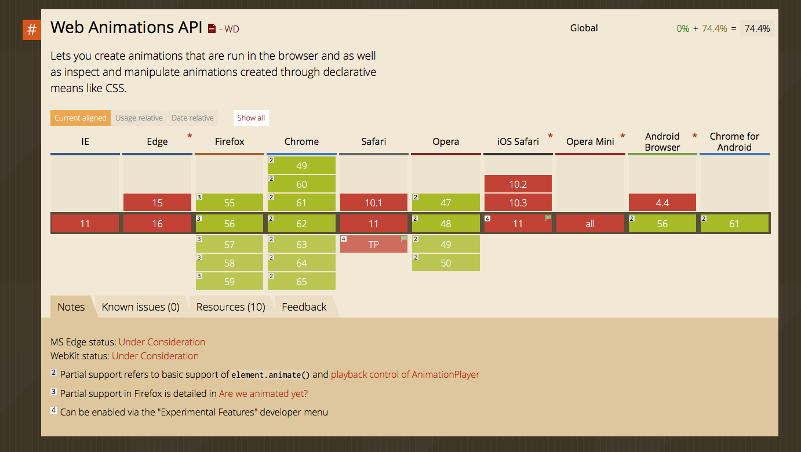

# JavaScript animations

JavaScript animations come in handy when you find it difficult to create your animations with CSS Transitions or CSS Animations. They are very useful and very easy to configure.

The ideal way to animate elements with pure JavaScript is to use through the [Web Animations API](https://developer.mozilla.org/en-US/docs/Web/API/Web_Animations_API).

Unfortunately, the Web Animations API is not well supported yet.

<figure>
  
  <figcaption>The Web Animations API is not well supported yet</figcaption>
</figure>

If you want to create animations with JavaScript, the easiest way is to use animation libraries.

## Animations libraries

There are many libraries you can use. Examples are:

1. Greensock Animation API
2. jQuery.animate
3. Velocity.js

Of the three (and many others not listed here), I highly recommend you use Greensock Animation API. You'll learn how to use it in the next lesson.

