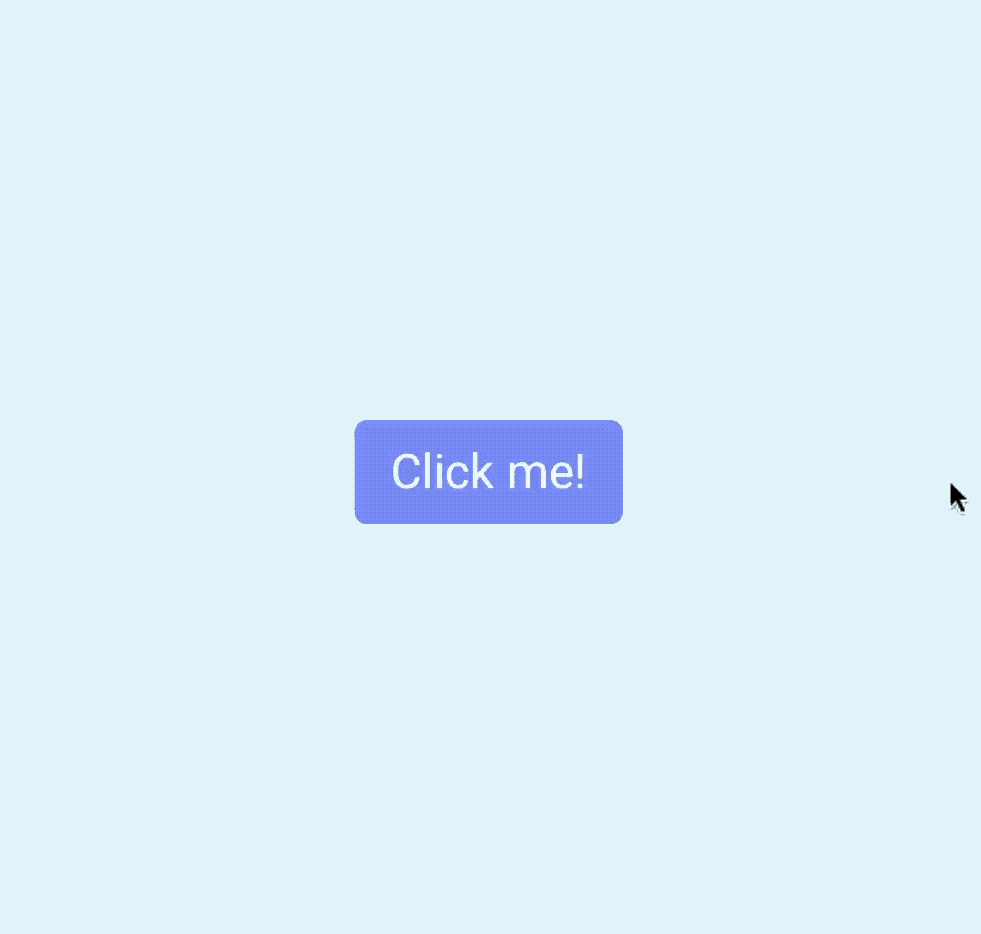
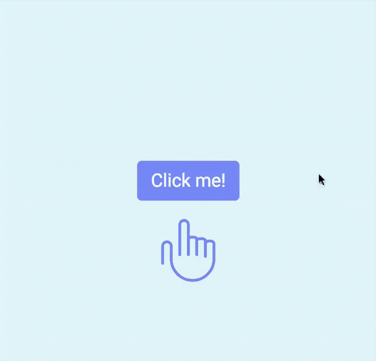
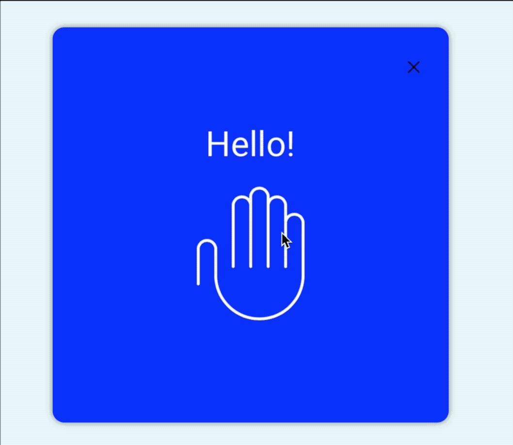
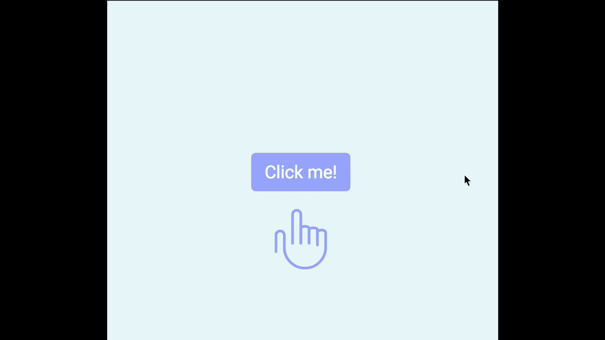
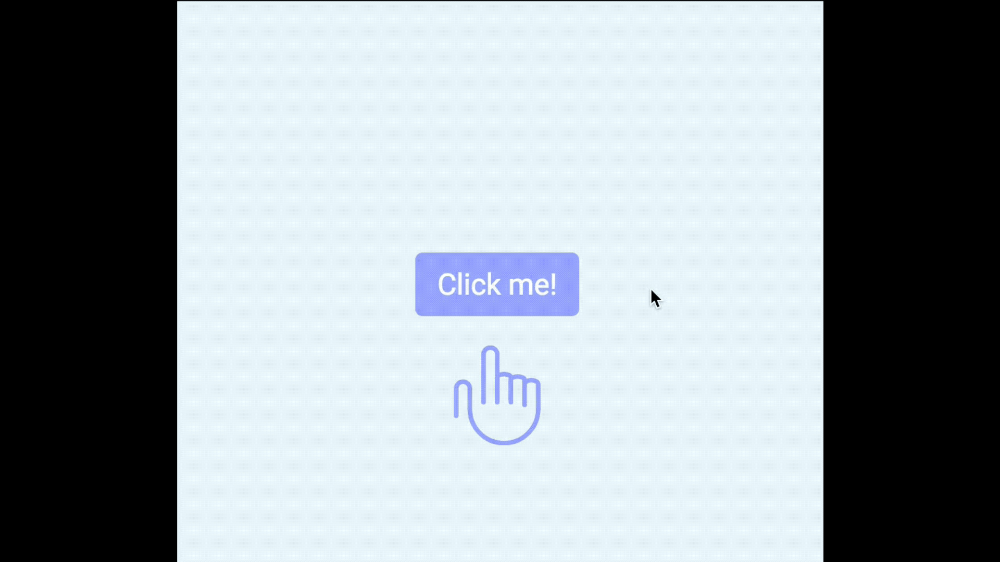
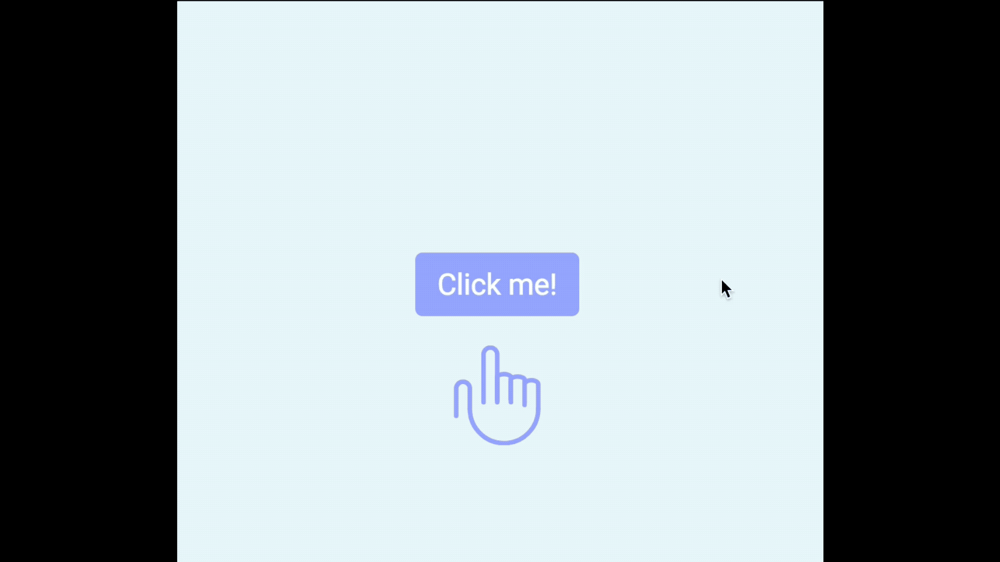
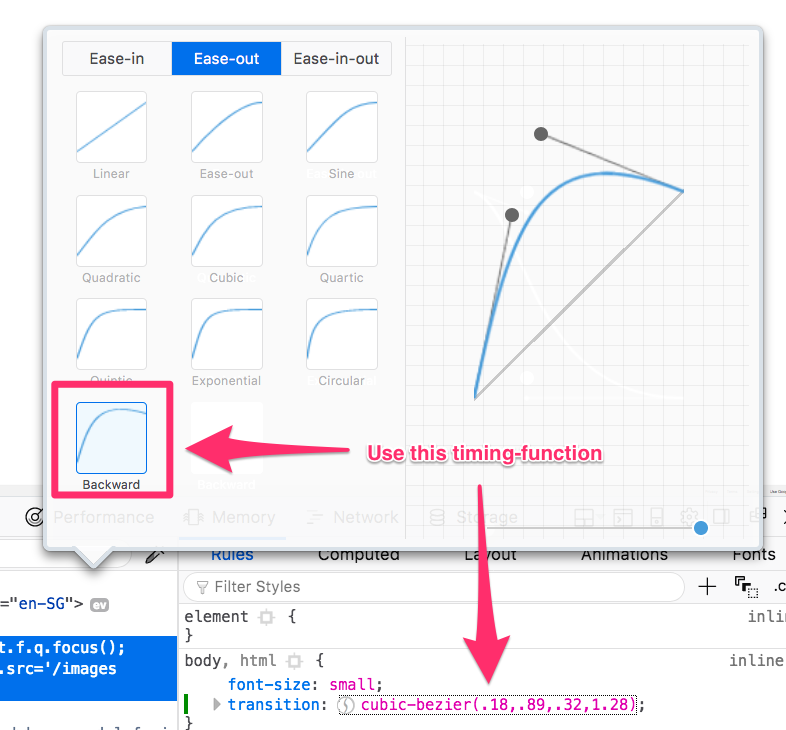

# 🛠 Animating the modal window

You're going to learn how to animate the modal in two lessons. By the end of these two lessons, you should get this:

<figure>
  
  <figcaption>Completed animation for the modal window</figcaption>
</figure>

Three animations happened in the GIF above:

1. The opening animation for the modal window.
2. The pointing hand animation when the browser loads
3. The waving hand animation after the button modal opens

You'll learn to create the first two animations in this lesson.

## The opening animation for the modal window.

You already know the modal window is visible (`opacity: 1;`) when it is open, and invisible (`opacity: 0;`) when it is closed. You can transition this `opacity` value to animate the opening/closing of the modal.

```css
.modal-container {
  /* other properties */
  transition: opacity 0.3s ease-out;
}
```

<figure>
  
  <figcaption>Opening animation</figcaption>
</figure>

This animation looks okay at first, but there's something you need to be aware of—the button appears before the modal fades away when you close the modal. You can see the problem happening in the following GIF.

(Note: I changed the background color of the modal and slowed down the animation to three seconds).

<figure>
  
  <figcaption>Button appears before modal fades away completely!</figcaption>
</figure>

This happens because changed two properties—`z-index` and `opacity`—when opening and closing the modal window. We've transitioned `opacity`; but we didn't transition `z-index`, which makes `z-index` flips immediately.

To fix this problem, you might be tempted to create a transition on them both at the same time, like in the code below.

(Note: Let's slow down the animation so it takes 3s instead of 0.3s to complete; this'll give us time to spot any problems.)

```css
.modal-container {
  transition: opacity 3s ease-out, z-index 3s ease-out;
}
```

<figure>
  
  <figcaption>Swapping of layers causes a strange change in opacity</figcaption>
</figure>

Did you notice the color of the button change right in the middle of the transition? This sudden change in button color is caused by a swap in `z-index` in the middle of the animation.

This is a tiny detail that many people won't notice if your animation is quick. But even if people don't notice it, they may still feel uncomfortable about it.

To fix this, we need to change tweak the `z-index` transition.

When the modal opens, we want `z-index` to jump to `1` immediately so the modal window can fade in at the right layer.

When the modal closes, we want `z-index` to remain at `1` until the modal fades away completely. We only change the `z-index` from `1` to `-1` when the modal completes the fade.

That means `z-index` should not have a `transition-duration`.

```css
.modal-container {
  transition: opacity 3s ease-out, z-index 0s linear;
}
```

When you remove the transition duration from `z-index`, you'll notice the animation works well when you're opening the modal. But in the closing animation, you'll notice you still have the same problem as if you didn't add a `z-index` transition.

<figure>
  
  <figcaption>Results after removing transition duration on z-index</figcaption>
</figure>

For the closing animation, we want the `z-index` to change after the modal fades away completely. To do so, we wait till the transition completes by adding a `transition-delay`.

```css
.modal-container {
  transition: opacity 3s ease-out, z-index 0s 3s;
}
```

If you do this, you fix the closing animation. But you screw up the opening animation 😢. This screw-up happens because `z-index` becomes `1` only after the modal has faded in completely.

<figure>
  
  <figcaption>Z-index flips to 1 only after modal has faded in completely</figcaption>
</figure>

The solution? We want a `transition-delay` when closing the modal. But we don't want the `transition-delay` when opening the modal.

To do this, we can overwrite `transition-delay` to `0s` when the modal is open.

```css
body.modal-is-open .modal-container {
  opacity: 1;
  z-index: 1;
  transition-delay: 0s;
}
```

And now you'll have a perfect transition 😄.

<figure>
  
  <figcaption>Flawless opening and closing animations. Finally!</figcaption>
</figure>

One more thing. Don't forget to set the `transition-duration` and `transition-delay` back to 0.3s when you're done.

```css
.modal-container {
  transition: opacity 0.3s ease-out, z-index 0s 0.3s;
}
```

## The pointing hand animation

The pointing hand animation begins when the browser loads. You need to create this animation with CSS Animation since we don't have a clear trigger for a CSS Transition.

Let's look closely at the pointing hand animation and see what you need to extract from it.

<figure>
  
  <figcaption>Pointing-hand animation</figcaption>
</figure>

You can tell a few things from this animation. First, the hand is invisible at the start; it becomes visible overtime, which means you need to change the `opacity` property.

```html
<!-- Adding the point-hand class to the SVG -->
<svg class="point-hand" viewBox="0 0 58 66"><use xlink:href="images/sprite.svg#point-hand"/></svg>
```

```css
@keyframes point {
  0% {
    opacity: 0;
  }

  100% {
    opacity: 1;
  }
}

.point-hand {
  animation: point 1s ease-out;
}
```

<figure>
  
  <figcaption>Pointing-hand fades in</figcaption>
</figure>

Second, the hand slides in from the bottom; this means you need to move the hand with `translateY`.

```css
@keyframes point {
  0% {
    transform: translateY(3em);
    opacity: 0;
  }

  100% {
    transform: translateY(0);
    opacity: 1;
  }
}

.point-hand {
  animation: point 1s ease-out;
}
```

<figure>
  
  <figcaption>Sliding in the hand from the bottom</figcaption>
</figure>

Third, as the hand slides in, it moves a bit over the intended position, then moves back down.

There are many ways to do this animation. One way is to create the movement with `@keyframes`. (Don't do this. You'll kill yourself trying to get the @keyframe point right). A better way is to change the timing-function to a "backwards" cubic-bezier curve.

<figure>
  
  <figcaption>Backwards ease-out curve</figcaption>
</figure>

```css
.point-hand {
  animation: point 1s cubic-bezier(0.18, 0.89, 0.32, 1.28);
}
```

And you get the pointing-hand animation.

<figure>
  
  <figcaption>Pointing-hand animation</figcaption>
</figure>

## Wrapping up

You learned to build two animations in this lesson:

1. The opening modal animation
2. The pointing-hand animation

You'll learn how to create the waving-hand animation in the next lesson.

## Homework

Build these two animations yourself without referring to the lesson.


