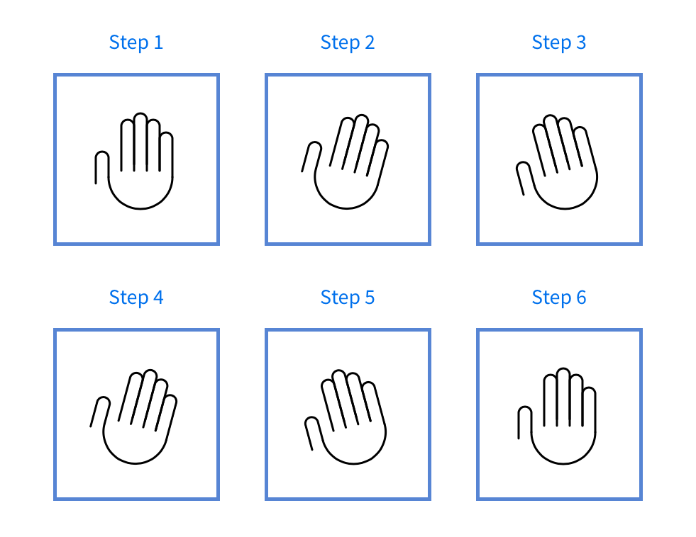

# 🛠 Animating the modal (part 2)

The waving-hand animation looks complicated, but it can be done easily. You're going to learn how.

<figure>
  
  <figcaption>The waving hand animation</figcaption>
</figure>

From the GIF above, you can see that the animation consist of two parts—the zooming part and the waving part. We're going to work on the zooming part first.

## The zooming part

When the modal window opens up, the hand turns opaque (from invisible to visible) and pops out (from small to big).

For this animation, we don't want to use CSS Transitions because the entire animation (zoom and wave) is complicated. We want to create the entire animation with a single animation method.

Let's try creating the animation with CSS Animations.

```css
/* Makes waving hand zoom out */
@keyframes zoom {
  0% {
    transform: scale(0.25);
    opacity: 0;
  }

  100% {
    transform: scale(1);
    opacity: 1;
  }
}
```

Once you've built the `zoom` animation, add it to the waving hand.

```html
<!-- Adding wave-hand class to the SVG -->
<svg class="wave-hand" width="112" height="139" viewBox="0 0 112 139"><use xlink:href="images/sprite.svg#wave-hand" /></svg>
```

```css
.wave-hand {
  /* This is the backwards cubic-bezier curve */
  animation: zoom 0.5s cubic-bezier(0.18, 0.89, 0.32, 1.28);
}
```

The `zoom` animation begins immediately when the browser loads. We don't want that. We want the `zoom` animation to play only when the button gets clicked.

To do so, we set `animation-play-state` to `paused`. When the modal opens, we change `animation-play-state` to `running`.

```css
.wave-hand {
  animation: zoom 0.5s cubic-bezier(0.18, 0.89, 0.32, 1.28);
  animation-play-state: paused;
}

.modal-is-open .wave-hand {
  animation-play-state: running;
}
```

<figure>
  
  <figcaption>Hand zooms in when the modal is open</figcaption>
</figure>

(Note: This animation works in all browsers but Safari. It seems like there's a bug with changing the `animation-play-state` property.)

Let's work on the waving part next.

## The waving part

The waving part feels complicated. When you build anything that feels complicated, you want to extract and work on it elsewhere, so you don't get distracted by other things.

I've prepared a Codepen for you to play around with the wave part. Go ahead and click on [this link][1] to get started.

Now, to create wave animation, you have to think about the different values the waving hand needs to move to.

Our hand moves to these six points:

1. Begins straight upright
2. Rotates to its left (your right)
3. Rotates to its right (your left)
4. Rotates to its left again
5. Rotates to its right again
6. Goes back to the starting position

You can say that these 6 points are "snapshots" in the animation. Once you get these six points right, the rest of the animation follows through easily.

<figure>
  
  <figcaption>6 points of wave-hand animation</figcaption>
</figure>

Since each snapshot takes up the same amount of time, you can split the `@keyframes` points evenly into 6 (including 0%).

```css
@keyframes wave {
  0% { /* Start at center */ }
  20% { /* Rotate to its left */ }
  40% { /* Rotate to its right */ }
  60% { /* Rotate to its left */ }
  80% { /* Rotate to its right */ }
  100% { /* Back to center */ }
}
```

For the waving animation, the hand rotates by 15 degrees in each wave. To rotate clockwise, you set `rotate` to 15 degrees. To rotate anti-clockwise, you set `rotate` to -15 degrees.

```css
@keyframes wave {
  0% { transform: rotate(0); }
  20% { transform: rotate(15deg); }
  40% { transform: rotate(-15deg); }
  60% { transform: rotate(15deg); }
  80% { transform: rotate(-15deg); }
  100% { transform: rotate(0); }
}

.wave-hand {
  animation: wave 1s ease-in-out;
}
```

```html
<!-- Remember to add the wave-hand class to your HTML! -->
<svg class="wave-hand" width="112" height="139" viewBox="0 0 112 139"><use xlink:href="images/sprite.svg#wave-hand" /></svg>
```

<figure>
  
  <figcaption>The hand waves! But...</figcaption>
</figure>

Whoa, the animation animation looks weird—it rotates around the middle of the hand, and that's not how you normally wave!

You want the hand to rotate about the bottom center part so the animation looks natural. To so do, you change `transform-origin` (which tells CSS where to rotate from) to `bottom center`.

```css
.wave-hand {
  transform-origin: bottom center;
  animation: wave 1s ease-in-out;
}
```

<figure>
  
  <figcaption>The hand waves correctly now!</figcaption>
</figure>

Much better!

Next, we combine the `zoom` animation with the `wave` animation together in the `wave-hand` selector.

Since `zoom` comes first, let's put `zoom` before `wave` in the `animation` property. We'll add a slight delay to the `wave` animation to make sure it comes after `zoom`.

```css
.wave-hand {
  transform-origin: bottom center;
  animation: zoom 0.5s cubic-bezier(0.18, 0.89, 0.32, 1.28),
    /* creates a delay for the wave animation. Experiment with the delay value here! */
    wave 1s 0.55s ease-in-out;
  animation-play-state: paused;
}
```

<figure>
  
  <figcaption>The waving hand animation</figcaption>
</figure>

And you're done...?

Not quite. Try opening the button a second time. If you do so, you'll notice the animation doesn't move anymore.

Why?

The reason is because the animation has completed. To make it move again, you have to restart the animation.

## Restarting the waving hand

Restarting CSS Animations is tricky, almost hacky. You can read more about restarting CSS Animations in [this article][2] on CSS Tricks if you're interested.

I don't like hacky tricks; they make things hard to maintain going forward. If we want to make the wave-hand animation work whenever the modal opens, we need another method—JavaScript animations.

Note: You can comment out everything we've done above. We won't need what we've written going forward. 

## Waving the hand with JavaScript (using GSAP)

First, we'll need to add GSAP to the project:

```html
<script src="https://cdnjs.cloudflare.com/ajax/libs/gsap/1.20.3/TweenMax.min.js"></script>
<script src="js/main.js"></script>
```

Next, we'll need to select the hand with JavaScript.

```html
<svg class="wave-hand" width="112" height="139" viewBox="0 0 112 139"><use xlink:href="images/sprite.svg#wave-hand" /></svg>
```

```js
const hand = document.querySelector('.wave-hand')
```

The hand waves when the modal window opens. To perform this action, you can create a function called `wave`. We'll call the `wave` function when we open the modal:

```js
const wave = _ => {
  // Wave hand animation here
}

const openModal = _ => {
  document.body.classList.add('modal-is-open')
  wave()
}
```

The easiest way to create the entire animation is through TimelineMax (since we need to chain many tweens together).

```js
const wave = hand => {
  const tl = new TimelineMax({})
}
```

You're now prepared to create the `zoom` animation.

## Creating the zoom animation with GSAP

Here's how we created the `zoom` animation with CSS Animations:

```css
@keyframes zoom {
  0% {
    transform: scale(0.25);
    opacity: 0;
  }

  100% {
    transform: scale(1);
    opacity: 1;
  }
}

.wave-hand {
  animation: zoom 0.5s cubic-bezier(0.18, 0.89, 0.32, 1.28);
  animation-play-state: paused;
}
```

Here, we changed the `scale` from 0.25 to 1. We also changed `opacity` from 0 to 1.

We know that, without any treatment for animations, `wave-hand` is already at `scale` 1 and `opacity` 1. That means we need to animate *from* `scale` 0.25 and `opacity` 0.

The cubic-bezier curve equivalent for the `zoom` animation is `Back.easeOut` in GSAP.

```js
const wave = hand => {
  const tl = new TimelineMax({})
  tl.from(hand, 0.5, {
    scale: 0.5,
    opacity: 0,
    ease: Back.easeOut.config(1.5)
  })
}
```

<figure>
  
  <figcaption>Zoom animation with GSAP</figcaption>
</figure>

Note: you'll see red squiggly underlines in your JavaScript file for both `TimelineMax` and `Back` variables. This is because Standard (the linter) doesn't recognize them. See the linter lesson on how to remove the underlines.

## Creating the wave animation with GSAP

Here's the `wave` animation we created previously:

```css
@keyframes wave {
  0% { transform: rotate(0); }
  20% { transform: rotate(15deg); }
  40% { transform: rotate(-15deg); }
  60% { transform: rotate(15deg); }
  80% { transform: rotate(-15deg); }
  100% { transform: rotate(0); }
}

.wave-hand {
  transform-origin: bottom center;
  animation: wave 1s 0.55s ease-in-out;
  animation-play-state: paused;
}
```

When you use GSAP, you don't care about the `0%`, `20%`, `40%` and so on. What you care about is the animation from `0%` to `20%`, from `20%` to `40%`, and so on.

From `0%` to `20%`, you want the hand to rotate to the right. Here, you use the `to` method. The duration of this movement is 0.2 seconds.

```js
const wave = hand => {
  const tl = new TimelineMax({})
  tl.from(hand, 0.5, {
    scale: 0.5,
    opacity: 0,
    ease: Back.easeOut.config(1.5)
  })
  tl.to(hand, 0.2, { rotation: 15 })
}
```

From `20%` to `40%`, we want the hand to rotate to the left. It should end up at a `-15deg` rotation; we can continue chaining the wave animation with `to`.

```js
const wave = hand => {
  const tl = new TimelineMax({})
  tl.from(hand, 0.5, {scale: 0.5, opacity: 0, ease: Back.easeOut.config(1.5)})
  tl.to(hand, 0.2, {rotation: 15})
  tl.to(hand, 0.2, {rotation: -15})
}
```

Then to the right, and left, and back to 0.

```js
const wave = hand => {
  const tl = new TimelineMax({})
  tl.from(hand, 0.5, {scale: 0.5, opacity: 0, ease: Back.easeOut.config(1.5)})
  tl.to(hand, 0.2, {rotation: 15})
  tl.to(hand, 0.2, {rotation: -15})
  tl.to(hand, 0.2, {rotation: 15})
  tl.to(hand, 0.2, {rotation: -15})
  tl.to(hand, 0.2, {rotation: 0})
}
```

Finally, we also want to set the `transform-origin` property, or our hand wave will about the center. Since no animations need to happen when we set `transform-origin`, we can use the `set` method.

```js
const wave = hand => {
  const tl = new TimelineMax({})
  // Sets transform origin
  tl.set(hand, {transformOrigin: 'bottom center'})
  tl.from(hand, 0.5, {scale: 0.5, opacity: 0, ease: Back.easeOut.config(1.5)})
  tl.to(hand, 0.2, {rotation: 15})
  tl.to(hand, 0.2, {rotation: -15})
  tl.to(hand, 0.2, {rotation: 15})
  tl.to(hand, 0.2, {rotation: -15})
  tl.to(hand, 0.2, {rotation: 0})
}
```

## Adding a delay between tweens in TimelineMax

If you noticed, there is a slight delay (0.05 seconds) after the `zoom` animation completes, before the start of the `wave` animation.

```css
.wave-hand {
  animation: zoom 0.5s cubic-bezier(0.18, 0.89, 0.32, 1.28),
    wave 1s 0.55s ease-in-out;
}
```

To create the additional delay in TimelineMax, you pass a fourth parameter to the tween. It looks like this

```js
const tween = TweenMax.to(element, duration, vars, '+=0.05')
```

The `+=0.05` tells GSAP to add a 0.05s delay. If you used `-=0.05`, you tell GSAP to start the tween 0.05s earlier.

<figure>
  
  <figcaption>Completed animation for the modal window</figcaption>
</figure>

And you're done! Hello and bye bye!

## Wrapping up

You learned how to use CSS Animations and GSAP to create the wave-hand animation in this lesson. At this point, you're equipped with everything you need to create flawless animations. Congratulations! 😁.

## Homework

Build the wave-hand animation without referring to the lesson.

[1]:	https://codepen.io/zellwk/pen/zEbERM
[2]:	https://css-tricks.com/restart-css-animation/


---

- Previous Lesson: [Animating the modal window](10.animating-modal.md)
