# Functional Array Methods

Javascript contains functional programming methods that help you manipulate arrays easily. In this lesson, you'll learn five of these methods. They are:

1. Array.findIndex
2. Array.find
3. Array.filter
4. Array.map
5. Array.reduce

Without further ado, let's begin to dive into each of them.

(Note: You'll need a good grasp of [`array.forEach`](../03.dom-basics/04.foreach.md) before attempting to understand any array methods explained in this article).

## Array.findIndex

`findIndex` lets you **find the index of an item** in an array. It loops through every item in the array and **returns the first** truthy expression.

The syntax looks like this:

```js
const index = array.findIndex((currentItem, index) => {
  // return a truthy expression here
})
```

Its much easier to explain Array.findIndex with an example, so let's do that.

Let's say you have an array of objects. Each object is a person, and each person has a name.

```js
const people = [{name: 'Zell'}, {name: 'Vincy'}, {name: 'Casper'}]
```

You want to know the position of the person named `Casper` in the `people` array. To do so, you can use `Array.findIndex` and check if the `name` property in each object matches `Casper`.

```js
const casperIndex = people.findIndex(person => person.name === 'Casper')
console.log(casperIndex) // 2
```

## Array.find

`array.find` works the same way as `array.findIndex`. The difference is **`array.find` returns the item instead of the index**.

```js
const casper = people.findIndex(person => person.name === 'Casper')
console.log(casper) // {name: 'Casper'}
```

## Array.filter

`array.filter` returns an array that contains a **subset of the original array**. Items will be added in the array returned by `array.filter` if they return a truthy expression in the callback.

```js
const filteredItems = array.filter((currentItem, index) => {
  // return a truthy expression to include in filteredItems
})
```

Once again, its easier to explain `Array.filter` with an example, so let's do that.

In the [for loops lesson](../02.js-basics/15.for-loops.md), you performed a task that requires you to loop through an array and return a list of numbers greater than ten.

Here's how you might have done it:

```js
const numbers = [1, 12, 4, 18, 9, 7, 11, 3, 50, 5, 6]
let biggerThan10 = []

for (let num of numbers) {
  if (num > 10) {
    biggerThan10 = biggerThan10.concat(num)
  }
}

console.log(biggerThan10) // [12, 18, 11, 50]
```

When you use `array.filter`, you're doing the same thing as the `for` loop. The difference is you *return a boolean instead of concatenating the value*.

```js
const numbers = [1, 12, 4, 18, 9, 7, 11, 3, 50, 5, 6]
const biggerThan10 = numbers.filter(num => {
  if (num > 10) {
    return true
  }
})

console.log(biggerThan10) // [12, 18, 11, 50]
```

Since `array.filter` concatenates the current item if you return a truthy value, you can immediately return the `if` condition.

```js
const numbers = [1, 12, 4, 18, 9, 7, 11, 3, 50, 5, 6]
const biggerThan10 = numbers.filter(num => num > 10)
```

## Array.map

`array.map` returns an array that contains the **same number of items** in the original array. Each item in the array item is a value that you return in the callback. It looks like this:

```js
const newArray = Array.map((currentItem, index) => {
  // return the transformed value
})
```

Once again, its easier to explain `Array.map` with an example, so let's do that.

In the [for loops lesson](../02.js-basics/15.for-loops.md), you were asked to create a new array. You had to multiply an array of numbers by five, and add each number into the new array you created.

Here's how you might have done it:

```js
const numbers = [1, 12, 4, 18, 9, 7, 11, 3, 50, 5, 6]
const multipliedBy5 = []

for (let num of numbers) {
  multipliedBy5 = multipliedBy5.concat(num * 5)
}

console.log(multipliedBy5) // [5, 60, 20, 90, 45, 35, 55, 15, 250, 25, 30]
```

What you do with `array.map` is the same thing as what you do in the `for` loop too. The difference is you *return the value instead of concatenating it*.

```js
const numbers = [1, 12, 4, 18, 9, 7, 11, 3, 50, 5, 6]
const multipliedBy5 = numbers.filter(num => {
  return num * 5
})

console.log(multipliedBy5) // [5, 60, 20, 90, 45, 35, 55, 15, 250, 25, 30]
```

And since you're only writing a single line of code in the array function, you can use an implicit return statement:

```js
const numbers = [1, 12, 4, 18, 9, 7, 11, 3, 50, 5, 6]
const multipliedBy5 = numbers.map(num => num * 5)
```

`Array.map` is super versatile. It can be used to simplify arrays or even modify other types of values.

### Modifying an array value

Let's say you have an array of todos. You want to add the string `I need to` in front of each todo item.

```js
const todos = ['buy eggs', 'feed my cat', 'water plants']

// What you want:
// [
//   'I need to buy eggs',
//   'I need to feed my cat',
//   'I need to water plants',
// ]
```

```js
const todoStrings = todos.map(todo => return 'I want to ' + todo)

console.log(todoStrings)
// [
//   'I need to buy eggs',
//   'I need to feed my cat',
//   'I need to water plants',
// ]
```

### Simplifying arrays with map

Let's say you have an array of objects. Each object contains a person's first and last name.

```js
const people = [{
  firstName: 'Zell',
  lastName, 'Liew'
}, {
  firstName: 'Vincy',
  lastName: 'Zhang'
}]
```

From this list of people, you need to get an array of firstNames. To get this array, you can use `map` to loop through the array and return `person.firstName`.

```js
const firstNames = people.map(person => person.firstName)
console.log(firstNames) // ['Zell', 'Vincy']
```

### Array.map vs Array.forEach

Many people get confused between `Array.map` and `Array.forEach`. Here's a quick way to remember what does what:

1. Use `Array.map` when you want to return a new array
2. Use `Array.forEach` when you want to do stuff (possibly stuff that's changes state).

## Array.reduce

`array.reduce` is a function that helps to simplify a complex array into a simpler value. It looks like this:

```js
const callback = (accumulator, currentValue, index) => {
  // return something here
}
const result = array.reduce(callback, initialValue)
```

There are a lot of moving parts, so let's take it slow.

**accumulator** is the accumulated value from previous reductions. The value you return in each iteration will be the value for the accumulator in the next iteration.

**currentValue** is the current item in the array that you're looping through. It's the same value that you'll expect to see when you use `forEach`, `filter` and `map`.

**initialValue** is the starting value passed into accumulator.

It's much easier to explain reduce with the use of some examples, so let's get straight into some use cases for reduce and how it works.

### Reducing an array of values into a single value

Let's say you have a list of numbers, and you want to find the total sum of these numbers.

```js
const numbers = [1, 2, 3, 4, 5]
```

One way to get the total sum of the numbers is through a `for` loop. If you do this, you can create a variable called `total` outside the loop, then add to `total` as you loop through the numbers.

```js
let total = 0

for (let num in numbers) {
  total = total + num
}

console.log(total) // 15
```

You can also do it with `array.reduce`.

```js
const total = numbers.reduce((acc, num) => acc + num, 0)
console.log(total) // 15
```

`array.reduce` can be difficult to understand at the start, so let's break down what's happening, step by step.

First, you pass an initial value to the `array.reduce`. Since we're starting the count from 0, you can pass in 0.

<figure>
  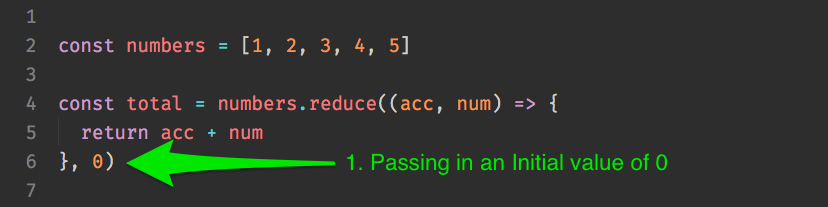
  <figcaption>Initial value set to 0</figcaption>
</figure>

This `initialValue` will be used as the `accumulator` in the first iteration. The `currentValue` in the first iteration is the first item in the array.

<figure>
  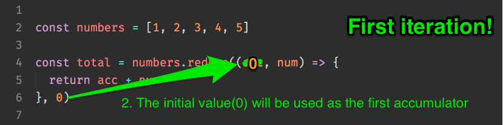
  <figcaption>accumulator assigns as 0</figcaption>
</figure>

<figure>
  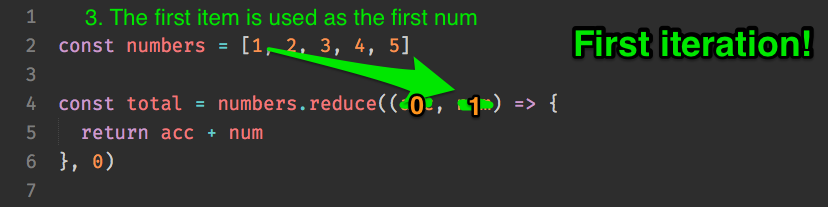
  <figcaption>currentValue is the first item in the array</figcaption>
</figure>

In a `reduce` callback, you need to return a value to be used as the next `accumulator`.

<figure>
  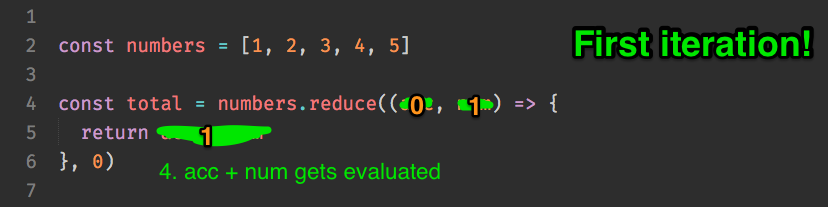
  <figcaption>The next return value is calculated</figcaption>
</figure>

In the second iteration, the `accumulator` value is the previous returned value while the `currentValue` is the second item in the array.

<figure>
  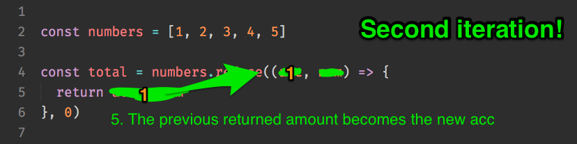
  <figcaption>The previous return value is used as the next accumulator</figcaption>
</figure>

<figure>
  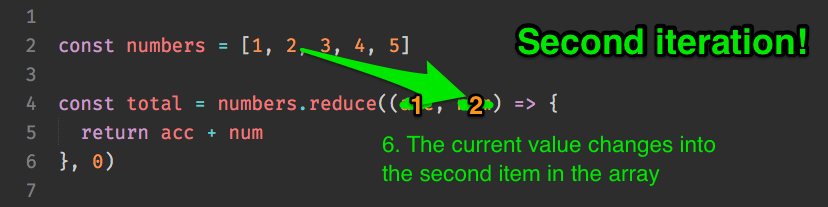
  <figcaption>currentValue becomes the second item in the array</figcaption>
</figure>

This process goes on and on until `reduce` loops over every item in the array. The final value that is returned will be returned to the function call.

<figure>
  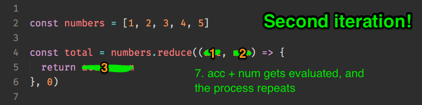
  <figcaption>The return value is calculated and the process repeats</figcaption>
</figure>

### Getting unique values from an array

Let's say you have an array of fruits in a basket. Some of these fruits are duplicated. You just want to know what kinds of fruits are in the basket.

```js
const fruitsBasket = ['apple', 'banana', 'banana', 'orange', 'pear', 'apple']

// Want you want:
// ['apple', 'banana', 'orange', 'pear']
```

Here's how you'll do it with reduce.

```js
const uniqueFruits = fruitsBasket.reduce((acc, item) => {
  if (acc.indexOf(item) === -1) {
    return acc.concat(item)
  } else {
    return acc
  }
}, [])
```

Let's go through it step by step again.

Since you want an array of items that are unique, you start off by passing an array as the initial value.

<figure>
  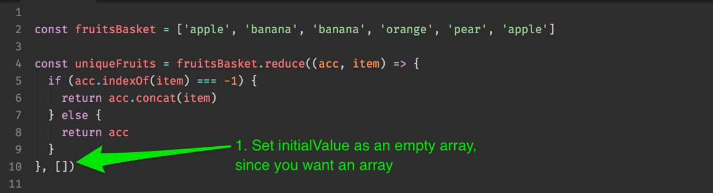
  <figcaption>Setting initialValue to an empty array</figcaption>
</figure>

In the first iteration, the `accumulator` is an empty array. The `item` is the `apple`.

<figure>
  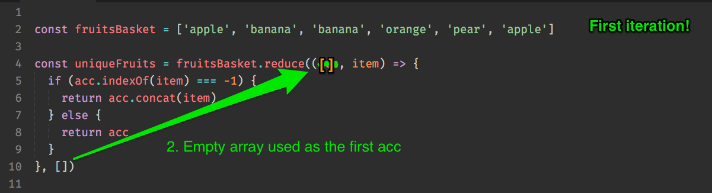
  <figcaption>The empty array is used as the first accumalator value</figcaption>
</figure>

<figure>
  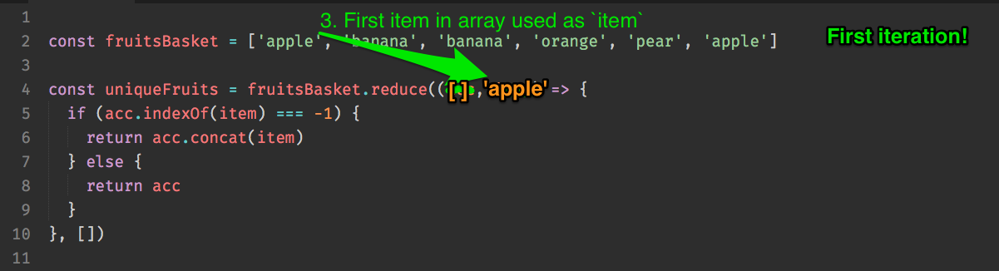
  <figcaption>The first item in the array is set as currentValue</figcaption>
</figure>

Next, you check if `accumulator` contains `apple`. If it doesn't, you add it with `Array.concat` and return the newly accumulator.

If the accumulator already contains `apple`, you return the accumulator without touching it, so the reduction continues with the next item.

<figure>
  
  <figcaption>Checks if apple is in acc</figcaption>
</figure>

<figure>
  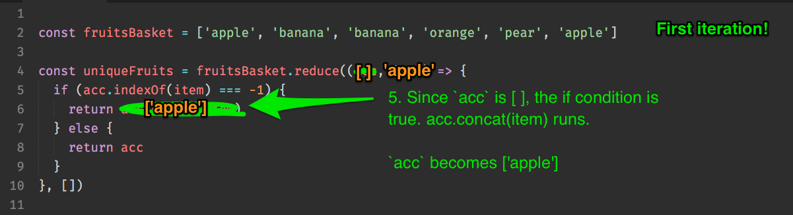
  <figcaption>Adds apple to the accumulator since its not already there</figcaption>
</figure>

<figure>
  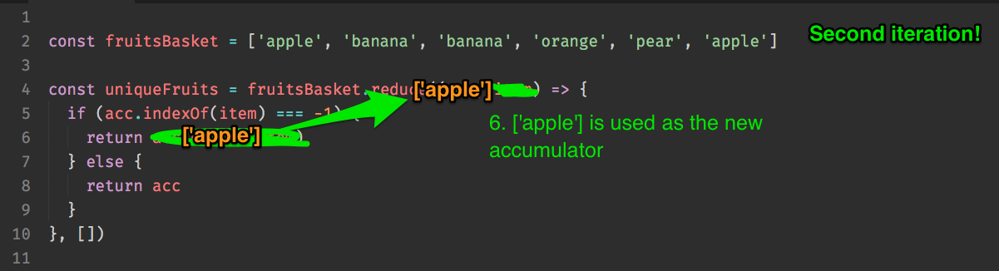
  <figcaption>Continues with the reduction, setting ['apple'] as the new accumulator</figcaption>
</figure>

### Creating an object from an array

Let's say you have an array of fruits in a basket. You want to know how many of each fruit is in it.

```js
const fruitsBasket = ['apple', 'banana', 'banana', 'orange', 'pear', 'apple']

// What you want
// {
//   apple: 2,
//   banana: 2,
//   orange: 1
//   pear: 1,
// }
```

Since you want an object, you need to pass an object as the initialValue to the reducing function. The principle here is the same as the above, so I'll leave you to figure out how it works.

```js
const fruitsCount = fruitsBasket.reduce((tally, fruit) => {
  if (tally[fruit]) {
    tally[fruit] = tally[fruit] + 1
  } else {
    tally[fruit] = 1
  }
  return tally
}, {})
```

## Wrapping up

There are many useful functional methods built into Javascript arrays. You learned some of the most useful ones in this lesson:

1. Array.findIndex
2. Array.find
3. Array.filter
4. Array.map
5. Array.reduce

## Exercise

Try completing these exercises with the following set of data:

1. Find the index of `Thomas Edison`.
2. Find the object that contains `Winston Churchill`.
3. Create an array that contains people that died before 1940.
4. Create an array that contains people that are alive between 1850 and 1900.
5. Create an array that contains the `firstName`, `lastName` and `yearsLived` for each person (where `yearsLived` is the number of years tho person lived).
6. Get the total number of `yearsLived` of the people who were alive between 1750 and 1900.

```js
const people = [
  { firstName: 'Benjamin', lastName: 'Franklin', yearBorn: 1706, yearOfDeath: 1790 },
  { firstName: 'Thomas', lastName: 'Edison', yearBorn: 1847, yearOfDeath: 1931 },
  { firstName: 'Franklin', lastName: 'Roosevelt', yearBorn: 1882, yearOfDeath: 1945 },
  { firstName: 'Napolean', lastName: 'Bonaparte', yearBorn: 1830, yearOfDeath: 1821 },
  { firstName: 'Abraham', lastName: 'Lincoln', yearBorn: 1809, yearOfDeath: 1865 },
  { firstName: 'Mahatma', lastName: 'Gandhi', yearBorn: 1869, yearOfDeath: 1948 },
  { firstName: 'Winston', lastName: 'Churchill', yearBorn: 1874, yearOfDeath: 1965 },
  { firstName: 'Charles', lastName: 'Darwin', yearBorn: 1809, yearOfDeath: 1882 },
  { firstName: 'Albert', lastName: 'Einstein', yearBorn: 1879, yearOfDeath: 1955 },
  { firstName: 'Pablo', lastName: 'Picasso', yearBorn: 1881, yearOfDeath: 1973 },
  { firstName: 'Ludwig', lastName: 'Beethoven', yearBorn: 1770, yearOfDeath: 1827 },
  { firstName: 'Walt', lastName: 'Disney', yearBorn: 1901, yearOfDeath: 1966 },
  { firstName: 'Henry', lastName: 'Ford', yearBorn: 1863, yearOfDeath: 1947 },
  { firstName: 'Steve', lastName: 'Jobs', yearBorn: 1955, yearOfDeath: 2012 }
]
```
