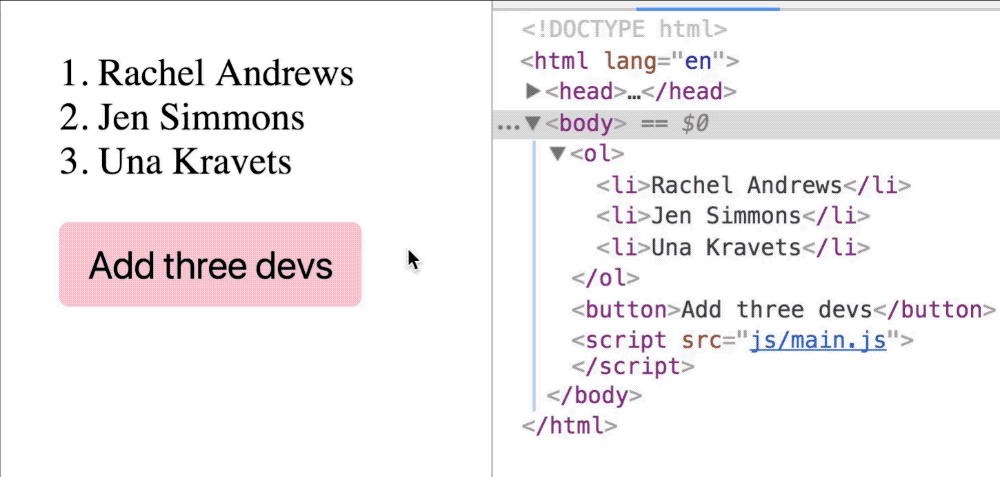

# Adding multiple elements to the DOM

If you need to add multiple HTML elements to the DOM, it's a bad practice to add them one by one with `appendChild` or `insertBefore`. This is because each `appendChild` or `insertBefore` call forces the DOM to update once.

```js
const devs = ['Addy Osmani', 'Vitaly Friedman', 'Chris Coyier']

// Don't do this!
const ol = document.querySelector('ol')
devs.forEach(dev => {
  const li = document.createElement('li')
  li.innerHTML = dev
  ol.appendChild(li)
})
```

There are two better ways to add multiple elements to the DOM.

1. Replacing innerHTML
2. Appending a document fragment

## Replacing innerHTML

One way to add many elements to the DOM is to replace the `innerHTML` element with the final list of elements.

For example, let's say you have an empty list in your HTML, and you want to add three developers to the list.

```html
<ol></ol>
```

```js
// Devs to add to <ol>
const devs = ['Addy Osmani', 'Vitaly Friedman', 'Chris Coyier']
```

To add the three developers into the `<ol>` element, you can change `<ol>`'s innerHTML directly.

```js
const ol = document.createELement('ol')
ol.innerHTML = `
  <li>Addy Osmani</li>
  <li>Vitaly Friedman</li>
  <li>Chris Coyier</li>
`
```

Obviously, the code above is hard coded. When you write actual code, you'll want to convert the `devs` array into a HTML string before changing the `innerHTML`.

```js
// Create a HTML String that contains all list items
let htmlString = ''
devs.forEach(dev => htmlString = htmlString + `<li>${dev}</li>`)

ol.innerHTML = htmlString
```

### A better way to create the html string

Since you already have an array, you can use two array methods—`map` and `join`—to create the HTML string. You already know about `map`, so let's talk about `join`.

`join` combines all array items into a string. It takes one argument—the character you want to use to separate each array item in the produced string.

```js
const string = array.join(separator)
```

If you want to join array items with a space, you can use a `' '`. If you want to join array items without a separator, you can use an empty string.

```js
const string = devs.join('')
console.log(string) // Addy OsmaniVitaly FriedmanChris Coyier
```

If you omit the separator, `join` uses `,` as the separator.

```js
const devs = ['Addy Osmani', 'Vitaly Friedman', 'Chris Coyier']

const string = devs.join()
console.log(dev) // Addy Osmani,Vitaly Friedman,Chris Coyier
```

To produce the eventual HTML string, you can use `map` to modify each array item such that they are valid HTML strings.

```js
const modifiedArray = devs.map(dev => `<li>${dev}</li>`)

console.log(modifiedArray)
// [
//   '<li>Addy Osmani</li>',
//   '<li>Vitaly Friedman</li>',
//   '<li>Chris Coyier</li>''
// ]
```

Once you have valid HTML strings within your array, you can use `join` to join them into a single string.

```js
const htmlString = modifiedArray.join('')

console.log(htmlString)
// <li>Addy Osmani</li><li>Vitaly Friedman</li><li>Chris Coyier</li>
```

Once you have the final HTML String, you can change the innerHTML.

```js
ol.innerHTML = htmlString
```

You can also put everything together in a single line of code:

```js
list.innerHTML =
  devs.map(dev => `<li>${dev}</li>`)
  .join('')
```

### What if you have existing items in the list?

Let's say you have three developers in your list and you want to add three more developers to it.

```html
<ol>
  <li>Rachel Andrews</li>
  <li>Jen Simmons</li>
  <li>Una Kravets</li>
</ol>
```

```js
// Devs to add to <ol>
const devs = [
  'Addy Osmani',
  'Vitaly Friedman',
  'Chris Coyier'
]
```

With the replace method, you can add the new HTML string into `ol.innerHTML`.

```js
const string = devs.map(dev => `<li>${dev}</li>`)
  .join('')
ol.innerHTML = ol.innerHTML + string
```

The downside of this approach? You replace the entire list. The GIF below proves that the first three items are also replaced even though they're not changed.

<figure>
  
  <figcaption>The `<ol>` and all `<li>` elements flashed when the button was clicked, indicating that there was a change</figcaption >
</figure>

A better approach to multiple items into the DOM is through a document fragment.

## Using a document fragment

A document fragment is like a separate DOM. It functions exactly like the DOM. To create a document fragment, you use `createDocumentFragment`.

```js
const fragment = document.createDocumentFragment()
```

You can treat the document fragment like the actual DOM. Once you've created the fragment, you can use `insertBefore`, `appendChild` and other DOM methods to populate the fragment.

The great part about using a document fragment is that your changes aren't reflected on the actual DOM until you add the fragment into the DOM.

```js
// Nothing changes on the DOW with this code
devs.forEach(dev => {
  const li = document.createElement('li')
  li.innerHTML = dev
  fragment.appendChild(li)
})
```

When you're done creating your fragment, you add the fragment into the DOM with `appendChild` or `insertBefore` as if it's a normal Element.

```js
ol.appendChild(fragment)
```

In this case, you can see from the GIF that the first three elements remain. You only added three more items into the list.

<figure>
  
  <figcaption>The last three `<li>` elements flashed which means only the last three elements changed; the rest didn't.</figcaption>
</figure>

## Exercise

Say you have the following HTML:

```html
<div class="characters">
  <ul class="elves">
    <li>Legolas</li>
    <li>Arwen Evenstar</li>
  </ul>
</div>
```

Do these with both methods you learned:

1. Add a list of humans to `.characters`. This list should have a `humans` class and contains five list items—Gandalf, Saruman, Aragon, Boromir, and Faramir.
2. Add two list items—Glorifendel and Elrond—before Arwen Evenstart.


