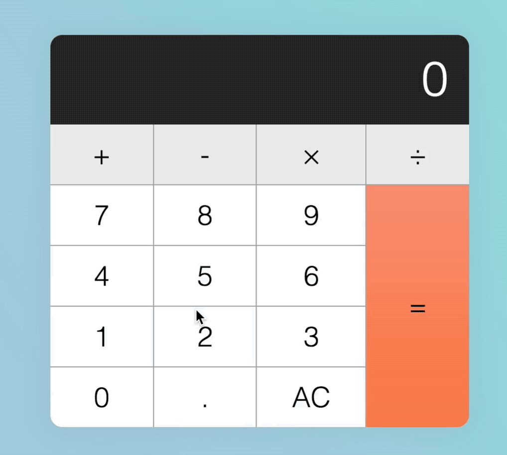
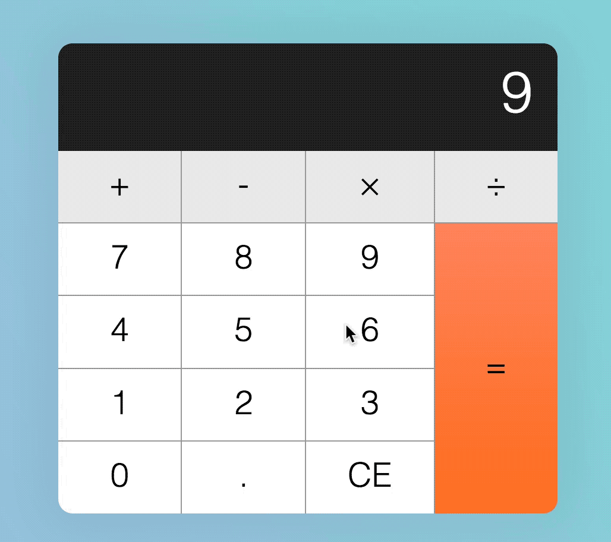
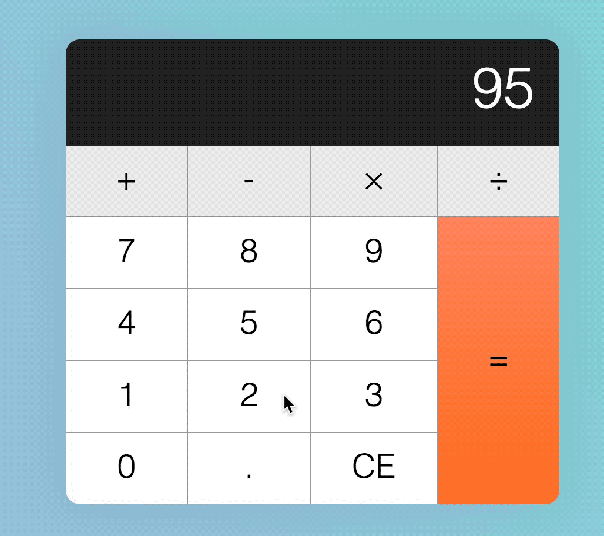
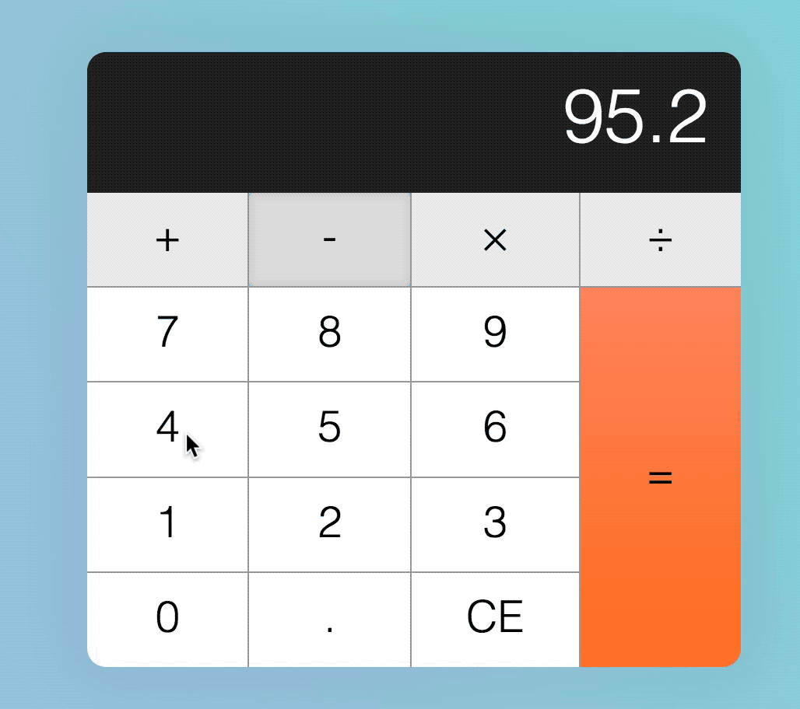
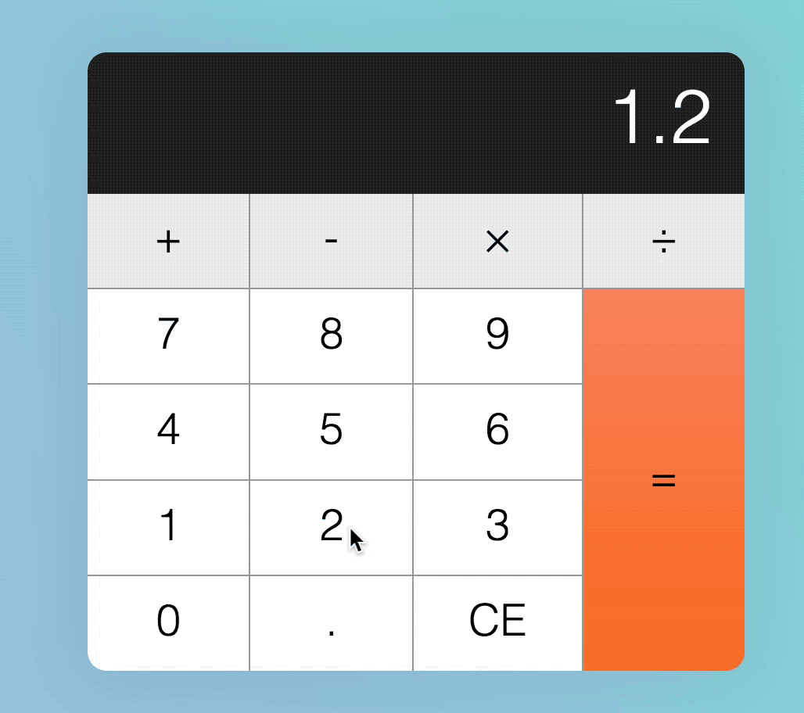
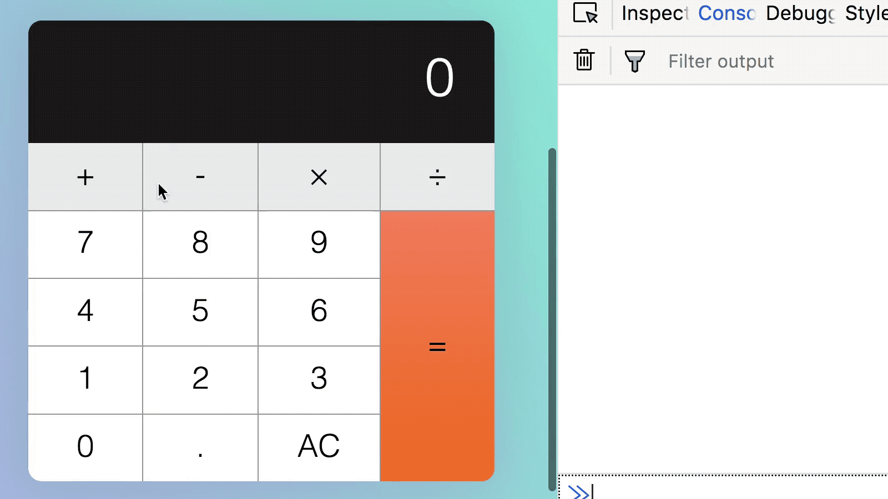

# Building a calculator

This is the start of a two-part lesson about building a calculator. By the end of these two lessons, you should get a calculator that functions exactly like an iPhone calculator (without the `+/-` and percentage functionalities).

Here's what you'll get:

<figure>
  
  <figcaption aria-hidden>GIF of a calculator you'll build</figcaption>
</figure>

I urge you to sit down and try building the calculator yourself before following the lesson. It's a good practice.

A word of warning—don't take the calculator lightly; it may seem simple at first, but you need to take care of many edge cases. When I tried to build the calculator, I had to redo it three times because I underestimated its complexity.

With that, let's begin by understanding how a calculator works.

You'll find the starter files for this lesson in `components/06.carousel/01.starter`.

## How a calculator works

What can possibly happen when a person gets hold of a calculator?

A few things can happen:

1. They hit a number key (0-9)
2. They hit an operator key (+, -, &times;, ÷)
3. They hit the decimal key
4. They hit the equal key
5. They hit the clear key

Immediately, you have five branches of `if/else` statements. It can be overwhelming to consider everything at once, so let's take it step by step and consider what a normal person would do when they pick up a calculator.

## A normal flow

Let's call this normal person Mary.

When Mary picks up a calculator, she'll probably hit a number key.

### Hitting a number key

At this point, if the calculator shows 0 (the default number), the target number should replace zero.

<figure>
  
  <figcaption aria-hidden>Calculator replaces 0 with 9</figcaption>
</figure>

If the calculator shows a non-zero number, the target number should be appended to the displayed number.

<figure>
  
  <figcaption aria-hidden>Calculator appends 5 to 9</figcaption>
</figure>

At this point, Mary will hit any of the following keys:

1. A decimal key
2. An operator key

Let's say Mary hits a decimal key.

### Hitting the decimal key

When Mary hits the decimal key, a decimal should appear on the display. If Mary hits any number after hitting a decimal key, the number should be appended on the display as well.

<figure>
  
  <figcaption aria-hidden>Calculator adds a decimal, followed by a number, to the display</figcaption>
</figure>

Next, let's say Mary continues her calculation by hitting an operator key.

### Hitting an operator key

If Mary hits an operator key, the operator should be highlighted so Mary knows the operator is active.

<figure>
  
  <figcaption aria-hidden>Operator keys should be depressed when they're clicked on</figcaption>
</figure>

Once Mary has hit an operator key, if she is sensible, she'll hit a number key.

### Hitting a number key again

When Mary hits a number key again, the previous display should be replaced with the new number. The operator key should also release it's pressed state.

<figure>
  
  <figcaption aria-hidden>Display replaced by a new number</figcaption>
</figure>

Let's say Mary decides to complete her calculation by hitting the equal key next.

### Hitting the equal key

When Mary hits the equal key, the calculator should calculate a result, depending on the initial value entered before the operator, the operator, and the final value that's currently displayed.

Once a result is calculated, the result should replace the value on the display.

<figure>
  
  <figcaption aria-hidden>Calculates the correct value</figcaption>
</figure>

## Let's take pause and build the above flow

First, we want to build the calculator.

The calculator consist of two parts. The display and the keys.

```html
<div class="calculator">
  <div class="calculator__display">0</div>
  <div class="calculator__keys"> ... </div>
</div>
```

We can use CSS Grid to make the keys since they're arranged in a grid-like format.

To help us identify operator, decimal, clear and equal keys, we're going to supply a data-action attribute that describes what they do.

```html
<div class="calculator__keys">
  <button class="key--modifier" data-action="add">+</button>
  <button class="key--modifier" data-action="subtract">-</button>
  <button class="key--modifier" data-action="multiply">&times;</button>
  <button class="key--modifier" data-action="divide">÷</button>
  <button>7</button>
  <button>8</button>
  <button>9</button>
  <button>4</button>
  <button>5</button>
  <button>6</button>
  <button>1</button>
  <button>2</button>
  <button>3</button>
  <button>0</button>
  <button data-action="decimal">.</button>
  <button data-action="clear">AC</button>
  <button class="key--equal" data-action="calculate">=</button>
</div>
```

The above has already been done for you. You can find the calculator's starter code in `components/calculator/01.starter`.

## Listening for keys

The first step to building the calculator is to listen for events on each of the calculator keys. In this case, we can use a event delegation pattern to listen since keys are all children of `.calculator__keys`.

Note: We want to perform actions only if the user clicks on a `<button>` element, which is why we check if the target element matches a button.

```js
const calculator = document.querySelector('.calculator')
const keys = calculator.querySelector('.calculator__keys')

keys.addEventListener('click', e => {
  if (e.target.matches('button')) {
    // Do something
  }
})
```

Before we do anything else, we need to know the type of key a user clicked on. If you used the HTML mentioned above, you can get the type of key through the `data-action` attribute.

```js
const key = e.target
const action = key.dataset.action
```

If the key does not have a `data-action` attribute, it must be a number key.

```js
if (!action) {
  console.log('number key!')
}
```

If the key has a `data-action` that is either `add`, `subtract`, `multiply` or `divide`, we know the key is an operator.

```js
if (
  action === 'add' ||
  action === 'subtract' ||
  action === 'multiply' ||
  action === 'divide'
) {
  console.log('operator key!')
}
```

If the key's `data-action` is `decimal`, we know the user clicked on the decimal key.

Following the same thought process, if the key's `data-action` is `clear`, we know the user clicked on the clear (the one that says AC) key; if the key's `data-action` is `calculate`, we know the user clicked on the equal key.

```js
if (action === 'decimal') {
  console.log('decimal key!')
}

if (action === 'clear') {
  console.log('clear key!')
}

if (action === 'calculate') {
  console.log('equal key!')
}
```

If you did this right so far, you'll get the correct `console.log` response from every calculator key.

<figure>
  
  <figcaption aria-hidden>We're now able to detect different types of keys</figcaption>
</figure>

## Implementing a normal flow

If a user clicks on a number key, and if the calculator shows zero, the number of the clicked key should replace the displayed number.

We can get the number of the clicked key through the key's `textContent`. Likewise, we can get the displayed number through `textContent` as well.

```js
const display = document.querySelector('.calculator__display')

keys.addEventListener('click', e => {
  if (e.target.matches('button')) {
    const key = e.target
    const action = key.dataset.action
    const keyContent = key.textContent
    const displayedNum = display.textContent

    if (!action) {
      if (displayedNum === '0') {
        display.textContent = keyContent
      }
    }

    // ...
  }
})
```

<figure>
  
  <figcaption aria-hidden>Replacing 0 with a number</figcaption>
</figure>

If the calculator shows a non-zero number, the number of the clicked key should be appended to the displayed number. To append a number, we concatenate a string.

```js
if (!action) {
  if (displayedNum === '0') {
    display.textContent = keyContent
  } else {
    display.textContent = displayedNum + keyContent
  }
}
```

<figure>
  
  <figcaption aria-hidden>Adding a number to another number on the display</figcaption>
</figure>

### When a user clicks on the decimal key

If a user clicks on a decimal key, a decimal should be appended to the display. This happens regardless whether the displayed number shows zero.

To create this effect, we can concatenate `.` to the displayed number.

```js
if (action === 'decimal') {
  display.textContent = displayedNum + '.'
}
```

<figure>
  
  <figcaption aria-hidden>Calculator adds a decimal, followed by a number, to the display</figcaption>
</figure>

### When a user clicks on an operator key

If a user clicks an operator key, that key should be highlighted. To do so, we use the `is-depressed` class.

```js
if (
  action === 'add' ||
  action === 'subtract' ||
  action === 'multiply' ||
  action === 'divide'
) {
  key.classList.add('is-depressed')
}
```

<figure>
  
  <figcaption aria-hidden>Operator keys should be depressed when they're clicked on</figcaption>
</figure>

### When a user clicks a number after an operator key

If a user clicks a number key after an operator key, the operator key should also be released from its pressed state.

To release the pressed state, we can loop through all keys and ensure that no key has the `is-depressed` class.

```js
keys.addEventListener('click', e => {
  if (e.target.matches('button')) {
    const key = e.target
    // ...

    // Remove .is-depressed class from all keys
    Array.from(key.parentNode.children)
      .forEach(k => k.classList.remove('is-depressed'))
  }
})
```

At the same time, we also want to updated the display to the number of the clicked key. To do so, we need to know if the user clicked on an operator key previously. One way to know if the user has clicked on an operator key is to store a `previousKeyType` custom attribute.

```js
const calculator = document.querySelector('.calculator')
// ...

keys.addEventListener('click', e => {
  if (e.target.matches('button')) {
    // ...

    if (
      action === 'add' ||
      action === 'subtract' ||
      action === 'multiply' ||
      action === 'divide'
    ) {
      key.classList.add('is-depressed')
      // Add custom attribute
      calculator.dataset.previousKeyType = 'operator'
    }
  }
})
```

If the `previousKeyType` is an operator, we want to replace the displayed number with clicked number.

```js
const previousKeyType = calculator.dataset.previousKeyType

if (!action) {
  if (displayedNum === '0' || previousKeyType === 'operator') {
    display.textContent = keyContent
  } else {
    display.textContent = displayedNum + keyContent
  }
}
```

<figure>
  
  <figcaption aria-hidden>Displayed number replaced with clicked number</figcaption>
</figure>

### When a user clicks on the equal key

When a user clicks on the equal key, we want to calculate the result of the numbers the user entered.

<figure>
  
  <figcaption aria-hidden>Calculates the correct value</figcaption>
</figure>

To calculate a result, we need three values:

1. The **first number** entered into the calculator
2. The **operator**
3. The **second number** entered into the calculator

At this point, we only know the **second number**—the currently displayed number.

```js
if (action === 'calculate') {
  const secondValue = displayedNum
  // ...
}
```

To get the **first number**, we need to store the calculator's displayed value before we wiped it clean.

One way to save this first number is to add it to a custom attribute when the operator button gets clicked. (But why should we save the first number to a custom attribute when the operator button gets clicked? Are there any other ways? Think about it before moving on).

To get the **operator**, we can also use the same technique. (But why do we do this? Are there any other ways? Think about this too!).

```js
if (
  action === 'add' ||
  action === 'subtract' ||
  action === 'multiply' ||
  action === 'divide'
) {
  // ...
  calculator.dataset.firstValue = displayedNum
  calculator.dataset.operator = action
}
```

Once we have the three values we need, we can perform a calculation. Eventually, we want code to look something like this:

```js
if (action === 'calculate') {
  const firstValue = calculator.dataset.firstValue
  const operator = calculator.dataset.operator
  const secondValue = displayedNum

  display.textContent = calculate(firstValue, operator, secondValue)
}
```

Here, we know we need to create a `calculate` function that takes in three values—the first number, the operator, and the second number.

```js
const calculate = (n1, operator, n2) => {
  // Perform calculation and return value
}
```

If the operator is `add`, we want to add values together; if the operator is `subtract`, we want to subtract the values, and so on.

```js
const calculate = (n1, operator, n2) => {
  let result = ''

  if (operator === 'add') {
    result = n1 + n2
  } else if (operator === 'subtract') {
    result = n1 - n2
  } else if (operator === 'multiply') {
    result = n1 * n2
  } else if (operator === 'divide') {
    result = n1 / n2
  }

  return result
}
```

Remember that `firstValue` and `secondValue` are strings at this point. If you add strings together, you'll concatenate them (`1 + 1 = 11`).

Before calculating the result, we want to convert strings to numbers. We can do so with two functions—`parseInt` and `parseFloat`.

- `parseInt` converts a string into an **integer**.
- `parseFloat` converts a string into a **float** (this means a number with decimal places).

For a calculator, we need a float.

```js
const calculate = (n1, operator, n2) => {
  let result = ''

  if (operator === 'add') {
    result = parseFloat(n1) + parseFloat(n2)
  } else if (operator === 'subtract') {
    result = parseFloat(n1) - parseFloat(n2)
  } else if (operator === 'multiply') {
    result = parseFloat(n1) * parseFloat(n2)
  } else if (operator === 'divide') {
    result = parseFloat(n1) / parseFloat(n2)
  }

  return result
}
```

We're done creating the happy path now.

## The happy path

The happy path is a scenario where there we encounter no errors nor edge cases. It's the scenario above, where we presumed Mary will excel at using the simple calculator we created.

Unfortunately, happy paths don't always occur in reality. There's always edge cases to every application you build 😢. Thats why you need to make sure your app is robust enough to withstand most (if possible, all) edge cases. This is something you'll learn to do in the next part.

## Wrapping up

You learned to build the calculator that works if the user follows a specific input pattern. It's a great start!

Before moving on, I suggest you work through the happy path yourself; make sure you can build it without looking through this lesson again.