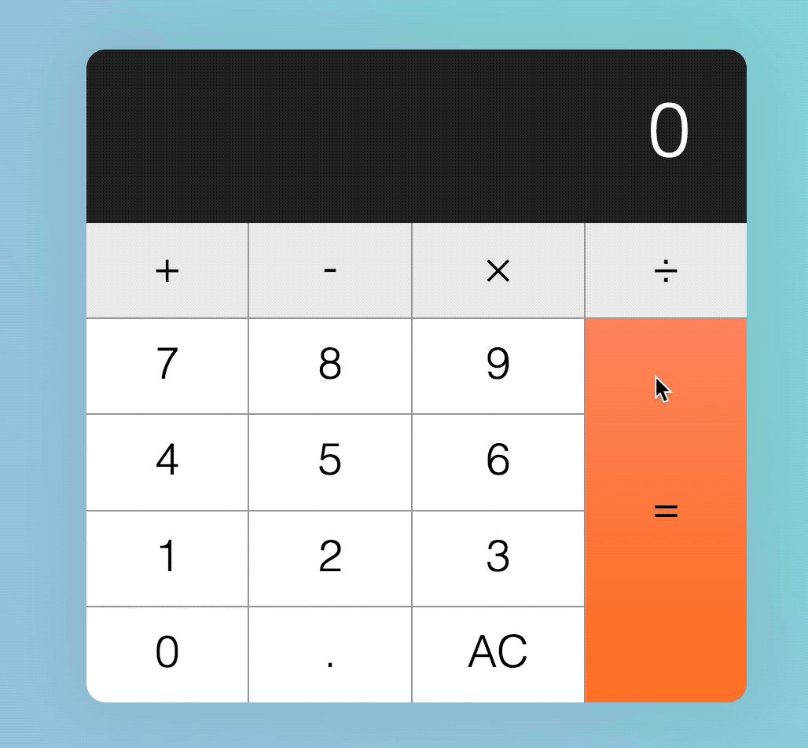
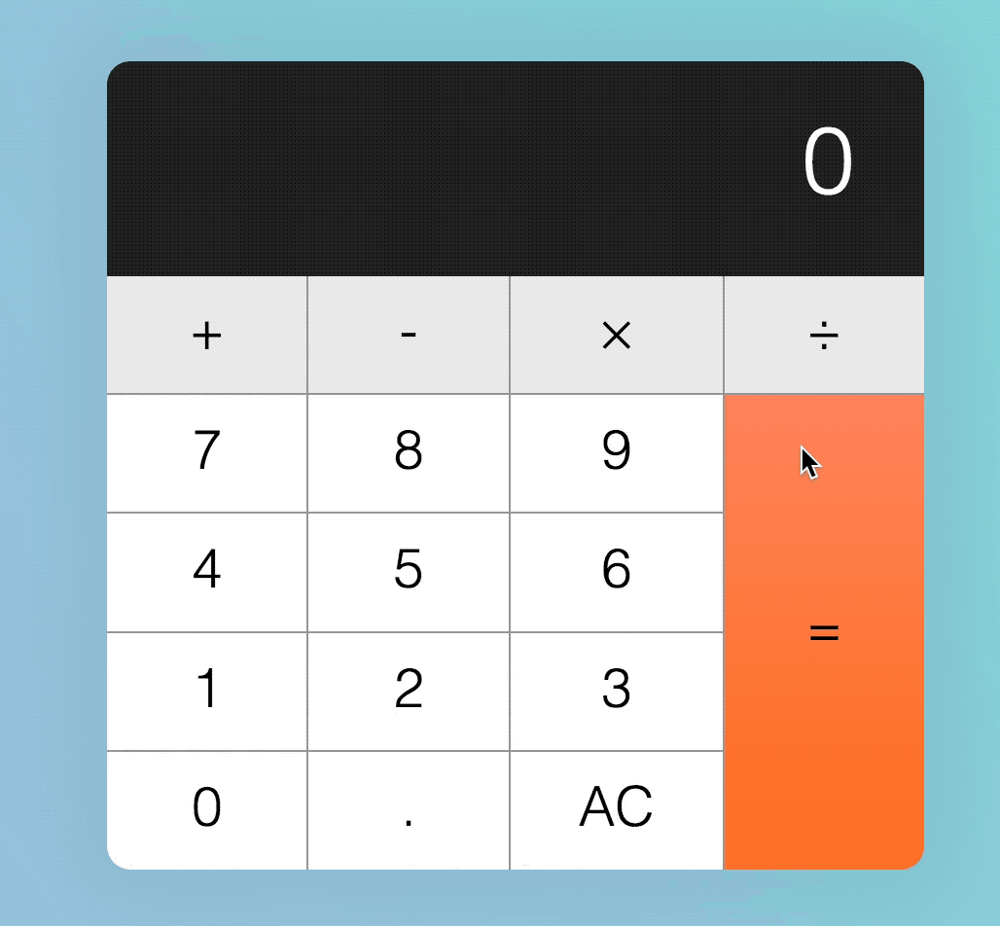
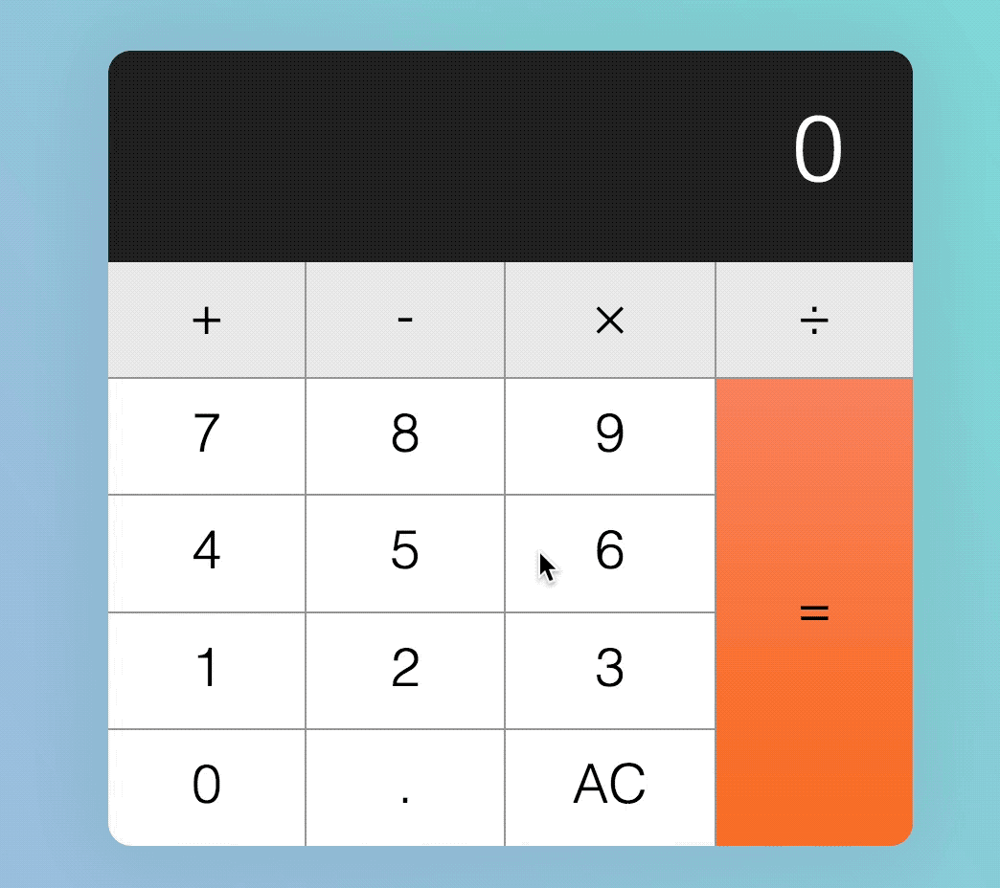
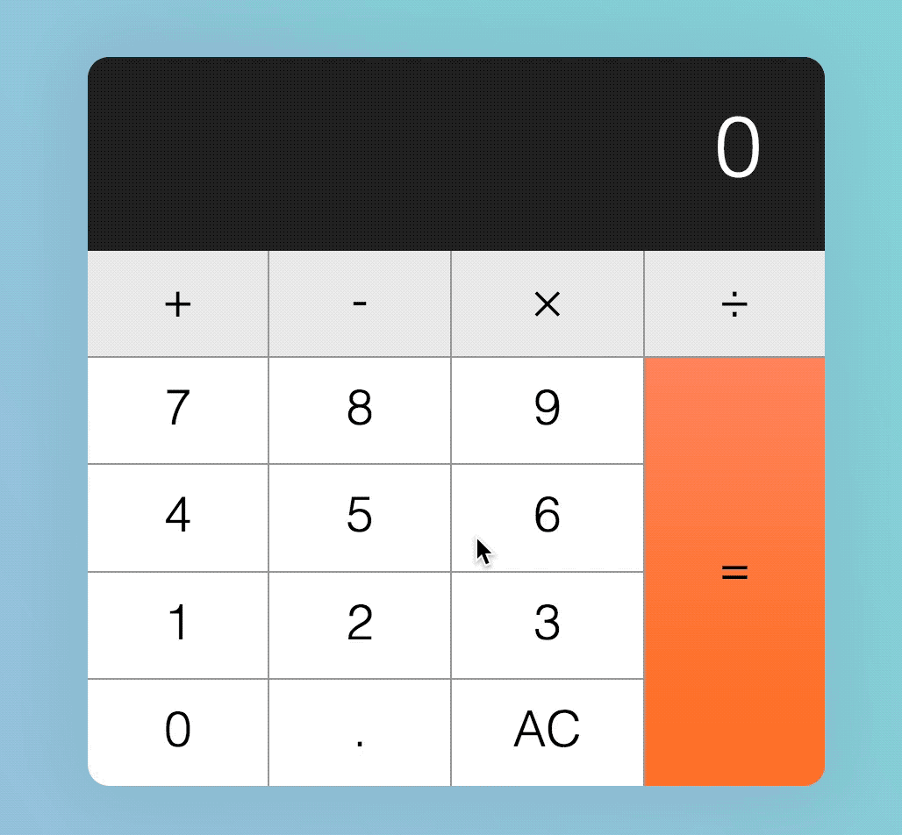

# Building a calculator (part 2)

The code you wrote in the last lesson was a small part to build a workable calculator. In this lesson, we're going to expand our calculator to make it resilient to all sorts of weird input patterns.

To do so, we have to imagine a troublemaker who tries to break our calculator by hitting keys in the wrong order. Let's call this troublemaker Tim.

Tim can hit any of these keys in any order:

1. A number key (0-9)
2. An operator key (+, -, &times;, ÷)
3. The decimal key
4. The equal key
5. The clear key

## If Tim hits a decimal key...

**If Tim hits a decimal key when the display already shows a decimal point, nothing should happen.**

<figure>
  
  <figcaption>Nothing happens when a user hits the decimal key when the display already shows a decimal point</figcaption>
</figure>

<figure>
  
  <figcaption>Nothing should happen even if the previous key isn't the decimal key</figcaption>
</figure>

Here, we can check the displayed number contains a `.` with the `includes` method.

`includes` checks strings for a given match; if a string is found, it returns `true`; if not, it returns `false`. Note: `includes` is case sensitive

```js
// Example of how includes work.
const string = 'The hamburgers taste pretty good!'
const hasExclaimation = string.includes('!')

console.log(hasExclaimation) // true
```

```js
// Do nothing if string has a dot
if (!displayedNum.includes('.')) {
  display.textContent = displayedNum + '.'
}
```

**Next, if Tim hits the decimal key after hitting an operator key, the display should show `0.`.**

<figure>
  
  <figcaption>Display should show "0." if a user hits a decimal key after an operator key</figcaption>
</figure>

Here, we need to know whether the custom attribute, `data-previous-key-type` is an `operator`. We already built this functionality in the previous lesson, but it wasn't complete. To correctly identify if the previous key type is an operator, we need to make sure we set a different type for each type of key clicked.

```js
if (!action) {
  // ...
  calculator.dataset.previousKey = 'number'
}

if (action === 'decimal') {
  // ...
  calculator.dataset.previousKey = 'decimal'
}

if (action === 'clear') {
  // ...
  calculator.dataset.previousKeyType = 'clear'
}

if (action === 'calculate') {
 // ...
  calculator.dataset.previousKeyType = 'calculate'
}
```

Then, we can use an `if` statement to check whether we should display `0.`.

```js
if (action === 'decimal') {
  if (!displayedNum.includes('.')) {
    display.textContent = displayedNum + '.'
  } else if (previousKeyType === 'operator') {
    display.textContent = '0.'
  }

  calculator.dataset.previousKeyType = 'decimal'
}
```

## What happens when Tim hits an operator key?

**If Tim hits an operator key first, the operator key should light up.** (We've already covered for this edge case, but how? See if you can identify what we did).

<figure>
  
  <figcaption>Operator key should light up if it's the first key.</figcaption>
</figure>

**Next, if Tim hits the same operator key multiple times, nothing should happen.** (We've already covered for this edge case too).

Note: if you want to provide better UX, you can show the operator getting clicked on again and again with some CSS changes. We didn't do it here because I took recorded all the GIFs before I could fix that

<figure>
  
  <figcaption>Operator key remains depressed if clicked on multiple times</figcaption>
</figure>

**Next, If Tim hits another operator key after hitting the first operator key, the first operator key should be released. The second operator key should be depressed.** (We covered for this edge case too; but how?).

<figure>
  
  <figcaption>The new operator key should be depressed</figcaption>
</figure>

**Next, if Tim hits a number, an operator, a number and another operator, in that order, the displayed value should be updated to a calculated value.**

Here, the first number entered should be used for `firstValue`, the previous operator entered should be used for `operator`, and the second displayed number should be used for `secondValue`.

<figure>
  
  <figcaption>Clicking on the operator when numbers are stored in the calculator results in a calculation</figcaption>
</figure>

This means we need to use the `calculate` function when `firstValue`, `operator` and `secondValue` exists.

```js
if (
  action === 'add' ||
  action === 'subtract' ||
  action === 'multiply' ||
  action === 'divide'
) {
  const firstValue = calculator.dataset.firstValue
  const operator = calculator.dataset.operator
  const secondValue = displayedNum

  // Note: It's sufficient to check for firstValue and operator because secondValue always exists
  if (firstValue && operator) {
    display.textContent = calculate(firstValue, operator, secondValue)
  }

  key.classList.add('is-depressed')
  calculator.dataset.previousKeyType = 'operator'
  calculator.dataset.firstValue = displayedNum
  calculator.dataset.operator = action
}
```

With this code, although we can calculate a value when the operator key is clicked for a second time, we have also introduced a bug—additional clicks on the operator key (after any operator key) should do nothing, but it calculates a value right now.

<figure>
  
  <figcaption>Bug: subsequent clicks on the operator performs a calculation when it shouldn't</figcaption>
</figure>

To fix this undesirable calculation, we can check if `previousKeyType` is an operator. If it is, the calculator should not calculate.

```js
if (
  firstValue &&
  operator &&
  previousKeyType !== 'operator'
) {
  display.textContent = calculate(firstValue, operator, secondValue)
}
```

**Next, after the operator key calculates a number, if Tim hits on a number, followed by another operator, the operator should calculate again.**

<figure>
  
  <figcaption>Calculator should be able to continue calculation when a user clicks on numbers, followed by operators, followed by numbers, followed by operators, and so on.</figcaption>
</figure>

Right now, when a user clicks a number, followed by an operator, our calculator performs a calculation. Unfortunately, this second calculated value is wrong.

<figure>
  
  <figcaption>Calculated values are wrong. Second calculated value should be 97 instead of 0</figcaption>
</figure>

The value is wrong because we fed the wrong `firstValue` and `secondValue` into the `calculate` function.

Let me explain what we're doing through a few pictures. Here's what we're doing right now.

First, we clicked on a number, 99. At this point, nothing is registered in the calculator yet.

<figure>
  
  <figcaption>When a user hits numbers, the calculator doesn't register `firstValue` or `operator`</figcaption>
</figure>

Then, we clicked on the subtract operator. After we click on the subtract operator, `calculator.dataset.firstValue` is set to the displayed number, 99. At the same time, `calculator.dataset.operator` is set to the operator, subtract.

<figure>
  
  <figcaption>`firstValue` and `operator` are set after the operator button is clicked</figcaption>
</figure>

Next, we clicked on our second value, 1. At this point, the displayed number gets updated to 1, but our `firstValue`, `operator` and `secondValue` remains unchanged.

<figure>
  
  <figcaption>Display updates to 1, but `firstValue` and `operator` remains at `99` and `subtract`</figcaption>
</figure>

Next, we clicked the subtract again. Right after we click the minus sign, before the calculation, `displayedNum` is set as the `secondValue`.

<figure>
  
  <figcaption>displayed number, 1, is set as `secondValue`</figcaption>
</figure>

After `displayedNum` is set as `secondValue`, the calculator calculates the final value and replaces the display.

At the same time, `calculator.dataset.operator` is set to subtract, and `calculator.dataset.firstValue` is set to `displayedNum`.

<figure>
  
  <figcaption>After calculation, firstValue is set to `displayedNum`</figcaption>
</figure>

Well, that's terribly wrong! If we want to continue with the calculation, we need to update `firstValue` with the calculated value.

```js
if (
  action === 'add' ||
  action === 'subtract' ||
  action === 'multiply' ||
  action === 'divide'
) {
  const firstValue = calculator.dataset.firstValue
  const operator = calculator.dataset.operator
  const secondValue = displayedNum

  if (firstValue && operator && previousKeyType !== 'operator') {
    const calcValue = calculate(firstValue, operator, secondValue)
    display.textContent = calcValue

    // Update calculated value as firstValue
    calculator.dataset.firstValue = calcValue
  } else {
    // If there are no calculations, set displayedNum as the firstValue
    calculator.dataset.firstValue = displayedNum
  }

  key.classList.add('is-depressed')
  calculator.dataset.previousKeyType = 'operator'
  calculator.dataset.operator = action
}
```

<figure>
  
  <figcaption>updates calculated value as `firstValue`</figcaption>
</figure>

With this fix, consecutive calculations done by operator keys should now be correct.

<figure>
  
  <figcaption>Consecutive calculations done with the operator key is now correct</figcaption>
</figure>

## What happens if Tim hits the equal key?

**If Tim hits the equal key before an operator key is clicked, nothing should happen**.

<figure>
  
  <figcaption>Calculator should show zero if equal key is hit first</figcaption>
</figure>

<figure>
  
  <figcaption>When no calculation is required, display remains the same</figcaption>
</figure>

Here, we know that no operator keys are clicked if `firstValue` is not set. If `firstValue` is not present, we don't perform any calculation.

```js
if (action === 'calculate') {
  const firstValue = calculator.dataset.firstValue
  const operator = calculator.dataset.operator
  const secondValue = displayedNum

  if (firstValue) {
    display.textContent = calculate(firstValue, operator, secondValue)
  }

  calculator.dataset.previousKeyType = 'calculate'
}
```

**If Tim hits a number, followed by an operator, followed by a equal, the calculator should calculate the result such that:**

1. `2 + =` —> `2 + 2 = 4`
2. `2 - =` —> `2 - 2 = 0`
3. `2 &times; =` —> `2 * 2 = 4`
4. `2 ÷ =` —> `2 ÷ 2 = 1`

<figure>
  
  <figcaption>The calculator should treat first and second values as the same numbers if it's missing a value</figcaption>
</figure>

We have already taken this weird input into account. This is because `firstValue` and `operator` is when an operator key is clicked on. Next, because the user did not click on a number key, the currently displayed number will be the same number as `firstValue`. This new `displayNum` is used as `secondValue`.

**Next, if Tim hits the equal key after a calculation is completed, a similar calculation should be performed again.**

<figure>
  
  <figcaption>When a user hits the equal key multiple times, the calculator should continue to calculate</figcaption>
</figure>

Right now, our calculator messes this up big time. If you clicked 5 - 1, then the equal key, you should see 4. If you click the equal key immediate after, you should see 7, but our calculator shows 11.

<figure>
  
  <figcaption>Equal key consecutive calculation gives a wrong result</figcaption>
</figure>

Why does this happen? Well, let's take go through a few pictures again:

First, we clicked on a number, 5. At this point, nothing is registered in the calculator yet.

<figure>
  
  <figcaption>When a user clicked on the first number the calculator doesn't register `firstValue` or `operator`</figcaption>
</figure>

Then, we clicked on the subtract operator. After we click on the subtract operator, `calculator.dataset.firstValue` is set to the displayed number, 5. At the same time, `calculator.dataset.operator` is set to the operator, subtract.

<figure>
  
  <figcaption>`firstValue` and `operator` are set after the operator button is clicked</figcaption>
</figure>

Next, we clicked on our second value, 1. At this point, the displayed number gets updated to 1, but our `firstValue`, `operator` and `secondValue` remains unchanged.

<figure>
  
  <figcaption>Display updates to 1, but `firstValue` and `operator` remains at `5` and `subtract`</figcaption>
</figure>

Next, we click the equal key. Right after we click the equal key, before the calculation, `displayedNum` is set as the `secondValue`.

<figure>
  
  <figcaption>`displayedNum` is set as `secondValue`</figcaption>
</figure>

After `displayedNum` is set as `secondValue`, the calculator calculates the final value and replaces the display. Here, `firstValue` and `operator` gets ported over to the next calculation because they're not updated.

<figure>
  
  <figcaption>`firstValue` and `operator` are used for the next operation</figcaption>
</figure>

If we click the equal key again, the `displayedNum` will be set as `secondValue` before the calculation.

<figure>
  
  <figcaption>Once again, displayed num is set as the `secondValue` before the calculation</figcaption>
</figure>

At this point, you can tell what's wrong. We don't want the `displayedNum` to be set as `secondValue` if the equal key gets clicked right after a calculation. We want `displayedNum` to be set as `firstValue`.

```js
if (action === 'calculate') {
  let firstValue = calculator.dataset.firstValue
  const operator = calculator.dataset.operator
  const secondValue = displayedNum

  if (previousKeyType === 'calculate') {
    firstValue = displayedNum
  } else if (firstValue) {
    display.textContent = calculate(firstValue, operator, secondValue)
  }

  calculator.dataset.previousKeyType = 'calculate'
}
```

At the same time, we want the previous `secondValue` to be set as the `secondValue`. In order for the `secondValue` to persist to the next calculation, we need to store it in another custom attribute. Let's call this custom attribute `modValue` (stands for modifier value).

```js
if (action === 'calculate') {
  let firstValue = calculator.dataset.firstValue
  const operator = calculator.dataset.operator
  const secondValue = displayedNum

  if (previousKeyType === 'calculate') {
    firstValue = displayedNum
  } else if (firstValue) {
    display.textContent = calculate(firstValue, operator, secondValue)
  }

  calculator.dataset.modValue = secondValue
  calculator.dataset.previousKeyType = 'calculate'
}
```

If the `previousKeyType` is `calculate`, we know we can use `calculator.dataset.modValue` as `secondValue`. Once we know this, we can perform the calculation.

```js
if (previousKeyType === 'calculate') {
  firstValue = displayedNum
  secondValue = calculator.dataset.modValue
  display.textContent = calculate(firstValue, operator, secondValue)
}
```

With that, we have the correct calculation when the equal key is clicked consecutively.

<figure>
  
  <figcaption>Consecutive calculations made by the equal key is now fixed</figcaption>
</figure>

**If Tim hits a decimal key or a number key after the calculator key, the display should be replaced with `0.` or the the new number respectively.**

Here, instead of just checking if the `previousKeyType` is `operator`, we also need to check if it's `calculate`.

```js
if (!action) {
  if (
    displayedNum === '0' ||
    previousKeyType === 'operator' ||
    previousKeyType === 'calculate'
  ) {
    display.textContent = keyContent
  } else {
    display.textContent = displayedNum + keyContent
  }
  calculator.dataset.previousKeyType = 'number'
}

if (action === 'decimal') {
  if (!displayedNum.includes('.')) {
    display.textContent = displayedNum + '.'
  } else if (
    previousKeyType === 'operator' ||
    previousKeyType === 'calculate'
  ) {
    display.textContent = '0.'
  }

  calculator.dataset.previousKeyType = 'decimal'
}
```

**If Tim hits an operator key right after the equal key, calculator should NOT calculate.**

<figure>
  
  <figcaption>Operator keys should not perform calculations if they're clicked after the equal key</figcaption>
</figure>

To do this, we simply check if the `previousKeyType` is calculate before performing calculations with operator keys.

```js
if (
  action === 'add' ||
  action === 'subtract' ||
  action === 'multiply' ||
  action === 'divide'
) {
  // ...

  if (
    firstValue &&
    operator &&
    previousKeyType !== 'operator' &&
    previousKeyType !== 'calculate'
  ) {
    const calcValue = calculate(firstValue, operator, secondValue)
    display.textContent = calcValue
    calculator.dataset.firstValue = calcValue
  } else {
    calculator.dataset.firstValue = displayedNum
  }

  // ...
}
```

## What happens if Tim hits the clear key?

The clear key has two uses:

1. All Clear (denoted by `AC`) clears everything and resets the calculator to its initial state.
2. Clear entry (denoted by `CE`) clears the current entry. It keeps previous numbers in memory.

When the calculator is in its default state, `AC` should be shown.

<figure>
  
  <figcaption>AC should be shown in the initial state</figcaption>
</figure>

**If Tim hits a key (any key except clear), `AC` should be changed to `CE`.**

<figure>
  
  <figcaption>AC changes to CE when a key (except clear) gets hit</figcaption>
</figure>

We do this by checking if the `data-action` is `clear`. If it's not clear, we look for the clear button and change its `textContent`.

```js
if (action !== 'clear') {
  const clearButton = calculator.querySelector('[data-action=clear]')
  clearButton.textContent = 'CE'
}
```

**If Tim hits `CE`, the display should read 0. At the same time, `CE` should be reverted to `AC` so Tim can reset the calculator to its initial state.**

<figure>
  
  <figcaption>If CE is clicked, AC should show</figcaption>
</figure>

```js
if (action === 'clear') {
  display.textContent = 0
  key.textContent = 'AC'
  calculator.dataset.previousKeyType = 'clear'
}
```

**If Tim hits `AC`, reset the calculator to its initial state.**

To reset the calculator to its initial state, we need to clear all custom attributes we've set.

```js
if (action === 'clear') {
  if (key.textContent === 'AC') {
    calculator.dataset.firstValue = ''
    calculator.dataset.modValue = ''
    calculator.dataset.operator = ''
    calculator.dataset.previousKeyType = ''
  } else {
    key.textContent = 'AC'
  }

  display.textContent = 0
  calculator.dataset.previousKeyType = 'clear'
}
```

## Wrapping up

That's it! Building a calculator is hard, don't berate yourself if you cannot build a calculator without making mistakes.

For homework, write down all the edge cases mentioned above on a piece of paper, then proceed to build the calculator again from scratch. See if you can get the calculator up. Take your time, clear away your bugs one by one and you'll get your calculator up eventually.

While you carry out this homework, see if you can find any edge cases I missed :)

In the next module, you'll learn to clean up the code so the calculator isn't as confusing as what we have now. Look forward to it!