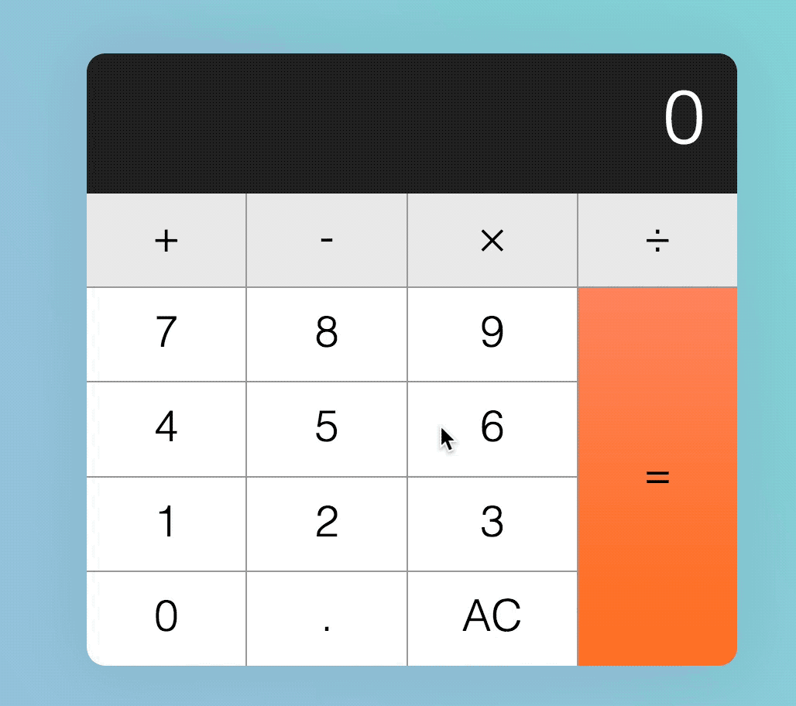
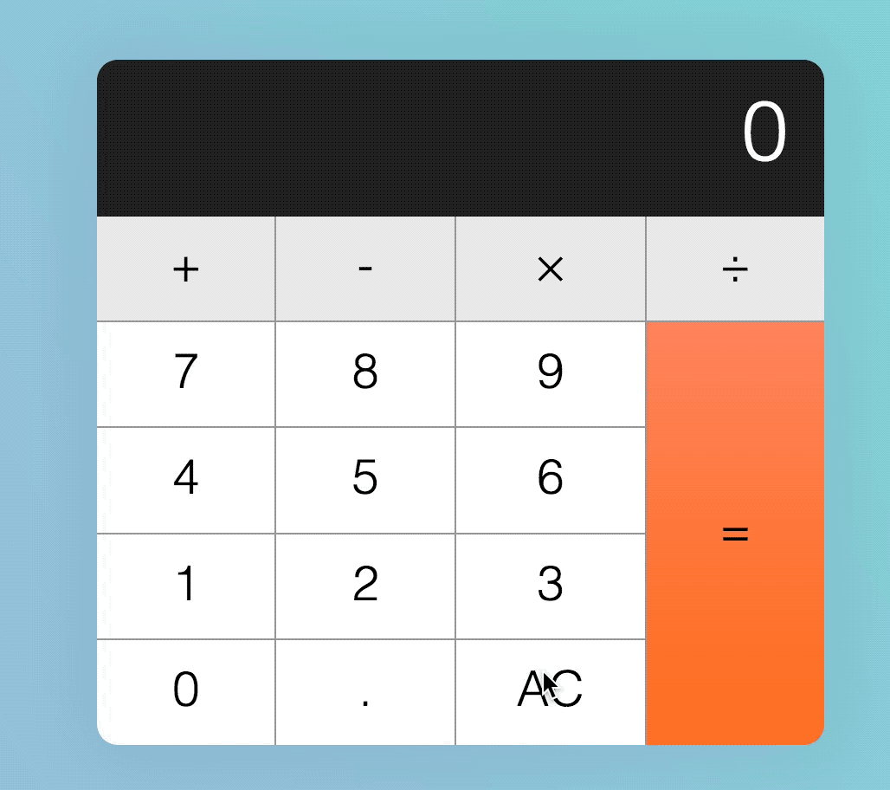
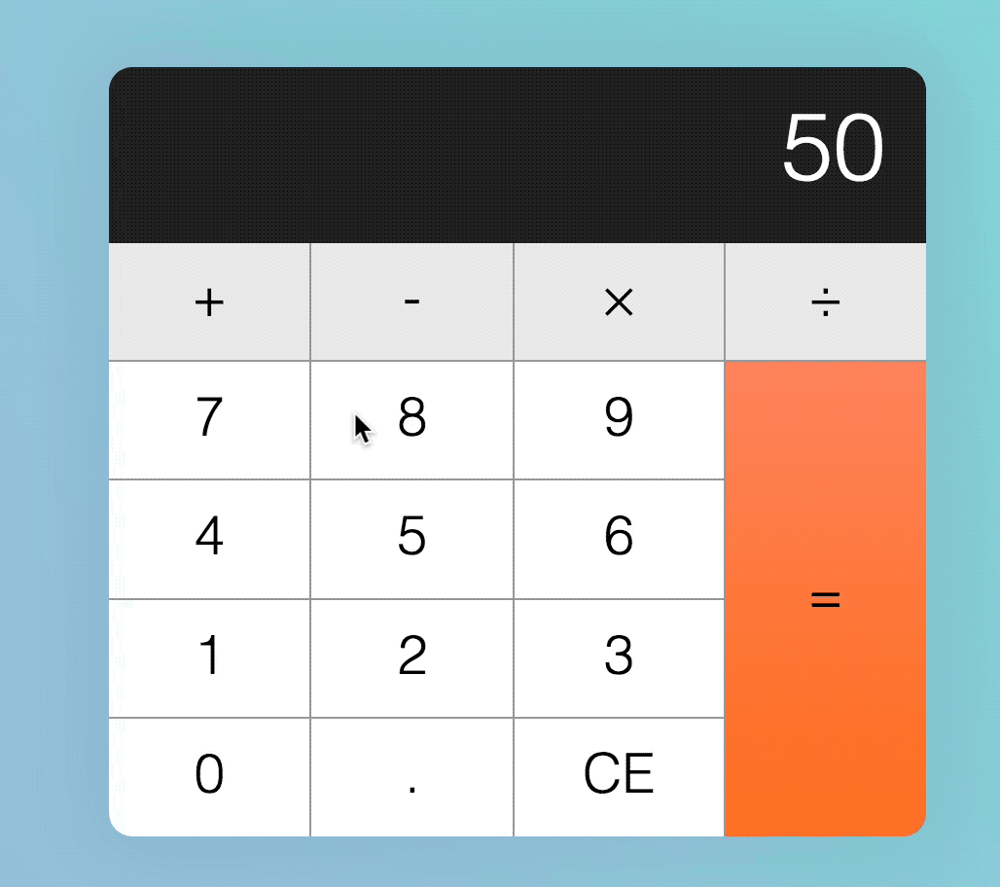
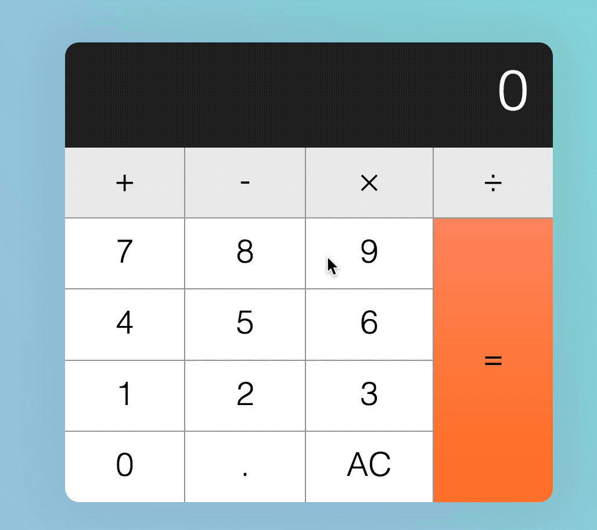
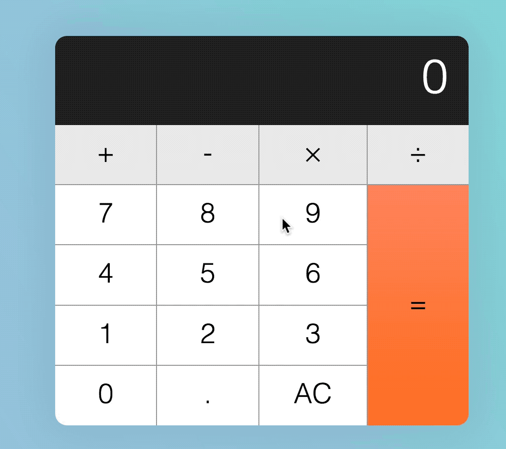
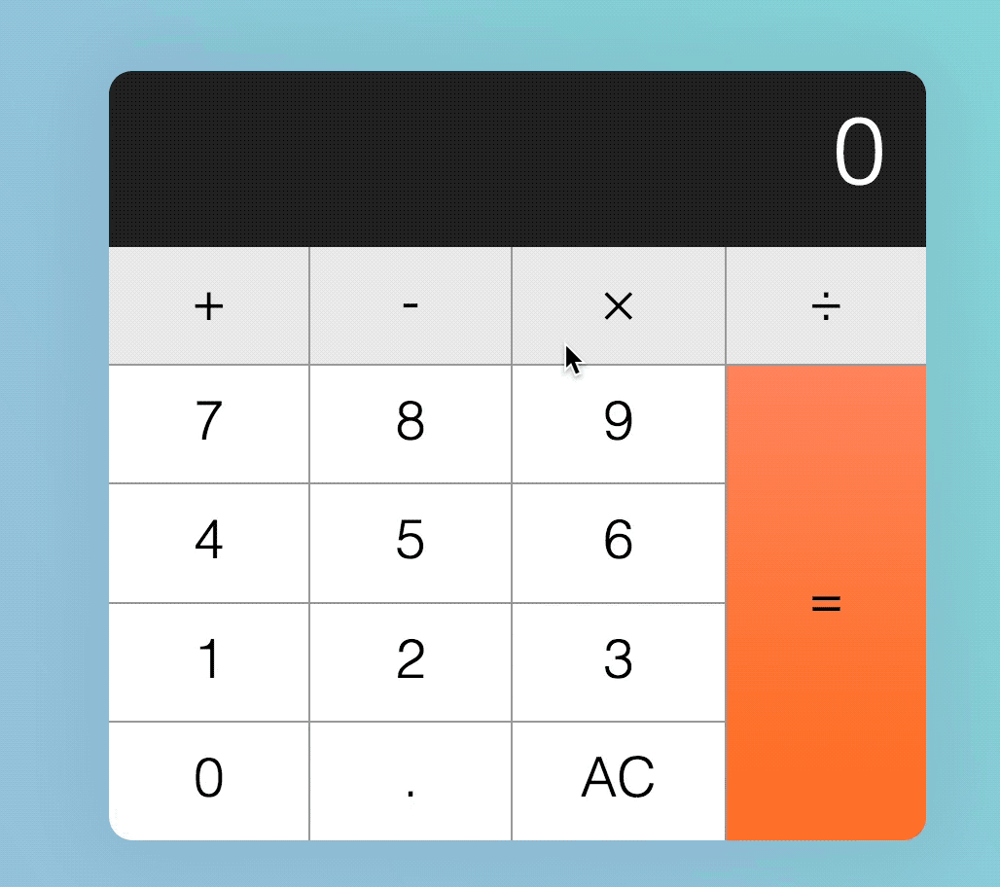
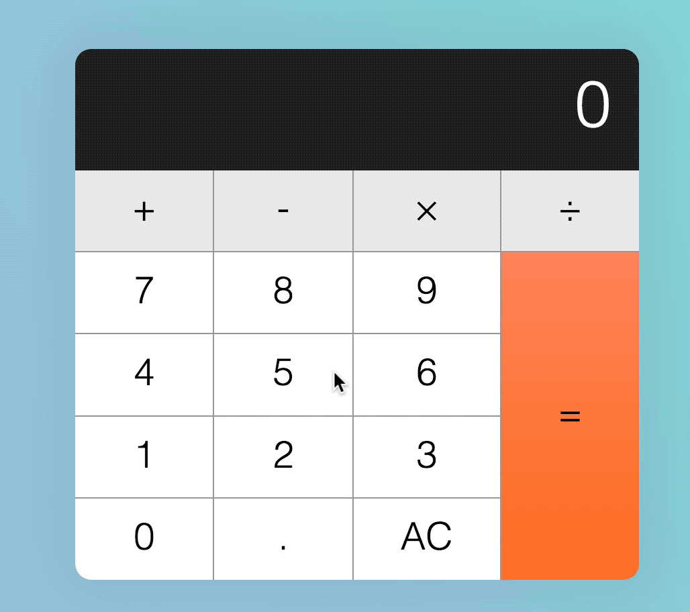
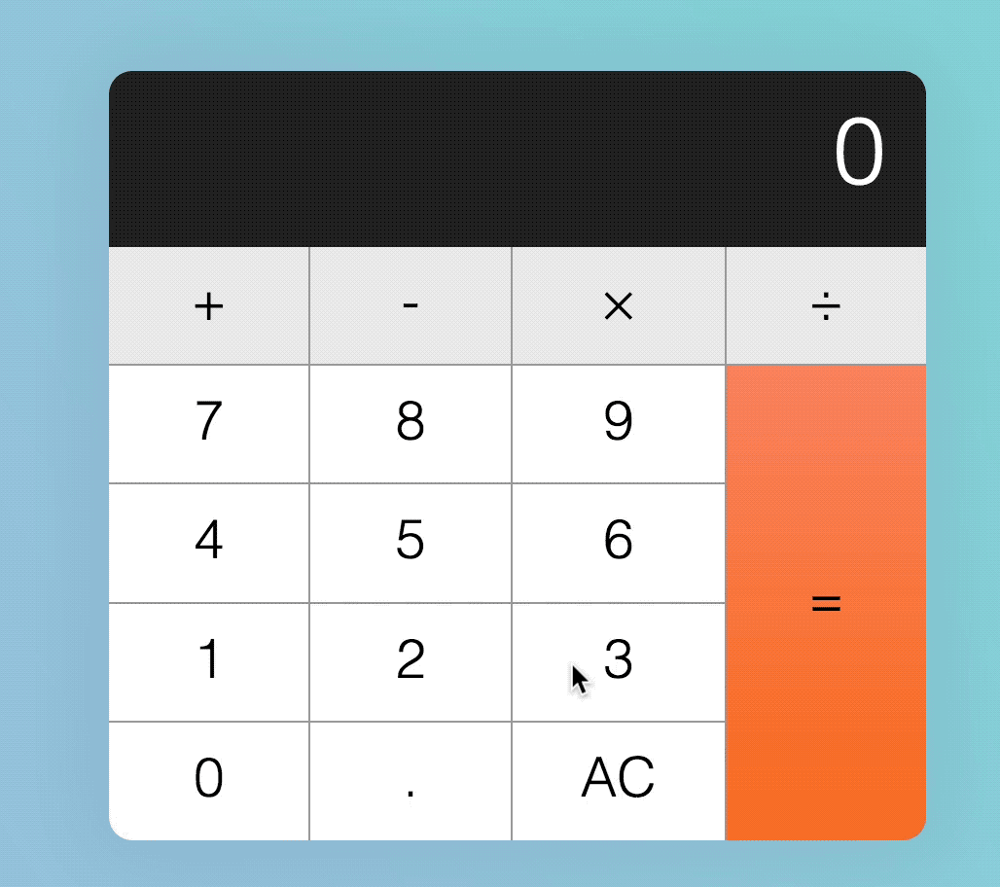
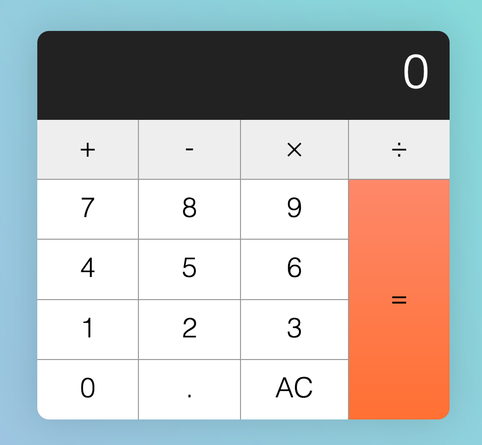
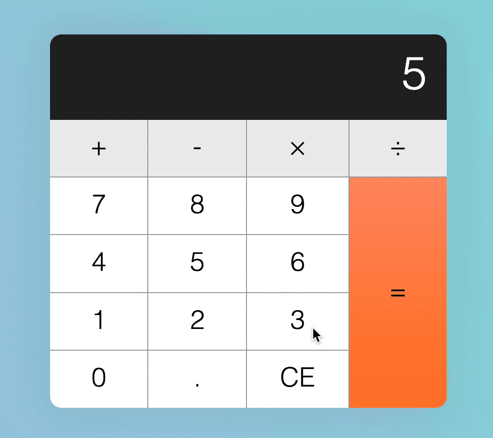

# Building a calculator (part 2)

The calculator you built in the previous lesson was a tiny part of the process to building a workable calculator. Besides the happy path, we need to create code for all possible edge cases.

For this lesson, we'll focus on the edge cases. This time, let's say our user is Tim.

## What happens if Tim hits a decimal key?

Right off the bat, when the display says 0, Tim can hit a decimal key. If he does so, they display should read `0.`.

<figure>
  
  <figcaption>Hitting the decimal key should append a decimal key regardless of the number displayed</figcaption>
</figure>

If the display already has a decimal key, and Tim still hits the decimal key, nothing should happen.

<figure>
  
  <figcaption>Nothing happens when a user hits the decimal key when the display already shows a dot</figcaption>
</figure>

<figure>
  
  <figcaption>Nothing should happen even if the previous key isn't the decimal key</figcaption>
</figure>

Tim may also hit the decimal key after hitting an operator key. If this happens, the display should show `0.`.

<figure>
  
  <figcaption>Display should show "0." if a user hits a decimal key after an operator key</figcaption>
</figure>

### Building edge cases for the decimal key

**If the user hits the decimal key when the display is zero, we want to replace `0` with `0.`**

We don't need to do anything to achieve this. Our code allows this already.

**If the display already has a decimal key, and Tim still hits the decimal key, nothing should happen.**

Here, we need to check if the displayed number has a `.`. If it has a `.`, we ignore the change. To check if a number has a string, we can use the `includes` method that's available to all strings.

`includes` checks strings for a given match. It's case sensitive. If a string is found, it returns `true`; if not, it returns `false`.

```js
// Example of how includes work.
const string = 'The hamburgers taste pretty good!'
const hasExclaimation = string.includes('!')

console.log(hasExclaimation) // true
```

```js
// Do nothing if string has a dot
if (!displayedNum.includes('.')) {
  display.textContent = displayedNum + '.'
}
```

**If Tim hits a decimal key right after an operator key, the display should show `0.`.**

In the previous lesson, we set `data-previous-key-type` as `operator` if an operator key is clicked on, but it was incomplete. If you clicked on any key after an operator, `data-previous-key-type` would still say operator.

We need to fix `data-previous-key-type` before we can use it properly for all occasions. To do so, we need to change `data-previous-key-type` according to the type of key that is clicked.

```js
if (!action) {
  // ...
  calculator.dataset.previousKey = 'number'
}

if (action === 'decimal') {
  // ...
  calculator.dataset.previousKey = 'decimal'
}

if (action === 'clear') {
  // ...
  calculator.dataset.previousKeyType = 'clear'
}

if (action === 'calculate') {
 // ...
  calculator.dataset.previousKeyType = 'calculate'
}
```

Once we ensure the `previousKeyType` is updated according, we use a `if` statement to check whether we should show `0.`.

```js
if (action === 'decimal') {
  if (!displayedNum.includes('.')) {
    display.textContent = displayedNum + '.'
  } else if (previousKeyType === 'operator') {
    display.textContent = '0.'
  }

  calculator.dataset.previousKeyType = 'decimal'
}
```

## What happens when Tim hits an operator key?

Tim may hit the operator key right at the start of a calculation. If he does so, the operator should light up. Nothing else should happen.

<figure>
  
  <figcaption>Operator key should light up if it's the first key.</figcaption>
</figure>

Tim may also hit the same operator key multiple times to ensure that it is actually selected (I've seen many people do this, don't be alarmed!). If Tim does this, the operator key should remain depressed.

<figure>
  
  <figcaption>Operator key remains depressed if clicked on multiple times</figcaption>
</figure>

Tim may also hit another operator key after hitting the first operator key. When this happens, original operator key should no longer be in a depressed state. The new operator key should be depressed.

<figure>
  
  <figcaption>The new operator key should be depressed</figcaption>
</figure>

After entering a number, an operator, and another number, Tim may hit a operator key again. When this happens, the displayed number should be updated to the correct calculated value.

<figure>
  
  <figcaption>Clicking on the operator when numbers are stored in the calculator results in a calculation</figcaption>
</figure>

After the operator calculates a number, Tim may hit a number, followed by another operator. If this happens, the calculator should continue the calculation.

<figure>
  
  <figcaption>Calculator should be able to continue calculation when a user clicks on numbers, followed by operators, followed by numbers, followed by operators, and so on.</figcaption>
</figure>

### Building edge cases for the decimal key

**If the operator key gets clicked at the start of a calculation, the operator should light up. Nothing else should happen.**

We have already accounted for this because we highlight an operator key when it is clicked, regardless of the order it was clicked.

**If the operator key gets clicked multiple times, nothing should happen.**

We have already accounted for this too. If you wish to, you can add a tiny difference between `is-depressed` and `:active` states to tell the user that they're is clicking on the same operator key.

**If a second operator key is clicked, the first operator key is no longer depressed; the second key becomes depressed.**

We have accounted for this by removing `is-depressed` from every key when a key is clicked on.

**If a user clicks an operator key after clicking a number, an operator, and another number, in this sequence, the calculator needs to calculate and update the display value**

This means the operator key needs to use the `calculate` function under a specific scenario.

```js
if (
  action === 'add' ||
  action === 'subtract' ||
  action === 'multiply' ||
  action === 'divide'
) {
  const firstValue = calculator.dataset.firstValue
  const operator = calculator.dataset.operator
  const secondValue = displayedNum

  if (firstValue && operator) {
    display.textContent = calculate(firstValue, operator, secondValue)
  }

  key.classList.add('is-depressed')
  calculator.dataset.previousKeyType = 'operator'
  calculator.dataset.firstValue = displayedNum
  calculator.dataset.operator = action
}
```

At this point, we introduced a bug—subsequent clicks on the operator key performs a calculation when it should not. Plus, the calculation is all messed up! 😢

<figure>
  
  <figcaption>Subsequent clicks on the operator performs a calculation</figcaption>
</figure>

Let's fix this by ensuring that the displayed number remains the same if the `previousKeyType` is an operator. To do so, we perform the calculation only if `previousKeyType` is NOT an operator.

```js
if (firstValue && operator && previousKeyType !== 'operator') {
  display.textContent = calculate(firstValue, operator, secondValue)
}
```

**After a calculation is done by the operator key, the calculator should continue calculation if a user clicks a number, followed by another operator key.**

Right now, our calculator calculates, but the calculated values are wrong. This happens because we assumed that `firstValue` and `displayedNum` are the right values to use for the calculation.

### Getting the calculation right

Let me explain with some pictures.

Let's say we clicked a number, 99. At this point, nothing is registered in the calculator yet.

<figure>
  
  <figcaption></figcaption>
</figure>

Then, say we click on the minus sign. Right after we click on the minus sign, `calculator.dataset.firstValue` is set to the displayed number, 99. At the same time, `calculator.dataset.operator` is set to the operator, subtract.

<figure>
  
  <figcaption></figcaption>
</figure>

Then, say we clicked on 1. At this point, the displayed number gets updated to 1, but our `firstValue`, `operator` and `secondValue` remains unchanged.

<figure>
  
  <figcaption></figcaption>
</figure>

Next, we click the minus again. Right after we click the minus sign, before the calculation, `displayedNum` is set as the `secondValue`.

<figure>
  
  <figcaption></figcaption>
</figure>

After `displayedNum` is set as `secondValue`, the calculator calculates the final value and replaces the display.

At the same time, `calculator.dataset.operator` is set to subtract. `calculator.dataset.value` is also set to `displayNum`, which is the second value. (This is terribly wrong!)

<figure>
  
  <figcaption></figcaption>
</figure>

Let's fix that so the newly calculated value is saved as `firstValue`.

```js
if (
  action === 'add' ||
  action === 'subtract' ||
  action === 'multiply' ||
  action === 'divide'
) {
  const firstValue = calculator.dataset.firstValue
  const operator = calculator.dataset.operator
  const secondValue = displayedNum

  if (firstValue && operator && previousKeyType !== 'operator') {
    const calcValue = calculate(firstValue, operator, secondValue)
    display.textContent = calcValue

    // Update firstValue to calculated value
    calculator.dataset.firstValue = calcValue
  } else {
    calculator.dataset.firstValue = displayedNum
  }

  key.classList.add('is-depressed')
  calculator.dataset.previousKeyType = 'operator'
  calculator.dataset.operator = action
}
```

<figure>
  
  <figcaption></figcaption>
</figure>

With this fix, consecutive calculations done by operator keys are now correct.

<figure>
  
  <figcaption></figcaption>
</figure>

## What happens if Tim hits the equal key?

Tim can hit the equal key right at the start of the calculation. If Tim does this, nothing should happen. The displayed value should still remain at zero.

<figure>
  
  <figcaption>Calculator should show zero if equal key is hit first</figcaption>
</figure>

Tim can hit a number (or decimal), followed by the equal key. If Tim does this, the number reflected on the display should remain as the same as before.

<figure>
  
  <figcaption>When no calculation is required, display remains the same</figcaption>
</figure>

Tim can hit a number, followed by an operator, followed by a equal. When Tim does this, the calculator should calculate the result based on the operator, in this way:

1. `2 + =` —> 2 + 2
2. `2 - =` —> 2 - 2
3. `2 &times; =` —> 2 * 2
4. `2 ÷ =` —> 2 ÷ 2

<figure>
  
  <figcaption>The calculator should treat first and second values as the same numbers if it's missing a value</figcaption>
</figure>

After a calculation is completed, Tim can hit the equal key again. If Tim does so, the calculator should update the display with a new calculation. This new calculation is made with the previous calculated value and the last entered input.

<figure>
  
  <figcaption>When a user hits the equal key multiple times, the calculator should continue to calculate</figcaption>
</figure>

If a calculation is completed, and Tim hits an operator key, followed by a number, followed by the equal key, the calculator should calculate normally, with the displayed number as the first value of the equation.

<figure>
  
  <figcaption>Calculator should "restart" calculation if a traditional calculation sequence is used</figcaption>
</figure>

If Tim hits a decimal key or a number key after the calculator key, the display should be replaced with `0.` or the the new number respectively.

<figure>
  
  <figcaption></figcaption>
</figure>

If Tim hits an operator key right after the equal key, calculator should NOT calculate.

<figure>
  
  <figcaption></figcaption>
</figure>

### Building edge cases for the equal key

**If the equal key is clicked at the start of the calculation, the calculator shows `displayedNum` and does nothing.**

We know an operator key has not been clicked if the calculator doesn't have a `calculator.dataset.firstValue`. We can use it as condition to check if the equal key is clicked right at the start.

To do nothing, we simply make sure we don't change the displayed number value.

```js
if (action === 'calculate') {
  const firstValue = calculator.dataset.firstValue
  const operator = calculator.dataset.operator
  const secondValue = displayedNum

  if (firstValue) {
    display.textContent = calculate(firstValue, operator, secondValue)
  }

  calculator.dataset.previousKeyType = 'calculate'
}
```

**If a number or decimal key has been clicked, but not an operator key, the calculator should do nothing too**.

This is already handled in the code above because we only set `calculator.dataset.firstValue` when the operator key is clicked.

**If a number, followed by an operator, followed by the equal key is clicked in this order, the displayed number should update accordingly in this way:**

1. `2 + =` —> 2 + 2
2. `2 - =` —> 2 - 2
3. `2 &times; =` —> 2 * 2
4. `2 ÷ =` —> 2 ÷ 2

This is already done with our above code. Can you figure out why? :)

**If the equal key is clicked immediately after a calculation, the calculator performs a second calculation with firstValue as the previously calculated value.**

Right now, our calculator messes up this condition big time. If you clicked 5 + 1, then the equal key, you should see 6. If you clicked the equal key immediately after, you should see 7; but our calculator shows 11.

<figure>
  
  <figcaption></figcaption>
</figure>

Why? Let's go through a calculation diagram again and you'll understand why this happened.

### Getting the calculation right (for the equal key)

Let's say we click a number, 5. At this point, the displayed number changes to 5, but nothing else is registered in our calculator.

<figure>
  
  <figcaption></figcaption>
</figure>

Then, say we click on the minus sign. Right after we click on the minus sign, `calculator.dataset.firstValue` is set to the displayed number, 5. At the same time, `calculator.dataset.operator` is set to the operator, subtract.

<figure>
  
  <figcaption></figcaption>
</figure>

Then, say we clicked on 1. At this point, the displayed number gets updated to 1, but our `firstValue` and `operator` value remained unchanged.

<figure>
  
  <figcaption></figcaption>
</figure>

Next, we click the equal key. Right after we click the equal key, before the calculation, `displayedNum` is set as the `secondValue`.

<figure>
  
  <figcaption></figcaption>
</figure>

After `displayedNum` is set as `secondValue`, the calculator calculates the final value and replaces the display.

At the same time, `calculator.dataset.operator` is set to subtract. `calculator.dataset.firstValue` did not get updated.

<figure>
  
  <figcaption></figcaption>
</figure>

If we click the equal key again, the `displayedNum` will be set as `secondValue` before the calculation.

<figure>
  
  <figcaption></figcaption>
</figure>

At this point, you can tell what's wrong. We don't want the `displayedNum` to be set as `secondValue` if the equal key gets clicked right after a calculation. We want `displayedNum` to be set as `firstValue`.

```js
if (action === 'calculate') {
  let firstValue = calculator.dataset.firstValue
  const operator = calculator.dataset.operator
  const secondValue = displayedNum

  if (previousKeyType === 'calculate') {
    firstValue = displayedNum
  } else if (firstValue) {
    display.textContent = calculate(firstValue, operator, secondValue)
  }

  calculator.dataset.previousKeyType = 'calculate'
}
```

At the same time, we want the previous `secondValue` to be set as the `secondValue`. In order for the `secondValue` to persist to the next calculation, we need to store it in a custom attribute. Let's call this custom attribute `modValue` (stands for modifier value).

```js
if (action === 'calculate') {
  let firstValue = calculator.dataset.firstValue
  const operator = calculator.dataset.operator
  const secondValue = displayedNum

  if (previousKeyType === 'calculate') {
    firstValue = displayedNum
  } else if (firstValue) {
    display.textContent = calculate(firstValue, operator, secondValue)
  }

  calculator.dataset.modValue = secondValue
  calculator.dataset.previousKeyType = 'calculate'
}
```

If the `previousKeyType` is `calculate`, we know we can use `calculator.dataset.modValue` as `secondValue`. Once we know this, we can perform the calculation.

```js
if (previousKeyType === 'calculate') {
  firstValue = displayedNum
  secondValue = calculator.dataset.modValue
  display.textContent = calculate(firstValue, operator, secondValue)
}
```

With that, we have the correct calculation when the equal key is clicked consecutively.

<figure>
  
  <figcaption></figcaption>
</figure>

### Back to the equal key

**If Tim hits a decimal key or a number key after the calculator key, the display should be replaced with `0.` or the the new number respectively.**

We've already done the same thing in the previous lesson. Now, instead of just checking if the `previousKeyType` is `operator`, we also need to check if it's `calculate`.

```js
if (!action) {
  if (
    displayedNum === '0' ||
    previousKeyType === 'operator' ||
    previousKeyType === 'calculate'
  ) {
    display.textContent = keyContent
  } else {
    display.textContent = displayedNum + keyContent
  }
  calculator.dataset.previousKeyType = 'number'
}

if (action === 'decimal') {
  if (!displayedNum.includes('.')) {
    display.textContent = displayedNum + '.'
  } else if (
    previousKeyType === 'operator' ||
    previousKeyType === 'calculate'
  ) {
    display.textContent = '0.'
  }

  calculator.dataset.previousKeyType = 'decimal'
}
```

**If Tim hits an operator key right after the equal key, calculator should NOT calculate.**

```js
if (
  action === 'add' ||
  action === 'subtract' ||
  action === 'multiply' ||
  action === 'divide'
) {
  // ...

  if (
    firstValue &&
    operator &&
    previousKeyType !== 'operator' &&
    previousKeyType !== 'calculate'
  ) {
    const calcValue = calculate(firstValue, operator, secondValue)
    display.textContent = calcValue
    calculator.dataset.firstValue = calcValue
  } else {
    calculator.dataset.firstValue = displayedNum
  }

  // ...
}
```

## What happens if Tim hits the clear key?

The clear key has two uses:

1. All Clear (denoted by `AC`) clears everything and resets the calculator to its initial state.
2. Clear entry (denoted by `CE`) clears the current entry. It keeps previous numbers in memory.

When the calculator is in its default state, `AC` should be shown.

<figure>
  
  <figcaption>AC should be shown in the initial state</figcaption>
</figure>

When Tim hits a key (any key except clear), `AC` should be changed to `CE`.

<figure>
  
  <figcaption>AC changes to CE when a key (except clear) gets hit</figcaption>
</figure>

If Tim hits `CE`, `AC` should now show, allowing Tim to hit `AC` to reset the calculator to its initial state. At the same time, the display should read 0.

<figure>
  
  <figcaption>If CE is clicked, AC should show</figcaption>
</figure>

Clear, then calculate. (Need to add)

If Tim hits clear while `AC` is shown, all values should be cleared and reset to its initial state.

### Building edge cases clear key

**If Tim hits a key (any key except clear), `AC` should be changed to `CE`.**

```js
if (action !== 'clear') {
  const clearButton = calculator.querySelector('[data-action=clear]')
  clearButton.textContent = 'CE'
}
```

<figure>
  
  <figcaption>AC changes to CE when a key (except clear) gets hit</figcaption>
</figure>

**If Tim hits `CE`, `AC` should now show, allowing Tim to hit `AC` to reset the calculator to its initial state.**

```js
if (action === 'clear') {
  display.textContent = 0
  key.textContent = 'AC'
  calculator.dataset.previousKeyType = 'clear'
}
```

<figure>
  
  <figcaption>If CE is clicked, AC should show</figcaption>
</figure>

**If Tim hits `AC` when clear is shown, reset the calculator to its initial state.**

To reset the calculator to its initial state, we need to clear all custom attributes we've set.

```js
if (action === 'clear') {
  if (key.textContent === 'AC') {
    calculator.dataset.firstValue = ''
    calculator.dataset.modValue = ''
    calculator.dataset.operator = ''
    calculator.dataset.previousKeyType = ''
  } else {
    key.textContent = 'AC'
  }

  display.textContent = 0
  calculator.dataset.previousKeyType = 'clear'
}
```

## Wrapping up

Building the calculator is not easy. It's normal if you make a mistake while building it. Take your time, clear away your bugs one at a time and you'll get your calculator up.

It make take a few hours, but you can do it.

In case you're wondering, we're not done with the calculator yet. In the next module, you'll learn to clean up the code so it's not as confusing as what we have now.

(It'll be fun to clean up the code. You'll see!)

