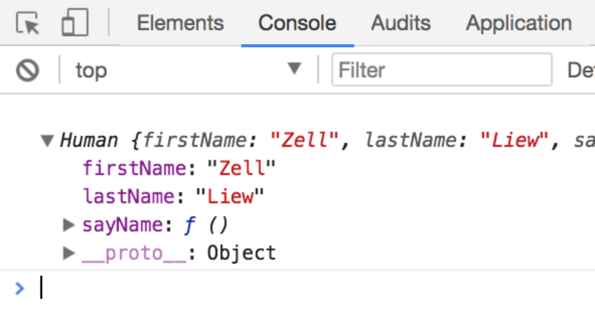

# Javascript Classes

Most Object Oriented Programming languages allow you to use classes as instance constructors. In Javascript, there is no notion of a class, so functions are used as constructors instead.

This changed when ES6 got introduced – now, there's a `class` keyword in Javascript.

## The class syntax

A `class` in Javascript looks like this:

```js
class ClassName {
  constructor() {
    // Code to initialize instances here
  }
}
```

Let's say you want to create a humans that have their own `firstName` and `lastName` variables. These humans also have the ability to say their own name.

In a previous lesson, you learned that you can do this with constructor functions:

```js
function Human (firstName, lastName) {
  this.firstName = firstName
  this.lastName = lastName

  this.sayName = function () {
    console.log(`I am ${this.firstName} ${this.lastName}`)
  }
}
```

You can do the same with classes as well. The code that goes into the constructor function now goes into the `constructor` method in the class:

```js
class Human {
  constructor (firstName, lastName) {
    this.firstName = firstName
    this.lastName = lastName

    this.sayName = function () {
      console.log(`I am ${this.firstName} ${this.lastName}`)
    }
  }
}
```

Then, you can create instances by writing the `new` keyword as usual.

```js
const zell = new Human('Zell', 'Liew')
console.log(zell)
```

<figure>
  
  <figcaption>Instances produced by classes and constructors are the same.</figcaption>
</figure>

## Classes vs constructors

Even though Javascript has a new `class` keyword, it doesn't have the notion of classes. Behind the scenes, Javascript converts the `class` you defined into plain ol' constructor functions.

So classes and constructors are the same thing. They're just written differently. This is why classes in ES6 are often called out to be **syntactic sugar** for a constructor.

But why would anyone create a syntactic sugar for constructors when constructors aren't complicated?

Well, we haven't explored everything about Object Oriented Programming yet. There is a second big part about Object Oriented Programming called **inheritance**. To find out why people want to create a syntactic sugar for constructors, you need to understand what inheritance is.

## Wrapping up

Classes don't exist in Javascript. They're are actually constructor functions written in a different way.

## Exercise

1. Create a class with `class`.
2. Create an instance of your class