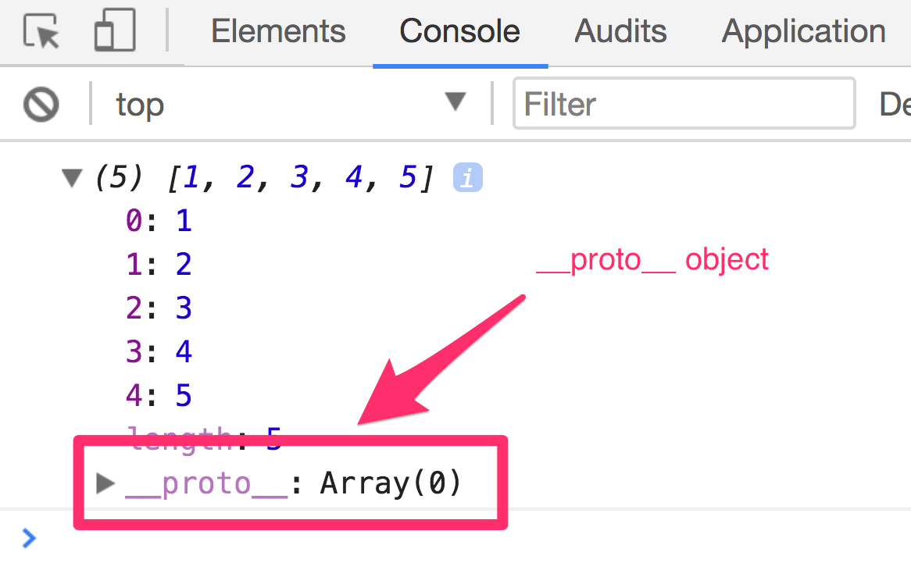
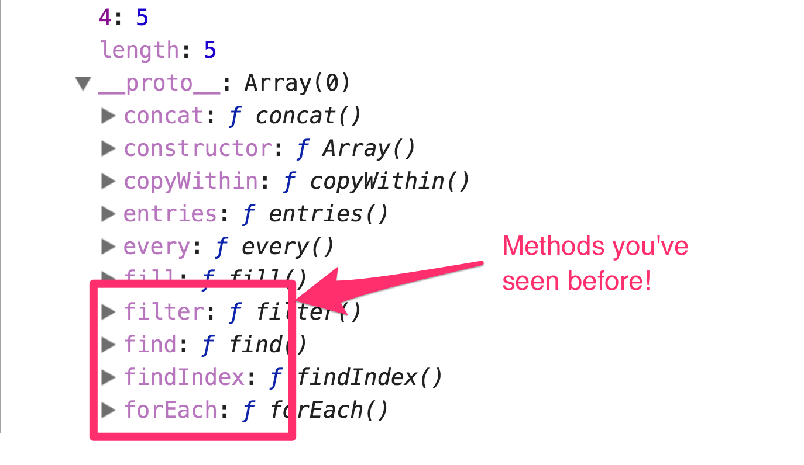
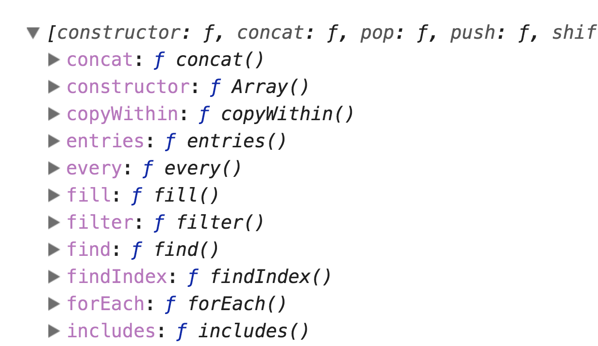
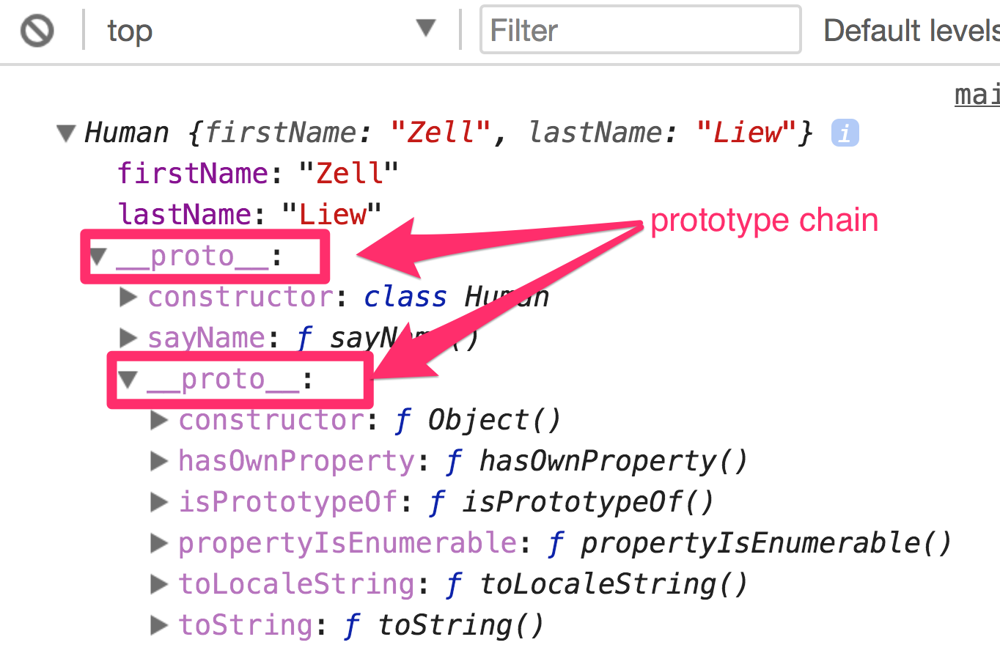
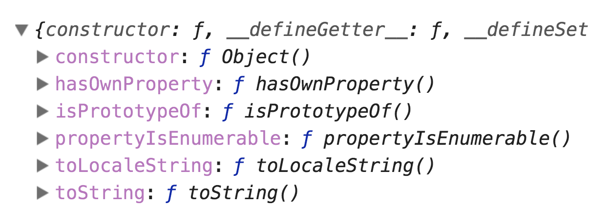
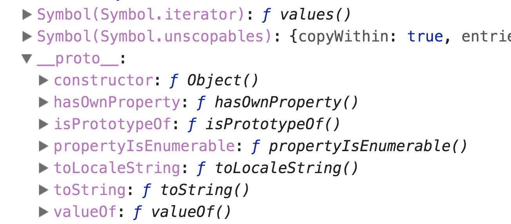
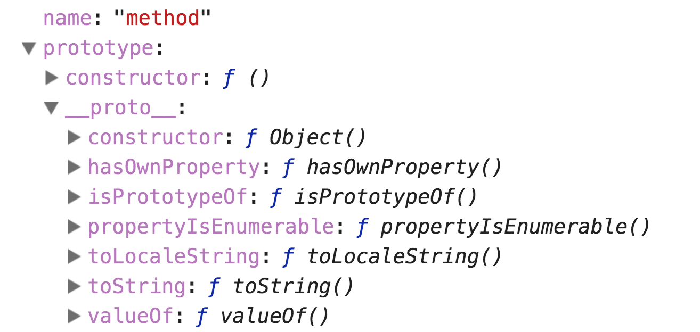

# Prototypes

You already know that objects can have properties and methods. These properties/methods must exist before you call them. Otherwise, you'll get an error.

```js
const cat = {
  name: 'Kitty',
  speak () { console.log('meow') }
}

console.log(cat.name) // kitty
cat.speak() // meow
cat.move() // TypeError: cat.move is not a function
```

Likewise, since arrays are objects, arrays can also have properties and methods. These properties must also exist before you call them, or you'll get an error.

```js
const numbers = [1, 2, 3, 4, 5]

console.log(numbers.concat) // Function
numbers.powerSmash() // TypeError: numbers.powerSmash is not a function
```

Weird, huh? 🤔

If you `console.log` an array, you'll see a `__proto__` object if you try to expand the chevron on the left hand side of the array.

<figure>
  
  <figcaption aria-hidden="true">The `__proto__` object exists on an array</figcaption>
</figure>

When you expand the the `__proto__` object, you'll see a list of familiar methods like `concat`, `filter`, and `forEach` amongst many other methods!

<figure>
  
  <figcaption aria-hidden="true">The expanded `__proto__` object has methods you've seen before!</figcaption>
</figure>

This `__proto__` object holds all the array methods you've been using so far. In Javascript, the `__proto__` object is also called the prototype.

## What are prototypes

The word "prototype" mean different things in English and in Javascript. **In Javascript, prototypes refer to the object that contain methods and properties that can be used by children objects.**

In Javascript, we're supposed to write prototypes as `[[Prototype]]`, so we'll use that syntax going forward.

If you `console.log` and Array's prototype, you'll see that it contains the same methods within an array's `__proto__` object.

```js
console.log(Array.prototype)
```

<figure>
  
  <figcaption aria-hidden="true">An array's prototype</figcaption>
</figure>

If you `console.log` any method in `Array.prototype`, you'll notice that they are functions.

```js
console.log(Array.prototype.concat) // Function
```

So why can you use the `concat` method in any array you create? To answer the question, you'll need to understand the **prototype chain**.

## The prototype chain

The prototype chain goes like this:

**If a method exists in the current object,** use the method in the current object.

**If the method doesn't exist in the current object,** Javascript looks within the current object's `__proto__` to see if the method exists. If it exists within `__proto__`, Javascript uses the method in `__proto__`.

**If the method doesn't exist in the current object's** `__proto__`, Javascript looks for another `__proto__` in current `__proto__`. It tries to find if the method exists in this next `__proto__`. If the method exists in the next `__proto__`, Javascript uses the method that was found in the next `__proto__`.

**If the method still doesn't exist**, Javascript goes on to search for the method in the next `__proto__`, and on, and on, until there are no more `__proto__` objects.

If no methods are found, Javascript eventually gives up and tells you that there's an error.

If you tried to find a property, Javascript does the same search up the prototype chain, but return `undefined` if the property cannot be found.

## Visualizing the prototype chain

Before you visualize multiple levels of the prototype chain, it helps to create a property that lives in this prototype chain.

If you use the `class` syntax, you can create such a method by writing it as a normal function after `constructor`.

```js
class Human {
  constructor (firstName, lastName) {
    this.firstName = firstName
    this.lastName = lastName
  }

  // This is a method that will live in a __proto__ object.
  sayName () {
    console.log(`I am ${this.firstName} ${this.lastName}`)
  }
}

const zell = new Human('Zell', 'Liew')
```

Now, you can `console.log(zell)`. When you do so, click the chevron on the left of every `__proto__` object you find and you'll see the `[[Prototype]]` chain in action.

<figure>
  
  <figcaption aria-hidden="true">The prototype chain exists!</figcaption>
</figure>

## Getting the `__proto__` property

To get the `__proto__` property of the current object, you can write `Object.getPrototypeOf(object)`.

```js
// Note: You can also write zell.__proto__, but that syntax is deprecated.
Object.getPrototypeOf(zell)
```

## Proof that arrays and functions are objects

The final property you'll encounter at the end of the `[[Prototype]]` chain is always `Object`'s `[[Prototype]]`. This proves that arrays and functions are actually derived from objects.

```js
console.log(Object.prototype)
```

<figure>
  
</figure>

If you open up an Array's `[[Prototype]]` chain, you'll see an Object's `[[Prototype]]` too:

<figure>
  
</figure>

If you open up a method's prototype chain, you'll also see see an Object's `[[Prototype]]` at the end.

(Note: The console doesn't show a chevron if you try to open a function, but since methods are functions, opening up a method is the same as opening up a function).

<figure>
  
</figure>

## Wrapping up

`[[Prototypes]]` in Javascript gives descendant objects the ability to look for properties and methods in ancestor objects.

You can look up a `[[Prototype]]` chain by opening up the `__proto__`.

The `[[Prototype]]` chain also proves that Arrays and Functions are derived from objects.

## Exercise

1. Create a new array. Look at what's in the `[[Prototype]]` chain.
2. Create a new object. Look at what's in the `[[Prototype]]` chain.
3. Create a method. Look at what's in the method's `[[Prototype]]` chain.
4. Create a method that lives in a `[[Prototype]]` with the `class` syntax. Look at what's in the instance's `[[Prototype]]` chain.