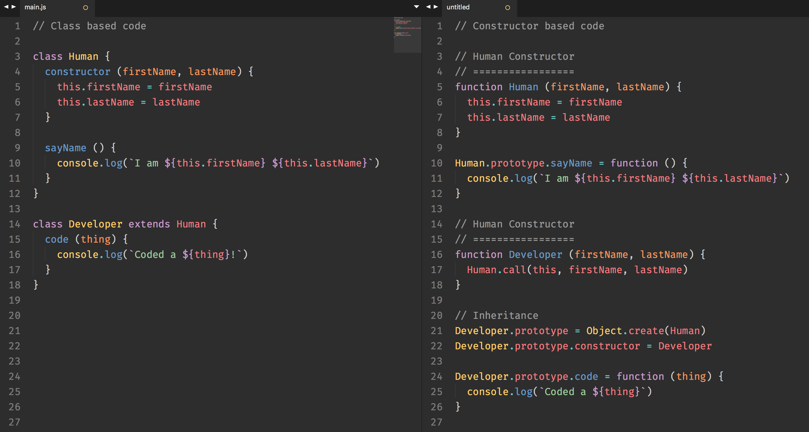
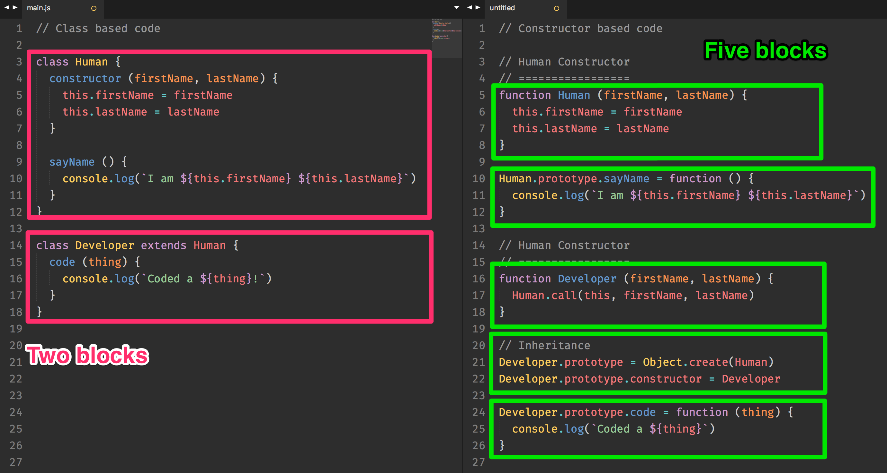

# Inheritance through Prototype

Did you notice that, when you created your `Human` and `Developer` constructors/classes previously, you didn't make use of the `[[Prototype]]` chain?

You may wonder. If what you're doing already works, why is there to use the `[[Prototype]]` chain?

## The candy factory

Let's say you manufacture candies. You're trying to decide what's the best way to make and sell your candies. You can either (1) make a giant candy factory near your house or (2) make multiple candy-making stands everywhere in the world.

**If you build a candy factory,** people can send you orders to make candies from anywhere in the world. When you get an order, you make your candy, and you send them via post to the customer.

**If you make candy stands around the world**, you need to buy 1,000 of the same machines you use at your candy factory. These machines are placed at your candy stands so you can make candies whenever an order comes in. The distribution lag time will be considerably shorter if you choose this option.

In Javascript, **when you inherit through properties, you are build a giant candy factory**—your constructor's `[[Prototype]]` is your factory. When you create methods in your constructor's `[[Prototype]]`, you allow each instance to pop in and use the method in the factory, no matter where they're used.

When you create methods, you create them once in the constructor's `[[Prototype]]`. Each instance you create from this point on is able to get the use constructor's method.

**If don't inherit through properties, you're making candy stands around the world.** Each instance is a candy stand contains that contains a machine—your method—that is an exact replica from the constructor. Here, you're copy-pasting on a code-level (without you knowing).

Now, if there is zero-lag time between orders and delivery, which model would you choose?

Obviously, you want to create a single candy factory, because it results in a smaller footprint.

Now, the question is how do you create this candy factory?

## Inheriting through prototype with Classes

To allow methods to live on prototypes in a class, you need to write methods as separate declarations to your `constructor` method.

Let's say you have a `Human` class that contains a `sayName` method.

```js
class Human {
  constructor (firstName, lastName) {
    this.firstName = firstName
    this.lastName = lastName
  }

  // This method will be created on Human.prototype
  sayName () {
    console.log(`I am ${this.firstName} ${this.lastName}`)
  }
}

const vincy = new Human('Vincy', 'Zhang')
```

When you `console.log` an instance created by the class, you'll see `sayName` lives in a prototype.

<figure>
  
  <figcaption aria-hidden="true">`sayName` exists on an instance's `__proto__`</figcaption>
</figure>

When you create a child class, you can use the `extends` keyword to inherit properties from the parent class.

```js
class Developer extends Human {
  constructor (firstName, lastName) {
    super(firstName, lastName)
  }

  // Methods and properties here
}
```

When you create a class with the `extends` keyword, a `constructor` method that calls `super` is automatically written, so there's no need to write the `constructor` method yourself.

```js
class Developer extends Human {
  // Methods and properties here
}
```

Once you've created a child class (`Developer` in this case), you can write methods and properties as separate declarations from your `constructor` method.

```js
class Developer extends Human {
  code (thing) {
    console.log(`Coded a ${thing}!`)
  }
}

const zell = new Developer('Zell', 'Liew')
```

When you `console.log` your child class's instance (`zell` in this case), you'll see that both `code` and `sayName` methods exist, but they exist in separate prototypes.

<figure>
  
  <figcaption aria-hidden="true">`sayName` and `code` exist, but on different prototypes</figcaption>
</figure>

That's how you create methods that inherit through prototypes with classes.

At this point, you'll probably have no idea how the methods get added to the prototype chain. To find out, you'll have to understand the constructor version.

## Inheriting through prototype with constructors

Similarly, let's say you want a `Human` constructor that contains a `sayName` method. To add a method that lives on a prototype, you need to add it to `Human.prototype`.

```js
function Human (firstName, lastName) {
  this.firstName = firstName
  this.lastName = lastName
}

// Adding a method into the prototype
Human.prototype.sayName = function () {
  console.log(`I am ${this.firstName} ${this.lastName}`)
}
```

When you create an instance, prototypes are automatically added to the instance, which is why instances can use the methods.

```js
const vincy = new Human('Vincy', 'Zhang')
vincy.sayName() // I am Vincy Zhang
```

If you `console.log` the instance, you'll see the prototype too.

<figure>
  
  <figcaption aria-hidden="true">`sayName` exists on an instance's `__proto__`</figcaption>
</figure>

The problem becomes slightly more complicated when you need a child constructor to inherit from a parent constructor's prototype.

Let's start by creating a child constructor, `Developer`, that inherits from a parent constructor, `Human`. The `Developer` should be able to code, so let's create the`code` method on `Developer`'s prototype while we're at it.

```js
function Developer (firstName, lastName) {
  Human.call(this, firstName, lastName)
}

Developer.prototype.code = function (thing) {
  console.log(`Coded a ${thing}!`)
}
```

If you create an instance `Developer` at this point, you'll notice that it has `firstName` and `lastName`, it can `code`, but it can't `sayName`.

```js
const zell = new Developer('Zell', 'Liew')
console.log(zell.firstName) // Zell
console.log(zell.lastName) // Liew
zell.code('website') // Coded a website!
zell.sayName() // TypeError: zell.sayName is not a function
```

If you `console.log` your instance, you'll notice that it contains doesn't have a `sayName` method in the prototype chain.

<figure>
  
  <figcaption aria-hidden="true">Nothing from `Human.prototype` exists in a `Developer`'s instance</figcaption>
</figure>

To get `sayName` to appear in `Developer`'s prototype chain, you need to link `Developer`'s prototype to `Human`'s prototype.

## Linking a child's prototype to a parent's prototype

You may think that all you need to do is assign the `Human.prototype` to the `Developer.prototype`, right?

Well, unfortunately, linking the `[[Prototype]]` is not a simple process. It confused the heck out of people, so **read this section slowly and carefully**.

First, you can't simply assign `Human.prototype` to `Developer.prototype`. If you do this, you're saying `Developer.prototype` is the same object as `Human.prototype`—which means that, when `Developer.prototype` mutates, `Human.prototype` changes automatically.

```js
// Don't do this
Developer.prototype = Human.prototype
Developer.prototype.code = function (thing) {
  console.log(`Coded a ${thing}!`)
}

const vincy = new Human('Vincy', 'Zhang')
vincy.code('website') // Coded a website! <-- this shouldn't happen!
```

A better way to link the `Developer.prototype` to the `Human.prototype` is to set `Developer.prototype` as an instance of `Human`, like this:

```js
// This is okay, but not ideal.
Developer.prototype = new Human()

// Add methods only after inheritance is completed!
Developer.prototype.code = function (thing) {
  console.log(`Coded a ${thing}!`)
}
```

If you create a new `Developer` at this point, you'll notice your developer will contain the `sayName` method.

```js
const zell = new Developer('Zell', 'Liew')
zell.sayName() // I am Zell Liew
```

If you `console.log` your instance, you'll see `sayName` method in the `[[Prototype]]` chain.

<figure>
  
  <figcaption aria-hidden="true">`sayName` is found in the `[[Prototype]]` chain.</figcaption>
</figure>

Unfortunately, you can also see undefined `firstName` and `lastName` properties that are created by `new Human()`.

<figure>
  
  <figcaption aria-hidden="true">`firstName` and `lastName` can be seen further up the `[[Prototype]]` chain, but they're undefined</figcaption>
</figure>

To remove properties that are added to the instance with `this`, like `firstname` and `lastName`, you need to, you need to use an intermediate constructor. This code is clunky, and looks like this:

```js
// Inheriting from an intermediate constructor
function Intermediary () {}
Intermediary.prototype = Human.prototype
Developer.prototype = new Intermediary()
```

This process is so important for inheriting prototypes that Javascript added a new `Object.create` method that does the same thing.

```js
// Here's what Object create does
Object.create = function(o) {
  function F () {}
  F.prototype = o;
  return new F();
}
```

So, the right way to link `[[Prototypes]]` is through `Object.create`:

```js
// Right way to link prototypes
Developer.prototype = Object.create(Human.prototype)
```

If `console.log` your instance after switching to `Object.create`, you'll see that there's no more undefined `firstName` and `lastName` variables.

<figure>
  
  <figcaption aria-hidden="true">No undefined properties are found on the `[[Prototype]]` chain now</figcaption>
</figure>

There's a final step to the inheritance process – you still need to add a `constructor` property to your `Developer.prototype`, because it was overwritten when you used `Object.create`.

```js
Developer.prototype.constructor = Developer
```

## The right way to inherit through constructors

If the previous section was hard to understand, you're not alone. You'll probably need to go through the process a few times yourself to internalize the inheritance process.

To sum it off, you link the child constructor's `[[Prototype]]` to parent constructor's `[[Prototype]]` with two lines of code:

```js
// Correct way to inherit
Developer.prototype = Object.create(Human)
Developer.prototype.constructor = Developer
```

So here's the code you need to create both `Human` and `Developer` constructors.

```js
// Human Constructor
// =================
function Human (firstName, lastName) {
  this.firstName = firstName
  this.lastName = lastName
}

Human.prototype.sayName = function () {
  console.log(`I am ${this.firstName} ${this.lastName}`)
}

// Human Constructor
// =================
function Developer (firstName, lastName) {
  Human.call(this, firstName, lastName)
}

// Inheritance
Developer.prototype = Object.create(Human)
Developer.prototype.constructor = Developer

Developer.prototype.code = function (thing) {
  console.log(`Coded a ${thing}`)
}
```

## Classes or constructors?

When you compare the code from a class and the code from a constructor side by side, I have no doubt that you'll prefer the code from a class.

<figure>
  
  <figcaption>You'll probably prefer class-based code if you compare the two code side-by-side</figcaption>
</figure>

The benefits are obvious.

**First, class allows you to write shorter code.** Terser code is always welcome. The shorter your code, the less surface area for bugs to hide.

**Second, classes create nice and readable sections.** If you look at the code from a class, you'll see two major sections, each belonging to a class. The indentation makes it obvious.

On the flip-side, if you look at the code from a constructor, you can't see where the constructor begins or end unless you throw in a comment.

<figure>
  
  <figcaption>It's much easier to understand class-based code from a glance without adding comments. The section breaks from naturally indented code is much more intuitive.</figcaption>
</figure>

**But people say classes are bad!**

If you read online, you'll come across multiple articles, from numerous voices, both popular and unpopular that say that classes are bad.

They most people say classes are bad because classes hide away `[[Prototype]]`, which is how inheritance really takes place in Javascript.

If you want to use classes, make sure you understand what goes underneath the hood (which you already do!).

If you ask for my decision, it's going to be controversial:

**Don't use classes; don't use constructors either**. There's a better way—use objects and `Object.create` instead. You'll learn more about this new way in the next lesson.

## Wrapping up

It's better to inherit from a constructor's `[[Prototype]]` because it reduces your overall code footprint.

It's much easier to write classes than constructor functions, but classes don't let you see what's going on behind the hood, which is quite important if you want to use Javascript at a master level.

There's a third (and possibly, easier) way to write Object Oriented Programming in Javascript—you can use objects and `Object.create`.

## Exercise

1. Learn to write class-based inheritance.
    1. Create a class with `class`.
    2. Create a method that allows you to inherit through prototypes
    3. Create a child class with `extends`.
    4. Create an instance of the child class.
    5. Console.log your instance. Notice the prototype chain
2. Do the same steps with a constructor-based approach.