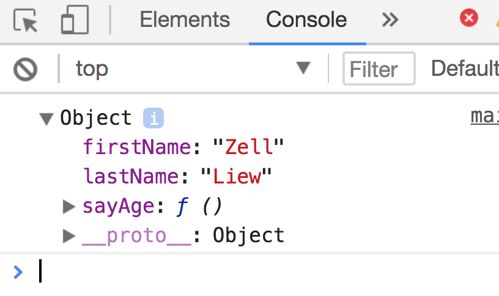

# Private variables

As you read about Object Oriented Programming, you'll come across another concept—private variables.

What are private variables? Why do we need private variables? How do we use them? You'll get these answers in this lesson.

Let's start by understanding what public properties are.

## Public properties

Let's say you have a `Human` object that has `firstName`, `lastName` properties.

```js
const Human = {
  init (firstName, lastName) {
    this.firstName = firstName
    this.lastName = lastName
  }
}
```

When you create an instance of `Human`, you can get the instance's `firstName` and `lastName` properties through `instance.firstName` and `instance.lastName`.

```js
const zell = Object.create('Human')
zell.init('Zell', 'Liew')

console.log(zell.firstName) // Zell Liew
```

These properties can be accessed from anywhere, as long as the instance is within scope. Because they can be accessed from anywhere, these properties are known as **public properties**.

```js
const zell = Object.create('Human')
zell.init('Zell', 'Liew')

function sayZellName () {
  console.log(zell.firstName)
}

sayZellName() // Zell
```

## Private variables

Private variables are the opposite of public properties—they cannot be accessed anywhere outside the instance. In the example below, `age` is a private variable. You cannot access it anywhere else outside the `init` function.

```js
const Human = {
  init (firstName, lastName, age) {
    this.firstName = firstName
    this.lastName = lastName

    console.log('age is', age)
  }
}
```

```js
const zell = Object.create(Human)

zell.init('Zell', 'Liew', 30) // age is 30
zell.age // undefined
```

Note: private variables should only be created in the `init` function. If you use the constructor or class format, private variables should be created in the `constructor` function.

```js
// Class format
class Human {
  constructor (firstName, lastName, age) {
    this.firstName = firstName
    this.lastName = lastName

    // Age is private
    console.log('age is', age)
  }
}
```

```js
// Constructor format
function Human (firstName, lastName, age) {
  this.firstName = firstName
  this.lastName = lastName

  // Age is private
  console.log('age is', age)
}
```

To use private variables, you need privileged methods.

## Privileged methods

Privileged methods are methods that have access to private variables. In JavaScript, they're created through closures.

```js
const Human = {
  init (firstName, lastName, age) {
    // Public properties
    this.firstName = firstName
    this.lastName = lastName

    // 'age' is a private property
    console.log('age is', age)

    // Privileged method
    this.sayAge = function () {
      console.log(`${firstName} is ${age} years old`)
    }
  }
}
```

```js
const zell = Object.create(Human)
zell.init('Zell', 'Liew', 30)

zell.age // undefined
zell.sayAge() // Zell is 30 years old
```

## The downsides of private variables and privileged methods

If you `console.log` an instance with a privileged method, you'll see the privileged method lives on the object itself, not on the prototype chain.

<figure>
  
  <figcaption>`sayAge` is a method that lives on the object, not the prototype chain.</figcaption>
</figure>

That means privileged methods cannot be inherited through the prototype chain. They must always be copy-pasted whenever you create a new instance.

## Why use private variables?

private variables lets you to **hide information** from developers. This process of hiding information is sometimes known as **encapsulation**.

Note: Encapsulation is a horrible term. It means a combination of three different things in programming:

1. Information hiding with private variables
2. Ensuring each instance has their own individuality
3. Creating functions for different functionality

Developers often misuse encapsulation as one of these three things, which makes "encapsulation" incredibly hard to understand. I suggest you stay far away from this term if you ever try to explain programming to another human being.

Back to private variables and information hiding. (/rant 😂).

There are two benefits to information hiding:

1. Information hiding helps protect data integrity
2. Information hiding helps prevents users from using properties and methods they're not supposed to use

### Protecting data integrity

Private variables lets you protect variables that should not be altered. For instance, let's say you want to create an `Human` that's 30 years old. In this case, `age` should never be altered.

If you write your code with public properties, `age` can be mutated easily. Another developer come also change `age` into a random string that doesn't mean anything.

```js
const Human = {
  init (firstName, lastName, age) {
    // Public properties
    this.firstName = firstName
    this.lastName = lastName
    this.age = age
  }
}

const zell = Object.create(Human)
zell.init('Zell', 'Liew', 30)
```

```js
// Mutating the age property
zell.age = 'Singapore is a pretty awesome place!'
```

If you write code with private variables and methods, can prevent important data from getting corrupted through privileged methods.

```js
const Human = {
  init (firstName, lastName, age) {
    // ...
    this.setAge = function (newAge) {
      if (typeof newAge === 'number') {
        age = newAge
      } else {
        throw Error('Age must be a number')
      }
    }
  }
}

const zell = Object.create(Human)
zell.init('Zell', 'Liew', 30)
```

```js
zell.setAge('Singapore is pretty awesome!') // Error: Age must be a number
```

### Preventing users from using properties and methods

Private variables lets you prevent users from using properties and methods you don't intend for them to use.

For example, let's say you have a `Human` object that has the ability to `sayName`. `sayName` calls another function, `getFullName`, to get the name of the person. This is what your code would look like if you used public methods.

```js
const Human = {
  init (firstName, lastName) {
    this.firstName = firstName
    this.lastName = lastName
  },
  getFullName () {
    return `${this.firstName} ${this.lastName}`
  },
  sayName () {
    console.log(`Hello, my name is ${this.getFullName()}`)
  }
}
```

Later, you decided to refactor `Human` so it doesn't use `getFullName` anymore:

```js
const Human = {
  init (firstName, lastName) {
    this.firstName = firstName
    this.lastName = lastName
  },
  sayName () {
    console.log(`Hello, my name is ${this.firstName} ${this.lastName}`)
  }
}
```

If another developer used `getFullName` in their code within this time period, your change would break their code.

If you create `getFullName` as a private variable, you can refactor `getFullName` however you want, since nobody has access to it.

## Private by convention

In JavaScript, the only way to create private variables is through closures (as you saw above). However, in practice, many developers opt to create privates variables by prefixing an `_` to the variable's name.

This method of creating private variables is called **private by convention** (or faux-private variables, or pseudo-private variables).

```js
const Human = {
  init (firstName, lastName, age) {
    // Public properties
    this.firstName = firstName
    this.lastName = lastName

    // Private (by convention)
    this._age = age
  },

  // Privileged method (by convention)
  sayAge = function () {
    console.log(`${this.firstName} is ${this._age} years old`)
  }
}
```

I recommend against faux-private variables because developers still have access to your "private" variables. If you need private variables, always go for closures.

```js
const zell = Object.create(Human)
zell.init('Zell', 'Liew', 30)

console.log(zell._age) // 30
```

If you wish to, you can always add the `_` prefix for real private variables in your closures.

## Wrapping up

Private variables are variables that cannot be accessed outside the instance. They're useful for protecting data integrity and preventing users from using properties and methods they shouldn't be using.

When you create private variables, make sure they're created in the `init` or `constructor` function. To access private variables, you need privileged methods.

## Exercise

1. Create a private variable with the `Object.create` syntax.
2. Create a privileged method with the `Object.create` syntax
3. Do the same with a `Class` syntax
4. Do the same with a `Constructor` syntax