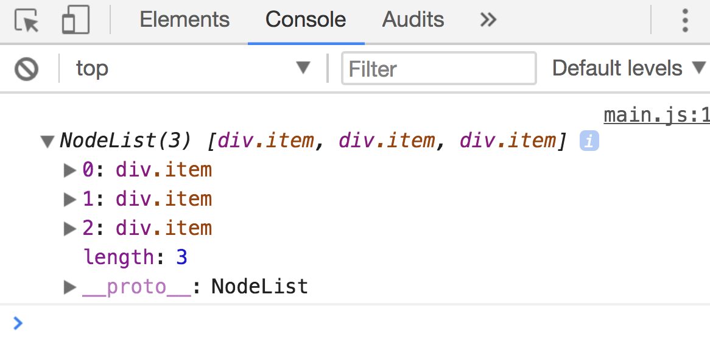

# Call, bind and apply

`call`, `bind` and `apply` are functions you'll find in advanced JavaScript programs. You need to know how they work to become proficient in JavaScript.

## Call

`call` is a function that lets you call/invoke/activate another function. When you use `call` to call a function, you can change the `this` context.

It's much easier to explain `call` through an example, so let's do that. Say you have a function called `sayName`. It takes in two arguments.

```js
function sayName (firstName, lastName) {
  console.log(`${firstName} ${lastName}`)
}
```

You can call the function normally by adding parenthesis to the end of the function:

```js
sayName('Zell', 'Liew') // Zell Liew
```

You can also call the function through `call`. If you do so, the first parameter passed into the function call replaces the `this` context. Other values passed into the functions behave as normal arguments.

```js
sayName.call(null, 'Zell', 'Liew') // Zell Liew
```

If you `console.log` the `this` context within `sayName`, can see it change according to the first value passed to `call`.

```js
function sayThis () {
  console.log(this)
}

sayThis() // Window
sayThis.call({}) // {}
```

### Call is used to borrow methods

`call` is used to borrow methods from another function (or method). It's easier to explain this with an example too.

Let's say you have an array of numbers. You want to use `slice` to copy the numbers into a new array. One way to use `slice` is to call the `slice` method through the `numbers` array.

```js
const numbers = [1, 2, 3]
const newArray = numbers.slice()

console.log(newArray) // [1, 2, 3]
```

Another way is through `call`. If you use `call`, you need to pass the numbers array is the `this` context.

```js
const numbers = [1, 2, 3]
const newArray = Array.prototype.slice.call(numbers)

console.log(newArray) // [1, 2, 3]
```

### How `Array.prototype.slice.call` works

`slice` is a method in `Array.prototype`. You can verify its existence by logging `Array.prototype`.

<figure>
  
  <figcaption></figcaption>
</figure>

When you write `Array.prototype.slice.call`, you call the `slice` method. `slice` needs a value in the `this` context; you'll get an error if you don't provide one.

```js
const newArray = Array.prototype.slice.call() // Error
```

When you call `numbers.slice`, JavaScript sets the `this` context to `numbers` because you called a method that belongs to `numbers`. (Read [this](./04.this.md) lesson if you're unsure why this happens).

Since `this === numbers`, you can pass `numbers` as the first argument to `Array.prototype.slice.call`, and that's why `Array.prototype.slice.call(numbers)` work.

### Why would anyone use `Array.prototype.slice.call` over `array.slice` when its so complicated?

People use `call` with array methods because most array methods (like `slice`, `forEach`, `filter`, and `map`) work with both arrays and array-like object.

An array-like object is an object that looks like an array. It needs to fulfill two criteria—it uses numbers as keys and has a `length` property.

One example of an array-like object is a NodeList—the value you get from `querySelectorAll`.

```html
<div class="item">Item 1</div>
<div class="item">Item 2</div>
<div class="item">Item 3</div>
```

```js
const items = document.querySelectorAll('.item')
console.log(items)
```

<figure>
  
  <figcaption>A NodeList is an array-like object</figcaption>
</figure>

Let's say you want to loop through a NodeList.

One way to do so is convert the NodeList into an array, then loop through it with `forEach`.

```js
Array.from(items).forEach(item => console.log(item))
```

Another method is to use `Array.prototype.forEach.call`. When you use the `call` method, you don't need to convert the NodeList into an array because a NodeList is already an array-like object. There's one less step in the process.

```js
Array.prototype.slice.call(items, item => console.log(item))
```

## Apply

`call` and `apply` are similar. When you use call `call`, you pass values as comma separated arguments. When you use `apply`, you pass in an array as the second argument.

```js
function sayName (firstName, lastName) {
  console.log(`${firstName} ${lastName}`)
}
```

```js
sayName.call(null, 'Zell', 'Liew') // Zell Liew
sayName.apply(null, ['Zell', 'Liew']) // Zell Liew
```

With ES6, there's no longer a need for `apply` because you can spread arrays with the spread operator.

```js
sayName.call(null, ...['Zell', 'Liew']) // Zell Liew
```

## Bind

`bind` lets you change the `this` context as well. However, instead of invoking the function immediately, `bind` returns a function with the parameters you provided.

```js
function sayThis () {
  console.log(this)
}

const emptyObjectThis = sayThis.bind({})
emptyObjectThis() // {}
```

Bind can be used to pass in arguments prematurely too. This process is called **partial application**.

```js
function sayName (firstName, lastName) {
  console.log(`${firstName} ${lastName}`)
}

const sayZellName = sayName.bind(null, 'Zell', 'Liew')
sayZellName() // Zell Liew
```

## Should you use call, bind or apply?

Although many JavaScript experts like to use `call`, `bind` and `apply`, I discourage you from using it because code written with `call`, `bind` and `apply` are much harder to understand compared to the versions written without these functions.

Try to avoid `call`, `bind`, `apply` unless you really need them.

## Wrapping up

`call`, `bind` and `apply` are functions that lets you change the `this` context in JavaScript. In addition to changing the `this` context, all three functions let you borrow methods from other functions.

The difference between `call` and `bind` is `call` invokes the called function immediately while `bind` returns the function with parameters you given, allowing you to call the new function at a later time.
