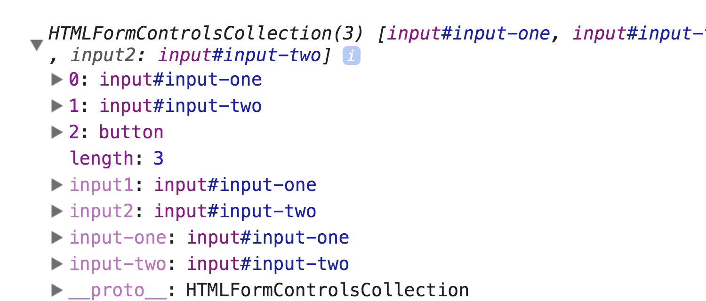

# Selecting form fields with JavaScript

There are two ways to select form fields with JavaScript. The first way is through `querySelector`. (You already know how to do this.)

The second way is through `form.elements`. This way is preferred because you don't need to select your form items manually through `querySelector`.

## Form.elements

All `<form>` elements have the `elements` property. It returns an object than contain three types of property-value pairs:

1. The `name` of each form field and it's associated Element.
2. The `id` of each from field and it's associated Element.
3. An index of each form field and it's associated Element.

```html
<form action="" method="post">
  <input type="text" name="input1" id="idForInput1">
  <input type="text" name="input2" id="idForInput2">
  <button type="submit"></button>
</form>
```

```js
const form = document.querySelector('form')

console.log(form.elements)
```

<figure>
  
  <figcaption aria-hidden>`form.elements` give you access to all form fields</figcaption>
</figure>

## Selecting a field

To select a field, you can use `form.elements`, followed by the `name` of the field, the `id` of the field, or the index of the field.

You'll only need one of these. Most of the time, I'll use the `name`.

To select `input1` from the above scenario, you can use `form.elements.input1`.

```js
const input1 = form.elements.input1

console.log(input1) // <input type="text" name="input1" id="idForInput1">
```


