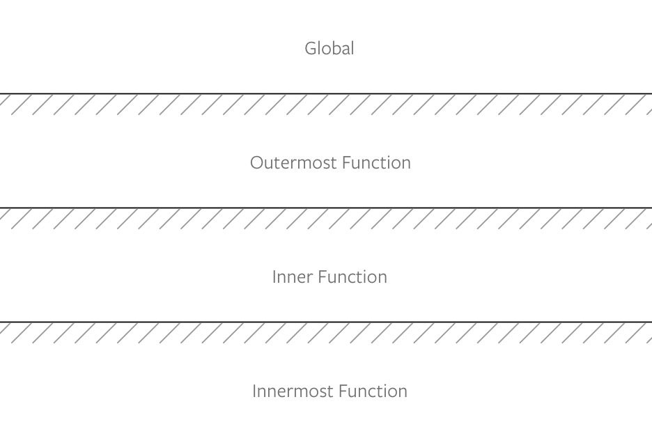

# Understanding JavaScript scopes

In JavaScript, a scope is the name given to the environment that encompasses variables. If a variable is within the scope, you can access the variable. If the variable is not in the scope, you cannot access the variable.

There are four kinds of scopes:

1. Global scope
2. Function scope
3. Block scope
4. Lexical scope

(There's actually a fifth kind of scope—closure scope, but we'll cover closures in a much later lesson).

## Global scope

If you declare a variable outside all functions and curly braces (`{}`), you create a variable in the global scope.

```js
const globalVariable = 'some value'
```

Global variables can be used everywhere—even in functions.

```js
const hello = 'Hello world!'

function sayHello () {
  console.log(hello)
}

console.log(hello) // 'Hello world!'
sayHello() // 'Hello world!'
```

Sometimes you'll hear the term local scope. It means variables that are not in a global scope. It can mean function scope, block scope, or even lexical scope.

## Function scope

When a variable is declared inside a function, the variable is said to be function-scoped.

```js
function someFunction () {
  const functionVariable = 'some value'
}
```

You cannot access the variable outside the function, but you can use it anywhere inside the function.

```js
function someFunction () {
  const functionVariable = 'some value'
  console.log(functionVariable)
}

someFunction() // some value
console.log(functionVariable) // ReferenceError: functionVariable is not defined
```

## Block scope

If you create a variable within a block, the variable is said to be block-scoped. A block is a set of code contained within curly brackets. Here are some examples of blocks:

1. A `for` loop
2. An `if` statement
3. A pair of curly brackets

```js
// For loop
for (let item of items) {
  // item is block-scoped
}

// if statement
if (time === '12pm') {
  const chimeCount = 12 // chimeCount is block-scoped
}

// A block
{
  const name = 'Zell' // name is block-scoped
}
```

Note: this only applies to variables created with `const` and `let`. It doesn't apply to variables created with `var`.

### var is function-scoped

Variables created with `var` is always function-scoped (or global-scoped, if it's not contained within a function). In the example below, you can see that `hello` ignores the block scope.

```js
{
  var hello = 'Hello world!'
  console.log(hello) // 'Hello world!'
}

console.log(hello) // 'Hello world!'
```

This is why you should not create variables with `var` anymore. Always use `const` or `let`.

## Lexical scope

When a variable is created, it can be used in the code that follows after its creation. It cannot be used before the variable is created.

This behavior is called lexical scope.

```js
console.log(blah) // ReferenceError: can't access lexical declaration `blah' before initialization
const blah = 'haha'
```

## Nested scopes

You can have functions in functions (and blocks in functions, or even functions in blocks). When you do this, you have nested scopes.

```js
// Global scope
const outerFunction = _ => {
  // Function scope
  const innerFunction = _ => {
    // Another function scope
  }
}
```

Variables created in the global scope can be used in both `outerFunction` and `innerFunction`.

Variables created in `outerFunction` can be used in `innerFunction`, but not in the global scope.

Variables created in `innerFunction` can only be used in inner function.

It can be easier to visualize scopes with a one-way glass—you can see the outside, but people from the outside cannot see you.

<figure>
  
  <figcaption>Scopes in functions behave like a one-way-glass. You can see the outside, but people outside can't see you</figcaption>
</figure>

If you have scopes within scopes, visualize multiple layers of one-way glass.

<figure>
  
  <figcaption>Multiple layers of functions mean multiple layers of one-way glass</figcaption>
</figure>

## Scopes are not transferable

Each function has their own scope. These scopes are not transferable to other functions. In the example below, `two` does not have access to `varOne`, even though `two` called `one`.

```js
function one () {
  const varOne = `I'm part of one`
}

function two () {
  one()
  console.log(varOne) // Error, varOne is not defined
}
```

## Same-name variables in different scopes

Variables with the same name can be used in different scopes. When this happens, the variable closest to the current scope will be used. The other variable with the same name is ignored.

```js
const name = 'Zell'
const sayName = name => console.log(name)

sayName('Vincy') // Vincy
```

## Avoid global variables

**Variables declared in the global scope are called global variables.**

You want to avoid global variables; each global variable you use increases the chance of a variable-name collision (where two or more variables have the same name)—which leads to errors and hard-to-catch bugs.