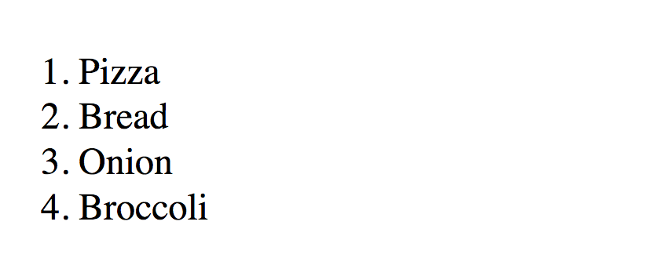

# Changing Text and HTML

You can change the text or HTML of any element you've selected. To do so, you use two methods:

1. `innerHTML`
2. `textContent`

## textContent

`textContent` lets you change the text of an Element.

```js
const element = document.querySelector('div')
element.textContent = 'Hello world!'
```

The DOM updates automatically when you change `textContent`.

## innerHTML

`innerHTML` lets you change the HTML inside an element.

```js
const element = document.querySelector('div')
element.innerHTML = '<p class="red">The quick brown fox ...</p>'
```

You can create complicated HTML that spans multiple lines with the help of template literals.

```js
const element = document.querySelector('div')
element.innerHTML =
  `<ol>
    <li>Pizza</li>
    <li>Bread</li>
    <li>Onion</li>
    <li>Broccoli</li>
  </ol>`
```

<figure>
  
  <figcaption>You can change `innerHTML` and the DOM will update.</figcaption>
</figure>

## textContent vs innerHTML

If you want to change text, always use `textContent` because `textContent` is faster than `innerHTML`.

If you want to change the HTML inside an element, use `innerHTML`.

## Exercise

Try the following:

1. Change an element's text with `textContent`
2. Change an element's inner HTML with `innerHTML`