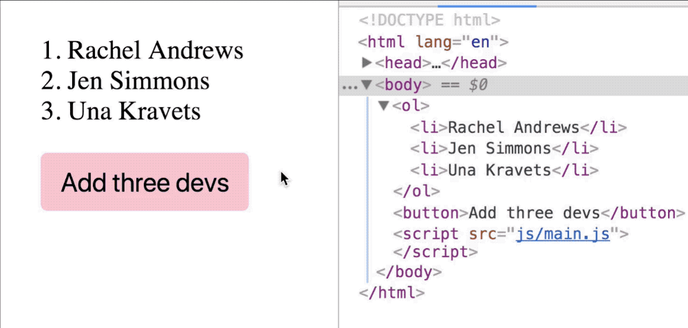

# Adding multiple elements to the DOM

You want want to use `appendChild` or `insertBefore` as little as possible because it's an expensive process to add elements to the DOM—everything after the element you added needs to be repainted by the browser.

```js
const devs = ['Addy Osmani', 'Vitaly Friedman', 'Chris Coyier']

// Don't do this! It causes the DOM to update three times
const ol = document.querySelector('ol')
devs.forEach(dev => {
  const li = document.createElement('li')
  li.innerHTML = dev
  ol.appendChild(li)
})
```

There are two better ways to add multiple elements to the DOM.

1. Replacing innerHTML
2. Appending a document fragment

## Replacing innerHTML

You can change multiple elements at once by changing the element's `innerHTML`.

For example, let's say you want to add three developers to an empty list.

```html
<ol></ol>
```

You can change `<ol>`'s innerHTML directly.

```js
const ol = document.querySelector('ol')
ol.innerHTML = `
  <li>Addy Osmani</li>
  <li>Vitaly Friedman</li>
  <li>Chris Coyier</li>
`
```

And you'll get this:

```html
<ol>
  <li>Addy Osmani</li>
  <li>Vitaly Friedman</li>
  <li>Chris Coyier</li>
</ol>
```

### Manipulating arrays into a HTML string

In reality, you'll probably have an array that contains devs you wanted to add to the DOM.

```js
const devs = [
  'Addy Osmani',
  'Vitaly Friedman',
  'Chris Coyier'
]
```

To create the HTML string, you can use `map` and `join`. Let's talk about `join` since you haven't learned it yet.

`join` combines every item in an array into a string. If you call `join` without any arguments, your items will be joined by a comma.

```js
const string = devs.join()
console.log(string) // AddyOsmani,Vitaly Friedman,Chris Coyier
```

If you want to join items without a separator, you can use an empty string.

```js
const string = devs.join('')
console.log(string) // Addy OsmaniVitaly FriedmanChris Coyier
```

To produce the HTML string, you want to use `map` to modify each array item into a list. Then, use `join` to convert the array into a string.

```js
const string =
  devs.map(dev => `<li>${dev}</li>`)
  .join('')

console.log(string)
// <li>Addy Osmani</li><li>Vitaly Friedman</li><li>Chris Coyier</li>
```

Once you have the final HTML String, you can change the innerHTML.

```js
ol.innerHTML = string
```

### What if you have existing items in the list?

Let's say you have three developers in your list and you want to add three more developers to it.

```html
<ol>
  <li>Rachel Andrews</li>
  <li>Jen Simmons</li>
  <li>Una Kravets</li>
</ol>
```

```js
// Devs to add to <ol>
const devs = [
  'Addy Osmani',
  'Vitaly Friedman',
  'Chris Coyier'
]
```

You can add the string to the original `ol.innerHTML`.

```js
const string = devs.map(dev => `<li>${dev}</li>`)
  .join('')
ol.innerHTML = ol.innerHTML + string
```

The downside of this approach? You replace the entire list. The GIF below proves that the first three items are also replaced even though they're not changed.

<figure>
  
  <figcaption>The `<ol>` and all `<li>` elements flashed when the button was clicked, indicating that there was a change</figcaption >
</figure>

A better approach to add multiple items is through a document fragment.

## Using a document fragment

A document fragment is like a separate DOM that lives only in JavaScript. It functions exactly like the DOM.

To create a document fragment, you use `createDocumentFragment`.

```js
const fragment = document.createDocumentFragment()
```

Document fragments can be treated like the DOM. That means you can add elements to the fragment with `appendChild` and `insertBefore`. Any changes you make to the fragment will not be reflected in the DOM (and hence not expensive) until you add the fragment into the DOM.

```js
// DOM doesn't change with this code
devs.forEach(dev => {
  const li = document.createElement('li')
  li.innerHTML = dev
  fragment.appendChild(li)
})
```

You can add the fragment to the DOM with `appendChild` or `insertBefore` when you're ready.

```js
ol.appendChild(fragment)
```

In this case, you can see from the GIF that the first three elements remain. You only added three more items into the list.

<figure>
  
  <figcaption>The last three `<li>` elements flashed which means only the last three elements changed; the rest didn't.</figcaption>
</figure>

## Exercise

Say you have the following HTML:

```html
<div class="characters">
  <ul class="elves">
    <li>Legolas</li>
    <li>Arwen Evenstar</li>
  </ul>
</div>
```

Do these with both methods you learned:

1. Add a list of humans to `.characters`. This list should have a `humans` class and contains five list items—Gandalf, Saruman, Aragon, Boromir, and Faramir.
2. Add two list items—Glorifendel and Elrond—before Arwen Evenstart. Use the document fragment method.

