# Building popovers

You'll learn to build popovers in this lesson. Here's what they look like:

<figure>
  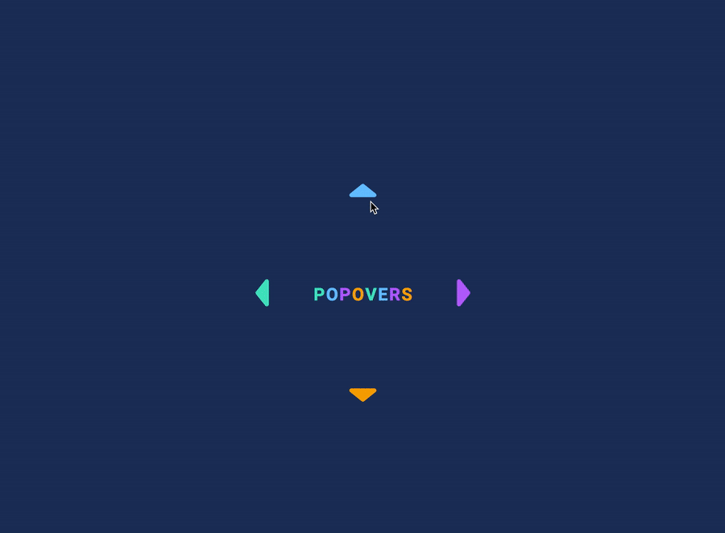
  <figcaption aria-hidden>Completed popover</figcaption>
</figure>

Before continuing, make sure you grab the starter files from the Github repo, in `components/07.popover/01.starter`.

## How popovers work

Popovers are components that contain extra information. They pop up when a user clicks on the element (usually a button or an icon) that triggers it.

Most popovers appear in four directions:

1. Top
2. Right
3. Bottom
4. Left

## Building the triggers

To build the popover, we need to build the triggers first. For this component, we'll use arrows as triggers. The starter file contains these triggers already.

<figure>
  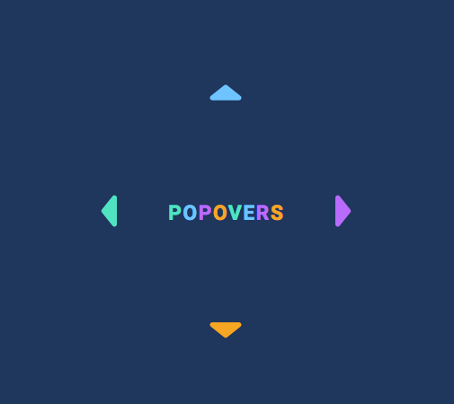
  <figcaption aria-hidden>The four arrows trigger a popover in their respective directions</figcaption>
</figure>

Each of our triggers is a `<button>` element that contains an arrow SVG.

```html
<button class="trigger">
  <svg viewBox="0 0 40 20">
    <use xlink:href="#arrow"></use>
  </svg>
</button>
```

Triggers should let popovers know where they should appear. In this case, I opted to use a `data-placement` custom attribute to determine the location. I also styled the arrow directions with this `data-placement` attribute.

```html
<button class="trigger" data-placement="top"> ... </button>
<button class="trigger" data-placement="right"> ... </button>
<button class="trigger" data-placement="bottom"> ... </button>
<button class="trigger" data-placement="left"> ... </button>
```

Next, we'll build the popovers.

## Building the top popover

Popovers should appear above all other elements. This means popovers must be a direct descendant of the `<body>` element. If popovers are placed inside another element, they may get cut off when an ancestor element uses `transform` or `overflow`.

```html
<body>
  <!-- other elements -->
  <div class="popover">
    <p>The quick brown fox jumps over the lazy dog</p>
  </div>
</body>
```

The popover needs to know which direction it should appear. Here, we can use the `data-placement` custom attribute as before.

```html
<div class="popover" data-placement="top">
  <p>The quick brown fox jumps over the lazy dog</p>
</div>
```

The top popover should appear above the top trigger as shown in the picture below.

<figure>
  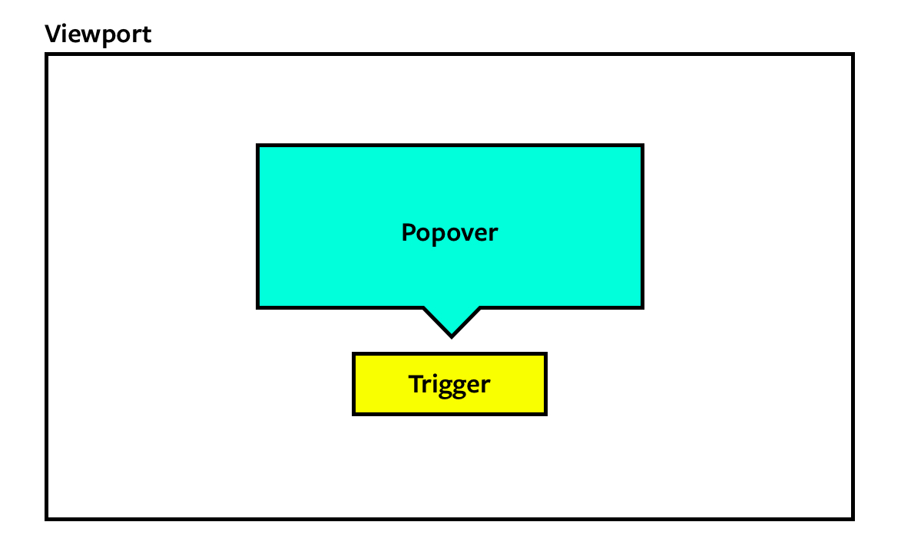
  <figcaption>Top popover should appear above trigger</figcaption>
</figure>

We can only achieve such a precise positioning by setting `position` to `absolute`. Since `position` is `absolute`, we need to provide the correct `top` and `left` values.

```css
.popover {
  position: absolute;
  /* Example values */
  top: 300px;
  left: 500px;
}
```

This means we need to use JavaScript to calculate the `top` and `left` values.

On the horizontal axis, we want the center of the popover to align with the center of the trigger.

We need to know where the center of the popover is. We can get the center of the popover through the trigger's left and right values from `getBoundingClientRect`.

<figure>
  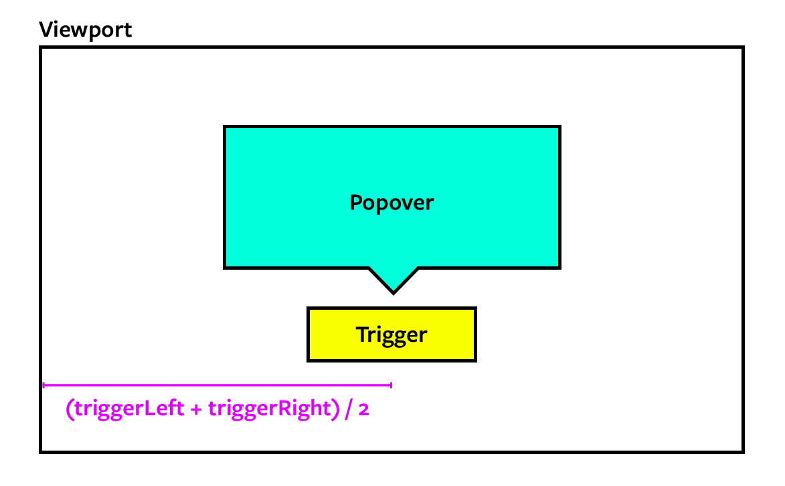
</figure>

```js
const trigger = document.querySelector('.trigger[data-placement=top]')
const triggerRect = trigger.getBoundingClientRect()

const center = (triggerRect.left + triggerRect.right) / 2
```

We can calculate the popover's `left` value once we know the center value. To do so, we need to know the popover's width. We can get the popover's width through `getBoundingClientRect` as well.

<figure>
  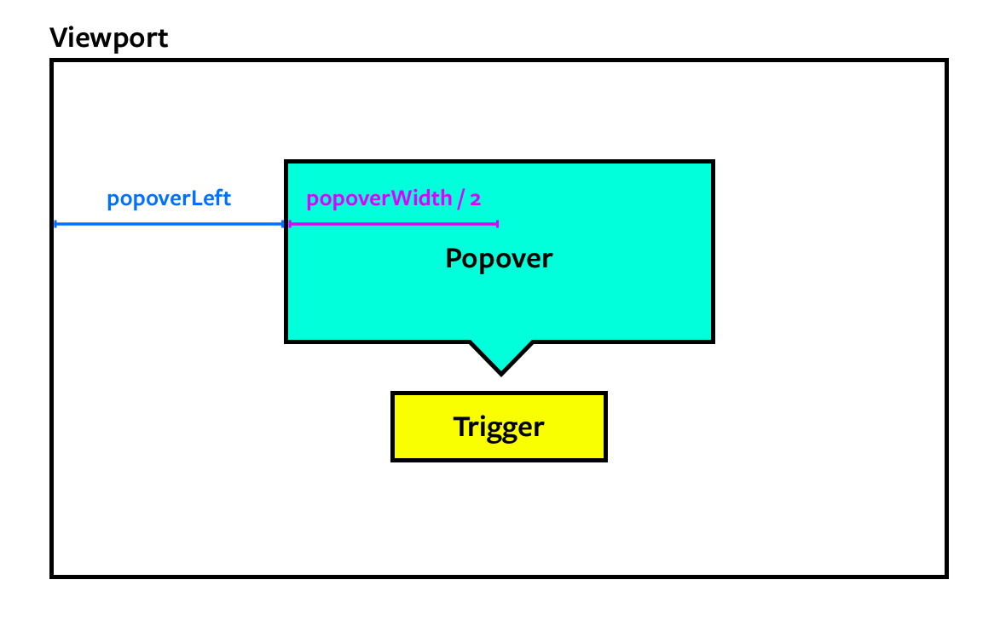
  <figcaption aria-hidden>Calculating the popover's left value</figcaption>
</figure>

```js
const popover = document.querySelector('.popover')
const popoverRect = popover.getBoundingClientRect()

const left = center - popoverRect.width / 2

popover.style.left = `${left}px`
```

<figure>
  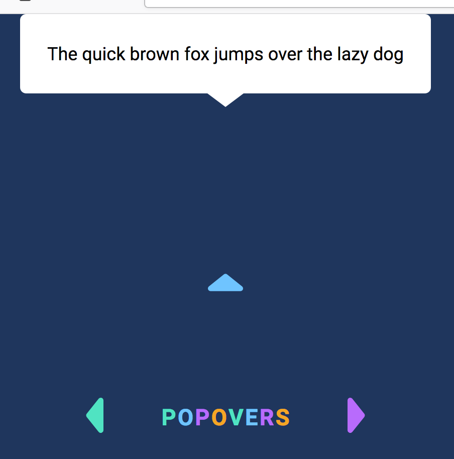
  <figcaption aria-hidden>Setting the popover's left value</figcaption>
</figure>

Next, we need to position the popover above the trigger. This means we need to know the trigger's `top` value. We can get this value with `getBoundingClientRect`.

<figure>
  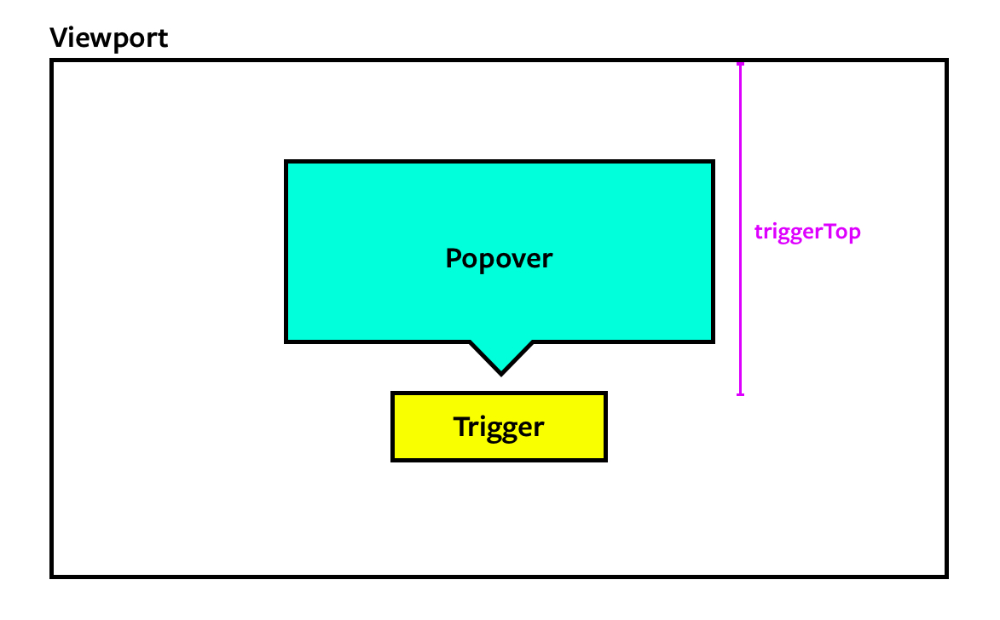
  <figcaption>Getting the trigger's top value</figcaption>
</figure>

```js
const triggerTop = triggerRect.top
```

The trigger's `top` value is equal to the sum of the popover's `top` value, the popover's height, and some breathing space.

<figure>
  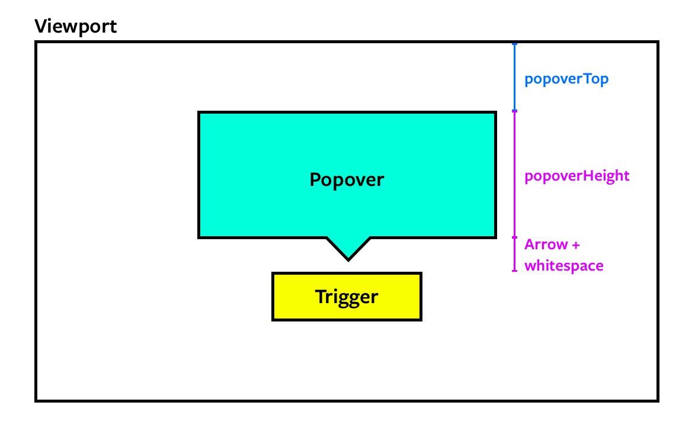
  <figcaption>Calculating the popover's top value</figcaption>
</figure>

We can get the popover's height with `getBoundingClientRect`. Also, let's say the space is 20px for now.

```js
const space = 20
const top = triggerTop - popoverRect.height - space

popover.style.top = `${top}px`
```

<figure>
  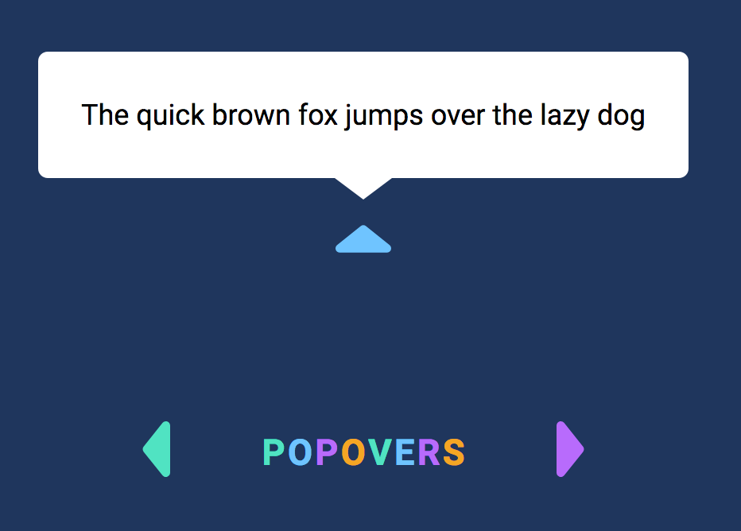
  <figcaption>Setting the popover's top value</figcaption>
</figure>

## A function to calculate popover position

We'll do similar calculations to position the popover on the right, bottom, and left. We should create a function to perform these calculations. Let's call this function `calculatePopoverPos`.

```js
const calcPopoverPos = () => {
  // Code here
}
```

`calcPopoverPos` needs to know the popover's and trigger's `boundingClientRect`. We can get the `boundingClientRect`s, by passing the popover and trigger as arguments.

```js
const calcPopoverPos = (trigger, popover) => {
  const triggerRect = trigger.getBoundingClientRect()
  const popoverRect = popover.getBoundingClientRect()

  // Perform calculations here
}
```

Next, we need to know where the popover should show up. We can get this from `data-placement`.

```js
const calcPopoverPos = (trigger, popover) => {
  const triggerRect = trigger.getBoundingClientRect()
  const popoverRect = popover.getBoundingClientRect()
  const placement = popover.dataset.placement

  if (placement === 'top') {
    // Return top and left values
  }
}
```

We also need to know the space between the popover and the trigger. We set this to 20px earlier.

```js
const calcPopoverPos = (trigger, popover) => {
  const triggerRect = trigger.getBoundingClientRect()
  const popoverRect = popover.getBoundingClientRect()
  const placement = popover.dataset.placement
  const space = 20

  if (placement === 'top') {
    // Return top and left values
  }
}
```

Finally, we perform the calculation and return the `left` and `top` values.

```js
if (placement === 'top') {
    return {
      left: (triggerRect.left + triggerRect.right) / 2 - popoverRect.width / 2,
      top: triggerRect.top - popoverRect.height - space
    }
  }
```

We can use `calcPopoverPos` this way:

```js
const trigger = document.querySelector('.trigger[data-placement=bottom]')
const popover = document.querySelector('.popover')
const popoverPos = calcPopoverPos(trigger, popover)

popover.style.left = `${popoverPos.left}px`
popover.style.top = `${popoverPos.top}px`
```

## Building the bottom popover

First, we need to make sure we target the correct trigger. We also need to make sure we change the `data-placement` on our popover to `bottom`.

```html
<div class="popover" data-placement="bottom">
  <p>The quick brown fox jumps over the lazy dog</p>
</div>
```

```js
const trigger = document.querySelector('.trigger[data-placement=bottom]')
const popover = document.querySelector('.popover')
```

We already know how to calculate the popover's `left` value. Let's put that value into `calcPopoverPos` first.

```js
if (placement === 'bottom') {
  return {
    left: (triggerRect.left + triggerRect.right) / 2 - popoverRect.width / 2,
  }
}
```

Let's calculate the `top` value next.

<figure>
  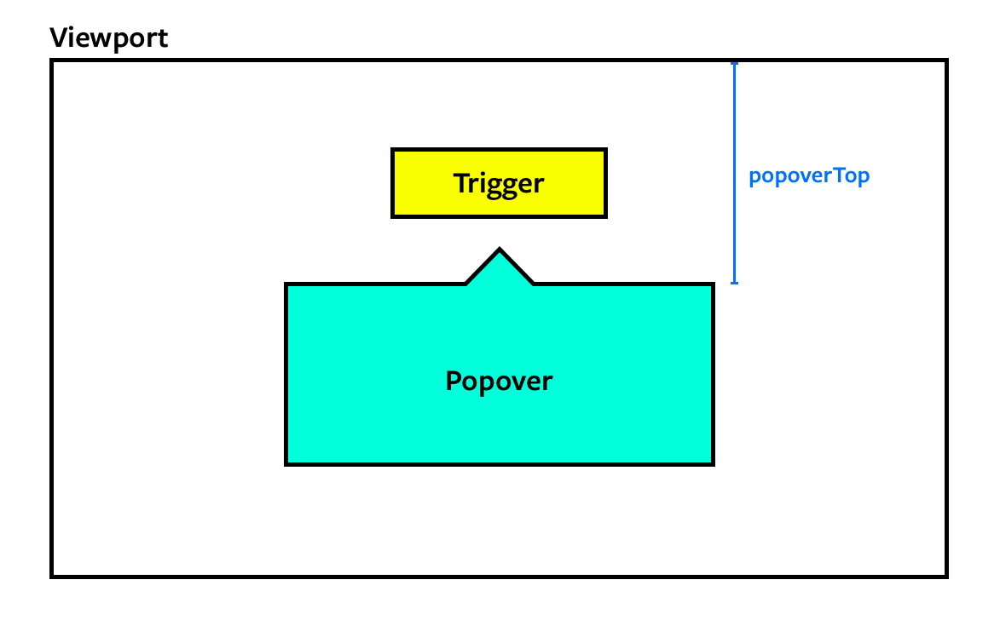
  <figcaption>The popover's top value</figcaption>
</figure>

The popover's `top` value is the sum of the trigger's `bottom` value and the space.

<figure>
  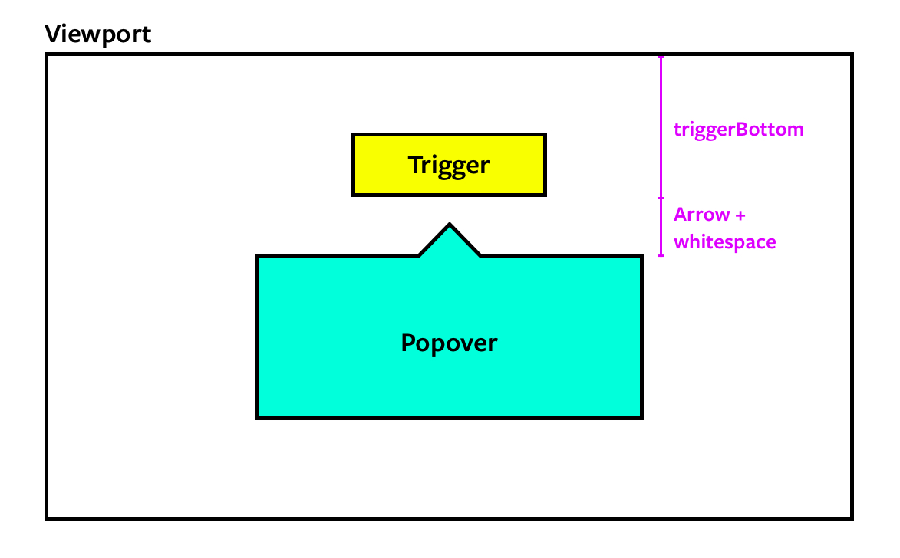
</figure>

```js
if (placement === 'bottom') {
  return {
    left: (triggerRect.left + triggerRect.right) / 2 - popoverRect.width / 2,
    top: triggerRect.bottom + space
  }
}
```

You can use `calcPopoverPos` the same way you did before:

```js
const popoverPos = calcPopoverPos(trigger, popover)

popover.style.left = `${popoverPos.left}px`
popover.style.top = `${popoverPos.top}px`
```

<figure>
  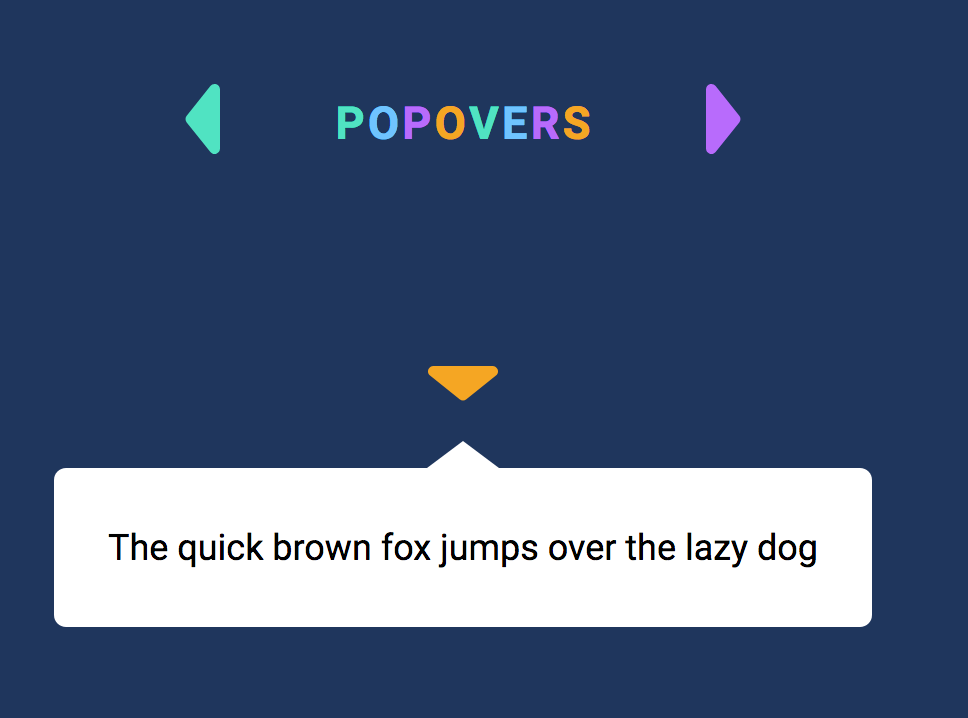
  <figcaption>Popover positioned below the trigger</figcaption>
</figure>

## Building the right popover

First, we need to make sure we target the correct trigger. We also need to make sure we change the `data-placement` on our popover to `right`.

```html
<div class="popover" data-placement="right">
  <p>The quick brown fox jumps over the lazy dog</p>
</div>
```

```js
const trigger = document.querySelector('.trigger[data-placement=right]')
const popover = document.querySelector('.popover')
```

To calculate the popover's `left` value, we need to know the trigger's `right` value and the amount of space between the popover and trigger.

<figure>
  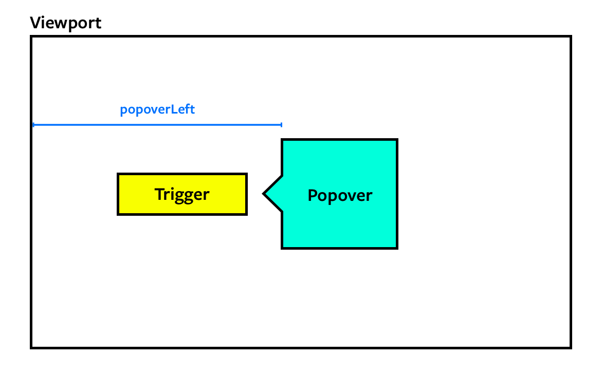
  <figcaption>Popover's left value</figcaption>
</figure>

<figure>
  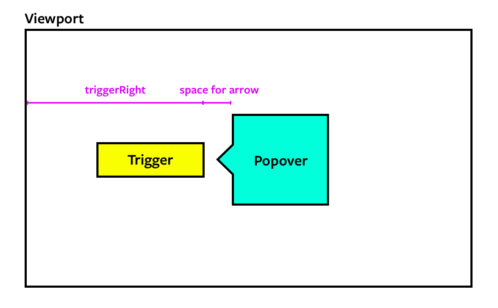
  <figcaption>Popover's left value should be equal to trigger's right value plus the space</figcaption>
</figure>

```js
if (placement === 'right') {
  return {
    left: triggerRect.right + space
  }
}
```

To get the popover's `top` value, we need to know the `trigger's` center position. We also need the popover's height.

<figure>
  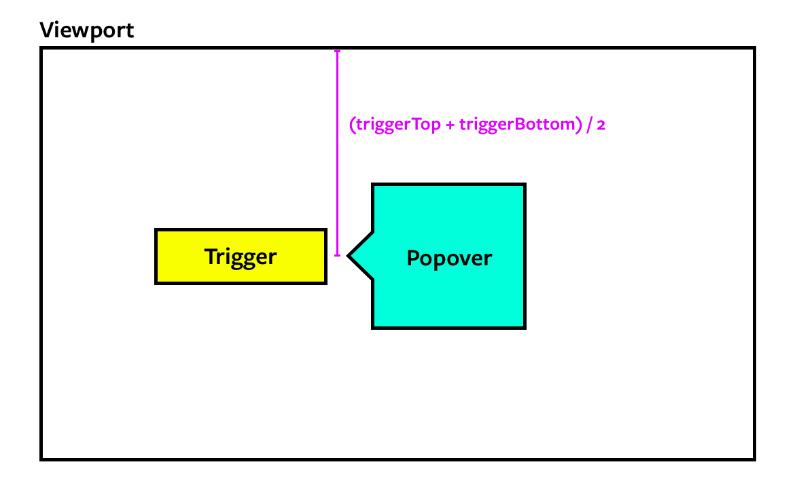
  <figcaption>The trigger's center</figcaption>
</figure>

<figure>
  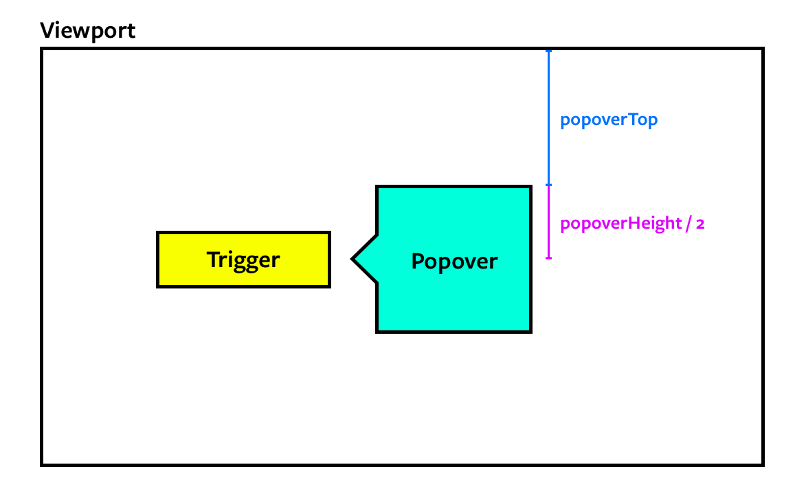
  <figcaption>The popover's center</figcaption>
</figure>

```js
if (placement === 'right') {
  return {
    left: triggerRect.right + space,
    top: (triggerRect.top + triggerRect.bottom) / 2 - popoverRect.height / 2
  }
}
```

You can then use `calcPopoverPos` the same way as before:

```js
const popoverPos = calcPopoverPos(trigger, popover)

popover.style.left = `${popoverPos.left}px`
popover.style.top = `${popoverPos.top}px`
```

<figure>
  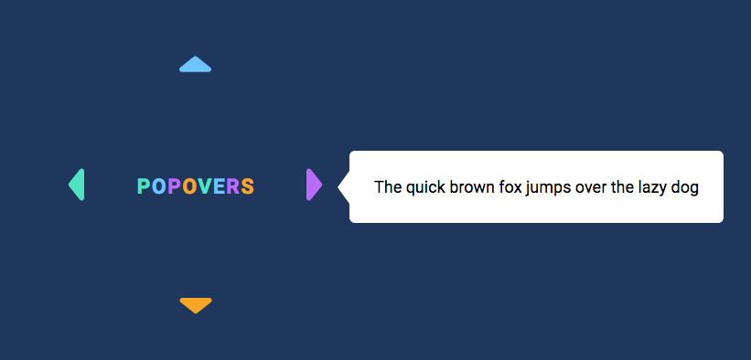
  <figcaption>Popover positioned to the right of the trigger</figcaption>
</figure>

## Building the left popover

To build a popover that shows up on the left, we need to change the `data-placement` attribute on our popover to `left`. We also need to make sure we select the `left` trigger.

```html
<div class="popover" data-placement="left">
  <p>The quick brown fox jumps over the lazy dog</p>
</div>
```

```js
const trigger = document.querySelector('.trigger[data-placement=left]')
const popover = document.querySelector('.popover')
```

We already know the `top` value from the `right` calculation. Let's add that into our code first.

```js
if (placement === 'left') {
  return {
    top: (triggerRect.top + triggerRect.bottom) / 2 - popoverRect.height / 2
  }
}
```

To get the `left` value, we need to know the trigger's `left` value, the popover`s width value, and the amount of space between the popover and trigger.

<figure>
  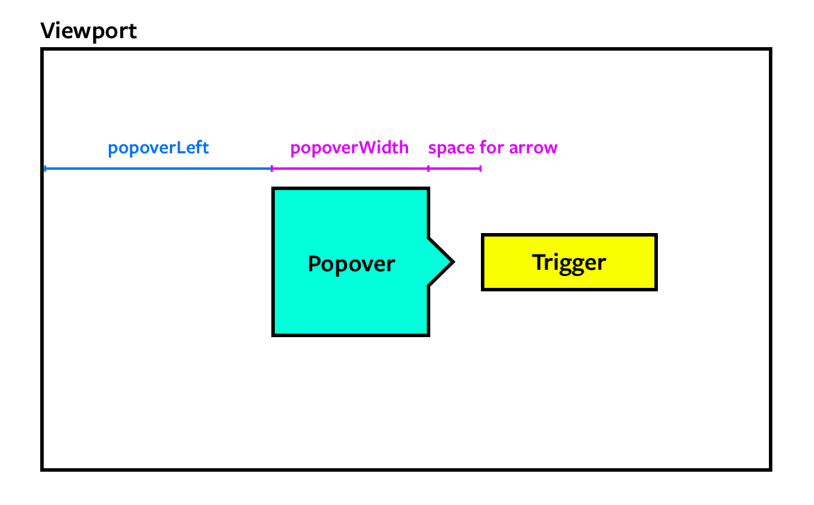
  <figcaption aria-hidden>The sum of the popover's left value, the popover's width value, and the space</figcaption>
</figure>

<figure>
  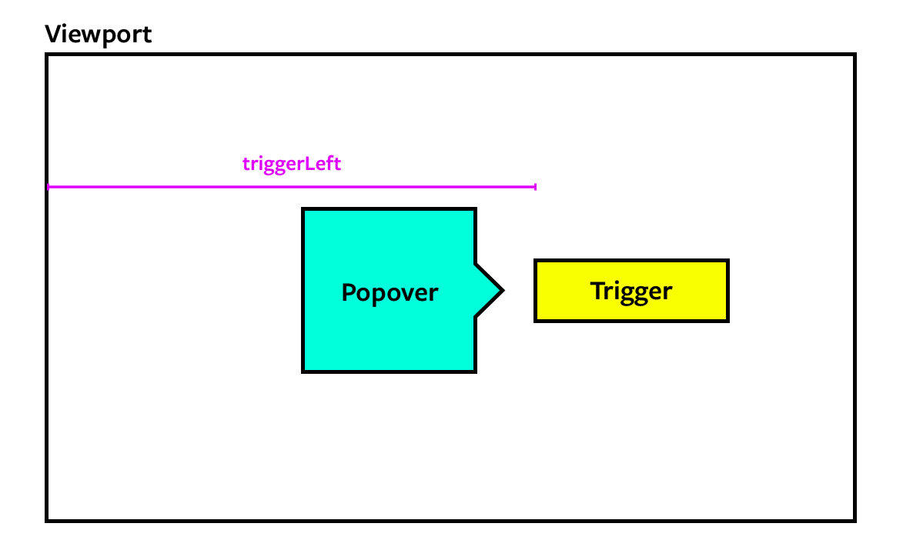
  <figcaption aria-hidden>Should add up to the trigger's left value</figcaption>
</figure>

```js
if (placement === 'left') {
  return {
    left: triggerRect.left - popoverRect.width - space,
    top: (triggerRect.top + triggerRect.bottom) / 2 - popoverRect.height / 2
  }
}
```

You can then use `calcPopoverPos` the same way as before:

```js
const popoverPos = calcPopoverPos(trigger, popover)

popover.style.left = `${popoverPos.left}px`
popover.style.top = `${popoverPos.top}px`
```

<figure>
  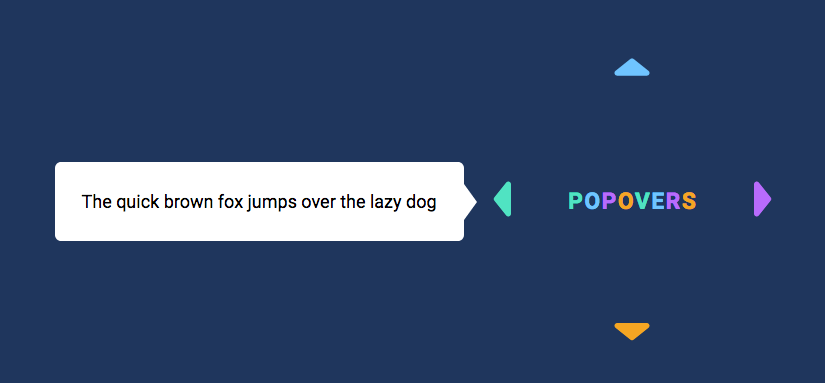
  <figcaption>Popover positioned to the left of the trigger</figcaption>
</figure>

## Exercise

Try and position the popover on the `top`, `right`, `bottom` and `left` with different triggers.

In the next lesson, you'll learn how to use JavaScript to create the popovers.