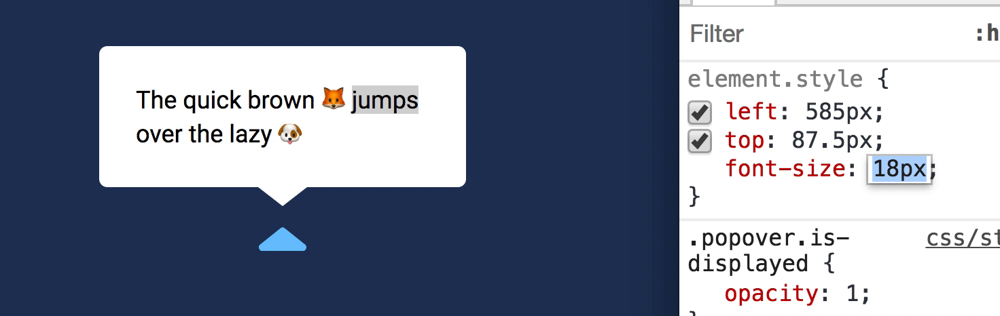
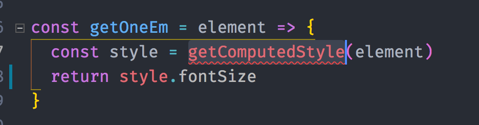

# 🛠️ Improving the popover's space variable

We set the leftover space for arrows and whitespace to be 20px as we built the popover. This is fine at first, but if you change the popover's font-size, this whitespace goes out of whack.

This is because the popover arrows are created with CSS. IF you dive into the CSS, you'll see this block of code. This is what [creates the arrows](https://css-tricks.com/examples/ShapesOfCSS/).

Here, you'll notice I sized the popovers with the `em` unit.

```css
.popover[data-placement="top"]::after {
  border-left: 1em solid transparent;
  border-right: 1em solid transparent;
  border-top: 0.75em solid #fff;
  bottom: -0.75em;
  left: 0;
  right: 0;
}
```

`1em` represents the font-size of the element. If you change the popover's font-size, the arrow size will change accordingly.

<figure>
  
  <figcaption>Size of the popover's arrow increases as font-size increases</figcaption>
</figure>

If we want the popover's placement to be correct regardless of the font-size of our popover, the `space` used in the calculation must be calculated with the `em` unit.

## Getting the em unit

We can use `getComputedStyle` to get the `em` unit. Since `1em` is always equal to the font-size of the element, we want to find the value of the `fontSize` property.

```js
const getOneEm = element => {
  const style = getComputedStyle(element)
  return style.fontSize
}
```

If you use Standard as your linter, you may notice that Standard underlines `getComputedStyle`. It complains that `getComputedStyle` is not defined.

<figure>
  
  <figcaption>getComputedStyle has a squiggly underline</figcaption>
</figure>

This happens because Standard doesn't recognize `getComputedStyle` style as a global variable. You can fix by using `window.getComputedStyle` or by writing `/* globals getComputedStyle */` at the top of your code.

At this point, `getOneEm` returns a value in pixels.

```js
const div = document.querySelector('div')
const oneEm = getOneEm(div)
console.log(oneEm) // 18px
```

We cannot use `18px` in our calculation. We need a number. You tell JavaScript to change `18px` into a number with either `parseInt` or `parseFloat`.

`parseInt` converts the value into an integer while `parseFloat` converts the value into a floating-point number (which means a number with decimal points). We want to be precise with our calculations here, so let's use `parseFloat`.

```js
const getOneEm = element => {
  const style = getComputedStyle(element)
  return parseFloat(style.fontSize)
}
```

You can calculate the amount of `space` you want through `getOneEm`. I found that a space of 1.2em looks best, did the following calculation:
```js
const space = oneEm(trigger) * 1.2
```

## Wrapping up

You learned how to get the value of `1em` through getComputedStyle in this lesson. What else can you use `getComputedStyle` for?

Brainstorm a few possible use cases and discuss what you think in the community.
