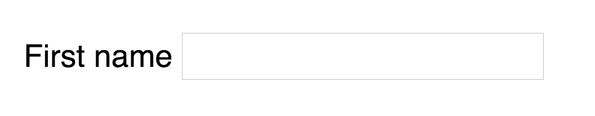

# Intro to forms

Forms allow users to enter information; they're essential for websites and web applications. When a user submits a form, the information they entered can be processed directly in the frontend (with JavaScript) or sent to the backend.

## The form element

All forms must be created with the `<form>` element. Each form should have at least two attributes—`method` and `action`.

```html
<form method="post" action="/some-url"> <!-- ... --> </form>
```

`method` tells the browser which HTTP method to use to submit the form. You can choose from `get` and `post`; and you'll learn what these methods are in a later module.

`action` tells the browser what URL to submit the information to. In this case, it's `/some-url`. If you want to process the information in the frontend, you don't need the `action` attribute.

### The smallest possible form

Forms must contain at least one field (officially, they're called widgets, but I call them fields) and a submit button, like this:

```html
<form method="post" action="/some-url">
  <label for="first-name">First name</label>
  <input type="text" name="first-name" id="first-name">
  <button type="submit">Submit form</button>
</form>
```

### Form fields

Form fields should have three things:

1. A `name` attribute for each field
2. A `label` for each field
3. An `id` attribute for each field

```html
<label for="first-name">First name</label>
<input type="text" name="first-name" id="first-name">
```

The `name` attribute lets servers extract values from fields. In this case, a server can find a user's first name by looking for the `first-name` field.

The `label` describes what a field is about. In this case, a user knows they should enter their first name into the `input` because the label exists.

<figure>
  
  <figcaption aria-hidden>A label tells users how to fill out the field</figcaption>
</figure>

When a user clicks on a label, you'll want the browser to focus on a field. To do so, you need to provide the label with a `for` attribute; this `for` attribute should match the `id` of the targeted field.

<figure>
  
  <figcaption aria-hidden>The browser focuses on the field when the label is clicked</figcaption>
</figure>

### The submit button

The submit button lets users submit a form. You can create a submit button with an `<input>` element or a `<button>` element. Many people prefer the `<button>` element because it's easier to style buttons.

```html
<!-- Submit button created with <input> -->
<input type="submit" value="Submit form">

<!-- Submit button created with <button> -->
<button type="submit">Submit form</button>
```

## Submitting a form

Users can submit a form in two ways:

1. By hitting the enter key
2. By clicking on the submit button

The `submit` event occurs when a user submits a form. You can listen to the submit event through an event listener.

```js
const form = document.querySelector('form')
form.addEventListener('submit', e => {
  // Do something here
  console.log('submitting form')
})
```

When the above form is submitted, browsers will log `submitting form` into the console for a split second before saying the url mentioned in the `action` attribute cannot be found.

<figure>
  
  <figcaption aria-hidden>Browsers navigate to the `action` attribute when the form is submitted</figcaption>
</figure>

This is normal—the default behavior for a form, when submitted, is to navigate to the url mentioned in the `action` attribute. If you want to perform actions before the navigation occurs, you need to stop the default behavior with `event.preventDefault`.

```js
form.addEventListener('submit', e => {
  e.preventDefault()

  // Do stuff here
  console.log('Default prevented. Yay!')
})
```

### Why prevent a form's default submit behavior?

There are two reasons for preventing a form's default behavior.

First, it allows you to alter field values (or even create new fields) with JavaScript before sending it to the server. You'll learn how to alter field values in a future lesson.

When you're ready to submit the form to the server, you can continue the submission process by calling `form.submit`.

```js
form.addEventListener('submit', e => {
  e.preventDefault()

  // Do stuff here
  console.log('Change stuff here')

  // Continues the submission
  form.submit()
})
```

Second, preventing a form's default behavior allows you to get and send data with AJAX (asynchronous JavaScript). You'll learn more about AJAX in a later module.

```js
form.addEventListener('submit', e => {
  e.preventDefault()

  // Sends form with AJAX.
  // You'll learn more about this in a later chapter
  fetch(form.action, { /* fetch options */ })
})
```

## Exercise

Three things:

1. Create a form with the form tag. Make sure your form has at least one field and a submit button.
2. Submit a form by clicking on the submit button and hitting the enter key. Observe what happens. Don't worry if you get a page not found error.
3. Prevent a form's default behavior, create `console.log`statements after preventing the default behavior, then continue the submission process.
