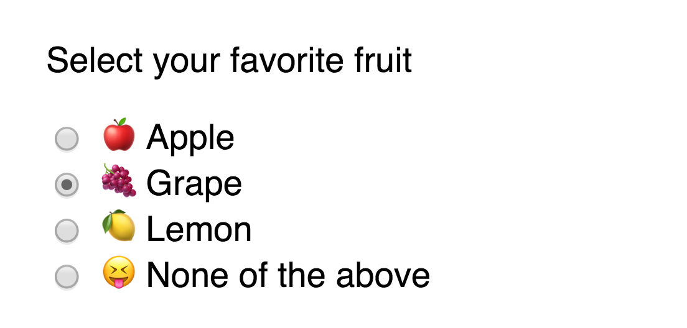

# Form fields and their events

Three types of fields are commonly used to build websites and web applications. We'll be covering the first two in this lesson. They are:

1. Input
2. Textarea
3. Select

## Input

Input fields are the most versatile amongst the three types. They can be used to collect all sorts of information.

If you want to collect text information, you'll set the input's type to `text`.

```html
<label for="username">Username</label>
<input type="text" name="username" id="username" />
```

<figure>
  
  <figcaption aria-hidden>Example of a text input</figcaption>
</figure>

Other types of text-related input types that are well supported across browsers include:

1. Email
2. Number
3. Password
4. Tel
5. Search
6. Url

Different types of input gives you different effects. For example, if you set `type="password"`, browsers will automatically hide the text entered by users:

```html
<label for="password">Password </label>
<input type="password" name="password" id="password">
```

<figure>
  
  <figcaption>Browsers mask password values automatically</figcaption>
</figure>

If you set `type="tel"`, browsers will launch a keypad instead of the standard keyboard on most mobile phones:

```html
<label for="phone-number">Phone number: </label>
<input type="tel" name="phone-number" id="phone-number">
```

<figure>
  
  <figcaption aria-hidden>Mobile browsers show a keypad when you set type to tel</figcaption>
</figure>

If you set `type="email"` or `type="url"`, browsers will automatically check if the entered values are valid email or url strings.

```html
<label for="email">Email address: </label>
<input type="email" name="email" id="email">
```

<figure>
  
  <figcaption>Browsers validate email addresses if type is set to email</figcaption>
</figure>

```html
<label for="url">Website: </label>
<input id="url" name="url" type="url">
```

<figure>
  
  <figcaption>Browsers validate urls automatically if type is set to url</figcaption>
</figure>

You can safely use most input types to collect textual information. If a browser does not support the type you specified, it will revert to `type="text"` automatically.

(Note: For a list of all available input types, visit [MDN's input reference][1])

### Getting values from textual input elements

To get the value from an `<input>`, you can use the `value` property.

```html
<input type="text" name="text" value="Hello world!">
```

```js
const input = document.querySelector('input')
console.log(input.value) // Hello world!
```

You want to remove unnecessary whitespace from the start and end of the any value you obtain from a text field. To do so, you use the `trim` method that's available for all strings.

```html
<input type="text" name="text" value="    Hello world!     ">
```

```js
console.log(input.value) // "    Hello world!    "
console.log(input.value.trim()) // "Hello world!"
```

### Input events

You can listen to four types of events for input fields:

1. `input`
2. `focus` or `focusin`
3. `blur` or `focusout`
4. `change`

`input` fires whenever a user types information into the field.

```js
input.addEventListener('input', e => {
  console.log(e.target.value)
})
```

<figure>
  
  <figcaption>`input` fires whenever a user types information into the field</figcaption>
</figure>

`focus` and `focusin` fires whenever a user activates a field, either by tabbing into it or by clicking on it. The difference between these two events is: `focusin` bubbles but `focus` doesn't.

```js
input.addEventListener('focus', e => {
  console.log(`Focus on! Value is: ${e.target.value}`)
})
```

<figure>
  
  <figcaption>`focus` fires whenever a user activates a field</figcaption>
</figure>

`focusout` and `blur` activate when a field loses focus. The difference between these two events is: `focusout` bubbles but `blur` doesn't.

```js
input.addEventListener('blur', e => {
  console.log(`Focus off! Value is: ${e.target.value}`)
})
```

<figure>
  
  <figcaption>`blur` fires whenever a user leaves a field</figcaption>
</figure>

`change` fires whenever a value is committed by a user. They're often used for other types of form fields, like checkboxes, radio buttons and select elements. For a text field, `change` acts the same way as `focusout` or `blur`.

## Checkboxes

You use checkboxes if you want to let users toggle between on and off states. To create a checkbox, you use an input element with `type` set to `checkbox`.

```html
<input type="checkbox">
```

<figure>
  
  <figcaption aria-hidden>Example of a checkbox</figcaption>
</figure>

Checkboxes require labels, or they wouldn't make sense.

```html
<input type="checkbox" name="checkbox" id="checkbox">
<label for="checkbox">Label for the checkbox</label>
```

<figure>
  
  <figcaption>You tell a user what the checkbox is for through a label</figcaption>
</figure>

Checkboxes are often used in tandem with other checkboxes. When you use them this way, make sure you use different `name` attributes for each checkbox.

```html
<form action="#" method="post">
  <p>Do you like these fruits?</p>

  <div class="checkbox">
    <input type="checkbox" name="apple" id="apple">
    <label for="apple">🍎 Apples</label>
  </div>
  <div class="checkbox">
    <input type="checkbox" name="grape" id="grape">
    <label for="grape">🍇 Grapes</label>
  </div>
  <div class="checkbox">
    <input type="checkbox" name="lemon" id="lemon">
    <label for="lemon">🍋 Lemons</label>
  </div>
</form>
```

<figure>
  
  <figcaption>Checkboxes are often used together</figcaption>
</figure>

### Getting values from checkboxes

You can get the value of a checkbox with the `value` property.

```html
<input type="checkbox" name="checkbox" id="checkbox" value="Have I been checked?">
<label for="checkbox">Label for the checkbox</label>
```

```js
const checkbox = document.querySelector('input')
console.log(checkbox.value) // Have I been checked?
```

If `value` is not set, `value` will default to `on`.

```html
<input type="checkbox" name="checkbox" id="checkbox">
<label for="checkbox">Label for the checkbox</label>
```

```js
const checkbox = document.querySelector('input')
console.log(checkbox.value) // on
```

### Selecting checked checkboxes

Checkboxes that are selected will have the `checked` attribute. You can select them through `querySelector` with the `:checked` pseudo class, through the `checked` property, or through the `hasAttribute` method.

<figure>
  
  <figcaption>Let's say you have two items checked</figcaption>
</figure>

```js
// Selecting checked checkboxes through querySelector
const checkedCheckboxes = document.querySelectorAll('input:checked')

console.log(checkedCheckboxes) // NodeList(2) [input#apple, input#grape]
```

```js
// Selecting checked checkboxes through the checked property
const checkboxes = Array.from(document.querySelectorAll('input'))
const checkedCheckboxes = checkboxes.filter(checkbox => checkbox.checked)

console.log(checkedCheckboxes) // [input#apple, input#grape]
```

```js
// Selecting checked checkboxes through hasAttribute
const checkboxes = Array.from(document.querySelectorAll('input'))
const checkedCheckboxes = checkboxes.filter(checkbox => checkbox.hasAttribute('checked'))

console.log(checkedCheckboxes) // [input#apple, input#grape]
```

### Checkbox events

You can listen to one event on checkboxes—`change`. `change` fires whenever a checkbox gets checked or unchecked. Note: you can use an event delegation pattern since `change` bubbles.

```js
form.addEventListener('change', e => {
  const checkbox = e.target
  console.log(checkbox.checked)
})
```

<figure>
  
  <figcaption>`change` fires when a checkbox gets checked or unchecked</figcaption>
</figure>

## Radio buttons

Radio buttons are used when you want a user to select one option from many options. To create a radio button, you use an `<input>` element with `type="radio"`.

```html
<input type="radio">
```

<figure>
  
  <figcaption aria-hidden>A radio button</figcaption>
</figure>

Like checkboxes, radio buttons require labels or they wouldn't make sense.

```html
<input type="radio" name="radio" id="radio">
<label for="radio">Label for the radio</label>
```

<figure>
  
  <figcaption aria-hidden>A radio button with a label</figcaption>
</figure>

Radio buttons are always used together with other radio buttons. A single radio button doesn't make sense. When you use multiple radio buttons, make sure all radio buttons have the same `name` property.

You will need a `value` attribute for every radio button if you want to pass the selected radio value to the backend.

```html
<form action="#" method="post">
  <p>Select your favorite fruit</p>

  <div class="radio">
    <input type="radio" name="fav-fruit" id="apple" value="apple">
    <label for="apple">🍎 Apple</label>
  </div>
  <div class="radio">
    <input type="radio" name="fav-fruit" id="grape" value="grape">
    <label for="grape">🍇 Grape</label>
  </div>
  <div class="radio">
    <input type="radio" name="fav-fruit" id="lemon" value="lemon">
    <label for="lemon">🍋 Lemon</label>
  </div>
  <div class="radio">
    <input type="radio" name="fav-fruit" id="lemon" value="none">
    <label for="lemon">😝 None of the above</label>
  </div>
</form>
```

<figure>
  
  <figcaption>Radio buttons come as a group</figcaption>
</figure>

### Getting values from radio buttons

You can get the value of a radio button with the `value` property. Note: You can use an event delegation pattern since `change` bubbles.

```html
<input type="radio" name="radio" id="radio" value="The best (only) radio channel in the world">
<label for="radio">Label for the radio</label>
```

```js
const radio = document.querySelector('input')
console.log(radio.value) // The best (only) radio channel in the world
```

### The selected radio

The selected radio button will have the `checked` attribute. You can select it through `querySelector` with the `:checked` pseudo class, through the `checked` property or through the `hasAttribute` method.

<figure>
  
  <figcaption>Grape is selected</figcaption>
</figure>

```js
// Selecting checked radio through querySelector
const checkedRadios = document.querySelector('input:checked')
console.log(checkedRadios) // <input id="grape" name="grape" ... >
```

```js
// Selecting checked radios through the checked property
const radios = Array.from(document.querySelectorAll('input'))
const radio = radios.find(radio => radio.checked)

console.log(radio) // <input id="grape" name="grape" ... >
```

```js
// Selecting checked radios through `hasAttribute`
const radios = Array.from(document.querySelectorAll('input'))
const radio = radios.find(radio => radio.hasAttribute('checked'))

console.log(radio) // <input id="grape" name="grape" ... >
```

### Radio events

You can listen to one event on radio buttons—`change`. `change` fires whenever a radio button gets selected.

```js
const radios = document.querySelectorAll('input')

radios.addEventListener('change', e => {
  if (e.target.checked) {
    console.log(e.target.value)
  }
})
```

<figure>
  
  <figcaption>`change` fires when a radio button gets selected</figcaption>
</figure>

## Textarea

Textareas are used to gather large amounts of textual information. They look like this:

```html
<label for="long-text">Enter some text: </label>
<textarea name="long-text" id="long-text"></textarea>
```

<figure>
  
  <figcaption aria-hidden>Example of a textarea</figcaption>
</figure>

### Getting values from textarea

You can get the value of a `<textarea>` through the `value` property. When you do so, make sure you run `trim` on the value.

```html
<label for="long-text">Enter some text: </label>
<textarea name="long-text" id="long-text" value="    something goes here     "></textarea>
```

```js
const textarea = document.querySelector('textarea')
console.log(textarea.value.trim()) // something goes here
```

### Textarea events

You can listen to the event as text-based input elements. They are

1. `input`
2. `focus`
3. `focusout`
4. `blur`
5. `change`

Refer to the [input events section][2] for an explanation for what each event does.

## Wrapping up

Three types of fields are commonly used to build websites. They are:

1. Input
2. Textarea
3. Select menu

When you work with `<input>` elements, make sure to use the correct `type` attribute.

## Exercise

1. Create a text field
	1. Get the value of the field when the `input` event occurs
	2. Get the value of the field when the `focus` event occurs
	3. Get the value of the field when `focusout` or `blur` events occur
2. Create five checkboxes
	1. Check three of the five checkboxes
	2. Get checked checkboxes with JavaScript
	3. Get checked checkboxes when the `change` event fires
3. Create five radio buttons
	1. Select a radio button
	2. Get the value of the selected radio
	3. Get the value of the selected radio when the `change` event fires
4. Create a textarea
	1. Get the value of the textarea when the `input` event occurs
	2. Get the value of the textarea when the `focus` event occurs
	3. Get the value of the textarea when `focusout` or `blur` events occur

[1]:	https://developer.mozilla.org/en-US/docs/Web/HTML/Element/input
[2]:	#input-events
