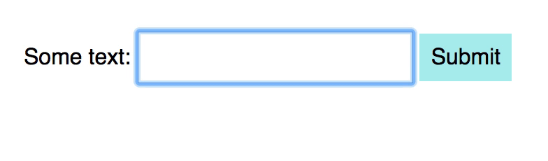
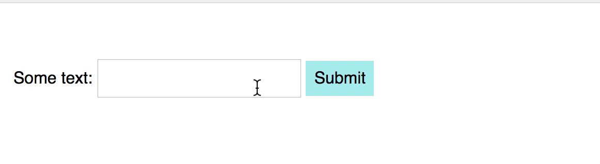
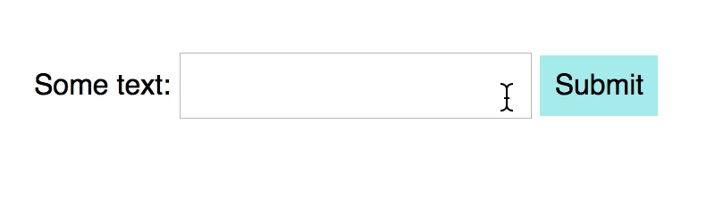
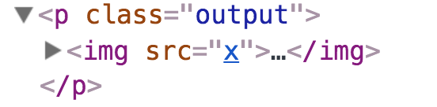

# Sanitize your output

Hackers can exploit your website to attack users if you're not careful. They do it through a method called cross-site scripting (XSS).

XSS basically means the attacker gets your website to run their JavaScript. When they run their JavaScript, they can do a lot of harm. They can even use your site to steal your users' usernames and passwords.

To prevent XSS attacks, you need to prevent other people from running JavaScript in your website. To prevent people from running JavaScript in your website, you need to sanitize your output.

## How people can run JavaScript on your website

Attackers can run JavaScript on your website when you accidentally insert their JavaScript into the DOM.

They can send you JavaScript without your knowledge through two main ways.

1. Through the URL
2. Through a text field

Let's go through an example and see how it works. Say you have a form with a text field and a submit button.

When the user submits the form, you reproduce what they wrote to the DOM.

Here's the HTML:

```html
<form action="#">
  <label for="text">Text</label>
  <input type="text" id="text" name="text">
  <button type="submit">Submit</button>
</form>
<div class="output"></div>
```

And the JavaScript

```js
const form = document.querySelector('form')
const output = document.querySelector('.output')

form.addEventListener('submit', event => {
  event.preventDefault()
  const input = event.target.querySelector('input')
  const value = input.value.trim()

  output.innerHTML = value
})
```

<figure>
  
</figure>

When an attacker has access to a text field, they can submit JavaScript through an attribute. Here's one example:

```html

```

If you add this HTML into the text box, you'll immediately see an alert that says "Hacked!".

<figure>
  
</figure>

What happens is:

1. JavaScript adds the `` tag into the DOM.
2. The `` tag tries to load the image from "x". This fails because x doesn't exist.
3. When the loading fails, an `error` event will occur.
4. The `onerror` attribute handles the `error` event. This runs the attacker's JavaScript code.

## Sanitizing your output

Doctors and nurses wash their hands with hand sanitizers after touching a patient. They do this to prevent themselves (and other patients) from getting infected.

Loosely translated, sanitizing something means to disinfect it.

When we sanitize JavaScript, we remove ways that allow people to run their JavaScript on our site.

There are two ways to sanitize our output:

1. Use `textContent`
2. Use a sanitizer

### Using textContent

`textContent` can only output text. If you use `textContent`, you won't generate any HTML. If you don't generate HTML, there's no way to insert JavaScript.

```js
form.addEventListener('submit', event => {
  // ...
  output.textContent = value
})
```

<figure>
  
  <figcaption>There's no way to insert JavaScript if you don't insert HTML</figcaption>
</figure>

If you need to write HTML, you'd want to use a sanitizer instead.

### Using a sanitizer

There are many sanitizer libraries on the internet. One example is [DOMPurify](https://github.com/cure53/DOMPurify).

Before you use DOMPurify, you need to include the library before your JavaScript file. The process looks like this:

```html
<!-- Link to DOMPurify -->
<script src="https://cdnjs.cloudflare.com/ajax/libs/dompurify/1.0.7/purify.min.js"></script>

<!-- Your main JavaScript comes next -->
<script src="js/main.js"></script>
```

Once you have installed DOMPurify, you will be able to use a variable called `DOMPurify`. To sanitize your code, you use a `sanitize` method.

```js
form.addEventListener('submit', event => {
  // ...
  output.innerHTML = DOMPurify.sanitize(value)
})
```

If you try adding `` to the input box, nothing will show up.

But if you look in the DOM, you'll see an `` tag with an `src` attribute that points to `x`. The `` tag is present, but the `onerror` attribute is missing. DOMPurify removed it.

<figure>
  
  <figcaption aria-hidden>The `onerror` attribute has been removed. </figcaption>
</figure>

## Exercise

Sanitize the following strings. What are their sanitized outputs?

1. ``
2. `<svg><g/onload=alert(2)</svg>`
3. `<iframe src=jAva&Tab;script:alert(3)><iframe>`

Note: You can learn more about Cross-site scripting [here](https://excess-xss.com).
