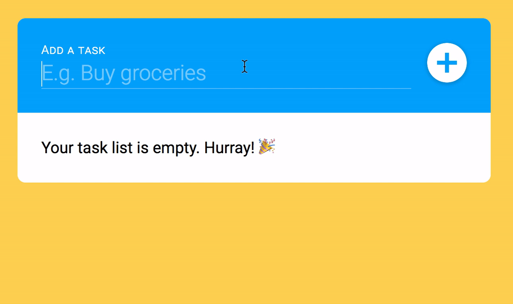
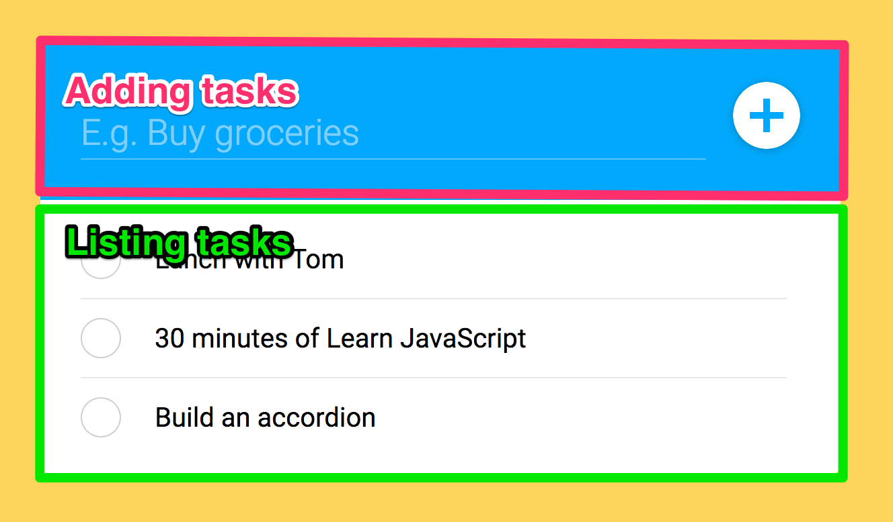
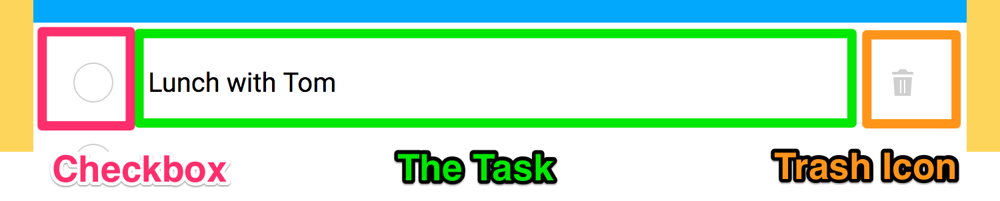
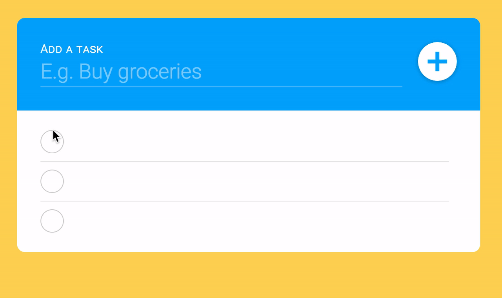
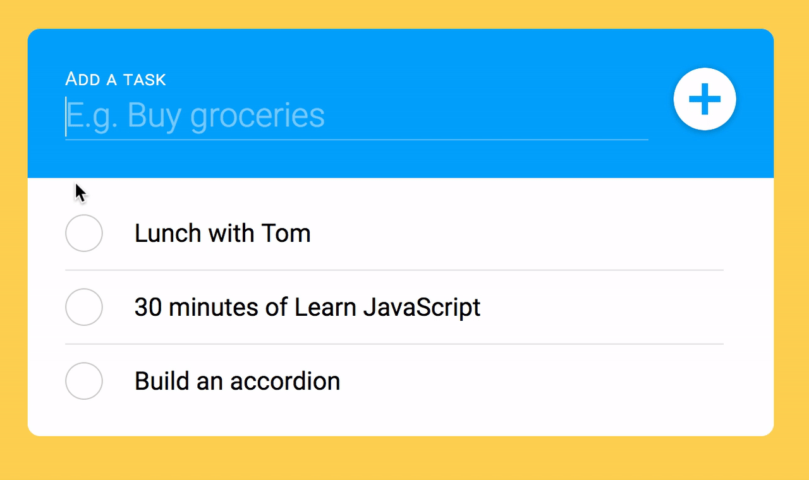
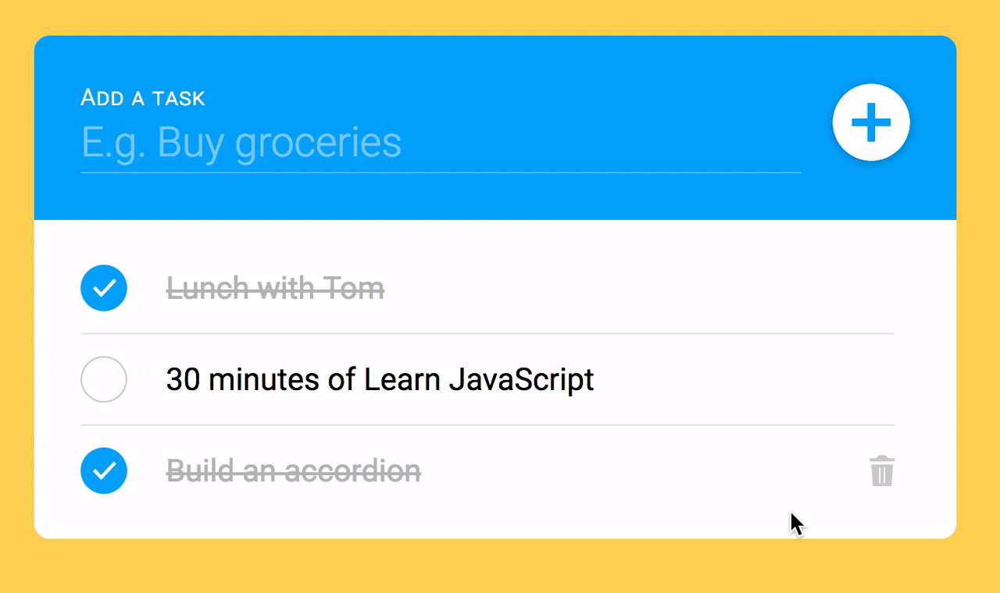
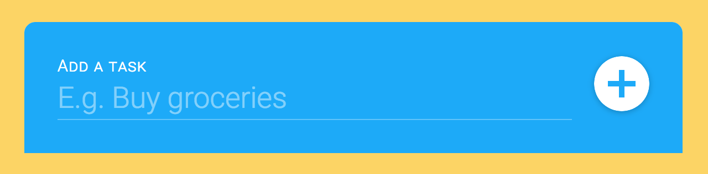
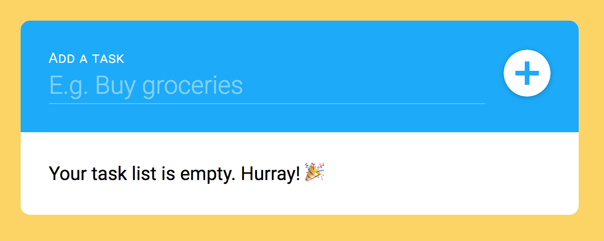
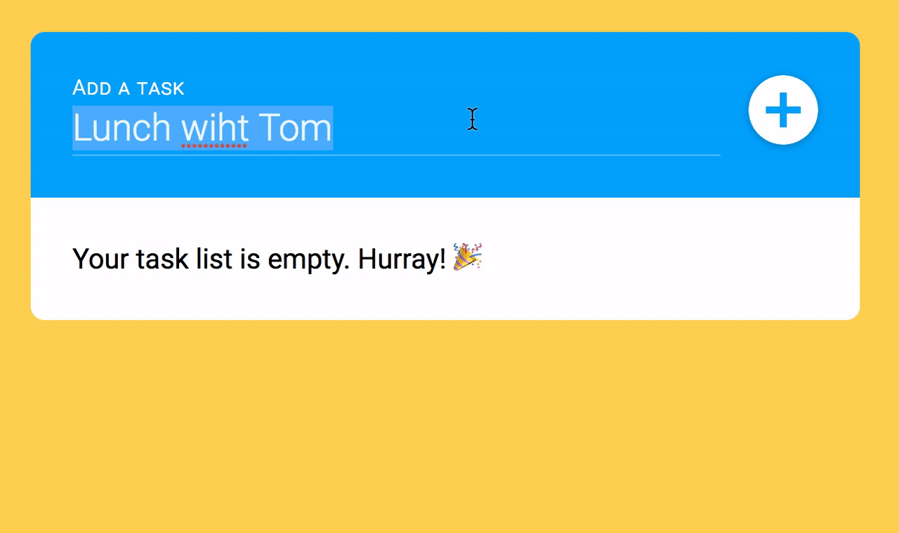
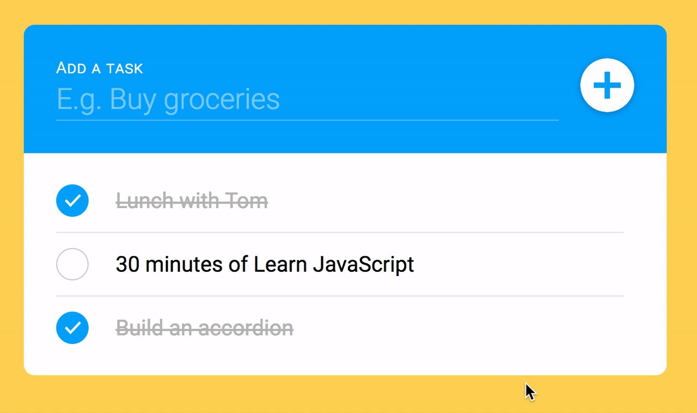

# Building a Todo List

You'll learn how to build a todo list in this lesson. Here's what you'll get when you complete the lesson.

<figure>
  
</figure>

You can grab the starter files for the todo list from Github, in `components/08.todolist/01.starter`

## Todo and Task

First, recognize that a "todo" can also be called a "task", and "todo" is harder to say than "task".

Your code will become clearer when you use easier words. We're going to call our todo list a "task list".

## The HTML and CSS for the task list

When you look at the task list component, you'll realize it is divided into two major parts:

1. The part for adding a new task
2. The part that lists tasks

<figure>
  
</figure>

### HTML and CSS for adding a new task

If you look at the UI, you can deduce that users will be able to add a new task with two actions:

1. Typing into the text field
2. Clicking on the plus button.

At this point, you may want to listen for a `click` on the button to create a new task.

Wait, because there is a better method.

What will a user do when they finish typing a task in the text field? If the user is adept with keyboards, they may hit the `enter` key to create the new task. This behavior is a norm amongst many people who use enough UI.

There is an event that can listen to both the `enter` key and the `click` on the button. This event is a form's `submit` event.

So a `<form>` element is the best way to create the "add new task" feature. Here, we also want to set the `autocomplete` attribute to `off` so browsers don't try to autocomplete the fields.

```html
<div class="tasklist">
  <form action="#" class="tasklist__add" autocomplete="off">
    <label>Add a task</label>
    <input type="text" placeholder="E.g. Buy groceries" id="add" name="add">
    <button type="submit"> ... </button>
  </form>
</div>
```

Note: You may think the label is redundant in this task list. But the label is important. It's much easier for a user to add a task when they know the label is present.

Trying adding tasks to the task list with and without label. You'll notice a difference in the ease in adding tasks.

## HTML and CSS for the tasks

A task list contains a list of tasks. This means we need to use a list element (either `<ul>` or `<ol>`) to create our list. In this case, the `<ul>` element is appropriate since we don't need an ordered list.

```html
<div class="tasklist">
  <form action="#" class="tasklist__add"> ... </form>
  <ul class="tasks">
    <li class="task"> ... </li>
    <li class="task"> ... </li>
    <li class="task"> ... </li>
  </ul>
</div>
```

Each task contains three parts:

1. The checkbox
2. The task
3. The delete button

<figure>
  
  <figcaption aria-hidden>Each task contains a checkbox, the task itself, and the delete button</figcaption>
</figure>

### Making the checkbox

You can create a checkbox with an `input` element. To create the checkbox, the `type` attribute should be set to `checkbox`.

```html
<li class="task">
  <input type="checkbox" name="task" id="task">
</li>
```

We can tell whether the checkbox is checked by looking at the `checked` attribute. If the `checked` attribute is present, the checkbox is checked.

In CSS, we can tell whether the checkbox is checked with the `:checked` pseudo-class.

```css
.task [type="checkbox"] {
  /* Style when checkbox is not checked */
}

.task [type="checkbox"]:checked {
  /* Style when checkbox is checked */
}
```

But checkboxes are difficult to style. That's why we style their labels instead.

To style the label, we need to add a label to the HTML. Make sure the label goes after the checkbox.

We also hide the checkbox with a `visually-hidden` class. This class hides content visually while making the content accessible for JavaScript and screen readers. You can find out more about `visually-hidden` in [Jonathan Snook's article][1]

Note: I abbreviated `visually-hidden` to `vh`.

```html
<li class="task">
  <input type="checkbox" class="vh" name="task" id="task">
  <label for="task">
    <svg viewBox="0 0 20 15">
      <use xlink:href="#check"></use>
    </svg>
  </label>
</li>
```

```css
.vh {
  border: 0;
  clip: rect(0 0 0 0);
  height: 1px;
  margin: -1px;
  overflow: hidden;
  padding: 0;
  position: absolute;
  width: 1px;
}
```

CSS has a thing called the **adjacent sibling combinator**. This combinator lets us select an element immediately after another element.

Since we placed the label after the checkbox, we can create checked and unchecked states on the label with the following CSS:

```css
.task [type="checkbox"] + label {
  /* Style when checkbox is not checked */
}

.task [type="checkbox"]:checked + label {
  /* Style when checkbox is checked */
}
```

One more thing before we finish up the creating the checkbox.

For labels to check the correct checkbox, the label's `for` attribute must be the same value as checkbox's `id` attribute.

This means each checkbox must have a unique `id`.

```html
<li class="task">
  <input type="checkbox" name="task-1" id="task-1">
  <label for="task-1"> ... </label>
</li>

<li class="task">
  <input type="checkbox" name="task-2" id="task-2">
  <label for="task-2"> ... </label>
</li>
```

You should be able to click on each label to check their respective checkboxes now.

<figure>
  
</figure>

### Making the task

You can create the task with a generic element like a `<div>` or a `<span>`. What you use doesn't matter. The important thing is to place the task after the label.

```html
<li class="task">
  <input type="checkbox" name="task-1" id="task-1">
  <label for="task-1"> ... </label>
  <div>The task</div>
</li>
```

When the task is completed (which means the checkbox is checked), we can use a **general sibling combinator** to create a strikeout style.

The general sibling combinator lets us select elements that appear after another element. This is why the task must be placed after the checkbox.

```css
.task [type="checkbox"]:checked ~ div {
  text-decoration: line-through
}
```

<figure>
  
  <figcaption>The task gets a strikeout style when the label gets checked.</figcaption>
</figure>

### Making the delete button

The delete button is a button. We should create it with a `<button>` element. We can use an SVG for the trash icon.

```html
<li class="task">
  <input type="checkbox" name="task-1" id="task-1">
  <label for="task-1"> ... </label>
  <div>The task</div>
  <button>
    <svg viewBox="0 0 16 20">
      <use xlink:href="#trash"></use>
    </svg>
  </button>
</li>
```

This delete button should only be shown when a user hovers over the task. We can set it to `display: none`, and only show it when a user hovers onto the item with a `:hover` pseudo-class.

```css
.task > button svg {
  display: none;
}

.task:hover > button svg {
  display: block;
}
```

<figure>
  
  <figcaption>Trash icon appears on hover</figcaption>
</figure>

## Building the empty state

When there are no tasks, our task component contains only the part for adding a task.

<figure>
  
</figure>

Users won't know what they're supposed to see when they add a task. This can create confusion.

We want to help our users understand what will happen. To do so, we provide an empty state. In this case, the empty state can be a congratulatory message.

```html
<div class="tasklist">
  <form action="#" class="tasklist__add"> ... </form>
  <ul class="tasks"> ... </ul>
  <div>
    <p>Your task list is empty. Hurray! 🎉</p>
  </div>
</div>
```

If the `<ul>` is empty, we want to congratulatory message to show up. If the `<ul>` contains a task, we want to hide the congratulatory message.

We can use the `:empty` pseudo-class to do so.

```css
.tasks + div {
  display: none;
}

.tasks:empty + div {
  display: block;
}
```

`:empty` only works if the element is really empty. This means the `<ul>` element cannot contain any whitespaces.

```html
<ul class="todo"></ul>
<div>
  <p>Your task list is empty. Hurray! 🎉</p>
</div>
```

<figure>
  
  <figcaption aria-hidden>Empty state shows up when there are no tasks</figcaption>
</figure>

## Writing the JavaScript

We need to provide two interactions:

1. Adding a task
3. Deleting a task

## Adding a task

To add a task, we listen for a `submit` event on the form we created.

```js
const tasklist = document.querySelector('.tasklist')
const newTaskForm = tasklist.querySelector('form')

newTaskForm.addEventListener('submit', event => {
  // Add task
})
```

The `submit` event redirects a user to the URL stated in the `action` attribute automatically. We want to prevent this automatic behavior with `event.preventDefault`.

```js
newTaskForm.addEventListener('submit', event => {
  event.preventDefault()
})
```

Next, we need to figure out what the user typed into the text field. We can do this by getting the `value` of the text field.

When we add a task, we need to figure out what is the value of the task we're trying to add. We can do this by getting the `value` of the text field.

```js
newTaskForm.addEventListener('submit', event => {
  event.preventDefault()
  const form = event.target
  const input = form.elements.add
  const task = input.value.trim()
})
```

Once we have the task, we need to make an `<li>` item and append it to our `<ul>`. We can do this with a function called `makeTask`.

```js
const makeTask = _ => {
  // Make task item
}

newTaskForm.addEventListener('submit', event => {
  event.preventDefault()
  const form = event.target
  const input = form.elements.add
  const task = input.value.trim()

  makeTask()
})
```

`makeTask` needs to recreate the `<li>` element we created above. To jog your memory, here's the `<li>` item again:

```html
<li class="task">
  <input type="checkbox" class="vh" id="task-1" name="task-1">
  <label for="task-1">
    <svg viewBox="0 0 20 15">
      <use xlink:href="#check"></use>
    </svg>
  </label>
  <div>Lunch with Tom</div>
  <button class="task__trash">
    <svg viewBox="0 0 16 20">
      <use xlink:href="#trash"></use>
    </svg>
  </button>
</li>
```

Here, we know the element needs to be a `<li>`. We can create this `<li>` with `document.createElement`. This list element also needs to have a class called `task`.

```js
const makeTask = _ => {
  const task = document.createElement('li')
  task.classList.add('task')
}
```

We can copy the rest of the HTML as the `innerHTML` of the `<li>` element we created. You can use a template literal to make multi-line strings easier for yourself:

```js
const makeTask = _ => {
  const task = document.createElement('li')
  task.classList.add('task')

  task.innerHTML = `
    <input type="checkbox" class="visually-hidden" id="task-1" name="task-1">
    <label for="task-1">
      <svg viewBox="0 0 20 15">
        <use xlink:href="#check"></use>
      </svg>
    </label>
    <div>Lunch with Tom</div>
    <button class="task__trash">
      <svg viewBox="0 0 16 20">
        <use xlink:href="#trash"></use>
      </svg>
    </button>
  `
}
```

`makeTask` above will always create the task "Lunch with Tom". This is not what we want.

We want to make a task with what the user specified. This means we need to pass the task value from the `submit` event listener into `makeTask`.

```js
const makeTask = value => {
  const task = document.createElement('li')
  task.classList.add('task')

  task.innerHTML = `
    <input type="checkbox" class="visually-hidden" id="task-1" name="task-1">
    <label for="task-1">
      <svg viewBox="0 0 20 15">
        <use xlink:href="#check"></use>
      </svg>
    </label>
    <div>${value}</div>
    <button class="task__trash">
      <svg viewBox="0 0 16 20">
        <use xlink:href="#trash"></use>
      </svg>
    </button>
  `
}
```

Whenever we pass a value from a user, we always want to sanitize the output. This prevents cross-site-scripting attacks. 

```js
const makeTask = value => {
  const task = document.createElement('li')
  task.classList.add('task')

  task.innerHTML = DOMPurify.sanitize(`
    <input type="checkbox" class="visually-hidden" id="task-1" name="task-1">
    <label for="task-1">
      <svg viewBox="0 0 20 15">
        <use xlink:href="#check"></use>
      </svg>
    </label>
    <div>${value}</div>
    <button class="task__trash">
      <svg viewBox="0 0 16 20">
        <use xlink:href="#trash"></use>
      </svg>
    </button>
  `)
}
```

Note: Unfortunately, DOMPurify [removes the `<use>` tag][2]. One way to overcome this problem is to write the actual SVG (instead of using `<use>`). 

```js
const makeTask = value => {
  const task = document.createElement('li')
  task.classList.add('task')

  task.innerHTML = DOMPurify.sanitize(`
    <input type="checkbox" class="visually-hidden" id="task-1" name="task-1">
    <label for="task-1">
      <svg viewBox="0 0 20 15">
        <title>Done</title>
        <path d="M0 8l2-2 5 5L18 0l2 2L7 15z" fill="currentColor" fill-rule="nonzero" />
      </svg>
    </label>
    <div>${value}</div>
    <button class="task__trash">
      <svg viewBox="0 0 16 20">
        <title>Trash</title>
        <path d="M4 2l2-2h4l2 2h4v2H0V2h4zM1 6h14l-1 14H2L1 6zm5 2v10h1V8H6zm3 0v10h1V8H9z" fill="currentColor" fill-rule="nonzero" />
      </svg>
    </button>
  `)
}
```

(From this point onwards, you can remove the SVG symbol declaration in the HTML file). 

We also need to get the correct `id`, `name` and `for` attributes for our checkbox and label. This ensures that users can click on the checkbox to check or uncheck the correct task.

```js
const generateUnique = length =>
  Math.random().toString(36).substring(2, 2 + length)

const makeTask = value => {
  const id = generateUnique(5)
  const task = document.createElement('li')
  task.classList.add('task')

  task.innerHTML = DOMPurify.sanitize(`
    <input type="checkbox" class="vh" id="task-${id}" name="task-${id}">
    <label for="task-${id}">
      <svg viewBox="0 0 20 15">
        <title>Done</title>
        <path d="M0 8l2-2 5 5L18 0l2 2L7 15z" fill="currentColor" fill-rule="nonzero" />
      </svg>
    </label>
    <div>${value}</div>
    <button class="task__trash">
      <svg viewBox="0 0 16 20">
        <title>Trash</title>
        <path d="M4 2l2-2h4l2 2h4v2H0V2h4zM1 6h14l-1 14H2L1 6zm5 2v10h1V8H6zm3 0v10h1V8H9z" fill="currentColor" fill-rule="nonzero" />
      </svg>
    </button>
  `)
}
```

After creating the `<li>`, we need to append it to the `<ul>`.

```js
const makeTask = value => {
  const taskContainer = tasklist.querySelector('.tasks')
  const task = document.createElement('li')
  // ... Make the task element

  taskContainer.appendChild(task)
}
```

You can add a new task to the task list now.

Try adding three tasks to your task list. You'll realize you need to manually select and remove the text you entered before you can add another task.

That's not nice.

<figure>
  
</figure>

To facilitate the task adding process, we can reset the text field to an empty string.

```js
newTaskForm.addEventListener('submit', event => {
  // ...
  makeTask(task)
  input.value = ''
})
```

<figure>
  
</figure>

The focus gets removed from the text field if user clicks on the plus button to add a task. This prevents the user from adding a second task easily, so we want to bring the focus back onto the text field.

To do so, we can use the `focus` method.

```js
newTaskForm.addEventListener('submit', event => {
  // ...
  makeTask(task)
  input.value = ''
  input.focus()
})
```

Finally, we don't want users to add blank tasks into the task list. To do so, we can check if the input value is empty. If it is, we do nothing.

```js
newTaskForm.addEventListener('submit', event => {
  // ...
  if (!task) return

  makeTask(task)
  input.value = ''
  input.focus()
})
```

## Deleting a task

Delete buttons are located in each task, and tasks are located in within the  `<ul>` element. This means we use the event delegation pattern to listen for the deletion process.

```js
const taskContainer = tasklist.querySelector('.tasks')

taskContainer.addEventListener('click', event => {
  // ... Delete a task
})
```

We want to listen for the delete button. We can use the `matches` property to check the clicked target is a button. We do nothing if the target isn't a button.

```js
taskContainer.addEventListener('click', event => {
  const { target } = event
  if (!target.matches('button')) return
})
```

To delete a task, we need to delete the `<li>` element. This `<li>` element is the parent element of the button.

```js
taskContainer.addEventListener('click', event => {
  // ...
  const task = target.parentElement
  taskContainer.removeChild(task)
})
```

When you remove the final `<li>` element, JavaScript automatically removes any extra whitespace to show the empty state.

<figure>
  
  <figcaption>Deleting tasks and showing empty state</figcaption>
</figure>

## Exercise

Try making a task list without referring to this lesson.

[1]:	https://snook.ca/archives/html_and_css/hiding-content-for-accessibility
[2]:	https://github.com/cure53/DOMPurify/issues/233