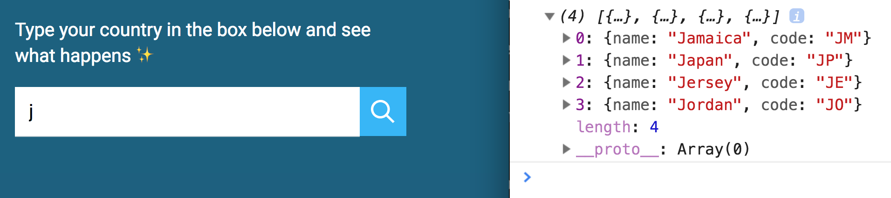

# Building an autocomplete text field

You'll learn how to build a autocomplete text field. Here's what you'll build by end of this lesson.

<figure>
  
</figure>

You can get the starter files from `components/09.autocomplete/01.starter`.

## What is an autocomplete?

When I say autocomplete, I don't mean the autocomplete feature that comes together with browsers.

<figure>
  
  <figcaption>Not this autocomplete!</figcaption>
</figure>

The autocomplete feature that comes with browsers have one major drawback—they only show users things they filled in before.

The autocomplete we're building is like Google's search. It gives you possible choices to choose from.

<figure>
  
</figure>

Note: Sometimes autocomplete is called typeahead because it shows results ahead of whatever you're typing.

## The HTML

When you use autocomplete, you want to help users fill up a form. This means the component should be wrapped with a `<form>` element.

```html
<form action="#">
  <label>Type something:</label>
  <input type="text" name="autocomplete">
  <button type="submit">...</button>
</form>
```

We need to prevent browsers from activating their autocomplete since we're providing our version. We do this by we setting the `autocomplete` attribute to `off`.

```html
<form action="#" autocomplete="off">
  <label>Type something:</label>
  <input type="text" name="autocomplete">
  <button type="submit">...</button>
</form>
```

For the autocomplete we're building, we're going to help users type their country into the field. Here's the modified HTML we're using.

Note: we're skipping the label because there's already some help text before the form.

```html
<form action="#" autocomplete="off">
  <input type="text" name="country" id="country">
  <button type="submit"> ... </button>
</form>
```

### The dropdown box

When a user fills up the autocomplete field, we want to display a box to show possible options they can choose.

We're going to call this box a dropdown.

The dropdown contains a list of possible choices. Since it's a list, we should use the `<ul>` element.

```html
<form action="#" autocomplete="off">
  <input ...>
  <button type="submit"> ... </button>

  <ul class="dropdown">
    <li> Item 1 </li>
    <li> Item 2 </li>
    <li> Item 3 </li>
  </ul>
</form>
```

The dropdown is hidden when the autocomplete is empty.

```css
.dropdown {
  display: none;
}
```

<figure>
  
  <figcaption>Dropdown hidden when autocomplete is empty</figcaption>
</figure>

When a user types something into the autocomplete, we want to show the dropdown. We can do this by attaching an `is-filled` class to the autocomplete.

```html
<form action="#" autocomplete="off">
  <input class="is-filled" ...>
  <!-- ... -->
</form>
```

When the autocomplete has an `is-filled` class, we can use the `+` (adjacent sibling) and `~` (subsequent sibling) selectors to light up the search icon and show the dropdown.

```css
input.is-filled + .search-icon {
  background-color: var(--accent);
}

input.is-filled ~ .dropdown {
  display: block;
}
```

<figure>
  
  <figcaption>Dropdown gets displayed and search icon lights up</figcaption>
</figure>

You can find the completed HTML and CSS in the starter file.

## The JavaScript

You should see a `countries` array in your JavaScript file. This `countries` array contains the name and country code of 249 countries in the world.

Here's an example:

```js
[
  { name: 'Japan', code: 'JP' },
  { name: 'Jordan', code: 'JO' },
]
```

Let's say the user typed `j` in the autocomplete. Countries with names beginning with J should be shown in the dropdown box.

From this list, we have Jamaica, Japan, Jersey, and Jordan.

<figure>
  
  <figcaption aria-hidden>Four countries begin with J: Jamaica, Japan, Jersey, and Jordan</figcaption>
</figure>

If the user types `ja` into the autocomplete, only countries beginning with `Ja` should show up in the dropdown.

From this list, we have Jamaica and Japan.

<figure>
  
  <figcaption aria-hidden>Two countries begin with Ja: Jamaica, Japan</figcaption>
</figure>

This means we need to do three things with JavaScript:

1. Check if the autocomplete contains text
2. Create a list of countries that match the text
3. Populate the dropdown with the matched countries.

### Checking if the autocomplete contains text

We can use the `input` event to detect user input. It fires whenever a user types into a form field.

```js
const autocomplete = document.querySelector('input')
autocomplete.addEventListener('input', event => {
  // do something
})
```

We can use the autocomplete's `value` property to check whether the autocomplete contains any text.

If the autocomplete contains text, we show the dropdown by adding an `is-filled` class. Otherwise, we hide the dropdown by removing the `is-filled` class.

```js
input.addEventListener('input', event => {
  const val = autocomplete.value

  if (val) {
    autocomplete.classList.add('is-filled')
  } else {
    autocomplete.classList.remove('is-filled')
  }
})
```

<figure>
  
  <figcaption></figcaption>
</figure>

If the autocomplete is empty, we don't need to run any more JavaScript code. We can complete the event listener early with an early return statement.

```js
autocomplete.addEventListener('input', event => {
  const val = autocomplete.value

  if (val) {
    autocomplete.classList.add('is-filled')
  } else {
    autocomplete.classList.remove('is-filled')
    return false
  }
})
```

If are returning the function early, we don't need an if/else statement. We can restructure the code as follows:

1. Always hide the dropdown first
2. If the autocomplete is filled, we show the dropdown

```js
autocomplete.addEventListener('input', event => {
  const val = autocomplete.value
  autocomplete.classList.remove('is-filled')

  if (!val) return
  autocomplete.classList.add('is-filled')
})
```

Next, try adding a space into the autocomplete. The dropdown will show up.

<figure>
  
  <figcaption aria-hidden>Dropdown shows up when a user types space into the autocomplete</figcaption>
</figure>

This shouldn't happen. We don't want a space character to trigger open the dropdown. So, we `trim` any whitespaces before we check if `val` is filled.

```js
input.addEventListener('input', event => {
  const val = input.value.trim()
  // ...
})
```

Before we move on, remove the dummy `<li>` items from the HTML. We don't need them going forward.

```html
<form action="#" autocomplete="off">
  <!-- ... -->
  <ul class="dropdown"></ul>
</form>
```

### Create a list of countries that match the text

To get the list of countries that match the typed value, we filter the `countries` array with the value.

Let's do this step by step.

First, we'll write a filter function and `console.log` each country in our `countries` array. You should see a JavaScript object in the console for each loop, and this object contains a `name` property and a `code` property.

```js
input.addEventListener('input', event => {
  // ...
  const matches = countries.filter(country => {
    console.log(country)
  })
})
```

<figure>
  
  <figcaption>Logging all countries</figcaption>
</figure>

We want to check whether the country name starts with the letter `j`. Here, we can use the `startsWith` method. `startsWith` lets you check whether a string starts with the arguments you entered.

```js
'My name'.startsWith('M') // true
'My name'.startsWith('My') // true
'My name'.startsWith('Z') // false
```

Note: `startsWith` is case sensitive. You need to make sure the cases match.

```js
'My name'.startsWith('M') // true
'My name'.startsWith('m') // false
```

We'll log the country that begins with the value the user typed. If the user typed `J`, we'll search for a list of countries starting with `J`. If the user typed `S`, we'll search for a list of countries starting with `S`.

We can do this by using the typed value as the searched term.

```js
input.addEventListener('input', event => {
  // ...
  const matches = countries.filter(country => {
    if (country.name.startsWith(val)) {
      console.log(country)
    }
  })
})
```

At this point, if you type the uppercase letter `J` into the autocomplete, you'll see four `console.log` statements.

But if you type the lowercase letter `J` into the autocomplete, you'll see nothing.

<figure>
  
  <figcaption aria-hidden>Uppercase J matches four countries</figcaption>
</figure>

<figure>
  
  <figcaption aria-hidden>Lowercase j matches nothing</figcaption>
</figure>

This happens because `startsWith` is case-sensitive. We need to make sure the cases match.

One way to make the cases match is to force both strings to lowercase. We can do this with `toLowerCase`.

(Another way to make the cases match is to force both strings to uppercase. We can do this with `toUpperCase`).

```js
input.addEventListener('input', event => {
  const val = autocomplete.value.trim().toLowerCase()
  // ...
  const matches = countries.filter(country => {
    if (country.name.toLowerCase().startsWith(val)) {
      console.log(country)
    }
  })
})
```

Now try to type either `j` or `J` in the autocomplete field. You'll see four objects in both cases.

<figure>
  
  <figcaption aria-hidden>Uppercase J matches four countries</figcaption>
</figure>

<figure>
  
  <figcaption aria-hidden>Lowercase J matches four countries</figcaption>
</figure>

The `filter` function creates a new array with if you return a truthy value. To get the filtered list of countries, we can return `true` when the country name matches with the typed value.

```js
input.addEventListener('input', event => {
  const val = autocomplete.value.trim().toLowerCase()
  // ...
  const matches = countries.filter(country => {
    if (country.name.toLowerCase().startsWith(val)) {
      return true
    }
  })
})
```

Since truthy values return `true`, we can clean up the code slightly by returning the `if` condition.

```js
input.addEventListener('input', event => {
  const val = autocomplete.value.trim().toLowerCase()
  // ...
  const matches = countries.filter(country =>
    country.name.toLowerCase().startsWith(val)
  )
})
```

If you `console.log(matches)`, you should see an array with four objects.

<figure>
  
  <figcaption aria-hidden>The matched array</figcaption>
</figure>

### Creating the list of items

When the user types `j` into the autocomplete, we want to show Jamaica, Japan, Jersey, and Jordan in the dropdown. The HTML should look like this:

```html
<ul class="dropdown">
  <li>Jamaica</li>
  <li>Japan</li>
  <li>Jersey</li>
  <li>Jordan</li>
</ul>
```

We can create this HTML by setting the dropdown's `innerHTML` to a string that contains the four countries:

```js
dropdown.innerHTML = `
  <li>Jamaica</li>
  <li>Japan</li>
  <li>Jersey</li>
  <li>Jordan</li>
`
```

Since we have an array of matched countries, we can use `map` and `join` to create our HTML string.

```js
autocomplete.addEventListener('input', event => {
  // ...
  const htmlString = matches.map(match => `<li>${match.name}</li>`)
    .join('')

  dropdown.innerHTML = htmlString
})
```

<figure>
  
  <figcaption>Created the HTML</figcaption>
</figure>

Cleaning this code up a bit: Since `matches` is an array, we can chain `filter`, `map` and `join` together.

```js
autocomplete.addEventListener('input', event => {
  // ...
  dropdown.innerHTML = countries.filter(country =>
    country.name.toLowerCase().startsWith(val) ||
    country.code.toLowerCase().startsWith(val)
  )
    .map(match => `<li>${match.name}</li>`)
    .join('')
})
```

## Filling up the autocomplete

When a user clicks on a dropdown item, we want to fill up the autocomplete with that item.

We can use an event delegation pattern to listen for a `click` event on the entire dropdown element. Here, we only do something if the clicked item is a `<li>` element.

```js
dropdown.addEventListener('click', event => {
  if (!event.target.matches('li')) return
})
```

If the list item was clicked, then we replace the input value with the contents of the clicked item.

```js
dropdown.addEventListener('click', event => {
  if (!event.target.matches('li')) return
  const li = event.target
  autocomplete.value = li.textContent
})
```

We also hide the dropdown and remove any items in the dropdown.

```js
dropdown.addEventListener('click', e => {
  // ...
  dropdown.classList.remove('is-filled')
  dropdown.innerHTML = ''
})
```

That's it!

## Wrapping up

The main challenge for building an autocomplete is finding the item to complete it with.

To find the item to complete, we need to search the `countries` array for the value the user typed. We can use `filter` to create a new array that matched what the user has typed.

When we have the matched array, we can display the matched items by adding it into the HTML.

## Exercise

Try building the autocomplete again without looking through this tutorial.

