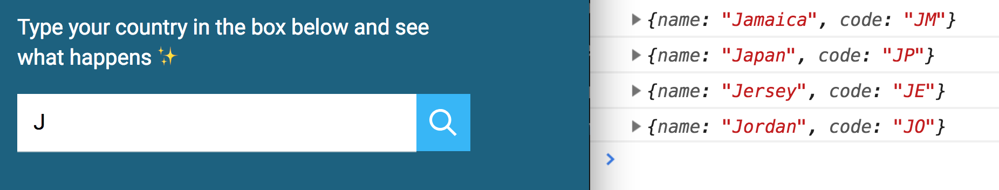

# Building an autocomplete text field

You'll learn how to build a autocomplete text field. This is what you'll get by the end of the lesson.

<figure>
  
  <figcaption></figcaption>
</figure>

You can get the starter files from `components/09.autocomplete/01.starter`.

## What is an autocomplete field?

When I say autocomplete, I don't mean the autocomplete feature that comes together with browsers.

<figure>
  
  <figcaption>Not this autocomplete!</figcaption>
</figure>

The autocomplete feature that comes with browsers have one major drawback—they only show users things they filled in before.

The autocomplete feature we're building is like Google's search. It gives you possible choices to choose from.

<figure>
  
  <figcaption></figcaption>
</figure>

Note: Sometimes autocomplete is called typeahead because it shows results ahead of whatever you're typing.

## The HTML

When you use autocomplete, you want to help users fill up a form. This means the component should be wrapped with a `<form>` element.

```html
<form action="#">
  <label>Type something:</label>
  <input type="text" name="autocomplete">
  <button type="submit">...</button>
</form>
```

We need to prevent browsers from activating their autocomplete since we're providing our version. To do so, we set `autocomplete` to `off`.

If we want to create our own autocomplete, we need to prevent browsers from activating their autocomplete. This means we set `autocomplete` to `off`.

```html
<form action="#" autocomplete="off">
  <label>Type something:</label>
  <input type="text" name="autocomplete">
  <button type="submit">...</button>
</form>
```

For the autocomplete we're building, we're going to help users type their country into the field. Here's the modified HTML we're using.

Note: we're skipping the label because there's already some help text before the form.

```html
<form action="#" autocomplete="off">
  <input type="text" name="country" id="country">
  <button type="submit"> ... </button>
</form>
```

This has already been created for you in the starter file.

### The dropdown box

When a user fills up the autocomplete field, we want to display a box to show possible options they can choose.

We're going to call this box a dropdown.

The dropdown contains a list of possible choices. Since it's a list, we should use the `<ul>` element.

```html
<form action="#" autocomplete="off">
  <input ...>
  <button type="submit"> ... </button>

  <ul class="dropdown">
    <li> Item 1 </li>
    <li> Item 2 </li>
    <li> Item 3 </li>
  </ul>
</form>
```

The dropdown is hidden when the autocomplete is empty.

```css
.dropdown {
  display: none;
}
```

<figure>
  
  <figcaption></figcaption>
</figure>

When a user types something into the autocomplete, we want to show the dropdown. We can do this by attaching an `is-filled` class to the autocomplete.

```html
<form action="#" autocomplete="off">
  <input class="is-filled" ...>
  <!-- ... -->
</form>
```

When the autocomplete has an `is-filled` class, we can use the `+` (adjacent sibiling) and `~` (subsequent sibling) selectors to light up the search icon and show the dropdown.

```css
input.is-filled + .search-icon {
  background-color: var(--accent);
}

input.is-filled ~ .dropdown {
  display: block;
}
```

<figure>
  
  <figcaption></figcaption>
</figure>

This has also been done for you in the starter file.

## The JavaScript

You should see a `countries` array in your JavaScript file. This `countries` array contains the name and country code of 249 countries in the world.

Here's an example:

```js
[
  { name: 'Japan', code: 'JP' },
  { name: 'Jordan', code: 'JO' },
]
```

Let's say the user typed `j` in the autocomplete. Countries with names beginning with J should be shown in the dropdown box.

From this list, we have Jamaica, Japan, Jersey and Jordan.

<figure>
  
  <figcaption></figcaption>
</figure>

If the user types `ja` into the autocomplete, only countries beginning with `Ja` should show up in the dropdown.

From this list, we have Jamaica and Japan.

<figure>
  
  <figcaption></figcaption>
</figure>

This means we need to do three things with JavaScript:

1. Check if there autocomplete contains text
2. Create a list of countries that match the text
3. Populate the dropdown with the matched countries.

### Checking if the autocomplete contains text

We can use the `input` event to detect user input. It fires whenever a user types into a form field.

```js
const autocomplete = document.querySelector('input')
autocomplete.addEventListener('input', event => {
  // do something
})
```

We can use the autocomplete's `value` property to check whether the autocomplete contains any text.

If the autocomplete contains text, we show the dropdown by adding a `is-filled` class. Otherwise, we hide the dropdown by removing the `is-filled` class.

```js
input.addEventListener('input', event => {
  const val = autocomplete.value

  if (val) {
    autocomplete.classList.add('is-filled')
  } else {
    autocomplete.classList.remove('is-filled')
  }
})
```

<figure>
  
  <figcaption></figcaption>
</figure>

Try adding a space into the autocomplete. You'll notice the input shows up as well.

<figure>
  
  <figcaption></figcaption>
</figure>

This shouldn't happen. We don't want a space character to trigger open the dropdown. So, we `trim` any whitespaces before we check if `val` is filled.

```js
input.addEventListener('input', event => {
  const val = input.value.trim()
  // ...
})
```

We don't need to run any following that follows if the autocomplete is not filled, so we'll return the function early.

```js
autocomplete.addEventListener('input', event => {
  const val = autocomplete.value

  if (val) {
    autocomplete.classList.add('is-filled')
  } else {
    autocomplete.classList.remove('is-filled')
    return false
  }
})
```

We can clean the `if` statement up a bit here. This code below does the same as the code above.

```js
autocomplete.addEventListener('input', event => {
  const val = autocomplete.value.trim().toLowerCase()
  autocomplete.classList.remove('is-filled')
  if (!val) return

  autocomplete.classList.add('is-filled')
})
```

Before we move on, remove the dummy `<li>` items from the HTML. We don't need them going forward.

```html
<form action="#" autocomplete="off">
  <!-- ... -->
  <ul class="dropdown"></ul>
</form>
```

### Create a list of countries that match the text

We can filter the `countries` array with the value the user typed into autocomplete.

Let's do this step by step.

First, we'll write a filter function and `console.log` each country in our `countries` array. You should see a JavaScript object in the console for each loop, and this object contains a `name` property and a `code` property.

```js
input.addEventListener('input', event => {
  // ...
  const matches = countries.filter(country => {
    console.log(country)
  })
})
```

<figure>
  
  <figcaption></figcaption>
</figure>

We want to check whether the country name starts with the letter `j`. Here, we can use the `startsWith` method. `startsWith` let's you check whether a string starts with the arguments you entered.

```js
'My name'.startsWith('M') // true
'My name'.startsWith('My') // true
```

If the country starts with `j`, we'll log the country.

```js
input.addEventListener('input', event => {
  // ...
  const matches = countries.filter(country => {
    if (country.name.startsWith(val)) {
      console.log(country)
    }
  })
})
```

At this point, if you typed `J` (uppercased) into autocomplete, you'll see the four countries in your console. However, if you typed `j` (lowercased) into autocomplete, you won't see anything.

<figure>
  
  <figcaption></figcaption>
</figure>

This happens because `startsWith` is case-sensitive. We need to make sure the cases match. One way to do so is make both `val` and `country.name` lowercased.

We can do this with `toLowerCase`.

```js
input.addEventListener('input', event => {
  const val = autocomplete.value.trim().toLowerCase()
  // ...
  const matches = countries.filter(country => {
    if (country.name.toLowerCase().startsWith(val)) {
      console.log(country)
    }
  })
})
```

Try typing both `J` and `j` into the autocomplete field. You'll see the four objects in each.

Since `filter` creates a new array with values that are truthy, we can return the `if` condition we wrote to get the filtered array.

```js
input.addEventListener('input', event => {
  const val = autocomplete.value.trim().toLowerCase()
  // ...
  const matches = countries.filter(country =>
    country.name.toLowerCase().startsWith(val)
  )
})
```

If you `console.log(matches)`, you should see an array with four objects.

<figure>
  
  <figcaption></figcaption>
</figure>

### Filtering based on country code

What happens if a user types `us` into the autocomplete?

`us` is the country code for United States. If they type `us`, it's pretty obvious they're searching for United States. We should show it in the dropdown as well.

To do so, we need to change our `filter` function such that it checks for the country code as well. If the country code starts with the value the user type, we add it into our filtered array.

```js
input.addEventListener('input', event => {
  const matches = countries.filter(country =>
    country.name.toLowerCase().startsWith(val) ||
    country.code.toLowerCase().startsWith(val)
  )
})
```

Try typing `us` in the autocomplete. You'll see United states in your console if you logged matches.

<figure>
  
  <figcaption></figcaption>
</figure>

### Creating the list of items

When the user types `j` into the autocomplete, we want to show Jamaica, Japan, Jersey, and Jordan in the dropdown. Here's what the HTML should look like:

```html
<ul class="dropdown">
  <li>Jamaica</li>
  <li>Japan</li>
  <li>Jersey</li>
  <li>Jordan</li>
</ul>
```

To do so, we can set the dropdown's `innerHTML` to a string that contains the four countries:

```js
dropdown.innerHTML = `
  <li>Jamaica</li>
  <li>Japan</li>
  <li>Jersey</li>
  <li>Jordan</li>
`
```

We can create this string with `map` and `join`

Since we have an array of matched countries, we can use `map` and `join` to create our HTML string.

```js
autocomplete.addEventListener('input', event => {
  // ...
  const htmlString = matches.map(match => `<li>${match.name}</li>`)
    .join('')

  dropdown.innerHTML = htmlString
})
```

<figure>
  
  <figcaption></figcaption>
</figure>

Since `matches` is an array, we can chain `filter`, `map` and `join` together.

```js
autocomplete.addEventListener('input', event => {
  // ...
  dropdown.innerHTML = countries.filter(country =>
    country.name.toLowerCase().startsWith(val) ||
    country.code.toLowerCase().startsWith(val)
  )
    .map(match => `<li>${match.name}</li>`)
    .join('')
})
```

## Filling up the text field

When a user clicks on a dropdown item, we want to fill up the text field with that item. This means we listen for a click event on each list item.

We can use an event delegation pattern for our `click` listener. In this case, we're only listening for clicks on the `<li>` element.

```js
dropdown.addEventListener('click', e => {
  if (!e.target.matches('li')) return
})
```

If the list item was clicked, then we replace the input value with the contents of the clicked item.

```js
dropdown.addEventListener('click', e => {
  if (!e.target.matches('li')) return
  const li = e.target
  autocomplete.value = li.textContent
})
```

We also hide the dropdown and remove any items in the dropdown.

```js
dropdown.addEventListener('click', e => {
  // ...
  dropdown.classList.remove('is-filled')
  dropdown.innerHTML = ''
})
```

## Exercise

The main challenge for the autocomplete exercise is filtering the countries list. Try this again. Understand the strings a bit more and you'll be able to use them like the back of your hand.
