# 🔨 Todolist: The HTML and CSS

The Todolist is a component many developers build at least once in their lives. It doesn't matter whether you've tried to build it before. We'll do it together now.

Here's an image of the Todolist we'll build. It's a simple one. You should be able to:

1. Add a task
2. Mark a task to be done
3. Edit a task
4. Delete a task

<figure>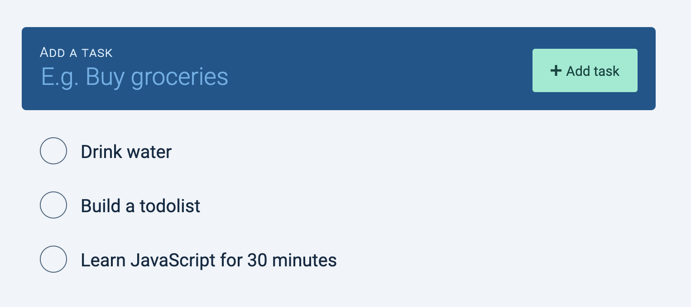</figure>

You can get the starter files for this Todolist from `components/08.todolist/01.starter`

## The structure

The Todolist can be split into two parts:

1. The new task part
2. A list of todos

<figure>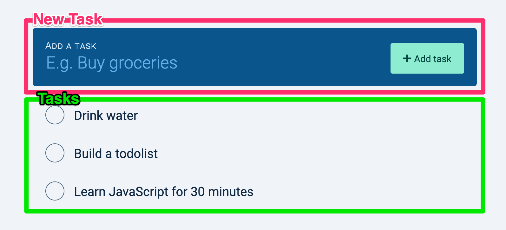</figure>

Whenever we want to get information from users, we want to use a `<form>` element. This is how we'll start the Todolist.

```html
<form action="#" class="todolist" autocomplete="off">
  <!-- Add new task -->
  <!-- List of todos -->
</form>
```

Note: We set `autocomplete` to `off` because we don't want browsers to trigger their autocomplete window.

## HTML for adding tasks

First, we'll use a `<div>` to wrap the new task part.

```html
<form action="#" class="todolist__add" autocomplete="off">
  <div class="todolist__new-task"> ... </div>
  <!-- List of todos -->
</form>
```

From the design, you can see we need three things in the part for adding a new task:

1. A label
2. A text input field
3. A submit button

To make the design easier to code, I wrapped the label and input in one `<div>`. Here's the HTML for the new task part:

```html
<div class="todolist__new-task">
  <div class="new-task__input-group">
    <label for="add">Add a task</label>
    <input
      type="text"
      id="new-task"
      name="new-task"
      placeholder="E.g. Buy groceries"
    />
  </div>
  <button type="submit">
    <svg viewBox="0 0 10 10">
      <path d="M6 4h4v2H6v4H4V6H0V4h4V0h2z" fill-rule="nonzero" />
    </svg>
    <span>Add task</span>
  </button>
</div>
```

<figure>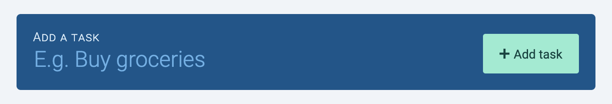</figure>

## HTML for the list of todos

The Todolist contains a list of Todos. We'll call each Todo item a "task" because "task" is easier to say and write compared to "todo item".

We'll create the list of tasks with an unordered list.

```html
<form action="#" class="todolist__add" autocomplete="off">
  <div class="todolist__new-task"> ... </div>
  <ul class="todolist__tasks">
    <li class="task"> ... </div>
    <li class="task"> ... </div>
    <li class="task"> ... </div>
  </ul>
</form>
```

## HTML for each task

Each task contains three things:

1. A checkbox
2. The task name
3. A delete button

<figure>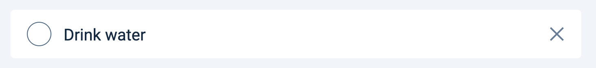</figure>

We'll make the task name and the delete button first because they're easy:

```html
<li class="task">
  <span class="task__name">Drink water</span>
  <button type="button" class="task__delete-button">
    <svg viewBox="0 0 20 20">
      <path d="M10 8.586L2.929 1.515 1.515 2.929 8.586 10l-7.071 7.071 1.414 1.414L10 11.414l7.071 7.071 1.414-1.414L11.414 10l7.071-7.071-1.414-1.414L10 8.586z"/>
    </svg>
  </button>
</li>
```

You should have this now:

<figure>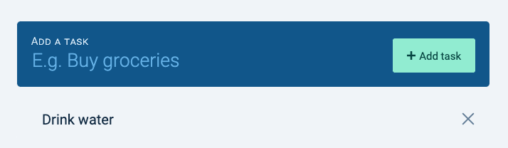</figure>

### Making the checkbox

We can make a checkbox with an input element. Here, we set `type` to `checkbox`.

```html
<li class="task">
  <input type="checkbox" id="task">
  <span class="task__name">Drink water</span>
  <button type="button" class="task__delete-button"> ... </button>
</li>
```

<figure>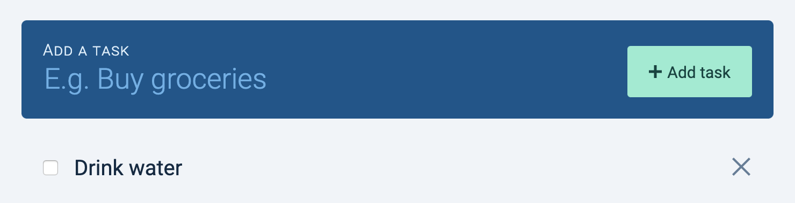</figure>

When the checkbox is checked, we want to strike out the task. This marks the task as "complete".

We need to know two CSS things to do this:

1. The `:checked` pseudo-class
2. The adjacent sibling combinator

The `:checked` pseudo-class tells us whether a checkbox is checked.

```css
input[type="checkbox"] {
  /* Not checked */
}

input[type="checkbox"]:checked {
  /* Checked */
}
```

The adjacent sibling combinator (`+`) allows us to style a second element if it follows the first element.

```css
/* This will style <h2> only if HTML looks like this:
 * <h1> ... </h1>
 * <h2> ... </h2>
 */
h1 + h2 {
  color: red;
}
```

We can use `:checked` and `+` to style strikeout a task.

```css
input[type="checkbox"]:checked + .task__name {
  text-decoration: line-through;
}
```

<figure>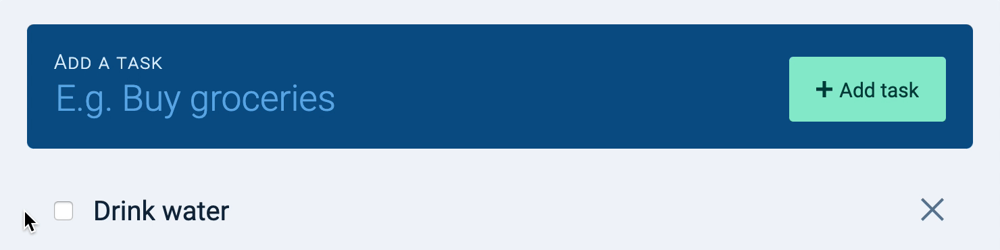</figure>

Next, we want to style the checkbox to fit our design.

Unfortunately, browsers make it hard for us to style `<input>` elements. We will create a `<label>` element after the `<input>`, and we'll style the `<label>` instead.

```html
<li class="task">
  <input type="checkbox" id="task">
  <label for="task">
    <svg viewBox="0 0 20 15">
      <path d="M0 8l2-2 5 5L18 0l2 2L7 15z" fill-rule="nonzero" />
      </svg>
  </label>
  <span class="task__name">Drink water</span>
  <button type="button" class="task__delete-button"> ... </button>
</li>
```

I went ahead and styled the label according to the design, so this is what you should see at this point:

<figure>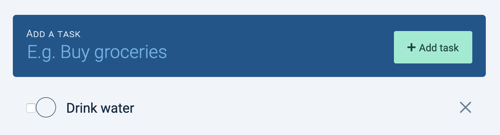</figure>

When the checkbox is checked, we want to use style the label so it is checked. We can use the same `:checked` and `+` trick we used earlier to create this effect.

```css
/* Note: This is already styled for you in the Starter CSS file */
input[type="checkbox"]:checked + label {
  /* Check the label */
}
```

You should get this effect:

1. When you check the checkbox, the label should get checked.
2. When you uncheck the checkbox, the label should get unchecked.
3. When you check the label, the checkbox should get checked.
4. When you uncheck the label, the checkbox should get unchecked.

<figure>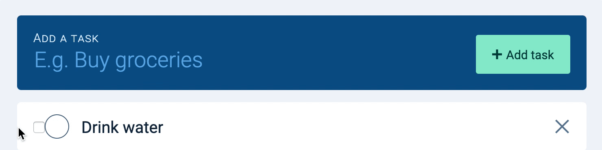</figure>

Notice the strikeout style didn't apply to `.task__name` anymore? This happens because we added `<label>` between our checkbox and `.task__name`. The `:checked` and `+` trick doesn't work anymore.

To fix the strikeout style, we can use the general-sibling combinator (`~`). `~` works like `+`, but it applies to any sibling that comes after the first selector.

Here's the fix:

```css
input[type="checkbox"]:checked ~ .task__name {
  text-decoration: line-through;
}
```

And it should work again.

<figure>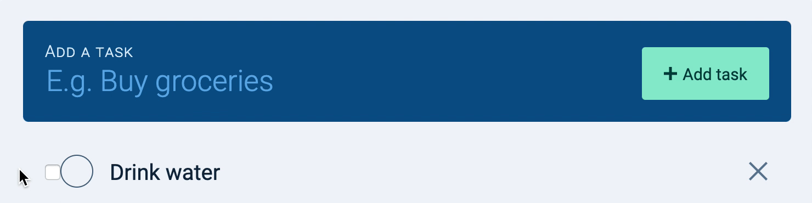</figure>

Next, we want to hide the checkbox visually. There are two steps to do this.

First, we take the checkbox out of the document flow with `position: absolute`. This means the checkbox doesn't take up any space.

```css
.task input[type="checkbox"] {
  position: absolute;
}
```

<figure>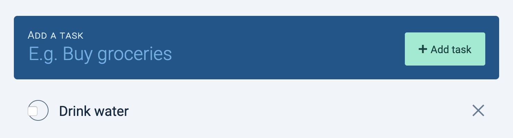</figure>

Second, we hide the checkbox with `opacity: 0`. This makes the checkbox invisible to the eyes.

```css
.task input[type="checkbox"] {
  position: absolute;
  opacity: 0;
}
```

<figure></figure>

## Making a second task

You can copy/paste the HTML of the first task to make the second task.

Make sure you change the `id` attribute (on the checkbox) and `for` attribute (on the label) so the checkbox syncs its corresponding label.

```html
<ul>
  <li class="task">
    <input type="checkbox" id="task-1">
    <label for="task-1"> ...  </label>
    <!-- ... -->
  </li>

  <li class="task">
    <input type="checkbox" id="task-2">
    <label for="task-2"> ...  </label>
    <!-- ... -->
  </li>
<ul>
```

<figure>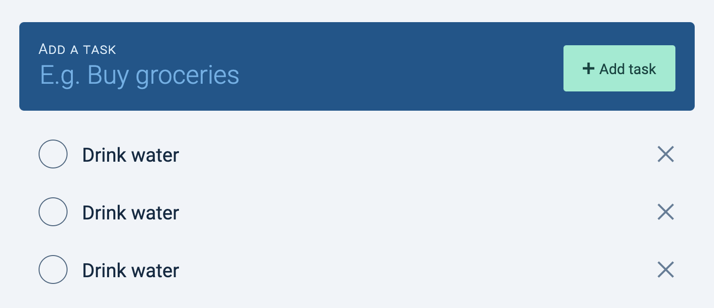</figure>

## The delete button

We want to hide the button to delete a task at first. This reduces things we place on the UI (and hence reduces cognitive load).

We only want to show the delete button when a user hovers over the task. We can change its `opacity` to do this.

```css
.task__delete-button {
  opacity: 0;
}

/* This one is done for you */
.task:hover .task__delete-button {
  opacity: 1;
}
```

<figure>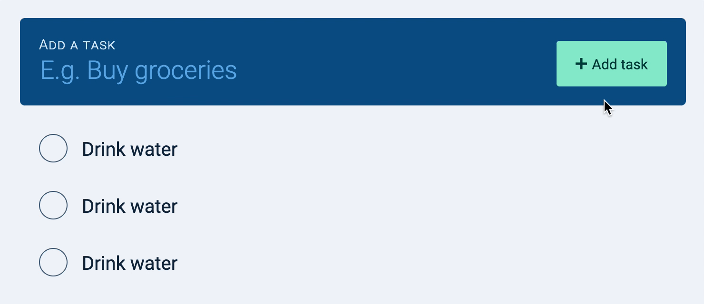</figure>

Now there's one thing left to do.

## Making the empty state

What happens when there are no tasks? Try deleting the tasks you created. This is what you'll see.

<figure></figure>

A user who stumbles onto this empty Todolist may not know they can create tasks with the new task form. We can make it clearer to them with some text that says the Todolist is empty.

<figure>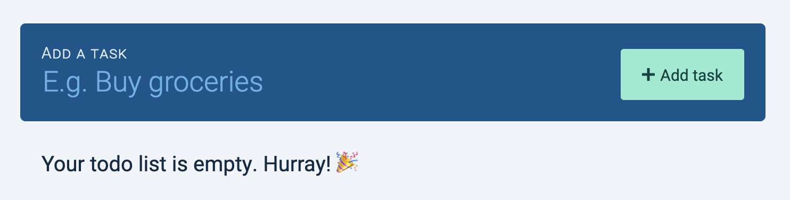</figure>

To build this empty state, we add an extra `<div>` after `.tasks`.

```html
<form action="#" class="todolist__add" autocomplete="off">
  <div class="todolist__new-task"> ... </div>
  <ul class="todolist__tasks"> ... </ul>
  <div class="todolist__empty-state"> Your todo list is empty. Hurray! 🎉 </div>
</form>
```

We want to display `.todolist__empty-state` only when there are no tasks in `.tasks`. We can do this with the `:empty` pseudo-class.

```css
.tasks + div {
  display: none;
}

.tasks:empty + div {
  display: block;
}
```

Note: `:empty` only works if the `.tasks` is really empty. This means the `<ul>` element cannot contain any whitespaces, like this:

```html
<ul class="todo"></ul>
<div>
  <p>Your task list is empty. Hurray! 🎉</p>
</div>
```

Try removing the whitespaces manually from the HTML. You should be able to get this to work.

<figure></figure>

That's it for the HTML and CSS!