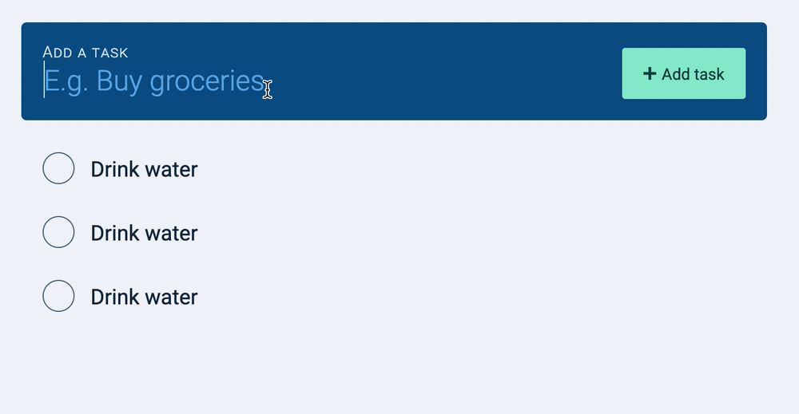
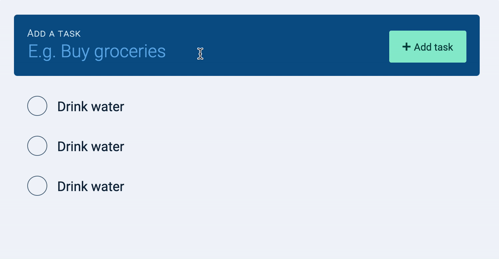
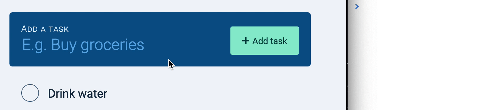
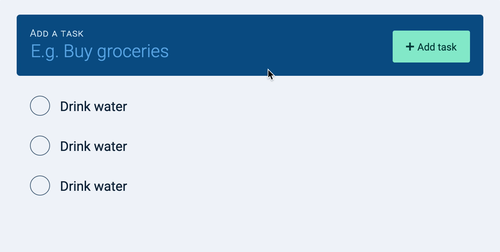
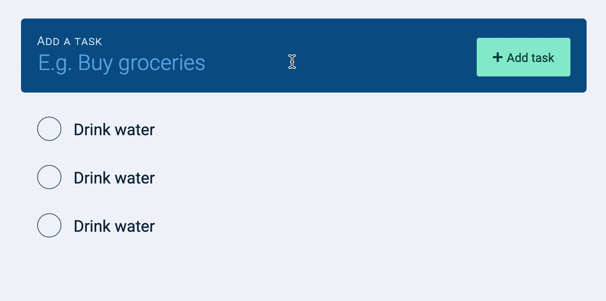
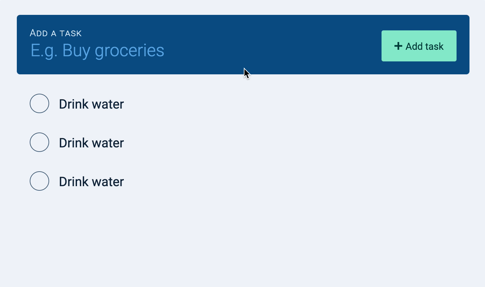

# 🔨 Todolist: Creating tasks with JavaScript

We want to add a task to the tasklist when a user clicks on the "add task" button. 

<figure></figure>

We also want to add a task to the tasklist if the user presses the "Enter" button. 

<figure></figure>

The best way to listen to both events (click and enter) is to listen to the form's `submit` event. 

```js
const todolist = document.querySelector('.todolist')

todolist.addEventListener('submit', ev => {
  // Add a new task
}) 
```

Note: By default, the `submit` event navigates a user to the url mentioned it the `action` attribute. We want to prevent this behavior since we're building custom functionality. 

```js
const todolist = document.querySelector('.todolist')
todolist.addEventListener('submit', ev => {
  ev.preventDefault()
  
  // Add a new task
})
```

There are three steps to creating a task: 

1. Get what the user typed 
2. Create the task 
3. Append the task into the DOM

## Getting what the user typed

First, we need to know what the user typed into the new task field. We can get this information through the input's `value` property. 

When we get the value, we also want to `trim` the contents so we don't get any extra whitespaces. 

```js
todolist.addEventListener('submit', ev => {
  ev.preventDefault()

  // Get value of task
  const newTaskField = todolist.querySelector('input')
  const inputValue = newTaskField.value.trim()
  console.log(inputValue)
})
```

<figure></figure>

## Creating a task

To create a task, we need to create an `<li>` element. This element should have the `.task` class.

```js
todolist.addEventListener('submit', ev => {
  // ... 

  // Create task 
  const taskEl = document.createElement('li')
  taskEl.classList.add('task')
})
```

We need to populate the task's `innerHTML` with the checkbox, label, the task name, and the delete button. Here, we can copy-paste the code from the HTML we wrote. 

```js
const task = document.createElement('li')
taskEl.classList.add('task')
taskEl.innerHTML = `
  <input type="checkbox" id="task-1" />
  <label for="task-1">
    <svg viewBox="0 0 20 15">
      <path d="M0 8l2-2 5 5L18 0l2 2L7 15z" fill-rule="nonzero" />
    </svg>
  </label>
  <span class="task__name">Drink water</span>
  <button type="button" class="task__delete-button">
    <svg viewBox="0 0 20 20">
      <path d="M10 8.586L2.929 1.515 1.515 2.929 8.586 10l-7.071 7.071 1.414 1.414L10 11.414l7.071 7.071 1.414-1.414L11.414 10l7.071-7.071-1.414-1.414L10 8.586z" />
    </svg>
  </button>`
```

The code above would produce a task that says "Drink water".

We don't want a task that says "Drink water". We want a task that's entered by the user. To do this, we can change the task name to `inputValue`. 

```js
taskEl.innerHTML = `
  <input type="checkbox" id="task-1" />
  <label for="task-1">
    <svg viewBox="0 0 20 15">
      <path d="M0 8l2-2 5 5L18 0l2 2L7 15z" fill-rule="nonzero" />
    </svg>
  </label>
  <span class="task__name">${inputValue}</span>
  <button type="button" class="task__delete-button">
    <svg viewBox="0 0 20 20">
      <path d="M10 8.586L2.929 1.515 1.515 2.929 8.586 10l-7.071 7.071 1.414 1.414L10 11.414l7.071 7.071 1.414-1.414L11.414 10l7.071-7.071-1.414-1.414L10 8.586z" />
    </svg>
  </button>`
```

When we use a user-entered value in `innerHTML`, we must sanitize it. This prevents our website from being susceptible to cross-site-scripting attacks. 

```html
<body> 
  <form class="todolist"> ... </form>

  <!-- Adds DOMPurify library -->
  <script src="https://cdnjs.cloudflare.com/ajax/libs/dompurify/1.0.7/purify.min.js"></script>
</body>
```

```js
// Sanitize the innerHTML
taskEl.innerHTML = DOMPurify.sanitize(`
  <input type="checkbox" id="task" />
  <label for="task">
    <svg viewBox="0 0 20 15">
      <path d="M0 8l2-2 5 5L18 0l2 2L7 15z" fill-rule="nonzero" />
    </svg>
  </label>
  <span class="task__name" value="${inputValue}"></span>
  <button type="button" class="task__delete-button">
    <svg viewBox="0 0 20 20">
      <path d="M10 8.586L2.929 1.515 1.515 2.929 8.586 10l-7.071 7.071 1.414 1.414L10 11.414l7.071 7.071 1.414-1.414L11.414 10l7.071-7.071-1.414-1.414L10 8.586z" />
    </svg>
  </button>`)
```

## Changing the id

The checkbox in each task needs to have a unique `id`. And the `<label>` in each task needs a `for` attribute that links to the checkbox's `id`. (Otherwise, you can't check the correct checkbox). 

The best way to create a unique `id` is to use `generateUniqueString`. We talked about this in "[Generating Unique IDs]()". 

```js
const generateUniqueString = length =>
  Math.random().toString(36).substring(2, 2 + length)
```

```js
const uniqueID = generateUniqueString(10)
const taskEl = document.createElement('li')
taskEl.classList.add('task)
taskEl.innerHTML = DOMPurify.sanitize(`
  <input type="checkbox" id="${uniqueID}" />
  <label for="${uniqueID}">
    <svg viewBox="0 0 20 15">
      <path d="M0 8l2-2 5 5L18 0l2 2L7 15z" fill-rule="nonzero" />
    </svg>
  </label>
  <span class="task__name">${inputValue}</span>
  <button type="button" class="task__delete-button">
    <svg viewBox="0 0 20 20">
      <path d="M10 8.586L2.929 1.515 1.515 2.929 8.586 10l-7.071 7.071 1.414 1.414L10 11.414l7.071 7.071 1.414-1.414L11.414 10l7.071-7.071-1.414-1.414L10 8.586z" />
    </svg>
  </button>`)
```

## Appending to the DOM

We can append the `taskEL` to the DOM with `appendChild`.

```js
todolist.addEventListener('submit', ev => {
  ev.preventDefault()
  // Get what the user typed 
  // Create task 

  // Append to the DOM 
  const tasksEl = todolist.querySelector('.tasks')
  tasksEl.appendChild(task)
})
```

Here's what you should have: 

<figure></figure>

## UX Improvements

Notice the task remains in the new task field after we added it to the DOM? This makes it hard for users to enter a second task. They have to delete the first task manually before they can enter a new one. 

We can make it easy for them by removing text from the new task field. 

```js
todolist.addEventListener('submit', ev => {
  ev.preventDefault()
  // Get what the user typed 

  // Clear the new task field 
  newTaskField.value = ''

  // Create task 
  // Append to the DOM 
})
```

<figure></figure>

Next, notice input loses focus if you click on the "add task" button? Again, this makes it hard for users to enter a second task. They have to click on the input again before they can type. 

We can put focus back onto the new task form to make it easy for users to enter a second task. 

```js
todolist.addEventListener('submit', ev => {
  ev.preventDefault()
  // Get what the user typed 
  // Clear the new task field 

  // Bring focus back to input field
  newTaskField.focus()

  // Create task 
  // Append to the DOM 
})
```

<figure></figure>

Another thing.

Right now, users can add an empty task to the tasklist. 

<figure></figure>

We want to prevent empty tasks from getting into the tasklist. We can do this by aborting the listener (and not do anything) unless `inputValue` is truthy. 

```js
todolist.addEventListener('submit', ev => {
  ev.preventDefault()
  // Get what the user typed 
  // Clear the new task field 
  // Bring focus back to input field

  // Prevent adding of empty task 
  if (!inputValue) return

  // Create task 
  // Append to the DOM 
})
```

## Cleaning up

Our event listener is pretty long new. We can make it easier to understand by abstracting the part that makes the task into a separate function. 

Here's what it looks like:

```js
const makeTaskEl = taskname => {
  const uniqueID = generateUniqueString(10)
  const taskEl = document.createElement('li')
  taskEl.classList.add('task')
  taskEl.innerHTML = DOMPurify.sanitize(`
    <input type="checkbox" id="${uniqueID}" />
    <label for="${uniqueID}">
      <svg viewBox="0 0 20 15">
        <path d="M0 8l2-2 5 5L18 0l2 2L7 15z" fill-rule="nonzero" />
      </svg>
    </label>
    <span class="task__name">${taskname}</span>
    <button type="button" class="task__delete-button">
      <svg viewBox="0 0 20 20">
        <path d="M10 8.586L2.929 1.515 1.515 2.929 8.586 10l-7.071 7.071 1.414 1.414L10 11.414l7.071 7.071 1.414-1.414L11.414 10l7.071-7.071-1.414-1.414L10 8.586z" />
      </svg>
    </button>`
  )
  return taskEl
}
```

Using it: 

```js
todolist.addEventListener('submit', ev => {
  ev.preventDefault()
  // ...
  const taskEl = makeTaskEl(inputValue)
  // ...
})
```

That's it! 

