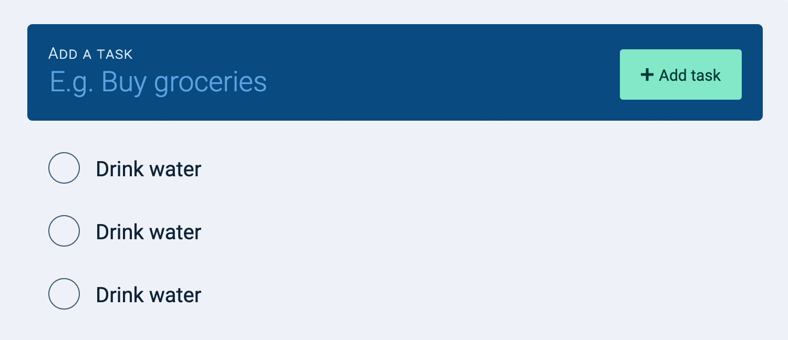

# 🔨 Todolist: Deleting tasks with JavaScript

When a user clicks the delete button, we want to delete the corresponding task. 

<figure></figure>

## Deleting tasks

A Todolist contains many tasks. Each task contains a delete button. In this case, the best way to delete a task is to use an event delegation pattern. 

```js
todolist.addEventListener('click', ev => {
  // Deletes a task
})
```

We only want to activate the event listener if the user clicks o the delete button. This means we bail if the clicked element is not a delete button. 

```js
todolist.addEventListener('click', ev => {
  if (!ev.target.matches('.task__delete-button')) return
  // Deletes a task
})
```

If the user clicks on the delete button, we want to find the task element to remove. The task element is the parent element of the delete button. 

```js
todolist.addEventListener('click', ev => {
  if (!ev.target.matches('.task__delete-button')) return

  // Deletes a task
  const taskEl = ev.target.parentElement
})

```

We can use `removeChild` to delete a task. This means we need to know what's the `parentElement` of the task too. 

```js
todolist.addEventListener('click', ev => {
  if (!ev.target.matches('.task__delete-button')) return

  // Deletes a task
  const taskEl = ev.target.parentElement
  const tasksEl = taskEl.parentElement

  tasksEl.removeChild(taskEl)
})
```

<figure></figure>

## Triggering the empty state

We want to trigger the empty state if there are no more tasks in the tasklist. This empty state can only be triggered if there are no whitespaces in the HTML (because of the way we built it). 

Each time we delete a task, we want to check if there are any tasks left in the tasklist. If there are no tasks left in the tasklist, we set the `innerHTML` to `''` to remove all whitespace. 

```js
todolist.addEventListener('click', ev => {
  if (!ev.target.matches('.task__delete-button')) return

  const taskEl = ev.target.parentElement
  const tasksEl = taskEl.parentElement

  // Removes the task
  tasksEl.removeChild(taskEl)
  
  // Triggers empty state
  if (tasksEl.children.length === 0) {
    tasksEl.innerHTML = ''
  }
})  
```

<figure></figure>

That's it!