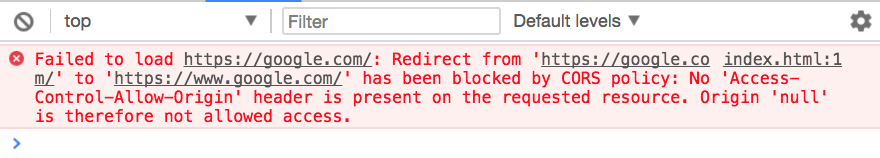
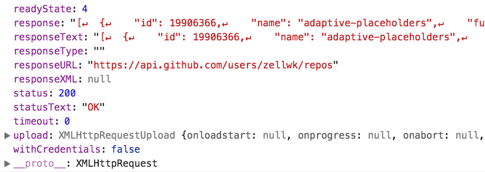

# Introduction to Ajax

AJAX stands for Asynchronous JavaScript and XML.

It is often used as a term to say:

1. Get (or send) some data to the server
2. Wait for the server to send something back
3. Update the page without refreshing it

## XML

XML stands for Extensible markup language. It was a standard we used to pass information between browsers and servers in the past.

But we rarely use XML now. We use another format called JSON. You'll learn about JSON in the next lesson.

## XMLHttpRequest

`XMLHttpRequest` (XHR for short) is a method we used to send and retrieve data. It's the technology that made Ajax possible.

If you want to get data back from a server, you need to send something to the server first.

We call this data you send to the server a **request**. We call the stuff the server sends back a **response**. The action (sending a request and getting a response) is called a **fetch**.

To send a request, we need to create an `XMLHttpRequest` object first.

```js
const request = new XMLHttpRequest()
```

We want to know when a response comes back from the server. To do so, we to listen for the `load` event.

```js
request.addEventListener('load', e => {
  // do something
})
```

Next, we want to construct the request. This is how it looks like:

```js
request.open(method, link)
```

`method` is the type of request you want to send. We will explain what method is in a later lesson. For now, let's set `method` to `get`.

`link` is the place you want to request information from. The requested information is also called a resource. If we want to get a list of my Github repositories, we can use `https://api.github.com/users/zellwk/repos`.

```js
request.open('get', 'https://api.github.com/users/zellwk/repos')
```

Finally, we need to send the request out.

```js
request.send()
```

Here's the entire `XMLHttpRequest` we created together.

```js
const request = new XMLHttpRequest()
request.addEventListener('load', e => { /* do something */ })
request.open('get', 'https://api.github.com/users/zellwk/repos')
request.send()
```

## The server must accept your request

Servers can choose to accept or reject your request. If you send a request to a server that does not accept requests from browsers, you'll get an error that says "No 'Access-Control-Allow-Origin' header is present on the requested resource".

```js
request.open('get', 'https://google.com')
```

<figure>
  
  <figcaption>You cannot fetch `https://google.com`</figcaption>
</figure>

## The callback

We're interested in the event target (the `XMLHttpRequest` itself). If you log the target, you'll see the response.

```js
request.addEventListener('load', e => {
  console.log(e.target)
})
```

<figure>
  
  <figcaption aria-hidden>Response from the server</figcaption>
</figure>

The `response` property contains the data you requested from the server. This data is often called the **body** or the **payload**.

If you pay attention to `response`, you will notice that the response looks like a string. This string is a JSON string (which brings us to the next lesson on JSON).

## A note on rate limits

You can send 60 requests to Github every hour. If you send more, you'll get an 403 (forbidden) error that says.

<figure>
  
  <figcaption>An error message due to a rate limit</figcaption>
</figure>

This 60 request per hour thing is a rate limit. API creators use them to limit the number of requests you can make. They help prevent the API from crashing due to too many requests.

The limit can increase when you are authenticated (or logged in). For example, Github lets you send up to 5000 authenticated requests every hour.

The only way to "fix" an error due to rate limits is to wait until your limit refreshes. (In short, try again later).

## Exercise

Answer these questions:

1. What is AJAX?
2. Why do we use Ajax?
3. What is a request?
4. What is a response?
5. What is a fetch?
6. What is a rate limit?

Do this:

1. Send a request to Github. Ask for a list of your repositories.
  1. Hint: replace `zellwk` with your Github username.
  2. If you don't know your Github username, request for a list of my repositories.
2. Log the response from the server.

