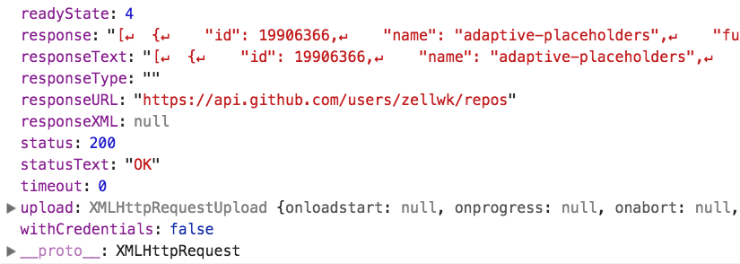

# Understanding JSON

JSON stands for JavaScript Object Notation.

We use JSON as the main format to pass information between browsers and servers today.

A JSON Object looks like a JavaScript object. The major difference between JSON and JavaScript is

1. JSON can only contain strings
2. JSON property and value pairs are always wrapped with double quotes

Here's an example of a JSON object (that's formatted for you to read).

```json
{
  "firstName": "Zell",
  "lastName": "Liew",
  "occupation": "developer",
  "age": "30"
}
```

## JavaScript <-> JSON

**To convert a JavaScript object to JSON**, we use `JSON.stringify`.

```js
const macbook = {
  operatingSystem: 'macOS Sierra',
  screenResolution: '2880x1800',
  usbPorts: 2
}

const jsonMac = JSON.stringify(macbook)
```

If you log `jsonMac` into the console, you'll see a string.

<figure>
  
  <figcaption>Converting from JavaScript to JSON</figcaption>
</figure>

**To convert JSON to JavaScript**, we use `JSON.parse`.

```js
const jsMac = JSON.parse(jsonMac)
```

If you log `jsMac` into the console, you'll see a JavaScript object.

<figure>
  
  <figcaption>Converting JSON to JavaScript</figcaption>
</figure>

## Parsing the response from XMLHttpRequest

Github responded with a list of my repositories in the previous lesson. This list can be found in the `response` property.

<figure>
  
  <figcaption aria-hidden>Response from Github</figcaption>
</figure>

The value for this `response` property is formatted in JSON. Before we can do anything with the JSON, we need to convert it to JavaScript. **This process is of interpreting and converting values is called parsing.**

```js
request.addEventListener('load', e => {
  const repos = JSON.parse(e.target.response)
  console.log(repos)
})
```

<figure>
  
  <figcaption aria-hidden>A list of my repositories</figcaption>
</figure>

## Massaging the data

Github gave us a lot of data. We have an array of 30 objects. Each object contains information about a Github repository.

<figure>
  
  <figcaption aria-hidden>Information about a repo is contained in each object</figcaption>
</figure>

Github sent us a lot of information! This information can feel overwhelming. That is why the first thing we do is reduce the information to what we need. Some developers call this process **massaging the data**.

To massage the data, you need to know what data we need. That would depend on what you are trying to do.

For our case, let's say we want to display a list of my Github repositories in the DOM. We want to know three things:

1. The name of the repository
2. The number of stars it has
3. The link to the repository

We want to create a list that looks like this:

```html
<ol>
  <li><a href="link-to-repo1">Name of repo1 (# of stars)</a></li>
  <li><a href="link-to-repo2">Name of repo2 (# of stars)</a></li>
  <li><a href="link-to-repo3">Name of repo3 (# of stars)</a></li>
  <li><a href="link-to-repo4">Name of repo4 (# of stars)</a></li>
</ol>
```

The first step is to extract the information we need. If you comb through all property and value pairs, you'll see we need these properties:

1. Name of the repo—`name`
2. Number of stars`stargazer_count`
3. Link to the repo—`html_url`

We can create a new array that contains only the information we need with `map`.

```js
const data = repos.map(repo => {
  return {
    name: repo.name,
    url: repo['html_url'],
    stars: repo['stargazers_count']
  }
})
```

<figure>
  
  <figcaption aria-hidden>Massaged data</figcaption>
</figure>

Once we have the data we need, we can create a list element, edit the list's `innerHTML`, and append it to the DOM.

```js
const ol = document.createElement('ol')

ol.innerHTML = data.map(repo => {
  return `<li>
    <a href="${repo.url}">${repo.name} (${repo.stars} stars)</a>
  </li>`
}).join('')

document.body.appendChild(ol)
```

<figure>
  
  <figcaption aria-hidden>List of repositories displayed in the DOM</figcaption>
</figure>

## Exercise

Answer these questions:

1. What is JSON?
2. How do you convert JavaScript to JSON?
3. How do you convert JSON back to JavaScript?

Do this:

1. Fetch my Github repositories
2. Create an array of repositories that have more than 50 stars.
3. Display this list in the DOM
