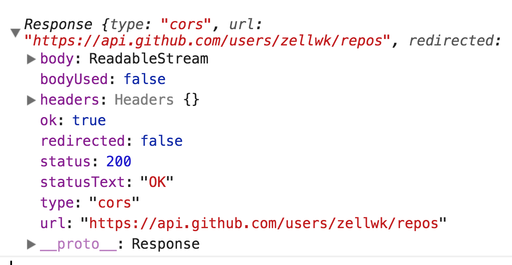
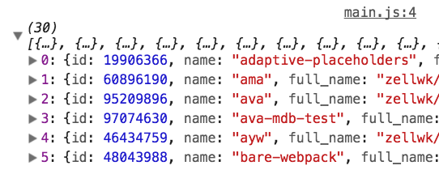

# The Fetch API

The Fetch API (Fetch from now on) is a newer method that lets you perform Ajax. It is a better alternative compared to XHR. It can be used in newer technologies, like Service Workers, where XHR is discouraged.

(We won't be covering Service Workers in this course).

## Fetching with Fetch

To send a request with Fetch, you use the `fetch` method.

```js
fetch(url, options)
```

`url` is the address you want to request information from.

`options` is a JavaScript object that lets you provide extra options. We'll examine the options in a later lesson.

Here's the fetch request to get a list of my Github repositories.

```js
fetch('https://api.github.com/users/zellwk/repos')
```

Note: Fetch sends out your request immediately when you write `fetch`. This is unlike XHR, where you send the request with `send` method.

## The response from Fetch

To see the response from Fetch, you need to write a `then` statement.

```js
fetch('https://api.github.com/users/zellwk/repos')
  .then(response => console.log(response))
```

<figure>
  
  <figcaption>Response with Fetch</figcaption>
</figure>

The response looks different from an XHR's response. The data we want is hidden in the `body` property as a readable stream.

We need to convert this readable stream into JavaScript before we can use it. To do so, we use the `json` method that comes with a Fetch response.

You will be able to see the data you requested a second `then` call.

```js
fetch('https://api.github.com/users/zellwk/repos')
  .then(response => response.json())
  .then(data => console.log(data))
```

<figure>
  
  <figcaption aria-hidden>A list of my repositories</figcaption>
</figure>

## Handling the data

The rest is similar—you need to massage the data before you can use it.

```js
fetch('https://api.github.com/users/zellwk/repos')
  .then(response => response.json())
  .then(data => {
    // Massage data and output to DOM here
  })
```

## Wrapping up

Fetch is based on promises. If we want to understand `fetch` and the whole `then` thing, we need to know what promises are and how they work.

## Exercise

Do this:

1. Send a request to Github with Fetch. Ask for a list of your repositories.
2. Display a list of repositories that have more than 59 stars.
