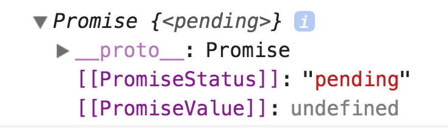

# JavaScript Promises

"Do you promise to buy a black forest cake for my birthday next week?", your daughter asks.

"Yeah, I promise", you say.

Promises in JavaScript are like promises in real life—we don't know if the promise will be fulfilled when it is made.

## How a promise works

In JavaScript, **a promise is an object that will return a value in future**. The promise between you and your daughter will look somewhat like this:

```js
const promise = buyCake('black forest')
```

We don't know if you'll fulfill the promise when you made it. At this point, we say the promise is **pending**.

### Fulfilling a promise

You fulfill your promise to your daughter if you show up with a black forest birthday cake on her birthday. In JavaScript, we say the promise is **fulfilled** or **resolved.**

When a promise gets fulfilled, you carry out the next set of instructions in a `then` method. `then` takes in a callback that accepts one argument.

```js
buyCake('black forest')
  .then(celebrateBirthday)
```

Some people call promises **thenables** (then-able) because they have a `then` method.

### Rejecting a promise

If you did not show up with a black forest birthday cake in hand, the promise is not fulfilled. In JavaScript, we say the promise is **rejected**.

When a promise gets rejected, you perform a contingency plan in a `catch` method.

```js
buyCake('black forest')
  .then(celebrateBirthday)
  .catch(postponeCelebration)
```

## Constructing a promise

You can construct a promise by writing `new Promise`. `Promise` here is a constructor (a function that creates other objects). Each constructed promise is a function takes in two values—`resolve` and `reject`.

```js
new Promise((resolve, reject) => {
  /* Do something here */
})
```

`resolve` and `reject` are functions that take in one value each. If `resolve` gets called, the promise succeeds and goes into the next `then` method. If `reject` gets called, the promise fails and goes into the `catch` method.

This means you need a condition to determine if a promise resolves or rejects.

```js
new Promise((resolve, reject) => {
  if (condition) {
    resolve('😁')
  } else {
    reject('😢')
  }
})
```

```js
// This version is written with ternary operators
new Promise((resolve, reject) => {
  condition ? resolve('😁') : reject('😢')
})
```

In the birthday cake example above, you need to show up with a black forest birthday cake. This is the condition for the promise.

```js
const buyCake = cakeType => {
  return new Promise((resolve, reject) => {
    cakeType === 'black forest'
      ? resolve('😁')
      : reject('😢')
  })
}
```

The above code works, but Standard (the linter we use) will give you a red squiggly underline in the `reject` method. It argues that [you should create an error when you reject a promise](https://eslint.org/docs/rules/prefer-promise-reject-errors).

Why?

Because errors give you a list of functions that were called before the error occurred. This list of functions is a **call stack**.

To create an error message, you use `new Error`.

```js
const buyCake = cakeType => {
  return new Promise((resolve, reject) => {
    cakeType === 'black forest'
      ? resolve('😁')
      : reject(new Error('😢'))
  })
}
```

If you pass `black forest` into `buyCake`, the promise fulfills and the `then` callback gets called.

```js
buyCake('black forest')
  .then(reaction => console.log(reaction)) // 😁
  .catch(reaction => console.log(reaction)) // Skipped
```

If you pass something else into `buyCake`, the promise rejects and the `catch` callback gets called.

```js
buyCake('pikachu cake')
  .then(reaction => console.log(reaction)) // Skipped
  .catch(reaction => console.log(reaction)) // 😢
```

The `buyCake` promise we built together is a simple one; we resolve or reject the promise immediately without waiting for an actual response from a server.

An example of a real promise is an Ajax call with Fetch.

## Fetch and promises

A Fetch request is a promise. You can see it if you log it into the console.

```js
const promise = fetch('https://api.github.com/users/zellwk/repos')
console.log(promise)
```

<figure>
  
  <figcaption aria-hidden>A fetch request is a promise</figcaption>
</figure>

Note: the `pending` status turns to `resolved` quite quickly. You have to be fast to catch it :)

### Chained then calls

If you return a value in a `then` call, that value will be available in the next `then` call.

```js
buyCake('black forest')
  .then(reaction => reaction + reaction) // 😁
  .then(reaction => console.log(reaction)) // 😁😁
```

This means the code we wrote in the previous lessons can be written as the following:

```js
fetch('https://api.github.com/users/zellwk/repos')
  .then(response => response.json())
  .then(data => data.map(repo => {
      return {
        name: repo.name,
        url: repo['html_url'],
        stars: repo['stargazers_count']
      }
    }))
  .then(data => data.map(repo =>
    `<li><a href="${repo.url}">${repo.name} (${repo.stars} stars)</a></li>`
  ).join(''))
  .then(HTMLString => {
    document.createElement('ol')
    ol.innerHTML = HTMLString
  })
```

This looks complicated. But if we refactor it with named callbacks, the code becomes quite elegant.

```js
fetch('https://api.github.com/users/zellwk/repos')
  .then(response => response.json())
  .then(massageData)
  .then(convertDataToHTMLString)
  .then(createList)
```

## One catch to catch them all

If an error occurs on a promise chain, the error will be passed into the `catch` call. Any `then` methods that are not called yet will be skipped.

```js
fetch('https://api.github.com/users/zellwk/repos')
  .then(response => response.json())
  .then(data => {
    // An error occurs!
    return new Error('Something went wrong!')
  })
  // JavaScript skips these 'then' methods
  .then(massageData)
  .then(convertDataToHTMLString)
  .then(createList)
  // JavaScript calls this catch method
  .catch(e => console.log(e)) // Error: Something went wrong!
```

## Finally

Promises also have a `finally` method. This method will be called after all `then` and `catch` calls.

```js
buyCake('black forest')
  .then(celebrateBirthday)
  .catch(postponeCelebration)
  .finally(goToBed)
```

## Exercise

Answer these questions:

1. What is a promise?
2. What happens when a promise resolves?
3. What happens when a promise rejects?
4. Can you chain multiple `then` methods?
5. When is `finally` called?
